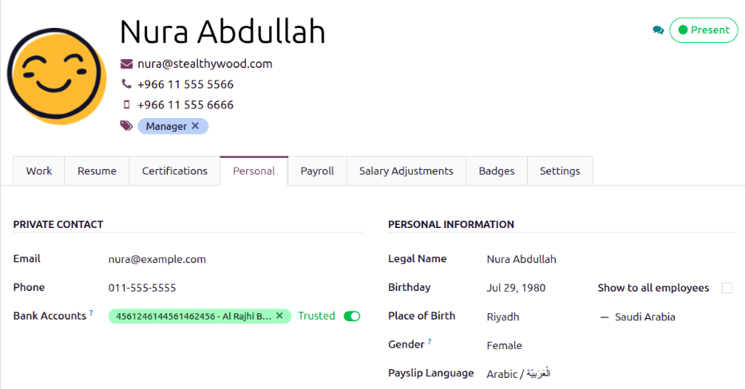
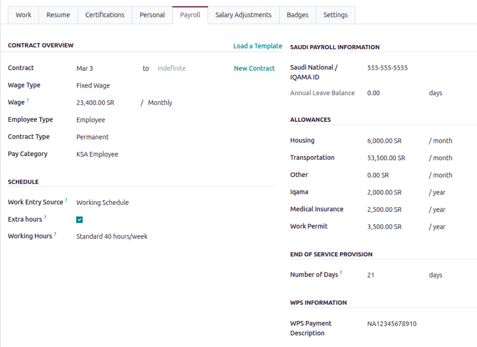
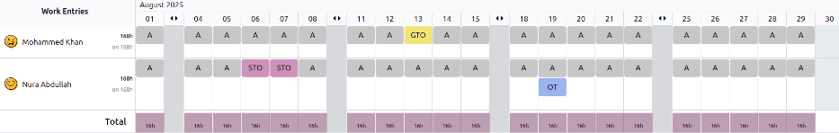
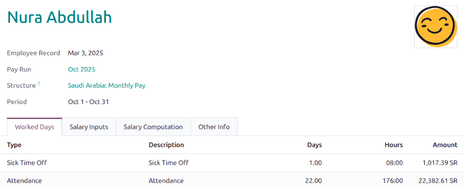
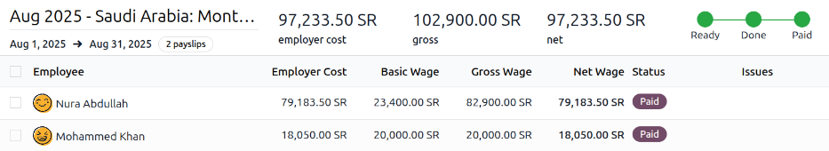

============
Saudi Arabia
============

.. |ABBR| replace:: :abbr:`WPS (Wages Protection System)`
.. |ABBR| replace:: :abbr:`GOSI (General Organization for Social Insurance)`
.. |ABBR| replace:: :abbr:`WPS (Wages Protection System)`
.. |ABBR| replace:: :abbr:`MHRSD (Ministry of Human Resources and Social Development)`
.. |ABBR| replace:: :abbr:`MoL (Ministry of Labor)`

The Saudi Arabia payroll localization covers salary computations for employees, including both
employee and employer payroll taxes. It accounts for national and provincial regulations.

Before configuring the Saudi Arabia localization, refer to the general :doc:`payroll
<../../payroll>` documentation, which includes the basic information for all localizations, as well
as all universal settings and fields.

.. _payroll/saudi_apps:

Apps & modules
==============

:ref:`Install <general/install>` the following modules to get all the features of the Saudi Arabia
payroll localization:

.. list-table::
   :header-rows: 1

   * - Name
     - Technical name
     - Dependencies
     - Description
   * - :guilabel:`Saudi Arabia - Payroll`
     - `l10n_sa_hr_payroll`
     - - hr_payroll
       - hr_contract_reports
       - hr_work_entry_holidays
       - hr_payroll_holidays
     - Provides Saudi Arabia payroll basics, including employee tax details, salary structures
       (Basic/Gross/Net), and tax rules.
   * - :guilabel:`Saudi Arabia - Payroll with Accounting`
     - `l10n_sa_hr_payroll_account`
     - - hr_payroll_account
       - l10n_sa
       - l10n_sa_hr_payroll
     - Links payroll and accounting by creating journal entries (per payslip if needed) to record
       payroll in the company's books.

.. seealso::
   :doc:`Configure the Saudi Arabia fiscal localization
   <../../../finance/fiscal_localizations/saudi_arabia>`

General configurations
======================

First, the company must be configured. Navigate to :menuselection:`Settings app --> Users &
Companies --> Companies`. From the list, select the desired company, and configure the following
fields:

- :guilabel:`Company Name`: Enter the business name in this field.
- :guilabel:`Address`: Complete the full address, including the :guilabel:`City`, :guilabel:`State`,
  :guilabel:`Zip Code`, and :guilabel:`Country`.

  .. important::
     The state selected in the company's address is associated as the *work address* by default for
     the employee, and the one used to calculate payroll taxes.

- :guilabel:`VAT Number`: Enter the company's unique 15-digit :abbr:`VAT (Value Added Tax)` number.
- :guilabel:`Company ID` : Enter the business's :abbr:`MoL (Ministry of Labour)` number.
- :guilabel:`Currency`: By default, :abbr:`SAR (Saudi riyal)` is selected. If not, select
  :guilabel:`SAR` from the drop-down menu.
- :guilabel:`Phone`: Enter the company phone number.
- :guilabel:`Email`: Enter the email used for general contact information.

.. warning::
   Ensure the information is accurate, as it is used when creating XXXXXXXXXXXXXXXXXXXXXXXXXXXX.

Employees
=========

Every employee being paid must have their employee profiles configured for the Saudi Arabia payroll
localization. Additional fields are present after configuring the database for Saudi Arabia.

To update an employee form, open the :menuselection:`Employees` app and click on the desired
employee record. On the employee form, configure the required fields in the related tabs.

Work tab
--------

Enter the :guilabel:`Work Address` for the employee in the :guilabel:`Location` section of the
:guilabel:`Work` tab.

Personal tab
------------

Select the correct :guilabel:`Nationality (Country)` for the employee, using the drop-down menu. The
selected nationality determines the :abbr:`GOSI (General Organization for Social Insurance)` rate.

Ensure the employee has a minimum of one :ref:`trusted bank account <employees/private-contact>`
listed in the :guilabel:`Bank Accounts` field in the :guilabel:`Private Contact` section.

The employee's *bank account* is their :abbr:`IBAN (International Bank Account Number)`, which is
how employees receives their salary according to :abbr:`WPS (Wages Protection System)` regulations.

Payroll **cannot** be processed for employees without a *trusted* :ref:`bank account
<employees/private-contact>`. If no trusted bank account is set, a warning appears on the
**Payroll** dashboard and an error occurs when attempting to run payroll.

Payroll tab
-----------

Contract overview section
~~~~~~~~~~~~~~~~~~~~~~~~~

This section holds information that drives salary calculations. Ensure the following fields are
configured:

- :guilabel:`Contract`: The Validity of the compensation conditions can be updated depending on the
  needs.
- :guilabel:`Wage Type`: Select how the employee is paid.

  - Select :guilabel:`Fixed Wage` for salaried employees who receive the same amount each pay
    period.
  - Select :guilabel:`Hourly Wage` for employees paid based on hours worked.

  .. tip::
     Set a default :guilabel:`Wage Type` in the salary :ref:`Structure Type
     <payroll/structure-types>` to configure employees in bulk. If needed, the default can be
     overridden on individual employee records if exceptions are needed.

- :guilabel:`Contract Type`: Determines how the employee is paid and classified, such as
  :guilabel:`Permanent`, :guilabel:`Temporary`, :guilabel:`Seasonal`.
- :guilabel:`Pay Category`: Select :abbr:`KSA (Kingdom of Saudi Arabia)` :guilabel:`Employee` for
  this field. This defines when the employee is paid, their default working schedule, and the work
  entry type it applies to.

Schedule section
~~~~~~~~~~~~~~~~

- :guilabel:`Work Entry Source`: Defines how :doc:`work entries <../work_entries>` are generated for
  payroll during the specified pay period. The options are:

  - :guilabel:`Working Schedule`: Based on the employee's assigned :ref:`working schedule
    <payroll/working-times>` (e.g., 40 hours per week).
  - :guilabel:`Attendances`: Based on :doc:`approved checked-in hours
    <../../attendances/management>` in the **Attendances** app.
  - :guilabel:`Planning`: Based on :ref:`scheduled shifts <planning/shifts>` in the **Planning**
    app.

- :guilabel:`Extra Hours`: Tick the checkbox to allow the **Attendances** app to add any extra work
  entries logged by the employee.
- :guilabel:`Working Hours`: Using the drop-down menu, select the default work schedule. This is
  particularly important for employees available to receive overtime pay (typically hourly
  employees, not salaried).

.. _payroll/saudi_payroll_info:

Saudi payroll information section
~~~~~~~~~~~~~~~~~~~~~~~~~~~~~~~~~

Enter the employee's unique 10-digit :guilabel:`Saudi National / IQAMA ID` number in this field.
This number is issued to Saudi citizens by the :guilabel:`Ministerial Agency of Civil Affairs`, and
is used for exporting WPS reports.

The :guilabel:`Annual Leave Balance` field is not editable, and displays the employee's available
annual vacation days.

Allowances section
~~~~~~~~~~~~~~~~~~

This section determines the various benefits the employee receives. Enter the monthly Saudi riyal
amount the employee receives from the company for :guilabel:`Housing`, :guilabel:`Transportation`,
and :guilabel:`Other`costs.

Enter the annual amount paid by the company for a Saudi :guilabel:`Iqama` (`iqama` is the Arabic
word for `residence permit`). An :guilabel:`Iqama` is an official residency and identification card,
similar to a visa, and it is . It is required for **all** foreign nationals to have a valid
:guilabel:`Iqama` to work, live, and access various services in Saudi Arabia.

Enter the annual amount the employer pays for the employee's :guilabel:`Medical Insurance` in the
corresponding field.

If the employee needs a :guilabel:`Work Permit`, enter the annual fees the company pays.

End of service provision section
~~~~~~~~~~~~~~~~~~~~~~~~~~~~~~~~

In Saudi Arabia, each employee receives an annual bonus each year, which is computed by their
salary. Enter the :guilabel:`Number of Days` the employee receives payment for each year, in the
corresponding field.

Payroll configuration
=====================

Several sections within the **Payroll** app installs a Salary Structure, Structure Type, Rules, and
Parameters specific to Saudi Arabia. Additionally, some other configurations are required to run
Saudi Arabia payroll.

.. _payroll/saudi_payroll_settings:

Payroll settings
----------------

Navigate to :menuselection:`Payroll --> Configuration --> Settings` to access the **Payroll** app
settings required for Saudi Arabia.

First, the company bank account must be configured to pay employees, per WPS regulations. Click into
the drop-down space beneath the :guilabel:`Establishment Bank Account` field, and click
:guilabel:`Create...`. This opens a :guilabel:`Create Establishment's Bank Account` pop-up window.
:ref:`Configure the company's bank account  <employees/private-contact>`, and ensure it is marked as
*trusted*. Click :guilabel:`Save` to save the information and close the window.

Next, enter the company's :guilabel:`MoL Establishment ID`. This ID number is provided by Saudi
Arabia's :abbr:`MoL (Ministry of Labor)`.

Finally, select the :ref:`time off type <time_off/time-off-types>` that is used to calculate the
:guilabel:`Annual Leave Balance` set in the :ref:`employee's profile <payroll/saudi_payroll_info>`.

Salary structures & structure types
-----------------------------------

When the **l10n_sa_hr_payroll** module is :ref:`installed <payroll/saudi_apps`, a new
:guilabel:`Salary Structure` gets installed, :guilabel:`KSA Employee`. This structure
includes two :guilabel:`Structure Types`, :guilabel:`Saudi Arabia: Monthly Pay`, and :guilabel:`SA
Salary Advance And Loan Structure`.

The :guilabel:`Salary Structure` contains all the individual :ref:`salary rules <payroll/usa_apps>`
that informs the **Payroll** app how to calculate employee payslips.

.. image:: saudi_arabia/structure-types.png
   :alt: The Saudi Arabia salary structure in the salary structures list.

.. _payroll/saudi_rules:

Salary rules
------------

To view the salary rules that inform the salary structure what to do, navigate to
:menuselection:`Payroll app --> Configuration --> Structures` and expand the :guilabel:`KSA
Employee` group to reveal the two available structure types. Click :guilabel:`Saudi Arabia: Monthly
Pay` to view the detailed salary rules for that structure type.

.. image:: saudi_arabia/us-rules-top-half.png
   :alt: The top portion of the US salary rules.

Each rule defines how pay is calculated, taking into account factors such as allowances, deductions,
and company contributions.

Rule parameters
---------------

Some calculations require specific rates associated with them, or wage caps. *Rules Parameters* are
capable of listing a value, either a percentage or a fixed amount, to reference in the salary rules.

Most rules pull information stored in the parameters module to get the rate of the rule (a
percentage) and the cap (a dollar amount).

To view rule parameters, navigate to :menuselection:`Payroll app --> Configuration --> Rule
Parameters`. Here, all rule parameters are displayed with their linked :guilabel:`Salary Rules`,
which can be accessed. Review the parameters associated with a rule by looking for the
:guilabel:`Name` of the rule, and make any edits as needed.

The Saudi Arabia payroll localization comes with four rule parameters:

- :guilabel:`Saudi GOSI Company Contribution`: This rule parameter determines the calculation of the
  GOSI contributions the employer must make for Saudi Arabia employees.
- :guilabel:`Non-Saudi GOSI Company Contribution`: This rule parameter determines the calculation of
  the GOSI contributions the employer must make for each non-Saudi Arabian employee.
- :guilabel:`Saudi GOSI Employee Contribution`: This rule parameter determines the calculation of
  the GOSI contributions the employee must make, and is deducted from their pay.
- :guilabel:`Saudi Arabia Overtime Rate`:  This rule parameter determines the overtime rate for
  employees.

.. important::
   Odoo adds updated rule parameters for the current calendar year. It is **not** recommended to
   edit rule parameters **unless a national or provincial parameter has changed**, and is different
   from the rule parameters created by Odoo. Check with all local and national regulations *before*
   making any changes to rule parameters.

.. _payroll/saudi_run_payroll:

Run Saudi Arabia payroll
========================

Before running payroll, the payroll officer must validate employee :doc:`work entries
<../work_entries>` to confirm pay accuracy and catch errors. This includes checking that all time
off is approved and any overtime is appropriate.

Work entries sync based on the employee's :doc:`contract <../contracts>` configuration. Odoo pulls
from the assigned working schedule, attendance records, planning schedule, and approved time off.

Any :ref:`discrepencies or conflicts <payroll/conflicts>` must be resolved, then the work entries
can be :ref:`regenerated <payroll/regenerate-work-entries>`.

Once everything is correct, draft payslips can be :ref:`created individually <payroll/process>` or
in :doc:`batches <../batches>`, referred to in the **Payroll** app as *Pay Runs*.

.. note::
   To cut down on the payroll officer's time, it is typical to process payslips in batches, either
   by wage type (fixed salary vs hourly), pay schedule (weekly, bi-weekly, monthly, etc.),
   department (direct cost vs. administration), or any other grouping that best suits the company.

The process of running payroll includes different actions that need to be executed to ensure that
the amount withheld from payroll taxes is correct, the amount that the employee receives as their
net salary is correct, and the computation of hours worked reflects the employee's actual hours
worked, among others.

When running a payroll batch, check that the period, company, and employees included are correct
*before* starting to analyze or validate the data.

Once the payslips are drafted, review them for accuracy. Check the :guilabel:`Worked Days & Inputs`
tab, and ensure the listed worked time is correct, as well as any other inputs. Add any missing
inputs, such as commissions, tips, reimbursements, that are missing.

Next, check the various totals (gross pay, allowances, contributions, etc.), then click
:guilabel:`Compute Sheet` to update the salary calculations, if there were edits. If everything is
correct, click :guilabel:`Validate`.

Accounting check
----------------

The accounting process when running payroll has two components: :ref:`creating journal entries
<payroll/journal_saudi>`, and :ref:`registering payments <payroll/register_saudi>`.

.. _payroll/journal_saudi:

Journal entry creation
~~~~~~~~~~~~~~~~~~~~~~

After payslips are confirmed and validated, journal entries are posted either individually, or in a
batch. The journal entry is created first as a draft.

.. important::
   It must be decided if journal entries are done individually or in batches *before* running
   payroll.

.. image:: saudi_arabia/create-draft-entry.png
   :alt: All payslips in a draft state.

Four accounts from the US :abbr:`CoA (Chart of Accounts)` are included with the payroll
localization:

- `611000 Salaries & Wages`: Records gross salary and the employer's portion of payroll expenses.
  Also groups values from rules without specific accounts (e.g., company-specific benefits).
- `230100 Employee Payroll Taxes`: Withheld taxes from employees, which the employer must file and
  pay. The partner and label columns of the journal entry indicate the specific tax.
- `230200 Employer Payroll Taxes`: Employer portion of payroll taxes to be filed and paid. The
  partner and label columns of the journal entry indicate the specific tax.
- `230000 Salary Payable`: Net salary owed to the employee.

.. note::
   The :abbr:`CoA (Chart of Accounts)` configuration is done by default when a company is located in
   the US. The account codes and names can be edited to suit the company's needs. If there is no
   :abbr:`CoA (Chart of Accounts)` account associated with a salary rule (used in a salary
   structure), Odoo uses the account `Salary Expenses` to create the journal entry, regardless of
   the nature of the move.

If everything seems correct on the journal entry draft, post the journal entries.

.. image:: saudi_arabia/post-entries.png
   :alt: Journal entries posted.

.. _payroll/register_saudi:

Register Payments
-----------------

After the :ref:`journal entries <payroll/journal_saudi>` are validated, Odoo can generate payments.

.. important::
   To generate payments from payslips,employee's **must** have a *trusted* bank account. If the
   employee's bank account is *not* marked as `trusted`, NACHA files **cannot** be generated through
   Odoo.

Payments can be :guilabel:`Grouped by Partner` if there is a partner associated with a salary rule.

Close Payroll
-------------

If there are no errors, payroll is completed for the pay period.

Reports
=======

The WPS report is a mandatory report all Saudi Arabian companies are required to provide the
government. The report confirms employee wages, including when and how much they were paid. The WPS
report can be generated either per payslip or per pay run.

.. note::
   This report is structured in accordance with the technical guidelines issued by the MHRSD.

.. important::
   To run the WPS report, the :guilabel:`Establishment Bank Account` and :guilabel:`Ministry of
   Labor Establishment ID` fields **must** be :ref:`configured <payroll/saudi_payroll_settings>` for
   the company.

   Ensure the :guilabel:`Establishment Bank Account` has the :guilabel:`Bank Establishment ID`,
   and :guilabel:`Bank SARIE Code` fields configured, and the bank is marked as :guilabel:`Trusted`.

   Ensure all employees included in the report have a :guilabel:`Saudi National / IQAMA ID` set on
   their employee profile.

First, :ref:`payslips or pay runs are generated <payroll/saudi_run_payroll>`, then the :ref:`journal
entries are posted <payroll/journal_saudi>`.

Click the :guilabel:`Payment Report` button on the :guilabel:`Pay Runs` dashboard, the individual
pay run, or an individual payslip, and a payment report pop-up window loads.

:guilabel:`Saudi WPS` is selected in the :guilabel:`Export Format` field, by default, and the
:guilabel:`Payment Date` and :guilabel:`WPS Value Date` fields are both populated according to the
selected payslips or pay runs.

The :guilabel:`WPS Debit Date` is an optional field, and specifies the date the company physically
pays the employees (transfers funds from the company account to employee accounts).

Once all fields are configured, click :guilabel:`Generate`, and the WPS report is created.

The resulting report includes the following sections:
1- The Header Group:
It includes the company's information, which consists of the list of fields below:

2 - Repeating Group:

 It is a list of rows that shows the details of the employee and their salary details. It can be split into two sections:
Employee information that consists of the following fields:

Employee’s salary details that consist of the following fields:

Important*: The two sections on the repeating group mentioned above will show on the same row as per the specification of the Ministry of Human Resources.

