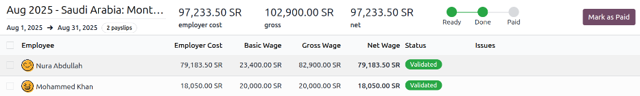

============
Saudi Arabia
============

.. |WPS| replace:: :abbr:`WPS (Wages Protection System)`
.. |GOSI| replace:: :abbr:`GOSI (General Organization for Social Insurance)`
.. |MHRSD| replace:: :abbr:`MHRSD (Ministry of Human Resources and Social Development)`
.. |MoL| replace:: :abbr:`MoL (Ministry of Labor)`

The Saudi Arabia payroll localization covers salary computations for employees, including national
and provincial regulations.

Before configuring the Saudi Arabia localization, refer to the general :doc:`payroll
<../../payroll>` documentation, which includes the basic information for all localizations, as well
as all universal settings and fields.

.. _payroll/saudi_apps:

Apps & modules
==============

:ref:`Install <general/install>` the following modules to get all the features of the Saudi Arabia
payroll localization:

.. list-table::
   :header-rows: 1

   * - Name
     - Technical name
     - Dependencies
     - Description
   * - :guilabel:`Saudi Arabia - Payroll`
     - `l10n_sa_hr_payroll`
     - - hr_payroll
       - hr_contract_reports
       - hr_work_entry_holidays
       - hr_payroll_holidays
     - Provides Saudi Arabia payroll basics, including salary structures (Basic/Gross/Net).
   * - :guilabel:`Saudi Arabia - Payroll with Accounting`
     - `l10n_sa_hr_payroll_account`
     - - hr_payroll_account
       - l10n_sa
       - l10n_sa_hr_payroll
     - Links payroll and accounting by creating journal entries (per payslip if needed) to record
       payroll in the company's books.

.. seealso::
   :doc:`Configure the Saudi Arabia fiscal localization
   <../../../finance/fiscal_localizations/saudi_arabia>`

General configurations
======================

First, the company must be configured. Navigate to :menuselection:`Settings app --> Users &
Companies --> Companies`. From the list, select the desired company, and configure the following
fields:

- :guilabel:`Company Name`: Enter the business name in this field.
- :guilabel:`Address`: Complete the full address, including the :guilabel:`City`, :guilabel:`State`,
  :guilabel:`Zip Code`, and :guilabel:`Country`.
- :guilabel:`VAT Number`: Enter the company's unique 15-digit :abbr:`VAT (Value Added Tax)` number.
- :guilabel:`Company ID` : Enter the business's MoL number.
- :guilabel:`Currency`: By default, :abbr:`SAR (Saudi riyal)` is selected. If not, select
  :guilabel:`SAR` from the drop-down menu.
- :guilabel:`Phone`: Enter the company phone number.
- :guilabel:`Email`: Enter the email used for general contact information.

Employees
=========

Every employee being paid must have their employee profiles configured for the Saudi Arabia payroll
localization. Additional fields are present after configuring the database for Saudi Arabia.

To update an employee form, open the :menuselection:`Employees` app and click on the desired
employee record. On the employee form, configure the required fields in the related tabs.

Work tab
--------

Enter the :guilabel:`Work Address` for the employee in the :guilabel:`Location` section of the
:guilabel:`Work` tab.

Personal tab
------------

Select the correct :guilabel:`Nationality (Country)` for the employee, using the drop-down menu. The
selected nationality determines the GOSI rate.

Ensure the employee has a minimum of one :ref:`trusted bank account <employees/private-contact>`
listed in the :guilabel:`Bank Accounts` field in the :guilabel:`Private Contact` section.

The employee's *bank account* is their :abbr:`IBAN (International Bank Account Number)`, which is
how employees receive their salary according to :abbr:`WPS (Wages Protection System)` regulations.

Payroll **cannot** be processed for employees without a *trusted* :ref:`bank account
<employees/private-contact>`. If no trusted bank account is set, a warning appears on the
**Payroll** dashboard and an error occurs when attempting to run payroll.

Payroll tab
-----------

Contract overview section
~~~~~~~~~~~~~~~~~~~~~~~~~

This section holds information that drives salary calculations. Ensure the following fields are
configured:

- :guilabel:`Contract`: The Validity of the compensation conditions can be updated depending on the
  needs.
- :guilabel:`Wage Type`: Select how the employee is paid.

  - Select :guilabel:`Fixed Wage` for salaried employees who receive the same amount each pay
    period.
  - Select :guilabel:`Hourly Wage` for employees paid based on hours worked.

  .. tip::
     Set a default :guilabel:`Wage Type` in the salary :ref:`Structure Type
     <payroll/structure-types>` to configure employees in bulk. If needed, the default can be
     overridden on individual employee records if exceptions are needed.

- :guilabel:`Contract Type`: Determines how the employee is paid and classified, such as
  :guilabel:`Permanent`, :guilabel:`Temporary`, :guilabel:`Seasonal`.
- :guilabel:`Pay Category`: Select :abbr:`KSA (Kingdom of Saudi Arabia)` :guilabel:`Employee` for
  this field. This defines when the employee is paid, their default working schedule, and the work
  entry type it applies to.

Schedule section
~~~~~~~~~~~~~~~~

- :guilabel:`Work Entry Source`: Defines how :doc:`work entries <../work_entries>` are generated for
  payroll during the specified pay period. The options are:

  - :guilabel:`Working Schedule`: Based on the employee's assigned :ref:`working schedule
    <payroll/working-times>` (e.g., 40 hours per week).
  - :guilabel:`Attendances`: Based on :doc:`approved checked-in hours
    <../../attendances/management>` in the **Attendances** app.
  - :guilabel:`Planning`: Based on :ref:`scheduled shifts <planning/shifts>` in the **Planning**
    app.

- :guilabel:`Extra Hours`: Tick the checkbox to allow the **Attendances** app to add any extra work
  entries logged by the employee.
- :guilabel:`Working Hours`: Using the drop-down menu, select the default work schedule. This is
  particularly important for employees available to receive overtime pay (typically hourly
  employees, not salaried).

.. _payroll/saudi_payroll_info:

Saudi payroll information section
~~~~~~~~~~~~~~~~~~~~~~~~~~~~~~~~~

Enter the employee's unique 10-digit :guilabel:`Saudi National / IQAMA ID` number in this field.
This number is issued to Saudi citizens by the :guilabel:`Ministerial Agency of Civil Affairs`, and
is used for exporting WPS reports.

The :guilabel:`Annual Leave Balance` field is not editable, and displays the employee's available
annual vacation days.

Allowances section
~~~~~~~~~~~~~~~~~~

This section determines the various benefits the employee receives. Enter the monthly Saudi riyal
amount the employee receives from the company for :guilabel:`Housing`, :guilabel:`Transportation`,
and :guilabel:`Other` costs.

Enter the annual amount paid by the company for a Saudi :guilabel:`Iqama` (`iqama` is the Arabic
word for `residence permit`). An :guilabel:`Iqama` is an official residency and identification card,
similar to a visa, and it is . It is required for **all** foreign nationals to have a valid
:guilabel:`Iqama` to work, live, and access various services in Saudi Arabia.

Enter the annual amount the employer pays for the employee's :guilabel:`Medical Insurance` in the
corresponding field.

If the employee needs a :guilabel:`Work Permit`, enter the annual fees the company pays.

End of service provision section
~~~~~~~~~~~~~~~~~~~~~~~~~~~~~~~~

In Saudi Arabia, each employee earns a percentage of their annual salary for each year they have
worked with a company. This amount is computed based on their salary. When they leave the company,
they receive this compensation in one lump sum.

Enter the :guilabel:`Number of Days` the employee earns in annual compensation, in the corresponding
field. The company sets this amount aside every year, so it is available when the employee leaves.

Payroll configuration
=====================

Several sections within the **Payroll** app installs a Salary Structure, Structure Type, Rules, and
Parameters specific to Saudi Arabia. Additionally, some other configurations are required to run
Saudi Arabia payroll.

.. _payroll/saudi_payroll_settings:

Payroll settings
----------------

Navigate to :menuselection:`Payroll --> Configuration --> Settings` to access the **Payroll** app
settings required for Saudi Arabia.

First, the company bank account must be configured to pay employees, per WPS regulations. Click into
the drop-down space beneath the :guilabel:`Establishment Bank Account` field, and click
:guilabel:`Create...`. This opens a :guilabel:`Create Establishment's Bank Account` pop-up window.
:ref:`Configure the company's bank account  <employees/private-contact>`, and ensure it is marked as
*trusted*. Click :guilabel:`Save` to save the information and close the window.

Next, enter the company's :guilabel:`MoL Establishment ID`. This ID number is provided by Saudi
Arabia's Ministry of Labor.

Finally, select the :ref:`time off type <time_off/time-off-types>` that is used to calculate the
:guilabel:`Annual Leave Balance` set in the :ref:`employee's profile <payroll/saudi_payroll_info>`.

Salary structures & structure types
-----------------------------------

When the **l10n_sa_hr_payroll** module is :ref:`installed <payroll/saudi_apps>`, a new
:guilabel:`Salary Structure` gets installed, :guilabel:`KSA Employee`. This structure includes two
:guilabel:`Structure Types`, :guilabel:`Saudi Arabia: Monthly Pay`, and :guilabel:`SA Salary Advance
And Loan Structure`.

The :guilabel:`Salary Structure` contains all the individual :ref:`salary rules <payroll/usa_apps>`
that informs the **Payroll** app how to calculate employee payslips.

.. _payroll/saudi_rules:

Salary rules
------------

To view the salary rules that inform the salary structure what to do, navigate to
:menuselection:`Payroll app --> Configuration --> Structures` and expand the :guilabel:`KSA
Employee` group to reveal the two available structure types. Click :guilabel:`Saudi Arabia: Monthly
Pay` to view the detailed salary rules for that structure type.

Each rule defines how pay is calculated, taking into account factors such as allowances, deductions,
and company contributions.

Rule parameters
---------------

Some calculations require specific rates associated with them, or wage caps. *Rules Parameters* are
capable of listing a value, either a percentage or a fixed amount, to reference in the salary rules.

Most rules pull information stored in the parameters module to get the rate of the rule (a
percentage) and the cap (a dollar amount).

To view rule parameters, navigate to :menuselection:`Payroll app --> Configuration --> Rule
Parameters`. Here, all rule parameters are displayed with their linked :guilabel:`Salary Rules`,
which can be accessed. Review the parameters associated with a rule by looking for the
:guilabel:`Name` of the rule, and make any edits as needed.

The Saudi Arabia payroll localization comes with four rule parameters:

- :guilabel:`Saudi GOSI Company Contribution`: This rule parameter determines the calculation of the
  GOSI contributions the employer must make for Saudi Arabia employees.
- :guilabel:`Non-Saudi GOSI Company Contribution`: This rule parameter determines the calculation of
  the GOSI contributions the employer must make for each non-Saudi Arabian employee.
- :guilabel:`Saudi GOSI Employee Contribution`: This rule parameter determines the calculation of
  the GOSI contributions the employee must make, and is deducted from their pay.
- :guilabel:`Saudi Arabia Overtime Rate`:  This rule parameter determines the overtime rate for
  employees.

.. important::
   Odoo adds updated rule parameters for the current calendar year. It is **not** recommended to
   edit rule parameters **unless a national or provincial parameter has changed**, and is different
   from the rule parameters created by Odoo. Check with all local and national regulations *before*
   making any changes to rule parameters.

.. _payroll/saudi_run_payroll:

Run Saudi Arabia payroll
========================

Before running payroll, the payroll officer must validate employee :doc:`work entries
<../work_entries>` to confirm pay accuracy and catch errors. This includes checking that all time
off is approved and any overtime is appropriate.

Work entries sync based on the employee's :doc:`contract <../contracts>` configuration. Odoo pulls
from the assigned working schedule, attendance records, planning schedule, and approved time off.

Any :ref:`discrepancies or conflicts <payroll/conflicts>` must be resolved, then the work entries
can be :ref:`regenerated <payroll/regenerate-work-entries>`.

Once everything is correct, draft payslips can be :ref:`created individually <payroll/process>` or
in :doc:`batches <../batches>`, referred to in the **Payroll** app as *Pay Runs*.

.. note::
   To cut down on the payroll officer's time, it is typical to process payslips in batches, either
   by wage type (fixed salary vs hourly), pay schedule (weekly, bi-weekly, monthly, etc.),
   department (direct cost vs. administration), or any other grouping that best suits the company.

The process of running payroll includes different actions that need to be executed to ensure that
the amount that the employee receives as their net salary is correct, any deductions or allocations
are correct, and the computation of hours worked reflects the employee's actual hours worked, among
others.

When running a payroll batch, check that the period, company, and employees included are correct
*before* starting to analyze or validate the data.

Once the payslips are drafted, review them for accuracy. Check the :guilabel:`Worked Days & Inputs`
tab, and ensure the listed worked time is correct, as well as any other inputs. Add any missing
inputs, such as commissions, tips, reimbursements, that are missing.

Next, check the various totals (gross pay, allowances, contributions, etc.), then click
:guilabel:`Compute Sheet` to update the salary calculations, if there were edits. If everything is
correct, click :guilabel:`Validate`.

Accounting check
----------------

The accounting process when running payroll has two components: :ref:`creating journal entries
<payroll/journal_saudi>`, and :ref:`registering payments <payroll/register_saudi>`.

.. _payroll/journal_saudi:

Journal entry creation
~~~~~~~~~~~~~~~~~~~~~~

After payslips are confirmed and validated, journal entries are posted either individually, or in a
batch. The journal entry is created first as a draft.

.. important::
   It must be decided if journal entries are done individually or in batches *before* running
   payroll.

Fifteen accounts from the Saudi Arabia :abbr:`CoA (Chart of Accounts)` are included with the payroll
localization:

- `400003 Basic Salary`: Tracks the basic wages paid to employees.
- `400004 Housing Allowance`: Captures housing allowance payments provided to employees.
- `400005 Transportation Allowance`: Captures transportation allowance payments to employees.
- `400012 Staff Other Allowances`: Covers employee allowances that do not fit standard categories.
- `106012 Prepaid Employee Expenses`: Logged as prepaid assets for employer-paid items that are
  *not* wages (for example, `Iqama` fees and medical insurance) and expensed as consumed.
- `201006 Leave Days Provision`: Accrues the cost of paid leave; the balance is reduced when leave
  is taken, and any leave not taken may be paid out at end of service.
- `201022 GOSI Employee Payable`: Holds amounts payable for social insurance contributions to the
  GOSI, including both employee and employer portions.
- `202001 End of Service Provision`: Accumulates the end-of-service benefit monthly so the amount
  can be paid (partially or fully) when the employee leaves, per service length and reason.
- `400007 Leave Salary`: Records salaries actually paid to employees while on paid leave.
- `400008 End of Service Indemnity`: Captures company expenses set aside to fund end-of-service
  benefits (expense-side counterpart to the provision).
- `400009 Medical Insurance`: Accounts for employer expenses related to employee medical insurance
  premiums.
- `400010 Life Insurance`: Tracks employer expenses for life/occupational insurance or the
  employer's portion of social insurance.
- `400014 Visa Expenses`: Used to track employer costs for non-Saudi Arabian employees' visas and
  related processing/renewal fees.
- `400074 Salary Deductions`: Reflects deductions applied to employee salaries (e.g., advances,
  fines, statutory deductions).
- `201002 Payables`: Shows amounts payable to employees as salaries (unpaid salary liability at
  period end).

If everything seems correct on the journal entry draft, post the journal entries.

.. _payroll/register_saudi:

Register Payments
-----------------

After the :ref:`journal entries <payroll/journal_saudi>` are validated, Odoo can generate payments.

.. important::
   To generate payments from payslips,employees **must** have a *trusted* bank account. If the
   employee's bank account is *not* marked as `trusted`, WPS files **cannot** be generated through
   Odoo.

Payments can be :guilabel:`Grouped by Partner` if there is a partner associated with a salary rule.

Close Payroll
-------------

If there are no errors, payroll is completed for the pay period.

Employee loans and advances
===========================

Employees are able to request :ref:`loans <payroll/loans>` or :ref:`advances <payroll/advances>`
against their salaries. *Loans* are handled by creating salary adjustments, whereas *advances* are
created and managed manually.

.. _payroll/loans:

Employee loans
--------------

Employees can take out *loans* against their salary and repay the loan with automatic deductions
from future paychecks. These loans are handled by :ref:`creating a salary adjustment
<payroll/salary_adjust_saudi>` to log the total loan amount and set up a repayment plan, and
:ref:`creating a payslip for the total loan amount <payroll/loan_payslip_saudi>`. The employee then
:ref:`repays the loan <payroll/repay_saudi>` in the increments configured in the salary adjustment.

.. _payroll/salary_adjust_saudi:

Create a salary adjustment
~~~~~~~~~~~~~~~~~~~~~~~~~~

When an employee requests a loan, first a *salary adjustment* is made, where the total loan amount
and repayment plan is configured.

To create the loan and repayment schedule, navigate to :menuselection:`Payroll app --> Employees -->
Salary Adjustments`. Click :guilabel:`New`, and a blank :guilabel:`Salary Adjustment` form loads.

Configure the following fields on the form:

- :guilabel:`Employees`: Using the drop-down menu, select the employee taking out the loan.
- :guilabel:`Type`: Using the drop-down menu, select :guilabel:`Loan Deduction`.
- :guilabel:`Payslip Amount`: Enter the :abbr:`SAR (Saudi riyal)` amount to be repaid each payslip.
- :guilabel:`Duration`: Tick the :guilabel:`Limited` option, which reveals a :guilabel:`until`
  (amount) :guilabel:`paid` field. First, using the calendar selector, enter the date the repayment
  begins. Next, enter the total loan amount in the field after :guilabel:`until`. Once both fields
  are configured, Odoo calculates when the loan is fully repaid, and displays the date as follows:
  `end in # years: (date)`.
- :guilabel:`Note`: Enter any details about the loan in this field.

.. _payroll/loan_payslip_saudi:

Generate a loan payslip
~~~~~~~~~~~~~~~~~~~~~~~

After creating the salary adjustment, a button labeled :guilabel:`Create Loan Payslip` appears above
the form. Click :guilabel:`Create Loan Payslip`, and Odoo automatically generates a payslip
configured for the employee loan, in the amount set up in the :ref:`salary adjustment
<payroll/salary_adjust_saudi>`.

Review the payslip to ensure all the fields and tabs are correct. The :guilabel:`Structure` should
be :guilabel:`SA Salary Advance And Loan Structure`. The :guilabel:`Salary Inputs` tab should list a
:guilabel:`Loan Deduction`, and the :guilabel:`Total` should be the full amount of the loan.

Click into the :guilabel:`Other Info` tab, and enter the date the employee receives the payment in
the :guilabel:`Payment Date` field.

Once the payslip form is correct, click :guilabel:`Compute Sheet`, then click :guilabel:`Create
Draft Entry`, and click :guilabel:`OK` in the confirmation pop-up window. Next, click
:guilabel:`Pay` to mark the payment as paid, then click :guilabel:`Create Payment Report` to
:ref:`generate the WPS report <payroll/reports_saudi>`.

.. _payroll/repay_saudi:

Loan repayment to employer
~~~~~~~~~~~~~~~~~~~~~~~~~~

From the date set on the :ref:`salary attachment <payroll/salary_adjust_saudi>`, all future
paychecks have the configured repayment amount taken out, to go towards the loan. Once the loan is
fully paid, the deductions end.

.. note::
   The deductions should end after the total is repaid, according to the salary adjustment. To
   ensure payments *stop* being taken out of the employee's paychecks after the loan has been
   repaid, open the salary adjustment record. If the salary adjustment still has a status of
   :guilabel:`Running`, click the :guilabel:`Mark as Completed` button, and the status changes to
   :guilabel:`Closed`, and payments stop.

.. _payroll/advances:

Salary advances
---------------

Employees can request an advance of their salary, outside of the regular pay cycle. This process is
done by paying the employee with a :ref:`manually created payslip <payroll/advance_slip>`, then the
employee repays the advance either :ref:`in full <payroll/repay_full>` in the next payslip, or in
:ref:`multiple payments <payroll/repay_partial>` in subsequent paychecks until the total is repaid.

.. _payroll/advance_slip:

Create advance payslip
~~~~~~~~~~~~~~~~~~~~~~

To issue an advanced payment, navigate to :menuselection:`Payroll app --> Payslips --> Payslips`.
Click the :guilabel:`New Off-Cycle` button and a blank :guilabel:`Employee Payslips` form loads.

Configure the following fields on the payslip:

- :guilabel:`Employees`: Using the drop-down menu, select the employee taking out the advance.

  .. note::
     Once the :guilabel:`Employee` is selected, the :guilabel:`Employee Record` field populates with
     the most recent employee version (contract).

- :guilabel:`Structure`: Using the drop-down menu, select :guilabel:`SA Salary Advance And Loan
  Structure`.

Next, click :guilabel:`Add a line` in the :guilabel:`Salary Inputs` tab. Select :guilabel:`Salary
Advance` for the :guilabel:`Type`. Next, enter any relevant description in the :guilabel:`Notes`
field, such as `Advance for auto repair`. Last, enter the amount being advanced in the
:guilabel:`Amount` field.

Once these fields have been configured, click :guilabel:`Compute Sheet`, then click
:guilabel:`Create Draft Entry`, and click :guilabel:`OK` in the confirmation pop-up window. Click
:guilabel:`Pay` to mark the payment as paid, then click :guilabel:`Create Payment Report` to
:ref:`generate the WPS report <payroll/reports_saudi>`.

.. _payroll/repay_full:

Automatic repayment in full
~~~~~~~~~~~~~~~~~~~~~~~~~~~

When the employee's next payslip is generated (using the `Saudi Arabia: Monthly Pay` structure), a
line is added under the `Other Inputs` tab, titled `Advanced Recovery`.

The amount is based on the advance previously taken by the employee. If the employee cannot repay
the full amount in the paycheck, the repayment can be broken up into :ref:`multiple payments
<payroll/repay_partial>`.

.. _payroll/repay_partial:

Multiple payments
~~~~~~~~~~~~~~~~~

When an employee cannot repay an advance in full in a future payslip, the employee can make partial
payments until the advance is repaid. To do this, the amount being deducted from the employee's
paycheck must be manually modified.

Open the employee's payslip, and under the :guilabel:`Salary Inputs` tab, modify the amount
specified on the :guilabel:`Advanced Recovery` line.

Odoo automatically calculates the remainder of the advance, and adds an :guilabel:`Advanced
Recovery` line for the balance in the subsequent payslip. If the employee cannot pay the second
payment in full, the :guilabel:`Advanced Recovery` line can be edited in the following payslip.

.. _payroll/reports_saudi:

WPS reports
===========

The WPS report is a mandatory report all Saudi Arabian companies are required to provide the
government. The report confirms employee wages, including when and how much they were paid. The WPS
report can be generated either per payslip or per pay run.

.. note::
   This report is structured in accordance with the technical guidelines issued by the MHRSD.

.. important::
   To run the WPS report, the :guilabel:`Establishment Bank Account` and :guilabel:`Ministry of
   Labor Establishment ID` fields **must** be :ref:`configured <payroll/saudi_payroll_settings>` for
   the company.

   Ensure the :guilabel:`Establishment Bank Account` has the :guilabel:`Bank Establishment ID`,
   and :guilabel:`Bank SARIE Code` fields configured, and the bank is marked as :guilabel:`Trusted`.

   Ensure all employees included in the report have a :guilabel:`Saudi National / IQAMA ID` set on
   their employee profile.

First, :ref:`payslips or pay runs are generated <payroll/saudi_run_payroll>`, then the :ref:`journal
entries are posted <payroll/journal_saudi>`.

Click the :guilabel:`Payment Report` button on the :guilabel:`Pay Runs` dashboard, the individual
pay run, or an individual payslip, and a payment report pop-up window loads.

:guilabel:`Saudi WPS` is selected in the :guilabel:`Export Format` field, by default, and the
:guilabel:`Payment Date` and :guilabel:`WPS Value Date` fields are both populated according to the
selected payslips or pay runs.

The :guilabel:`WPS Debit Date` is an optional field, and specifies the date the company physically
pays the employees (transfers funds from the company account to employee accounts).

Once all fields are configured, click :guilabel:`Generate`, and the WPS report is created.
