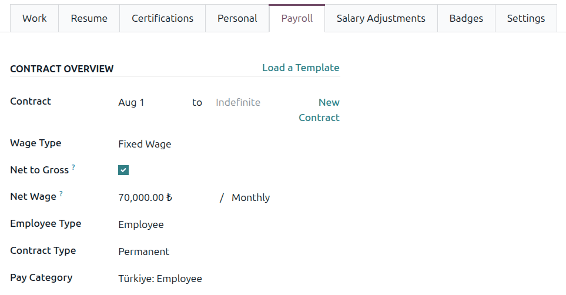
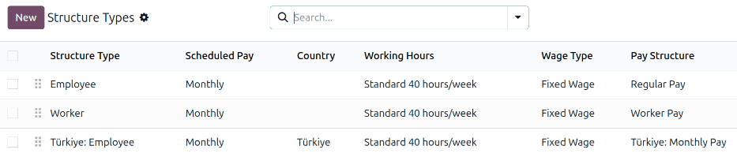
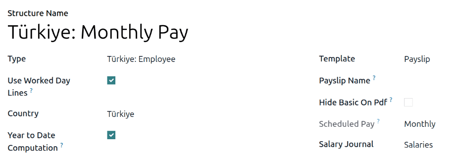
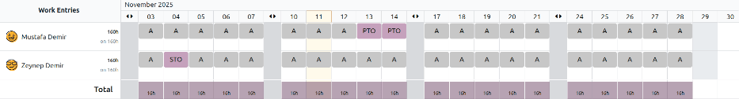
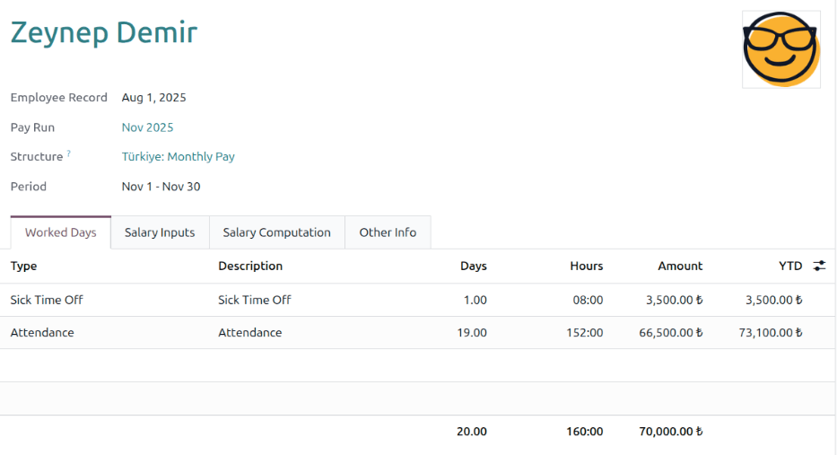
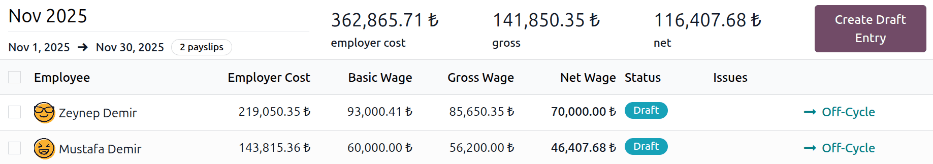
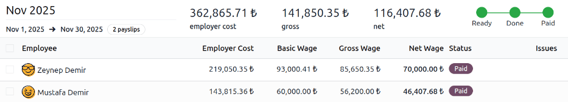

=======
Türkiye
=======

The Türkiye payroll localization covers salary computations for employees, including both employee
and employer payroll taxes. It accounts for federal and state regulations.

Before configuring the Türkiye localization, refer to the general :doc:`payroll <../../payroll>`
documentation, which includes the basic information for all localizations, as well as all universal
settings and fields.

.. _payroll/turkey_apps:

Apps & modules
==============

:ref:`Install <general/install>` the following modules to get all the features of the Türkiye
payroll localization:

.. list-table::
   :header-rows: 1

   * - Name
     - Technical name
     - Dependencies
     - Description
   * - :guilabel:`Türkiye - Payroll`
     - `l10n_tr_hr_payroll`
     - - hr_payroll
     - Includes all salary rules, leave logic, and compensation rules compliant with Türkiye labor
       laws.
   * - :guilabel:`Türkiye - Payroll with Accounting`
     - `l10n_tr_hr_payroll_account`
     - - hr_payroll_account
       - l10n_tr_hr_payroll_account
       - l10n_tr_hr_payroll
     - Links payroll and accounting by creating journal entries (per payslip if needed) to record
       payroll in the company's books.

General configurations
======================

First, the company must be configured. Navigate to :menuselection:`Settings app --> Users &
Companies --> Companies`. From the list, select the desired company, and configure the following
fields:

- :guilabel:`Company Name`: Enter the business name in this field.
- :guilabel:`Address`: Complete the full address, including the :guilabel:`City`, :guilabel:`State`,
  :guilabel:`ZIP`, and :guilabel:`Country`.
- :guilabel:`Tax ID`: Enter the company's tax ID.
- :guilabel:`Company ID` : Enter the business's ID number.
- :guilabel:`Currency`: By default, :abbr:`TRY (Turkish lira)` is selected. If not, select
  :guilabel:`TRY` from the drop-down menu.
- :guilabel:`Phone`: Enter the company phone number.
- :guilabel:`Email`: Enter the email used for general contact information.

Employees
=========

Every employee being paid must have their employee profiles configured for the Türkiye payroll
localization. Additional fields are present after configuring the database for Türkiye.

To update an employee form, open the :menuselection:`Employees` app and click on the desired
employee record. On the employee form, configure the required fields in the related tabs.

Work tab
--------

Enter the :guilabel:`Work Address` for the employee in the :guilabel:`Location` section of the
:guilabel:`Work` tab.

Personal tab
------------

Ensure the employee has a minimum of one :ref:`trusted bank account <employees/private-contact>`
listed in the :guilabel:`Bank Accounts` field in the :guilabel:`Private Contact` section.

These accounts are used to pay the employee. Payroll **cannot** be processed for employees without a
*trusted* :ref:`bank account <employees/private-contact>`. If no trusted bank account is set, a
warning appears on the **Payroll** dashboard and an error occurs when attempting to run payroll.

Payroll tab
-----------

.. _payroll/turkey_contract:

Contract overview section
~~~~~~~~~~~~~~~~~~~~~~~~~

This section holds information that drives salary calculations. Ensure the following fields are
configured:

- :guilabel:`Contract`: Ensure a contract start date is entered in the first field.
- :guilabel:`Wage Type`: Select how the employee is paid.

  - Select :guilabel:`Fixed Wage` for salaried employees who receive the same amount each pay
    period.
  - Select :guilabel:`Hourly Wage` for employees paid based on hours worked.

  .. tip::
     Set a default :guilabel:`Wage Type` in the salary :ref:`Structure Type
     <payroll/structure-types>` to configure employees in bulk. If needed, the default can be
     overridden on individual employee records if exceptions are needed.

- :guilabel:`Net to Gross`: Leave this box unchecked if the gross salary is based on a fixed gross
  and a dynamically computed net (Gross to Net). Activate this option if the gross salary is based
  on a fixed net and a dynamically computed gross (Net to Gross).
- :guilabel:`Wage`: If :guilabel:`Net to Gross` is unchecked, this field displays :guilabel:`Wage`.
  If it is checked, this field displays :guilabel:`Net Wage`. Enter the monthly amount earned by the
  employee.
- :guilabel:`Employee Type`: May affect the working hours for the employee.
- :guilabel:`Contract Type`: Determines how the employee is paid and classified, such as
  :guilabel:`Permanent`, :guilabel:`Temporary`, or :guilabel:`Student`.
- :guilabel:`Pay Category`: Select :guilabel:`Türkiye: Employee` for this field. This defines when
  the employee is paid, their default working schedule, and the work entry type it applies to.

Schedule section
~~~~~~~~~~~~~~~~

- :guilabel:`Work Entry Source`: Defines how :doc:`work entries <../work_entries>` are generated for
  payroll during the specified pay period. The options are:

  - :guilabel:`Working Schedule`: Based on the employee's assigned :ref:`working schedule
    <employees/schedule>` (e.g., 40 hours per week).
  - :guilabel:`Attendances`: Based on :doc:`approved checked-in hours
    <../../attendances/management>` in the **Attendances** app.
  - :guilabel:`Planning`: Based on :ref:`scheduled shifts <planning/shifts>` in the **Planning**
    app.

- :guilabel:`Working Hours`: Using the drop-down menu, select the default work schedule. This is
  particularly important for employees available to receive overtime pay (typically hourly
  employees, not salaried).

Payroll configuration
=====================

Several sections within the **Payroll** app install a Salary Structure, Structure Type, Rules, and
Parameters specific to Türkiye.

Salary structures & structure types
-----------------------------------

When the **l10n_tr_payroll** module is :ref:`installed <payroll/turkey_apps>`, a new
:guilabel:`Salary Structure` gets installed, :guilabel:`Türkiye: Regular Pay`. This structure
includes one :guilabel:`Structure Type`, :guilabel:`Türkiye: Employee`.

The :guilabel:`Salary Structure` contains all the individual :ref:`salary rules
<payroll/turkey_rules>` that informs the **Payroll** app how to calculate employee payslips.

.. _payroll/turkey_rules:

Salary rules
------------

To view the salary rules that inform the salary structure what to do, navigate to
:menuselection:`Payroll app --> Configuration --> Structures` and expand the :guilabel:`Türkiye:
Employee` group to reveal the :guilabel:`Türkiye: Monthly Pay` structure type. Click
:guilabel:`Türkiye: Monthly Pay` to view the detailed salary rules.

Each rule defines how pay is calculated, taking into account factors such as commissions, bonuses,
taxes, and insurance.

.. _payroll/turkey_rule-parameters:

Rule parameters
---------------

Some calculations require specific rates associated with them, or wage caps. *Rules Parameters* are
capable of listing a value, either a percentage or a fixed amount, to reference in the salary rules.

Most rules pull information stored in the parameters module to get the rate of the rule (a
percentage) and the cap (a monetary amount).

To view rule parameters, navigate to :menuselection:`Payroll app --> Configuration --> Rule
Parameters`. Here, all rule parameters are displayed with their linked :guilabel:`Salary Rules`,
which can be accessed. Review the parameters associated with a rule by looking for the
:guilabel:`Name` of the rule, and make any edits as needed.

Ensure the following rules parameters are up to date with current rules and regulations:

- :guilabel:`Türkiye Minimum Wage`
- :guilabel:`Türkiye SSI Base Amount Ceiling`
- :guilabel:`Türkiye Tax Exemption Amount`
- :guilabel:`Türkiye Stamp Tax Percentage`
- :guilabel:`Türkiye Tax Bracket Rates`
- :guilabel:`Türkiye SSI Company Contribution`

.. example::
   The minimum wage is updated, and is different from the one added by default in Odoo. To update
   this, navigate to :menuselection:`Payroll app --> Configuration --> Rule Parameters`, then click
   the rule parameter :guilabel:`Türkiye Minimum Wage`. Click :guilabel:`Add a line` and add the new
   :guilabel:`Parameter Value` (minimum wage), and reference the date the change goes into effect.

.. important::
   Odoo adds updated rule parameters for the current calendar year. It is **not** recommended to
   edit rule parameters **unless a parameter has changed**, and is different from the rule
   parameters created by Odoo. Check with all local and national regulations *before* making any
   changes to rule parameters.

Türkiye taxes
=============

The following sections explain in detail the various employer and employee taxes specific to
Türkiye.

Social insurance
----------------

Social insurance rules calculate the contribution amounts that are to be paid by the employer and
employee to the :abbr:`SSI (Social Security Institution)`. This is **only** available for Türkiye
employees.

Social insurance consists of two main categories:

- **Social Insurance**: Employers contribute 15% of their employee's salaries to the :abbr:`SSI
  (Social Security Institution)`, while employees contribute 14% of their salaries, which is
  deducted from their payslips.
- **Unemployment Insurance**: Employers contribute 2% of their employee's salaries to the
  :abbr:`SSI (Social Security Institution)`, while employees contribute 1% of their salary, which is
  deducted from their payslips.

.. important::
   Employer and employee contributions for both categories are calculated according to a salary
   maximum that is revised each year. Therefore, it is necessary to check the corresponding
   :ref:`rule parameters <payroll/turkey_rule-parameters>` to ensure all taxes are current.

Income tax
----------

Employees in Türkiye are subject to a progressive income tax system, where tax rates increase with
higher annual income levels.

To calculate the deductible tax amount for the current month, the following is done:

#. **Compute year-to-date gross amount**: This serves as the base amount for calculating the
   employee's taxable salary.
#. **Determine year-to-date taxable amount**: The taxable amount is compared to progressive tax
   brackets to compute the year-to-date tax amount due.
#. **Subtract prior month's tax**: The amount taxed in previous months is subtracted from the
   year-to-date tax to obtain the pre-exemption tax amount due for the current month.
#. **Deduct exemption amount**: The exemption amount is deducted from the pre-exemption tax to
   determine the final tax due amount post-exemptions.

Tax brackets
~~~~~~~~~~~~

As of 2025, and depending on the annual income of the employee, the following rates apply:

.. list-table::
   :header-rows: 1
   :stub-columns: 0

   * - Taxable Bracket
     - Range
   * - 15%
     - 0.00 - 158,000.00
   * - 20%
     - 158,000.00 - 330,000.00
   * - 27%
     - 330,000.00 - 800,000.00
   * - 35%
     - 800,000.00 - 4,300,000.00
   * - 40%
     - above 4,300,000.00

.. note::
   Tax brackets are applied progressively. This means each portion of an employee's income is taxed
   at its respective rate within each bracket, rather than their entire income being taxed at the
   highest rate they fall into.

.. important::
   Turkish employees benefit from a monthly personal income tax **exemption**, which is adjusted
   each year. For 2025, the exemption amount is TRY 3,315.70 per month, from January through July.

Stamp Tax
~~~~~~~~~

Stamp tax is applied to gross salary payments in Türkiye. The standard rate is 0.759% (i.e. 7.59 per
thousand), which is withheld from the employee's gross wage and remitted to the tax authority
:abbr:`GIB (Gelir İdaresi Başkanliği,)` by the employer.

The base amount for the stamp tax is the total gross salary amount (including bonuses or extras).

.. important::
   Turkish employees receive a personal stamp tax **exemption**, the value of which is updated
   annually. As of 2025, the exemption amount is TRY 197.38 per month, from January through July.
   This applies to gross earnings up to the legal minimum wage level before calculating stamp tax.

Net to gross
------------

On an employee record, if the option :guilabel:`Net to Gross` is enabled in the :ref:`contract
section <payroll/turkey_contract>` of the payroll tab, the net salary is fixed, and specified in the
:guilabel:`Net Wage` field, while the gross wage is recalculated each month, and increases
throughout the year.

The gross wage is what tax calculations are based on, so for these employees, the monthly *net* wage
does **not** change, but the monthly *gross* amount is recalculated each month, changing the taxes
with it.

In this scenario, the least amount of taxes are paid in the beginning of the year, and taxes
increase as the year progresses.

.. example::
   On January 31st, an employee's year-to-date total income is ₺10,000. The income tax is calculated
   based on the ₺10,000, which in this example is ₺800. In February, the employee's year-to-date
   gross is ₺20,000, and the taxes are calculated based on that figure, for a total of ₺2,000.

   Since the employee already paid ₺800 in January, the taxes due for February are ₺1,200 because
   the employee already paid ₺800 toward that total (₺2,000 - ₺800 = ₺1,200).

Gross to net
------------

On an employee record, if the option :guilabel:`Net to Gross` is **not** enabled in the
:ref:`contract section <payroll/turkey_contract>` of the payroll tab, the gross salary is calculated
based on the :guilabel:`Wage` field.

The gross wage then has all the salary rules computed, to determine the *net* wage. The taxes are
then computed based on the gross wage. In this scenario, unlike with net to gross, taxes are more
consistent and do not change that much, from month to month.

.. note::
   The gross from net calculation depends on the salary rules defined in the :guilabel:`Türkiye:
   Monthly Pay` salary structure. Changes made to those rules affect the computed amount.

Run Türkiye payroll
===================

Before running payroll, the payroll officer must validate employee :doc:`work entries
<../work_entries>` to confirm pay accuracy and catch errors. This includes checking that all time
off is approved and any overtime is appropriate.

Work entries sync based on the employee's :doc:`contract <../contracts>` configuration. Odoo pulls
from the assigned working schedule, attendance records, planning schedule, and approved time off.

Any :ref:`discrepancies or conflicts <payroll/conflicts>` must be resolved, then the work entries
can be :ref:`regenerated <payroll/regenerate-work-entries>`.

Once everything is correct, draft payslips can be :ref:`created individually <payroll/process>` or
in :doc:`batches <../batches>`, referred to in the **Payroll** app as *Pay Runs*.

.. note::
   To cut down on the payroll officer's time, it is typical to process payslips in batches, either
   by wage type (fixed salary vs hourly), pay schedule (weekly, bi-weekly, monthly, etc.),
   department (direct cost vs. administration), or any other grouping that best suits the company.

The process of running payroll includes different actions that need to be executed to ensure that
the amount withheld from payroll taxes is correct, the amount that the employee receives as their
net salary is correct, and the computation of hours worked reflects the employee's actual hours
worked, among others.

When running a payroll batch, check that the period, company, and employees included are correct
*before* starting to analyze or validate the data.

Once the payslips are drafted, review them for accuracy. Check the :guilabel:`Worked Days & Inputs`
tab, and ensure the listed worked time is correct, as well as any other inputs. Add any missing
inputs, such as commissions, tips, reimbursements, that are missing.

Next, check the various totals (gross pay, employee taxes, benefits, employer taxes, net salaries),
then click :guilabel:`Compute Sheet` to update the salary calculations, if there were edits. If
everything is correct, click :guilabel:`Validate`.

Accounting check
----------------

The accounting process when running payroll has two components: :ref:`creating journal entries
<payroll/journal-tr>` and :ref:`registering payments <payroll/register-tr>`.

.. _payroll/journal-tr:

Journal entry creation
~~~~~~~~~~~~~~~~~~~~~~

After payslips are confirmed and validated, journal entries are posted either individually, or in a
batch. The journal entry is created first as a draft.

.. important::
   It must be decided if journal entries are done individually or in batches *before* running
   payroll.

.. _payroll/register-tr:

Register Payments
-----------------

After the :ref:`journal entries <payroll/journal-tr>` are validated, Odoo can generate payments.

.. important::
   To generate payments from payslips, employees **must** have a *trusted* bank account. If the
   employee's bank account is *not* marked as `trusted`, payments **cannot** be generated through
   Odoo.

Payments can be :guilabel:`Grouped by Partner` if there is a partner associated with a salary rule.

Close Payroll
-------------

If there are no errors, payroll is completed for the pay period.
