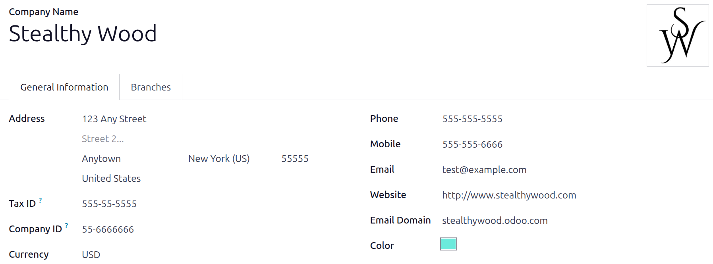

=============
United States
=============

The localization for payroll in the United States consists of the process of salary computation for
employees, including Payroll tax calculations (employee and employer portions). It takes into
consideration Federal and State regulations.

The States included in this localization are:

- California (CA)
- New York (NY)
- Texas (TX)
- Florida (FL)
- Colorado (CO)
- Alabama (AL)
- Washington (WA)
- Nevada (NV)

.. note::
  Federal portion of taxes (Income, :abbr:`FICA (Federal Insurance Contributions Act)`, and
  Unemployment) for employee and employer are covered by default with the current Odoo Payroll US
  localization. Check back as more states are added.

Before configuring the United States localization, refer to the general :doc:`payroll
<../../payroll>` documentation, which includes the basic information for all localizations, as well
as all universal settings and fields.

.. _payroll/usa_apps:

Apps & modules
==============

:ref:`Install <general/install>` the following modules to get all the features of the United States
payroll localization:

.. list-table::
   :header-rows: 1

   * - Name
     - Technical name
     - Dependencies
     - Description
   * - :guilabel:`United States - Payroll`
     - `l10n_us_hr_payroll`
     - hr_payroll
       hr_contract_reports
       hr_work_entry_holidays
       hr_payroll_holidays
     - The module includes the basics of US Payroll. The module's installation loads automatically:
       employee tax filing details; contract basis of pay and benefits; a salary type for the US
       with a common structure with Basic/Gross/Net Salary calculation; salary rules for correct
       employee and employer tax calculation, and W2 and ADP reports generation.
   * - :guilabel:`United States - Payroll with Accounting`
     - `l10n_us_hr_payroll_account`
     - hr_payroll_account
       l10n_us
       l10n_us_hr_payroll
     - This module is the link between payroll and accounting. Its main purpose is to allow the
       creation of a journal entry (per payslip if needed) to reflect the impact of Payroll in the
       company's books.

.. seealso::
   :doc:`United States fiscal localization documentation
   <../../../finance/fiscal_localizations/united_states>`

General configurations
======================

First, the company must be configured. Navigate to :menuselection:`Settings app --> Users &
Companies --> Companies`. From the list, select the desired company, and configure the following
fields:

- :guilabel:`Name`: Enter the business name in this field.
- :guilabel:`Address`: Complete the full address, including the :guilabel:`City`, :guilabel:`State`,
  :guilabel:`Zip Code`, and :guilabel:`Country`.

  .. important::
     The state selected in the company's address is associated as the *work address* by default for
     the employee, and the one used to calculate payroll taxes.

- :guilabel:`Tax ID`: Enter the business's :abbr:`Employer identification number (EIN)`.
- :guilabel:`Company ID` : Enter the business's state ID number.
- :guilabel:`Currency`: By default, :abbr:`USD (US Dollars)` is selected. If not, select
  :guilabel:`USD` from the drop-down menu.
- :guilabel:`Phone`: Enter the company phone number.
- :guilabel:`Email`: Enter the email used for general contact information.

.. warning::
   Make sure the information is accurate as it is used in the W2 form file generation.

Employees
=========

Every employee being paid must have their employee profiles configured for the United States payroll
localization. Additional fields are present after configuring the database for the United States.

To update an employee form, open the :menuselection:`Employees` app and click on the desired
employee record. Configure the following fields on the employee form, in the related tabs:

Work tab
--------

Enter the :guilabel:`Work Address` for the employee in the :guilabel:`Location` section of the
:guilabel:`Work` tab.

.. important::
   The state selected in this address guides Odoo to the appropriate salary rules when calculating
   taxes.

Personal tab
------------

Ensure the employee has a minimum of one :ref:`trusted bank account <employees/private-contact>`
listed in the :guilabel:`Bank Accounts` field in the :guilabel:`Private Contact` section.

These accounts are used to pay the employee, via an automation through a NACHA payment file. Payroll
**cannot** be processed for employees without a *trusted* bank account (a warning appears on the
**Payroll** dashboard, and an error message appears when attempting to run payroll).

Ensure there is a valid :guilabel:`SSN No` entered in the :guilabel:`Citizenship` section . The last
four digits of the :abbr:`SSN (Social Security Number)` number appears on the employee's payslips.

Payroll tab
-----------

Contract overview section
~~~~~~~~~~~~~~~~~~~~~~~~~

This section holds information that drives salary calculations. ENsure the following fields are
configured:

- :guilabel:`Contract`: The Validity of the compensation conditions can be updated depending on the
  needs.
- :guilabel:`Wage type`: Using the drop-down menu, select how the employee is paid. Select
  :guilabel:`Fixed Wage` for salaried employees, who receive a predetermined set amount each pay
  period. Select :guilabel:`Hourly wage` for employees who are paid based on their worked time.

  The most common wage type can be selected in the salary :ref:`Structure Type
  <payroll/structure-types>` as the default :guilabel:`Wage type`, but this can be overwritten on
  the employee record when configuring individual employee records.

- :guilabel:`Contract Type`: Using the drop-down menu, select one of the 18 default options,
  indicating the type of contract the employee has.

  .. important::
     This field is visible on payslips. Some states require payslips to state if the employee is
     exempt or non-exempt from overtime. Ensure the selection follows the state laws.

- :guilabel:`Pay Category`: Select :guilabel:`United States: Employee` for this field. This defines
  when the employee is paid, their default working schedule, and the work entry type it applies to.

Schedule section
~~~~~~~~~~~~~~~~

- :guilabel:`Work Entry Source`: Using the drop-down menu, select how the database creates
  :doc:`work entries <../work_entries>` either :guilabel:`Working Schedule`,
  :guilabel:`Attendances`, or :guilabel:`Planning`. Odoo creates and calculates work entries for pay
  periods based on either the selected working schedule, or the entries in the **Attendance** and
  **Planning** apps, respectively.
- :guilabel:`Extra Hours`: Tick the checkbox to allow the **Attendances** app to add any extra work
  entries logged by the employee.
- :guilabel:`Working Hours`: Using the drop-down menu, select the default work schedule. This is
  particularly important for employees available to receive overtime pay (typically hourly
  employees, not salaried).

W-2 form section
~~~~~~~~~~~~~~~~

A W-2 is a form provided to employees that details all the wages, taxes, and benefits paid to the
employee during a specific tax period, typically a year. This form is used by employees to file
their tax returns, and the options below all appear in box 13 of their W2 form. Tick any relevant
checkboxes for the employee:

- :guilabel:`Statutory Employee`: Tick this box if the employee is exempt from income tax, but
  subject to :abbr:`FICA (Federal Insurance Contributions Act)` taxes.
- :guilabel:`Retirement Plan`: Tick this box if the employee is an active contributor to an
  employer-sponsored retirement plan.
- :guilabel:`Third-Party Sick Pay`: Tick this box if the employee received sick pay benefits from a
  third-party at any point in the year.

W-4 form section
~~~~~~~~~~~~~~~~

A W-4 is an :abbr:`IRS (Internal Revenue Services)` form that indicates the characteristics of an
employee that aids in the calculation of their federal tax withholding. The withholdings are usually
done and then paid by the employer to the IRS, directly.

Configure any relevant fields for the employee in this section.

State filing section
~~~~~~~~~~~~~~~~~~~~

An employees' marital status impacts their payroll taxes. Configure the following fields in regards
to their status and withholdings.

- :guilabel:`Status`: Using the drop-down menu, select the employee's *federal* filing status. The
  options are :guilabel:`Single`, :guilabel:`Married/RDP filing jointly`, :guilabel:`Married/RDP
  filing separately`, :guilabel:`Head of household`, or :guilabel:`Qualifying surviving spouse/RDP
  with child`. This typically comes from the employee's W-4 form.
- :guilabel:`Tax Status`: Using the drop-down menu, select the employee's *state* filing status, if
  applicable.

  .. tip::
     The federal and state statuses do **not** need to match.

  .. note::
     As of 2025, nine states do **not** collect state income tax: Alaska, Florida, Nevada, New
     Hampshire, South Dakota, Tennessee, Texas, Washington, and Wyoming. If a payroll localization
     exists for these states, there will **not** be corresponding state options in the
     :guilabel:`Tax Status` field. Leave the field blank.

- :guilabel:`Withholding Allowance`: Enter the total annual amount to be withheld from the
  employee's pay for the year, for state taxes. Only fill this out if the employee lives in a state
  with state income tax.
- :guilabel:`Extra Withholding`: Enter the total *extra* annual amount (not including the
  :guilabel:`Withholding Allowance` amount) to be withheld from the employee's pay for the year, for
  state taxes, if the employee lives in a state with state income tax.

Common benefits
~~~~~~~~~~~~~~~

The following sections of benefits are considered common ones offered by US employers. This
information needs to be populated with the information selected by the employee.

.. note::
   The benefits listed in this section are considered the most commonly offered by companies. If
   other employee benefits exist that require regular paycheck deductions, they can be added as
   *inputs*.

Pre-tax deductions
******************

Pre-tax benefits lower the employee's gross wage, which decreases the base amount for tax
calculations. These are displayed at the beginning of the payslip before the gross wage is
stipulated.

Retirement plans section
^^^^^^^^^^^^^^^^^^^^^^^^

This section is where the employee and employer 401(k) contributions are configured. Fill out the
following fields:

- :guilabel:`401(k)`: Enter the amount of money taken out of the employee's payslip each pay period.
  This can be entered either as a percentage (%) of the payslip amount, or a specific dollar amount
  per payslip ($/slip).
- :guilabel:`Matching Amount`: Enter the matching amount the employer contributes to the employee's
  401(k), as compared to the employee's contributions. This field can also be configured as either a
  percentage (%) of the employee's contribution, or a specific dollar amount ($/slip).
- :guilabel:`Matching Yearly Cap`: If there is a limit to the employer's contribution, enter it as a
  percentage of the employee's annual salary.

.. example::
   A company allows employees to contribute to a 401(k) retirement plan, and matches 50% of the
   employee's controbutions, up to $5,000 USD a year. The employee earns $50,000 USD a year, and
   contributes 20% of their pay to their 401(k), which is $10,000 USD.

   To configure this, enter `20.00` in the :guilabel:`401(k)` field, `50.00` in the
   :guilabel:`Matching Amount` field, and `20.00` in the :guilabel:`Matching Yearly Cap` field.

Health benefits section
^^^^^^^^^^^^^^^^^^^^^^^

This section is where the employee's health contributions are configured. Populate each of the
fields with the corresponding amount deducted from  *each paycheck* for the employee.

Other benefits section
^^^^^^^^^^^^^^^^^^^^^^

THis section currently only houses a :guilabel:`Commuter` benefit field. Enter the amount being
deducted per paycheck, for applicable commuter benefits.

Post-tax deductions section
***************************

These types of benefit counts as a deduction *after* taxes are calculated. They appear towards the
end of the payslip before the net amount is displayed. Currently, only one field, :guilabel:`ROTH
401(k)` appears in this section. Enter either a percentage (%) of the payslip amount, or a specific
dollar amount per payslip ($/slip) being deducted form the employee's pay, and deposited into a ROTH
401(k) account.

Payroll configuration
=====================

Several sections within the **Payroll** app instals a Salary Structure, Structure Type, Rules, and
Parameters specific to the United States.

Salary structures & structure types
-----------------------------------

When the **l10n_us_hr_payroll** module is :ref:`installed <payroll/usa_apps>`, a new
:guilabel:`Salary Structure` gets installed, :guilabel:`United States: Regular Pay`. This structure
includes one :guilabel:`Structure Type`, :guilabel:`United States: Regular Pay`.

The :guilabel:`Salary Structure` contains all the individual :ref:`salary rules <payroll/usa_apps>`
that informs the **Payroll** app how to calculate employee payslips.

.. _payroll/usa_rules:

Salary rules
------------

To view the salary rules that inform the salary structure what to do, navigate to
:menuselection:`Payroll app --> Configuration --> Structures`. Click on :guilabel:`United States:
Employee (1)` to reveal the :guilabel:`United States: Regular Pay` structure type. Click
:guilabel:`United States: Regular Pay` to view the detailed salary rules.

Each rule tells the **Payroll** app what to do, and how to calculate the employee's pay. The *logic*
behind the various rules :guilabel:`United States: Regular Pay` is as follows:

The first four rules listed reflects all sources of income, including the basic wage listed on the
contract (:guilabel:`Basic Salary`), plus any allowances, such as :guilabel:`Commissions`,
:guilabel:`Tips`, and :guilabel:`Bonuses`.

Adding up these inputs is how the gross salary (:guilabel:`Gross Pay`) is calculated. This amount is
the base amount used to calculate payroll taxes.

The next set of rules are the various pre-tax benefits and taxable income, such as
:guilabel:`Medical` insurance contributions and :guilabel:`Commuter Benefits`. After the employee's
:guilabel:`Gross Pay` is calculated, Odoo deducts all the pre-tax benefits listed on the employee's
contract to determine the employee's :guilabel:`Taxable Income`.

Next, all the various tax rules are listed where both federal and state payroll withholdings are
outlined. First, federal tax rules are listed, then any state rules (if any) are listed.

The last rules listed are the post-tax employee deductions.

The :guilabel:`Other Inputs` tab contains anything else affecting payroll. This includes items to be
added to the payslip, such as :guilabel:`Tips`, and other deductions, such as :guilabel:`Child
Support`.

The employee's net salary is the amount the employee receives from the employer. The formula to
calculate the net salary is:

.. math::

   \text{Gross Salary} + \text{Allowances} - \text{Payroll Taxes} - \text{General Deductions}

Additionally, an extra section exists in payroll calculation for the US called `Employer
Deductions`, and it breaks down the payments the employer must make as their portion of payroll
taxes.

Rule parameters
---------------

Some calculations require specific rates associated with them, or wage caps. *Rules Parameters* are
capable of listing a value, either a percentage or a fixed amount, to reference in the salary rules.

.. example::
   The wage base for Social Security tax calculations has a cap for 2025, so the US payroll
   localization added a line to the `US: FICA OASDI Cap` parameter.

Most rules pull information stored in the parameters module to get the rate of the rule (a
percentage) and the cap of it (a dollar amount).

To view rule parameters, navigate to :menuselection:`Payroll app --> Configuration --> Rule
Parameters`. Here, all rule parameters are listed, and the :guilabel:`Salary Rules` they are linked
to are listed, and can be accessed. Review the parameters associated with a rule by looking for the
:guilabel:`Name` of the rule, and make any edits as needed.

.. example::
   The Unemployment tax of a company is different from the one added by default in Odoo. To update
   this, navigate to :menuselection:`Payroll app --> Configuration --> Rule Parameters`, then,
   filter the results by :abbr:`FUTA (Federal Unemployment Tax Act)`, or the name of the state that
   needs editing, and edit the corresponding rate from the list.

Run US payroll
==============

Before a payroll officer runs payroll, their first step is to validate employee :doc:`work entries
<../work_entries>`, to ensure employees are being correctly paid for the time they worked, and there
are no errors. This includes ensuring no time off requests are waiting for validation, and any
overtime logged is appropriate, and approved.

Work entries sync according to the :doc:`contract <../contracts>` configuration of the employee,
either their working schedule, attendance records, or the planning schedule, and their time off
information.

Any :ref:`discrepencies or conflicts <payroll/conflicts>` must be resolved, then the work entries
can be :ref:`regenerated <payroll/regenerate-work-entries>`.

Once everything is correct, draft payslips can be :ref:`created individually <payroll/process>` or
in :doc:`batches <../batches>`, referred to in the **Payroll** app as `Pay Runs`.

.. note::
   To cut down on the payroll officer's time, it is typical to process payslips in batches, either
   by wage type (fixed salary vs hourly), pay schedule (weekly, bi-weekly, monthly, etc.),
   department (direct cost vs. administration), or any other grouping that best suits the company.

The process of running payroll includes different actions that need to be executed to ensure that
the amount withheld from payroll taxes is correct, the amount that the employee receives as their
net salary is correct, and the computation of hours worked reflects the employee's actual hours
worked, among others.

When running a payroll batch, check that the period, company, and employees included are correct
*before* starting to analyze or validate the data.

Once the payslips are drafted, review them for accuracy. Check the :guilabel:`Worked Days & Inputs`
tab, and ensure the listed worked time is correct, as well as any other inputs. Add any missing
inputs, such as commissions, tips, reimbursements, that are missing.

Next, check the various totals (gross pay, employee taxes, benefits, employer taxes, net salaries),
then click :guilabel:`Compute Sheet` to update the salary calculations, if there were edits. If
everything is correct, click :guilabel:`Validate`.

Accounting check
----------------

The accounting process when running payroll has two components: :ref:`creating journal entries
<payroll/journal>`, and :ref:`registering payments <payroll/register>`.

.. _payroll/journal:

Journal entry creation
~~~~~~~~~~~~~~~~~~~~~~

After payslips are confirmed and validated, journal entries are posted either individually, or in a
batch.

.. important::
   It must be decided if journal entries are done individually or in batches *before* running
   payroll.

The journal entry is created first as a draft.

Four accounts from the US :abbr:`CoA (Chart of Accounts)` are added as part of the US payroll
localization:

- 611000 Salaries & Wages: This stores the gross salary of the employee and the employer's portion
  of payroll expenses. It also is used to group any values that come from rules that do not have an
  account associated with them, such as benefits that are specific to a company.
- 230100 Employee Payroll Taxes: This is the amount withheld from employees regarding payroll taxes,
  that the employer is liable to file and pay on their behalf. Check the partner and label columns
  of the JE to see the particular tax they represent.
- 230200 Employer Payroll Taxes: This is the employer portion of payroll taxes that they are liable
  to file and pay. Check the partner and label columns of the JE to see the particular tax they
  represent.
- 230000 Salary Payable: The amount that needs to be paid to the employee.

.. note::
   The :abbr:`CoA (Chart of Accounts)` configuration is done by default when a company is located in
   the US. The account codes and names can be edited to suit the company's needs. If there is no
   :abbr:`CoA (Chart of Accounts)` account associated with a salary rule (used in a salary
   structure), Odoo uses the account `Salary Expenses` to create the journal entry, regardless of
   the nature of the move.

If everything seems correct on the journal entry draft, post the journal entries.

.. _payroll/register:

Register Payments
-----------------

After the :ref:`journla entries <payroll/journal>` are validated, Odoo can generate payments.

.. important::
   To generate payments from payslips,employee's **must** have a *trusted* bank account. If the
   employee's bank account is *not* marked as `trusted`, NACHA files **cannot** be generated through
   Odoo.

Payments can be :guilabel:`Grouped by Partner` if there is a partner associated with a salary rule.

Close Payroll
-------------

If there are no errors, payroll is completed for the pay period.

Reports
=======

The US localization contains several reports unique to the US, which provide tax information for
employees, as well as the ability to integrate with outside organizations such as ADP.

W2 Report
---------

Odoo provides a CSV file that allows employees to e-file their W2 report with third-party software.
To access this report, navigate to :menuselection:`Payroll -> Reporting -> United States -> W2`.

To create a W2 form, click :guilabel:`New`, and a blank :guilabel:`Create W2 Form` page loads. Set
the :guilabel:`Start Date` and :guilabel:`End Date` (typically a calendar year), and select the
:guilabel:`Company`, if in a multi-company database.

All pay runs for the time period appear in a list view. To add any missing pay runs, click
:guilabel:`Add a line` at the bottom of the list, and select the missing files.

When done, click the :guilabel:`Generate` button to create a CSV file with a summary of all payroll
related payments made during the specified time period.

Form 941
--------

Form 941 is meant to inform the government of the amount of federal income tax, :abbr:`FICA (Federal
Insurance Contributions Act)` taxes (Medicare and Social Security) withheld from employee paychecks.
It also reports the employees' side of taxes.

To create this report, navigate to :menuselection:`Payroll -> Reporting -> United States -> Form
941`. CLick the :guilabel:`New` button, and a new :guilabel:`Form 941` report page loads. Configure
the information on the top portion of the form, including the :guilabel:`Company`, :guilabel:`Tax
Year`, :guilabel:`Quarter`, :guilabel:`IRS Payment Option` (how the money is being sent to the IRS),
and :guilabel:`Deposit Schedule and Tax Liability` (how often payments are made to the IRS).

All pay runs for the time period appear in a list view. To add any missing pay runs, click
:guilabel:`Add a line` at the bottom of the list, and select the missing files.

When done, click :guilabel:`Generate`, and the report is created as a CSV file, and appears on the
:guilabel:`Form 941` report dashboard. Companies then download and submit this report through a
third party for e-filing.

Form 940
--------

Form 940 reports the annual :abbr:`FUTA (Federal Unemployment Tax Act)` withheld for payroll.

To create this report, navigate to :menuselection:`Payroll -> Reporting -> United States -> Form
940`. CLick the :guilabel:`New` button, and a new :guilabel:`Form 940` report page loads. Configure
the information on the top portion of the form, including the :guilabel:`Company`, :guilabel:`Tax
Year`, :guilabel:`Single State Payer`, :guilabel:`Multi State Employer`, :guilabel:`Paid in Credit
Reduction State`, and :guilabel:`IRS Payment Option` (how the money is being sent to the IRS).

All pay runs for the time period appear in a list view. To add any missing pay runs, click
:guilabel:`Add a line` at the bottom of the list, and select the missing files.

When done, click :guilabel:`Generate`, and the report is created as a CSV file, and appears on the
:guilabel:`Form 940` report dashboard. Companies then download and submit this report through a
third party for e-filing.

Export to ADP
-------------

The ADP export report generates a CSV file that can be submitted to ADP, which then makes payments
to the employees.

The CSV file summarizes the employee worked hours during a specified time period, correlating to
their salary or hourly wage. The report is generated from :doc:`work entry <../work_entries>`
*after* any time off is confirmed.

The export format is meant to match with the ADP format. Since companies can customize their portal
and may require some changes, the data is there to be fed to ADP to run Payroll in it.
