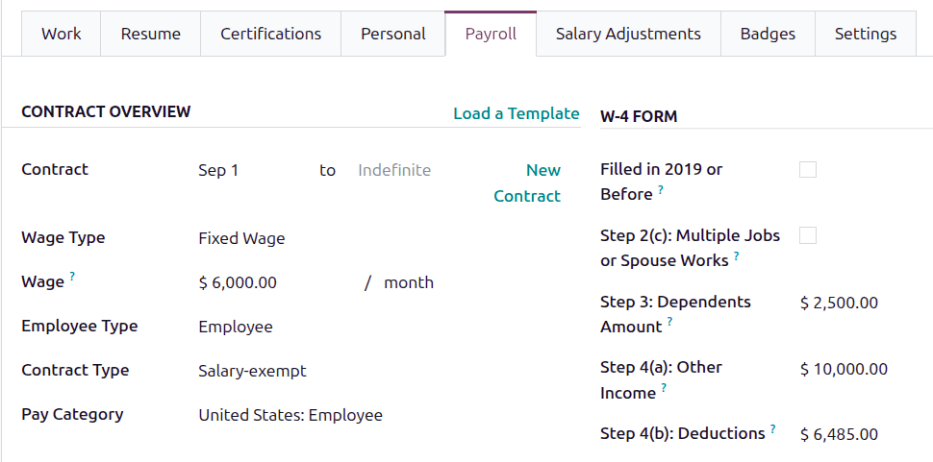

=============
United States
=============

The U.S. payroll localization covers salary computations for employees, including both employee and
employer payroll taxes. It accounts for federal and state regulations.

The states included in this localization are:

- California (CA)
- New York (NY)
- Texas (TX)
- Florida (FL)
- Colorado (CO)
- Alabama (AL)
- Washington (WA)
- Nevada (NV)

.. note::
   Federal taxes (Income, :abbr:`FICA (Federal Insurance Contributions Act)`, and Unemployment) for
   both employees and employers are covered by default in the Odoo U.S. Payroll localization.
   Additional states will be added over time, so check back for updates.

Before configuring the United States localization, refer to the general :doc:`payroll
<../../payroll>` documentation, which includes the basic information for all localizations, as well
as all universal settings and fields.

.. _payroll/usa_apps:

Apps & modules
==============

:ref:`Install <general/install>` the following modules to get all the features of the United States
payroll localization:

.. list-table::
   :header-rows: 1

   * - Name
     - Technical name
     - Dependencies
     - Description
   * - :guilabel:`United States - Payroll`
     - `l10n_us_hr_payroll`
     - - hr_payroll
       - hr_contract_reports
       - hr_work_entry_holidays
       - hr_payroll_holidays
     - Provides U.S. payroll basics, including employee tax details, salary structures
       (Basic/Gross/Net), tax rules, and W-2/3PA reporting.
   * - :guilabel:`United States - Payroll with Accounting`
     - `l10n_us_hr_payroll_account`
     - - hr_payroll_account
       - l10n_us
       - l10n_us_hr_payroll
     - Links payroll and accounting by creating journal entries (per payslip if needed) to record
       payroll in the company's books.

.. seealso::
   :doc:`Configure the United States fiscal localization
   <../../../finance/fiscal_localizations/united_states>`

General configurations
======================

First, the company must be configured. Navigate to :menuselection:`Settings app --> Users &
Companies --> Companies`. From the list, select the desired company, and configure the following
fields:

- :guilabel:`Company Name`: Enter the business name in this field.
- :guilabel:`Address`: Complete the full address, including the :guilabel:`City`, :guilabel:`State`,
  :guilabel:`Zip Code`, and :guilabel:`Country`.

  .. important::
     The state selected in the company's address is associated as the *work address* by default for
     the employee, and the one used to calculate payroll taxes.

- :guilabel:`Tax ID`: Enter the company's :abbr:`EIN (Employer Identification Number)`.
- :guilabel:`Company ID` : Enter the business's state ID number.
- :guilabel:`Currency`: By default, :abbr:`USD (US Dollars)` is selected. If not, select
  :guilabel:`USD` from the drop-down menu.
- :guilabel:`Phone`: Enter the company phone number.
- :guilabel:`Email`: Enter the email used for general contact information.

.. warning::
   Ensure the information is accurate, as it is used when creating W-2s.

Employees
=========

Every employee being paid must have their employee profiles configured for the United States payroll
localization. Additional fields are present after configuring the database for the United States.

To update an employee form, open the :menuselection:`Employees` app and click on the desired
employee record. On the employee form, configure the required fields in the related tabs.

Work tab
--------

Enter the :guilabel:`Work Address` for the employee in the :guilabel:`Location` section of the
:guilabel:`Work` tab.

.. important::
   The state selected in this address determines which salary rules Odoo applies when calculating
   taxes.

Personal tab
------------

Ensure the employee has a minimum of one :ref:`trusted bank account <employees/private-contact>`
listed in the :guilabel:`Bank Accounts` field in the :guilabel:`Private Contact` section.

These accounts are used to pay the employee, via an automation through a NACHA payment file. Payroll
**cannot** be processed for employees without a *trusted* :ref:`bank account
<employees/private-contact>`. If no trusted bank account is set, a warning appears on the
**Payroll** dashboard and an error occurs when attempting to run payroll.

Ensure there is a valid :guilabel:`SSN No` entered in the :guilabel:`Citizenship` section . The last
four digits of the :abbr:`SSN (Social Security Number)` number appears on the employee's payslips.

Payroll tab
-----------

Contract overview section
~~~~~~~~~~~~~~~~~~~~~~~~~

This section holds information that drives salary calculations. Ensure the following fields are
configured:

- :guilabel:`Contract`: The Validity of the compensation conditions can be updated depending on the
  needs.
- :guilabel:`Wage Type`: Select how the employee is paid.

  - Select :guilabel:`Fixed Wage` for salaried employees who receive the same amount each pay
    period.
  - Select :guilabel:`Hourly Wage` for employees paid based on hours worked.

  .. tip::
     Set a default :guilabel:`Wage Type` in the salary :ref:`Structure Type
     <payroll/structure-types>` to configure employees in bulk. If needed, the default can be
     overridden on individual employee records if exceptions are needed.

- :guilabel:`Contract Type`: Determines how the employee is paid and classified, such as
  :guilabel:`Salary-exempt`, :guilabel:`Salary-nonexempt`, :guilabel:`Hourly`.

  .. important::
     This field is visible on payslips. Some states require payslips to state if the employee is
     exempt or non-exempt from overtime. Ensure the selection follows the state laws.

- :guilabel:`Pay Category`: Select :guilabel:`United States: Employee` for this field. This defines
  when the employee is paid, their default working schedule, and the work entry type it applies to.

Schedule section
~~~~~~~~~~~~~~~~

- :guilabel:`Work Entry Source`: Defines how :doc:`work entries <../work_entries>` are generated for
  payroll during the specified pay period. The options are:

  - :guilabel:`Working Schedule`: Based on the employee's assigned :ref:`working schedule
    <employees/schedule>` (e.g., 40 hours per week).
  - :guilabel:`Attendances`: Based on :doc:`approved checked-in hours
    <../../attendances/management>` in the **Attendances** app.
  - :guilabel:`Planning`: Based on :ref:`scheduled shifts <planning/shifts>` in the **Planning**
    app.

- :guilabel:`Extra Hours`: Tick the checkbox to allow the **Attendances** app to add any extra work
  entries logged by the employee.
- :guilabel:`Working Hours`: Using the drop-down menu, select the default work schedule. This is
  particularly important for employees available to receive overtime pay (typically hourly
  employees, not salaried).

W-2 form section
~~~~~~~~~~~~~~~~

A W-2 is an annual tax form that reports an employee's wages, taxes, and benefits. Employees use it
to file their tax returns. The options below correspond to checkboxes in *box 13* of the W-2 form.
Select any that apply to the employee.

- :guilabel:`Statutory Employee`: Tick this box if the employee is exempt from income tax, but
  subject to :abbr:`FICA (Federal Insurance Contributions Act)` taxes.
- :guilabel:`Retirement Plan`: Tick this box if the employee is an active contributor to an
  employer-sponsored retirement plan.
- :guilabel:`Third-Party Sick Pay`: Tick this box if the employee is covered under a plan where sick
  pay benefits may be provided by a third party (e.g., an insurance company) during the year.

W-4 form section
~~~~~~~~~~~~~~~~

A W-4 is an :abbr:`IRS (Internal Revenue Services)` form that determines an employee's federal tax
withholding, which the employer remits directly to the :abbr:`IRS (Internal Revenue Services)`.

Configure any relevant fields for the employee in this section.

State filing section
~~~~~~~~~~~~~~~~~~~~

An employee's marital status impacts their payroll taxes. Configure the following fields regarding
their status and withholdings.

- :guilabel:`Status`: Using the drop-down menu, select the employee's *federal* filing status. The
  options are :guilabel:`Single`, :guilabel:`Married/RDP filing jointly`, :guilabel:`Married/RDP
  filing separately`, :guilabel:`Head of household`, or :guilabel:`Qualifying surviving spouse/RDP
  with child`. This typically comes from the employee's W-4 form.
- :guilabel:`Tax Status`: Using the drop-down menu, select the employee's *state* filing status, if
  applicable.

  .. tip::
     The federal and state statuses do **not** need to match.

  .. note::
     As of 2025, these states do **not** collect state income tax: Alaska, Florida, Nevada, New
     Hampshire, South Dakota, Tennessee, Texas, Washington, and Wyoming. If a payroll localization
     exists for these states, there are **no** corresponding state options in the :guilabel:`Tax
     Status` field. Leave it blank.

- :guilabel:`Withholding Allowance`: Enter the total annual amount to be withheld from the
  employee's pay for the year, for state taxes. Only fill this out if the employee lives in a state
  with state income tax.
- :guilabel:`Extra Withholding`: Enter the total *extra* annual amount (not including the
  :guilabel:`Withholding Allowance` amount) to be withheld from the employee's pay for the year, for
  state taxes, if the employee lives in a state with state income tax.

Common benefits
~~~~~~~~~~~~~~~

The following sections of benefits are considered common ones offered by US employers. This
information needs to be populated with the information selected by the employee.

.. note::
   The benefits listed in this section are considered the most commonly offered by companies. If
   other employee benefits exist that require regular paycheck deductions, they can be added as
   *inputs*.

Pre-tax deductions
******************

Pre-tax benefits lower the employee's gross wage, which decreases the base amount for tax
calculations. These are displayed at the beginning of the payslip before the gross wage is
stipulated.

Retirement plans section
^^^^^^^^^^^^^^^^^^^^^^^^

This section is where the employee and employer 401(k) contributions are configured. Fill out the
following fields:

- :guilabel:`401(k)`: Enter the amount of money taken out of the employee's payslip each pay period.
  This can be entered either as a percentage (%) of the payslip amount, or a specific dollar amount
  per payslip ($/slip).
- :guilabel:`Matching Amount`: Enter the matching amount the employer contributes to the employee's
  401(k), as compared to the employee's contributions. This field can also be configured as either a
  percentage (%) of the employee's contribution, or a specific dollar amount ($/slip).
- :guilabel:`Matching Yearly Cap`: If there is a limit to the employer's contribution, enter it as a
  percentage of the employee's annual salary.

.. example::
   A company allows employees to contribute to a 401(k) retirement plan, and matches 50% of the
   employee's contributions, up to $5,000 USD a year. The employee earns $50,000 USD a year, and
   contributes 20% of their pay to their 401(k), which is $10,000 USD.

   To configure this, enter `20.00` in the :guilabel:`401(k)` field, `50.00` in the
   :guilabel:`Matching Amount` field, and `20.00` in the :guilabel:`Matching Yearly Cap` field.

  .. image:: united_states/retirement.png
     :alt: An employee's retirement configurations.

Health benefits section
^^^^^^^^^^^^^^^^^^^^^^^

This section is where the employee's health contributions are configured. Populate each of the
fields with the corresponding amount deducted from *each paycheck* for the employee.

Other benefits section
^^^^^^^^^^^^^^^^^^^^^^

This section currently only houses a :guilabel:`Commuter` benefit field. Enter the amount being
deducted per paycheck, for applicable commuter benefits.

Post-tax deductions section
***************************

These types of benefits count as deductions *after* taxes are calculated. They appear towards the
end of the payslip before the net amount is displayed. Currently, only one field, :guilabel:`ROTH
401(k)` appears in this section. Enter either a percentage (%) of the payslip amount, or a specific
dollar amount per payslip ($/slip) being deducted from the employee's pay, and deposited into a ROTH
401(k) account.

Payroll configuration
=====================

Several sections within the **Payroll** app installs a Salary Structure, Structure Type, Rules, and
Parameters specific to the United States.

Salary structures & structure types
-----------------------------------

When the **l10n_us_hr_payroll** module is :ref:`installed <payroll/usa_apps>`, a new
:guilabel:`Salary Structure` gets installed, :guilabel:`United States: Regular Pay`. This structure
includes one :guilabel:`Structure Type`, :guilabel:`United States: Regular Pay`.

The :guilabel:`Salary Structure` contains all the individual :ref:`salary rules <payroll/usa_apps>`
that informs the **Payroll** app how to calculate employee payslips.

.. _payroll/usa_rules:

Salary rules
------------

To view the salary rules that inform the salary structure what to do, navigate to
:menuselection:`Payroll app --> Configuration --> Structures` and expand the :guilabel:`United
States: Employee` group to reveal the :guilabel:`United States: Regular Pay` structure type. Click
:guilabel:`United States: Regular Pay` to view the detailed salary rules.

Each rule defines how pay is calculated, taking into account factors such as commissions, bonuses,
taxes, and insurance. The *logic* behind the :guilabel:`United States: Regular Pay` rules is as
follows:

- The first four rules listed reflects all sources of income, including the basic wage listed on the
  contract (:guilabel:`Basic Salary`), plus any allowances, such as :guilabel:`Commissions`,
  :guilabel:`Tips`, and :guilabel:`Bonuses`.

  .. image:: united_states/first-rules.png
     :alt: The basic salary rules for the US localization.

- Adding up these inputs is how the gross salary (:guilabel:`Gross Pay`) is calculated. This amount
  is the base amount used to calculate payroll taxes.

- The next set of rules are the various pre-tax benefits and taxable income, such as
  :guilabel:`Medical` insurance contributions and :guilabel:`Commuter Benefits`. After the
  employee's :guilabel:`Gross Pay` is calculated, Odoo deducts all the pre-tax benefits listed on
  the employee's contract to determine the employee's :guilabel:`Taxable Income`.

  .. image:: united_states/pre-tax.png
     :alt: The pre-tax rules for the US localization.

- Next, all the various tax rules are listed where both federal and state payroll withholdings are
  outlined. First, federal tax rules are listed, then any state rules (if any) are listed.

  .. image:: united_states/irs.png
     :alt: The federal tax rules for the US localization.

  .. note::
     The rule for federal withholdings for `Worker's Compensation` appears *after* several
     state-specific withholdings are listed, and does **not** appear in the above image, but are
     listed in the rules.

- The last rules listed are the post-tax employee deductions.

  .. image:: united_states/post-tax.png
     :alt: The post-tax rules for the US localization.

- The :guilabel:`Other Inputs` tab contains anything else affecting payroll. This includes items to
  be added to the payslip, such as :guilabel:`Tips`, and other deductions, such as :guilabel:`Child
  Support`.

  .. image:: united_states/other-inputs.png
     :alt: The other inputs for the US localization.

- The employee's net salary is the amount the employee receives from the employer. The formula to
  calculate the net salary is:

  .. math::

     \text{Gross Salary} + \text{Allowances} - \text{Payroll Taxes} - \text{General Deductions}

- Additionally, an extra section exists in payroll calculation for the US called `Employer
  Deductions`, and it breaks down the payments the employer must make as their portion of payroll
  taxes.

  .. image:: united_states/employer-deductions.png
     :alt: The employer deduction rules for the US localization.

  .. note::
     The rule for employer deductions for `Worker's Compensation` appears *after* several
     state-specific employer deductions are listed, and does **not** appear in the above image, but
     are listed in the rules.

Rule parameters
---------------

Some calculations require specific rates associated with them, or wage caps. *Rules Parameters* are
capable of listing a value, either a percentage or a fixed amount, to reference in the salary rules.

.. example::
   The wage base for Social Security tax calculations has a cap for 2025, accounted for in the `US:
   FICA OASDI Cap` parameter.

Most rules pull information stored in the parameters module to get the rate of the rule (a
percentage) and the cap (a dollar amount).

To view rule parameters, navigate to :menuselection:`Payroll app --> Configuration --> Rule
Parameters`. Here, all rule parameters are displayed with their linked :guilabel:`Salary Rules`,
which can be accessed. Review the parameters associated with a rule by looking for the
:guilabel:`Name` of the rule, and make any edits as needed.

.. example::
   The Unemployment tax of a company is different from the one added by default in Odoo. To update
   this, navigate to :menuselection:`Payroll app --> Configuration --> Rule Parameters`, then,
   filter the results by :abbr:`FUTA (Federal Unemployment Tax Act)`, or the name of the state that
   needs editing, and edit the corresponding rate from the list.

.. important::
   Odoo adds updated rule parameters for the current calendar year. It is **not** recommended to
   edit rule parameters **unless a federal or state parameter has changed**, and is different from
   the rule parameters created by Odoo. Check with all local and national regulations *before*
   making any changes to rule parameters.

Run US payroll
==============

Before running paypoll, the payroll officer must validate employee :doc:`work entries
<../work_entries>` to confirm pay accuracy and catch errors. This includes checking that all time
off is approved and any overtime is appropriate.

Work entries sync based on the employee's :doc:`contract <../contracts>` configuration. Odoo pulls
from the assigned working schedule, attendance records, planning schedule, and approved time off.

Any :ref:`discrepencies or conflicts <payroll/conflicts>` must be resolved, then the work entries
can be :ref:`regenerated <payroll/regenerate-work-entries>`.

Once everything is correct, draft payslips can be :ref:`created individually <payroll/process>` or
in :doc:`batches <../batches>`, referred to in the **Payroll** app as *Pay Runs*.

.. note::
   To cut down on the payroll officer's time, it is typical to process payslips in batches, either
   by wage type (fixed salary vs hourly), pay schedule (weekly, bi-weekly, monthly, etc.),
   department (direct cost vs. administration), or any other grouping that best suits the company.

The process of running payroll includes different actions that need to be executed to ensure that
the amount withheld from payroll taxes is correct, the amount that the employee receives as their
net salary is correct, and the computation of hours worked reflects the employee's actual hours
worked, among others.

When running a payroll batch, check that the period, company, and employees included are correct
*before* starting to analyze or validate the data.

Once the payslips are drafted, review them for accuracy. Check the :guilabel:`Worked Days & Inputs`
tab, and ensure the listed worked time is correct, as well as any other inputs. Add any missing
inputs, such as commissions, tips, reimbursements, that are missing.

Next, check the various totals (gross pay, employee taxes, benefits, employer taxes, net salaries),
then click :guilabel:`Compute Sheet` to update the salary calculations, if there were edits. If
everything is correct, click :guilabel:`Validate`.

Accounting check
----------------

The accounting process when running payroll has two components: :ref:`creating journal entries
<payroll/journal>`, and :ref:`registering payments <payroll/register>`.

.. _payroll/journal:

Journal entry creation
~~~~~~~~~~~~~~~~~~~~~~

After payslips are confirmed and validated, journal entries are posted either individually, or in a
batch. The journal entry is created first as a draft.

.. important::
   It must be decided if journal entries are done individually or in batches *before* running
   payroll.

Four accounts from the US :abbr:`CoA (Chart of Accounts)` are included with the payroll
localization:

- `611000 Salaries & Wages`: Records gross salary and the employer's portion of payroll expenses.
  Also groups values from rules without specific accounts (e.g., company-specific benefits).
- `230100 Employee Payroll Taxes`: Withheld taxes from employees, which the employer must file and
  pay. The partner and label columns of the journal entry indicate the specific tax.
- `230200 Employer Payroll Taxes`: Employer portion of payroll taxes to be filed and paid. The
  partner and label columns of the journal entry indicate the specific tax.
- `230000 Salary Payable`: Net salary owed to the employee.

.. note::
   The :abbr:`CoA (Chart of Accounts)` configuration is done by default when a company is located in
   the US. The account codes and names can be edited to suit the company's needs. If there is no
   :abbr:`CoA (Chart of Accounts)` account associated with a salary rule (used in a salary
   structure), Odoo uses the account `Salary Expenses` to create the journal entry, regardless of
   the nature of the move.

If everything seems correct on the journal entry draft, post the journal entries.

.. _payroll/register:

Register Payments
-----------------

After the :ref:`journal entries <payroll/journal>` are validated, Odoo can generate payments.

.. important::
   To generate payments from payslips,employee's **must** have a *trusted* bank account. If the
   employee's bank account is *not* marked as `trusted`, NACHA files **cannot** be generated through
   Odoo.

Payments can be :guilabel:`Grouped by Partner` if there is a partner associated with a salary rule.

Close Payroll
-------------

If there are no errors, payroll is completed for the pay period.

Reports
=======

The US localization contains several reports unique to the US, which provide tax information for
employees, as well as the ability to integrate with outside organizations such as ADP.

W2 Report
---------

The *W2 Report* provides a CSV file that allows employees to e-file their W2 report with third-party
software. To access this report, navigate to :menuselection:`Payroll -> Reporting -> United States
-> W2`.

To create a W2 form, click :guilabel:`New`, and a blank :guilabel:`Create W2 Form` page loads. Set
the :guilabel:`Start Date` and :guilabel:`End Date` (typically a calendar year), and select the
:guilabel:`Company`, if in a multi-company database.

All pay runs for the time period appear in a list view. To add any missing pay runs, click
:guilabel:`Add a line` at the bottom of the list, and select the missing files.

When done, click the :guilabel:`Generate` button to create a CSV file with a summary of all payroll
related payments made during the specified time period.

Form 941
--------

The *Form 941* report is meant to inform the government of the amount of federal income tax,
:abbr:`FICA (Federal Insurance Contributions Act)` taxes (Medicare and Social Security) withheld
from employee paychecks. It also reports the employee's side of taxes.

To create this report, navigate to :menuselection:`Payroll -> Reporting -> United States -> Form
941`. Click the :guilabel:`New` button, and a new :guilabel:`Form 941` report page loads. Configure
the information on the top portion of the form, including the :guilabel:`Company`, :guilabel:`Tax
Year`, :guilabel:`Quarter`, :guilabel:`IRS Payment Option` (how the money is being sent to the IRS),
and :guilabel:`Deposit Schedule and Tax Liability` (how often payments are made to the IRS).

All pay runs for the time period appear in a list view. To add any missing pay runs, click
:guilabel:`Add a line` at the bottom of the list, and select the missing files.

When done, click :guilabel:`Generate`, and the report is created as a CSV file, and appears on the
:guilabel:`Form 941` report dashboard. Companies then download and submit this report through a
third party for e-filing.

Form 940
--------

The *Form 940* report details the annual :abbr:`FUTA (Federal Unemployment Tax Act)` withheld for
payroll.

To create this report, navigate to :menuselection:`Payroll -> Reporting -> United States -> Form
940`. Click the :guilabel:`New` button, and a new :guilabel:`Form 940` report page loads. Configure
the information on the top portion of the form, including the :guilabel:`Company`, :guilabel:`Tax
Year`, :guilabel:`Single State Payer`, :guilabel:`Multi State Employer`, :guilabel:`Paid in Credit
Reduction State`, and :guilabel:`IRS Payment Option` (how the money is being sent to the IRS).

All pay runs for the time period appear in a list view. To add any missing pay runs, click
:guilabel:`Add a line` at the bottom of the list, and select the missing files.

When done, click :guilabel:`Generate`, and the report is created as a CSV file, and appears on the
:guilabel:`Form 940` report dashboard. Companies then download and submit this report through a
third party for e-filing.

Export data to third-party apps
-------------------------------

The *ADP Export* report generates a CSV file that can be submitted to ADP, which then makes payments
to the employees.

The CSV file summarizes the employee's worked hours during a specified time period, correlating to
their salary or hourly wage. The report is generated from :doc:`work entry <../work_entries>`
*after* any time off is confirmed.

The export format is meant to match with the ADP format. Since companies can customize their portal
and may require some changes, the data is there to be fed to ADP to run payroll in it.

.. important::
   To access the ADP Export report, the `United States - Payroll - Export to ADP` module **must** be
   :ref:`installed <general/install>`.
