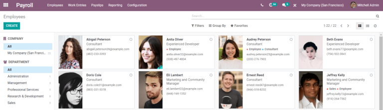
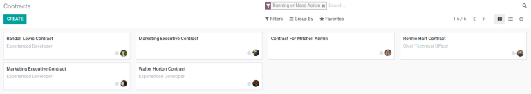
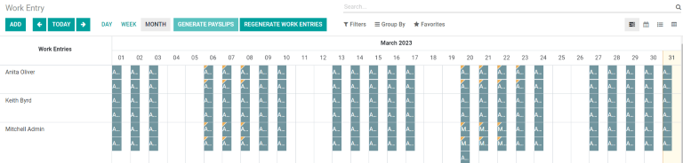
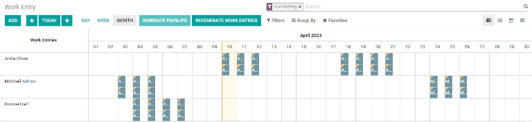
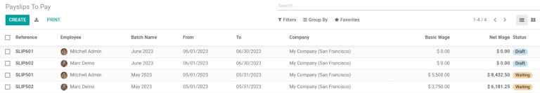
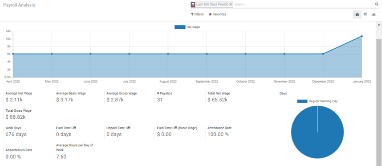

========================
Get started with Payroll
========================

The Odoo :guilabel:`Payroll` application allows for the management of employees, creation of
contracts, approval of timesheets, generation of payslips, and in-depth reporting.

:guilabel:`Payroll` consists of four main component: :guilabel:`Employees`,
:guilabel:`Work Entries`, :guilabel:`Payslips`, and :guilabel:`Reporting`. These four compnents have
all the tools needed to accurately handle payroll, and provide a birds-eye view of employees and
payments.

.. note::
   Several sections inside the :guilabel:`Payroll` applicaiton can be found in the
   :guilabel:`Employees` application as well. All the inforation below refers to specific sections
   within the :guilabel:`Payroll` appliciton only, regardless if the information is found elsewhere.

Employees
=========

The list of employees viewed in the :guilabel:`Payroll` application can be viewed by going to
:menuselection:`Payroll --> Employees --> Employees`. This list directly overlaps with the
:guilabel:`Employees` application, and displays all the employees of the business, whether
full-time, part-time, or contract.

The main :guilabel:`Employees` view displays a summary of each employee's information in the default
:guilabel:`Kanban` view setting. Each employee block (in the :guilabel:`Kanban` view) displays a
brief summary of that employee's information.

On the left sidebar, employees can be sorted by :guilabel:`Company` and/or :guilabel:`Department` by
clicking on the different companies and departments listed.

Contracts
---------

In order for an employee to be paid, an active contract is required. Go to :menuselection:`Payroll
--> Employees --> Contracts` to view empoyee contracts. All employee contracts, and their
current contract status, are displayed in a default :guilabel:`Kanban` view.

The default view displays both running contracts and contracts that need action. Expired and
canceled contracts are hidden from the default view.

Work Entries
============

The :guilabel:`Work Entries` dashboard, whic can be found by going to :menuselection:`Payroll
--> Work Entries --> Work Entries`, provides a visual overview of all employee's individual time
sheets, with each day split into a morning shift and an afternoon shift. From this page, work
entries can be regenerated by clicking :guilabel:`Regenrate Wor Entries` if there is an update to
schedules, and payslips can be generated by clicking :guilabel:`Generate Payslips`.

Conflicts
---------

A conflict appears for any request that has not been approved, such as sick time or vacation, or if
there are any errors on the work entry, such as required fields being left blank. Conflicts are
required to be resolved before payslips can be generated.

Any work entry that has a conflict to be resolved is indicated on the main :guilabel:`Work Entry`
overview dashboard, or by going to :menuselection:`Payroll --> Work Entries --> Conflicts` where
only conflicts needing resolution are shown.

Payslips
========

In Odoo :guilabel:`Payroll`, the :guilabel:`Payslips` drop-down header menu consists of three
sections: :guilabel:`To Pay`, :guilabel:`All Pay Slips`, and :guilabel:`Batches`.

Click :guilabel:`To Pay` to see the payslips that need to be paid. On this page, Odoo displays the
payslips that have not been generated yet, and can be created from this dashboard.

Click :guilabel:`All Payslips` to view all payslips regardless of status, on a separate page. On
this page, payslips are organized by month (in a default :guilabel:`List view`).

.. note::
   Both :guilabel:`To Pay` and :guilabel:`All Payslips` display all the detailed information for
   each payslip.

Clicking :guilabel:`Batches` reveals a separate page that displays all the payslip batches that
have been created. Commission payslips can be generated here, as well.

Reporting
=========

The :guilabel:`Reporting` section offers a variety of reports to chose from. To view a report, go to
:menuselection:`Payroll --> Reporting` and select the specific report to view.

The :guilabel:`Payroll Analysis` displays all the payslips generated in the last 365 days. This
report can display metrics based on the :guilabel:`Measures` selected, such as basic wages, work
days, unforeseen absences, and more.

:guilabel:`Meal Vouchers` provides an overview of  the meal vouchers used by employees, and can be
shown by day, week, month, quarter, or year.

:guilabel:`Attachment of Salary` is a report that shows any deductions or allocations per employee,
such as child support payments and wage garnishments.

Other reports are *country specific*, and if the specific report does not apply to the business, a
prompt will appear, alerting that the report is not valid.

All reports can be inserted into a spreadsheet for further use.

Settings
========

The :guilabel:`Settings` section is where localization settings are configured, including a detailed
view of all  benefits provided to employees.

To access the settings, go to :menuselection:`Payroll --> Configuration --> Settings`. Whether or
not payslips should be posted in accounting, or if SEPA payments are created, is selected here.
Any country specific locatiozations are set up in this section as well.
