========
Payslips
========

*Payslips* are created either by the employees themselves or their managers, and are approved by
authorized employees (typically managers). Then, once payslips are approved, employees are issued
payslips and are paid either by check or direct deposit, depending on how their employee profile is
configured.

The :guilabel:`Payslips` drop-down header of the :menuselection:`Payroll` application consists of
three sections: :guilabel:`To Pay`, :guilabel:`All Payslips`, and :guilabel:`Batches`.

These three sections provide all the tools needed to create payslips for employees, including
individual payslips, a batch of payslips, or commission payslips.

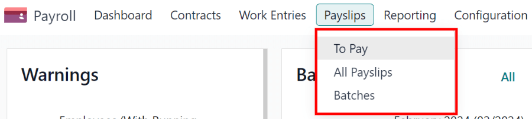

.. _payroll/to-pay:

To pay
======

Click on :menuselection:`Payroll app --> Payslips --> To Pay` to see the payslips that need to be
paid. On this page, Odoo displays the payslips that have not been generated yet, and can be created
from this dashboard.

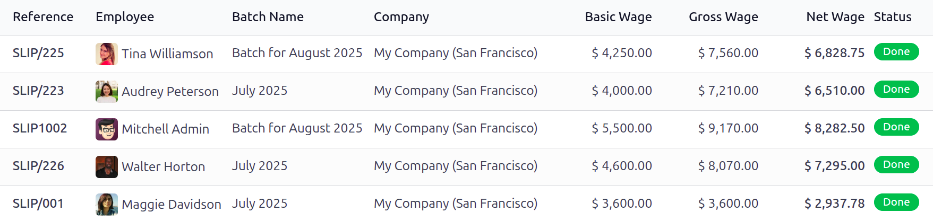

Each payslip lists the :guilabel:`Reference` number for the individual payslip, the
:guilabel:`Employee` name, the :guilabel:`Batch Name`, the :guilabel:`Company`, the :guilabel:`Basic
Wage`, :guilabel:`Gross Wage`, :guilabel:`Net Wage`, and the :guilabel:`Status` of the payslip.

Click on an individual payslip entry to view the details for that individual payslip.

.. _payroll/new-payslip:

Create a new payslip
--------------------

A new payslip can be created from either the :ref:`Payslips To Pay <payroll/to-pay>` page or the
:ref:`Employee Payslips <payroll/all-payslips>` page.

Create a new payslip by clicking the :guilabel:`New` button in the top-left corner.

A blank payslip form is loaded, where the necessary payslip information can be entered.

Payslip form
~~~~~~~~~~~~

On the blank payslip form, several fields are required. Most of the required fields auto-populate
after an employee is selected.

Fill out the following information on the payslip form:

- :guilabel:`Employee`: type in the name of an employee, or select the desired employee from the
  drop-down list in this field. This field is **required**.

  .. note::
     It is recommended to **only** create payslips for employees that are already in the database.
     If there is no current employee record (and therefore no employee contract) it is recommended
     to create the new employee in the *Employees* application **before** creating payslips for that
     employee. Refer to the :doc:`new employee <../employees/new_employee>` documentation for
     instructions on how to add an employee.

- :guilabel:`Period`: the first day to the last day of the *current* month auto-populates the
  :guilabel:`Period` fields by default. The dates can be changed, if desired.

  To change the start date, click on the first date in the :guilabel:`Period` field to reveal a
  pop-up calendar. On this calendar, use the :guilabel:`< (less-than)` and :guilabel:`>
  (greater-than)` icons to select the desired month. Then, click on the desired day to select that
  specific date.

  Repeat this process to modify the end date for the payslip. These fields are **required**.
- :guilabel:`Contract`: using the drop-down menu, select the desired contract for the employee. Only
  the available corresponding contracts for the selected employee appear as options. This field is
  **required**.
- :guilabel:`Batch`: using the drop-down menu in this field, select the batch of payslips this new
  payslip should be added to.
- :guilabel:`Structure`: using the drop-down menu, select the salary structure type. Only the
  corresponding structures associated with the selected contract for the employee appear as options.

  If no employee and/or no contract is selected yet, all available :guilabel:`Structures` appear in
  the list. Once an employee and/or contract is selected, any unavailable :guilabel:`Structures` set
  for that employee and/or contract do not appear. This field is **required**.

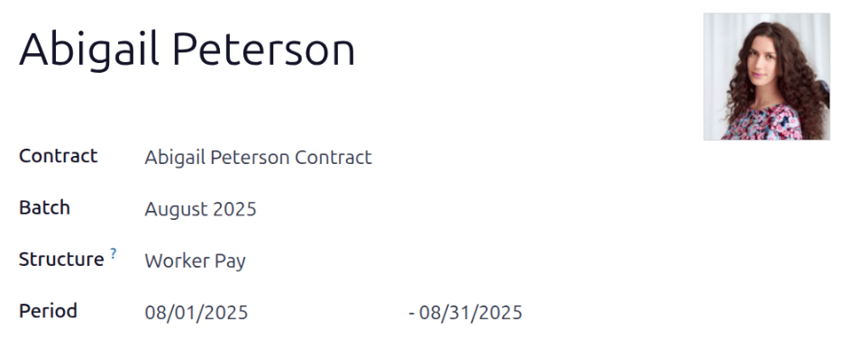

.. note::
   Typically, after making a selection in the :guilabel:`Employee` field, Odoo auto-populates all
   other required fields (besides the :guilabel:`Period` field), but **only** if that information is
   already on that employee's form in the *Employees* app.

.. important::
   If modifications to auto-populated fields are made, it is recommended to check with the
   accounting department to ensure every entry that affects the *Accounting* application is correct.

.. _payroll/worked-days-inputs:

Worked days & inputs tab
************************

- :guilabel:`Worked Days`: the entries under :guilabel:`Worked Days` (including the
  :guilabel:`Type`, :guilabel:`Description`, :guilabel:`Number of Days`, :guilabel:`Number of
  Hours`, and :guilabel:`Amount`) are automatically filled in, based on what was entered for the
  :guilabel:`Period`, :guilabel:`Contract`, and :guilabel:`Structure` fields of the payslip form.
- :guilabel:`Other Inputs`: additional inputs affecting the payslip can be entered in this section,
  such as deductions, reimbursements, and expenses.

  Click :guilabel:`Add a line` to create an entry in the :guilabel:`Other Inputs` section.

  Using the drop-down menu in the :guilabel:`Type` column, select a :guilabel:`Type` for the input.
  Next, enter a :guilabel:`Description`, if desired. Lastly, enter the amount in the
  :guilabel:`Count` field.

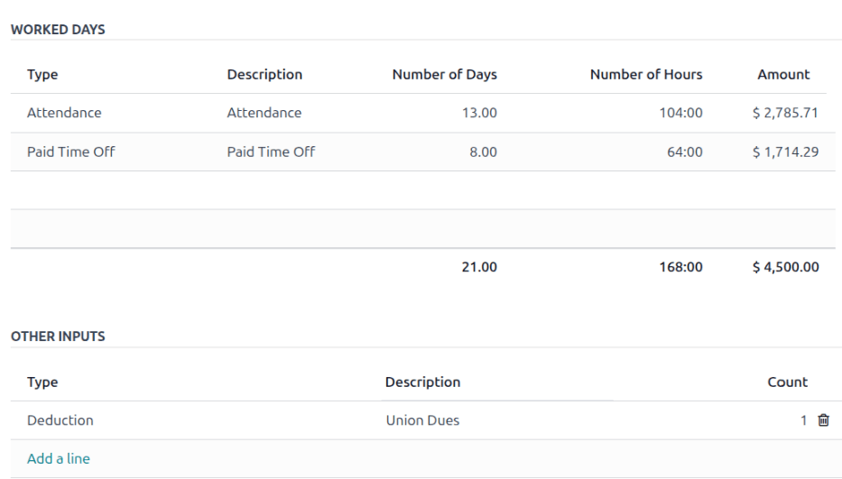

Salary computation tab
**********************

- :guilabel:`Salary Computation`: the :guilabel:`Salary Computation` tab is automatically filled in
  after the :guilabel:`Compute Sheet` button is clicked. Doing so displays the wages, deductions,
  taxes, etc. for the entry.
- :guilabel:`Has Negative Net To Report`: click the checkbox if the employee has a negative net
  amount for this payslip. This **only** appears if the employee's payslip has a negative balance.

.. image:: payslips/salary-comp-tab.png
   :align: center
   :alt: The fields filled out in the salary computation tab.

Other info tab
**************

- :guilabel:`Payslip Name`: type in a name for the payslip in this field. The name should be short
  and descriptive, such as `(Employee Name) April 2023`. This field is **required**.
- :guilabel:`Company`: select the company the payslip applies to using the drop-down menu in this
  field. This field is **required**.
- :guilabel:`Close Date`: enter the date that the payment is made to the employee in this field.

  Click in the field to reveal a calendar pop-up window. Using the :guilabel:`< >
  (less-than/greater-than)` icons, navigate to the desired month and year.

  Then, click on the desired date to select it.
- :guilabel:`Date Account`: enter the date on which the payslip should be posted in this field.
- :guilabel:`Salary Journal`: this field auto-populates after selecting an existing
  :guilabel:`Employee`. This field **cannot** be edited, as it is linked to the *Accounting*
  application. This field is **required**.
- :guilabel:`Accounting Entry`: if applicable, this field is automatically populated once the
  payslip is confirmed. This field **cannot** be modified.
- :guilabel:`Add an Internal Note...`: any note or reference message for the new entry can be typed
  in this field.

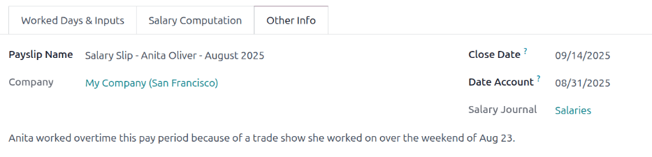

Process the new payslip
~~~~~~~~~~~~~~~~~~~~~~~

When all the necessary information on the payslip is entered, click the :guilabel:`Compute Sheet`
button. Upon doing so, all the information on the payslip is saved, and the :guilabel:`Salary
Computation` tab auto-populates, based on the information on the employee's contract or attendance
records.

If any modifications need to be made, first click the :guilabel:`Cancel` button, then click the
:guilabel:`Set to Draft` button. Make any desired changes, then click the :guilabel:`Compute Sheet`
button once again, and the changes are reflected in the :guilabel:`Worked Days` and
:guilabel:`Salary Computation` tabs.

Once everything on the payslip form is correct, click the :guilabel:`Create Draft Entry` button to
create the payslip.

Then, a confirmation pop-up window appears, asking :guilabel:`Are you sure you want to proceed?`.
Click :guilabel:`OK` to confirm.

The chatter is automatically updated to show the email sent to the employee, along with a PDF copy
of the payslip.

.. note::
   The database may need to be refreshed for the payslip and email to appear.

To print the payslip, click the :guilabel:`Print` button. To cancel the payslip, click the
:guilabel:`Cancel` button.

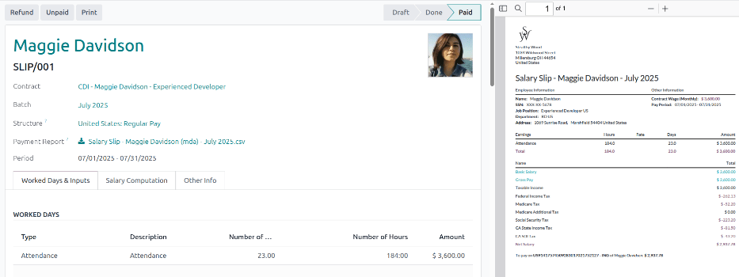

Next, the payment must be sent to the employee. To do this, click the :guilabel:`Register Payment`
button. Doing so reveals a pop-up form, in which the desired :guilabel:`Bank Journal` that the
payment should be made against must be selected from a drop-down menu. Then, click the
:guilabel:`Confirm` button to confirm the journal, and return to the payslip.

.. important::
   In order for a payslip to be paid, the employee *must* have a bank account entered in their
   contact information. If there is no bank information, a payslip cannot be paid, and an error
   appears when the :guilabel:`Make Payment` button is clicked. Banking information can be found in
   the :ref:`Private Information <employees/private-info>` tab on the employee's card in the
   *Employees* app. Edit the employee card, and add banking information, if it is missing.

   .. image:: payslips/banking.png
      :align: center
      :alt: Banking information can be entered in an employee's card.

Odoo automatically checks bank account information. If there is an error with the employee's listed
bank account, an error appears in a pop-up window, stating, *The employee bank account is
untrusted.* If this error appears, update the employee's bank account information on their
:ref:`Employee Form <employees/private-info>`.

If a payment needs to be canceled or refunded, click the corresponding :guilabel:`Cancel` or
:guilabel:`Refund` button, located at the top-left of the screen.

.. tip::
   Before processing payslips, it is best practice to check the *Warnings* section of the *Payroll*
   app dashboard. Here, all possible issues concerning payroll appear.

   To view the warnings, navigate to :menuselection:`Payroll app --> Dashboard`. The warnings appear
   in the top-left corner of the dashboard.

   .. image:: payslips/warnings.png
      :align: center
      :alt: The dashboard view of the Payroll app, with the warnings box highlighted.

   Warnings are grouped by type, such as `Employees Without Running Contracts` or `Employees Without
   Bank account Number`. Click on a warning to view all entries associated with that specific issue.

   If the warnings are not resolved, at any point in the payslip processing process, an error may
   occur. Errors appear in a pop-up window, and provide details for the error, and how to resolve
   them.

  Payslips **cannot** be completed if there are any warnings or issues associated with the payslip.

.. _payroll/all-payslips:

All payslips
============

To view all payslips, regardless of status, go to :menuselection:`Payroll app --> Payslips --> All
Payslips`. The :guilabel:`Employee Payslips` page loads, displaying all payslips, organized by
batch, in a default nested list view.

Click on the :guilabel:`▶ (right arrow)` next to an individual batch name to view all the payslips
in that particular batch, along with all the payslip details.

The number of payslips in the batch is written in parenthesis after the batch name. The
:guilabel:`Status` for each individual payslip appears on the far-right side, indicating one of the
following status options:

- :guilabel:`Draft`: the payslip is created, and there is still time to make edits, since the
  amounts are not calculated.
- :guilabel:`Waiting`: the payslip has been calculated, and the salary details can be found in the
  *Salary Computation* tab.
- :guilabel:`Done`: the payslip is calculated and ready to be paid.
- :guilabel:`Paid`: the employee has been paid.

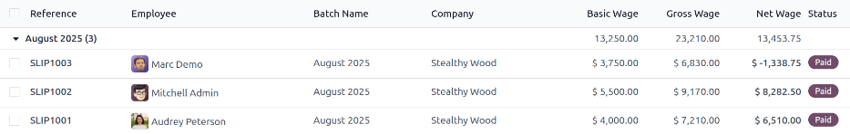

Click on an individual payslip to view the details for that payslip on a separate page. Using the
breadcrumb menu, click :guilabel:`Employee Payslips` to go back to the list view of all payslips.

A new payslip can be created from the :guilabel:`Employee Payslips` page, by clicking the
:guilabel:`New` button in the upper-left corner. Doing so reveals a separate blank payslip form
page. On that blank payslip form page, enter all the necessary information, as described in the
:ref:`Create new payslips <payroll/new-payslip>` section.

To print PDF versions of payslips from the *Payslips to Pay* or :guilabel:`Employee Payslips` pages,
first select the desired payslips by clicking on the individual checkbox to the left of each payslip
to be printed. Or, click the box to the left of the :guilabel:`Reference` column title, which
selects all visible payslips on the page. Then, click the :guilabel:`Print` button to print the
payslips.

Payslips can also be exported to an Excel spreadsheet. To export **all** payslips, click on the
:guilabel:`⚙️ (gear)` icon at the end of the words :guilabel:`Employee Payslips` in the top-left
corner. This reveals a drop-down menu. Click :guilabel:`Export All` to export all payslips to a
spreadsheet.

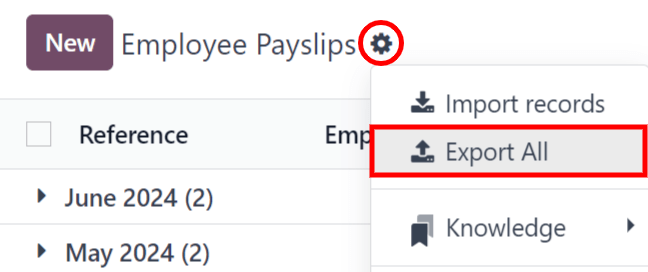

To export only select payslips, first select the payslips to be exported from the list. Then, click
the checkbox to the left of each individual payslip to select it. As payslips are selected, a smart
button appears in the top-center of the page, indicating the number of selected payslips. Then,
click the :guilabel:`⚙️ (gear) Actions` icon in the top-center of the page, and click
:guilabel:`Export`.

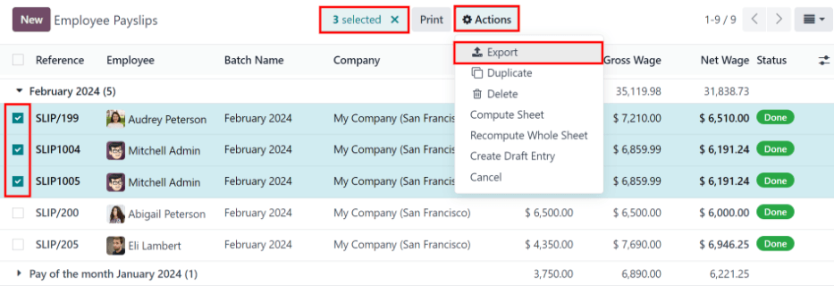

.. note::
   Both *To Pay* and *All Payslips* display all the detailed information for each payslip.

Batches
=======

To view payslips in batches, navigate to :menuselection:`Payroll app --> Payslips --> Batches` to
display all the payslip batches that have been created. These payslip batches are displayed in a
list view, by default.

Each batch displays the :guilabel:`Name`, :guilabel:`Date From` and :guilabel:`Date To` dates, its
:guilabel:`Status`, the number of payslips in the batch (:guilabel:`Payslips Count`), and the
:guilabel:`Company`.

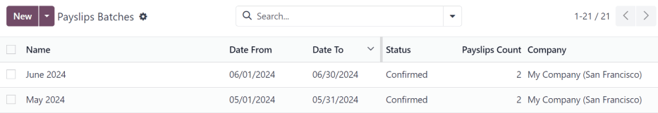

Create a new batch
------------------

To create a new batch of payslips from the :guilabel:`Payslips Batches` page
(:menuselection:`Payroll app --> Payslips --> Batches`), click the :guilabel:`New` button in the
top-left corner. Doing so reveals a blank payslip batch form on a separate page.

On the new payslip batch form, enter the :guilabel:`Batch Name`.

Next, select the date range to which the batch applies. Click into one of the :guilabel:`Period`
fields, and a calendar pop-up window appears. From this calendar pop-up window, navigate to the
correct month, and click on the corresponding day for both the start and end dates of the batch.

The current company populates the :guilabel:`Company` field. If operating in a multi-company
environment, it is **not** possible to modify the :guilabel:`Company` from the form. The batch
**must** be created while in the database for the desired company.

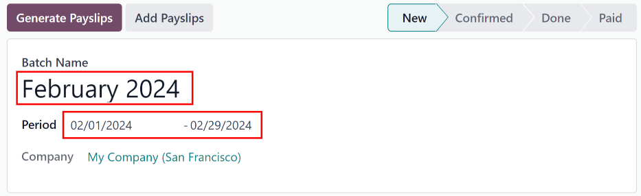

.. _payroll/batch-process:

Process a batch
---------------

Click on an individual batch to view the details for that batch on a separate page. On this batch
detail page, different options (buttons) appear at the top, depending on the status of the batch:

- :guilabel:`New` status: batches without any payslips added to them have a status of
  :guilabel:`New`. The following button options appear for these batches:

   .. image:: payslips/batch-new.png
      :align: center
      :alt: A batch with a status of new, with the available buttons highlighted.

   - :guilabel:`Add Payslips`: click the :guilabel:`Add Payslips` button to add payslips to the
     batch, and an :guilabel:`Add Payslips` pop-up window appears. Only payslips that can be added
     to the batch (payslips not currently part of a batch) appear on the list.

     Select the desired payslips by clicking the checkbox to the left of each payslip name, then
     click the :guilabel:`Select` button to add them to the batch. Once payslips are selected and
     added to the batch, the status changes to :guilabel:`Confirmed`.

   - :guilabel:`Generate Payslips`: after payslips have been added to the batch, click the
     :guilabel:`Generate Payslips` button to process the payslips and create individual payslips in
     the database.

     A :guilabel:`Generate Payslips` pop-up window appears. If only a specific :guilabel:`Salary
     Structure` and/or specific :guilabel:`Department` is desired to make payslips for, select them
     from the corresponding drop-down menus. If no selections are made, then all payslips listed in
     the pop-up window are processed as usual.

     Click the :guilabel:`Generate` button to create the payslips. The :guilabel:`Generate Payslips`
     button changes to a :guilabel:`Create Draft Entry` button, and the status changes to
     :guilabel:`Confirmed`.

- :guilabel:`Confirmed` status: batches that have been created and have payslips in them, but the
  payslips have *not* been processed, have a status of :guilabel:`Confirmed`. The following two
  button options appear for these batches:

  .. image:: payslips/batch-confirmed.png
     :align: center
     :alt: A batch with a status of confirmed, with the available buttons highlighted.

  - :guilabel:`Create Draft Entry`: click the :guilabel:`Create Draft Entry` button to confirm the
    individual payslips (and the batch), and create a draft of the payslips. The batch now has a
    status of :guilabel:`Done`.
  - :guilabel:`Set to Draft`: if at any point the batch needs to be reverted back to a status of
    :guilabel:`New`, click the :guilabel:`Set to Draft` button. This action does **not** remove any
    payslips that have already been added to the batch.

- :guilabel:`Done` status: batches with confirmed payslips in them have a status of
  :guilabel:`Done`. The following button options appear for these batches:

  .. image:: payslips/batch-done.png
     :align: center
     :alt: A batch with a status of done, with the available buttons highlighted.

  - :guilabel:`Create Payment Report`: click the :guilabel:`Create Payment Report` button, and a
    :guilabel:`Select a bank journal` pop-up window appears. Select the correct bank journal from
    the drop-down menu.

    The batch name appears in the :guilabel:`File name` field, but this can be modified, if desired.
    Finally, click :guilabel:`Confirm` to process the payslips, and pay the employees.
  - :guilabel:`Mark as paid`: after the payments have been created via the :guilabel:`Create Payment
    Report` button, the payslips need to be marked as paid in the database.

    Click the :guilabel:`Mark as paid` button, and the status of the batch changes to
    :guilabel:`Paid`.
  - :guilabel:`Set to Draft`: if at any point the batch needs to be reverted back to a status of
    :guilabel:`New`, click the :guilabel:`Set to Draft` button. This action does **not** remove any
    payslips that have already been added to the batch.

- :guilabel:`Paid` status: batches that have been completed have a status of :guilabel:`Paid`. No
  other button options appear for this status.

  .. image:: payslips/batch-paid-2.png
     :align: center
     :alt: A batch with a status of paid, with the available buttons highlighted.

On the batch detail page, the individual payslips in the batch are accessible, via the
:guilabel:`Payslips` smart button, located above the batch information, in the center. Click the
:guilabel:`Payslips` smart button to view a list of all the individual payslips.

Use the breadcrumb menu to navigate back to the individual batch detail page, or back to the list of
all batches.

Generate warrant payslips
-------------------------

Commissions are paid to employees in Odoo using *warrant payslips*.

Warrant payslips can be generated directly from the :guilabel:`Payslips Batches` page
(:menuselection:`Payroll app --> Payslips --> Batches`).

First, select the desired batches by clicking the box to the left of each batch for which commission
payslips should be created. Next, click the :guilabel:`Generate Warrant Payslips` button at the top
of the page.

Doing so reveals a :guilabel:`Generate Warrant Payslips` pop-up window, in which the necessary
information **must** be filled out.

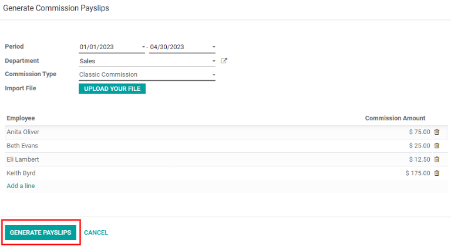

In this pop-up window, click on the drop-down menus, located beside the :guilabel:`Period` field, to
reveal calendar pop-up windows. On these calendar pop-up windows, select the desired period for
which the payslips are being generated. Using the :guilabel:`< (left)` and :guilabel:`> (right)`
arrow icons, navigate to the correct month, and click on the date to select it.

In the :guilabel:`Department` field, select the desired department from the drop-down menu.

When a department is selected, the employees listed for that department appear in the
:guilabel:`Employee` section.

Under the :guilabel:`Employee` section, enter the :guilabel:`Commission Amount` for each employee in
the far-right column. To remove an employee, click the :guilabel:`🗑️ (trash)` icon to remove the
line.

Add a new entry by clicking :guilabel:`Add a Line`, and entering the :guilabel:`Employee` and the
appropriate :guilabel:`Commission Amount`.

Click the :guilabel:`Upload your file` button to add a file, if necessary. Any file type is
accepted.

Once all the commissions are properly entered, click the :guilabel:`Generate Payslips` button to
create the warrant payslips in a batch.

:ref:`Process the batch <payroll/batch-process>` in the same way as a typical batch to complete the
payment process.
