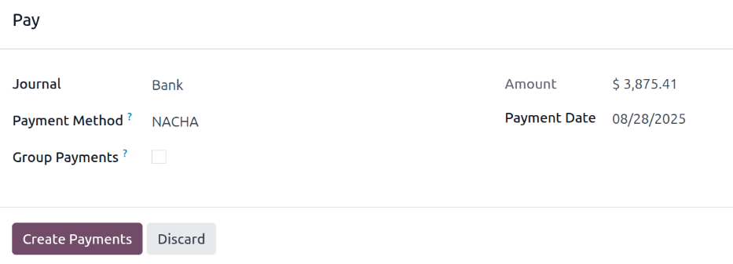

========
Payslips
========

*Payslips* are individual records of payment, containing all the details of how the pay was
calculated (hours, deductions, other inputs, etc.), and generated by payroll officers through the
**Payroll** application. Payslips can be created and processed individually, or multiple payslips
can be processed at one time, in a single batch.

.. _payroll/new-payslip:

Create a payslip
================

A new payslip can be created from either the :ref:`Payslips To Pay <payroll/to-pay>` page or the
:ref:`Employee Payslips <payroll/all-payslips>` page.

Navigate to :menuselection:`Payroll app --> Payslips`, and click either :guilabel:`To Pay` or
:guilabel:`All Payslips`. Click the :guilabel:`New` button in the top-left corner, and a blank
payslip form loads.

Payslip form
------------

Fill out the following information on the payslip form:

- :guilabel:`Employee`: Using the drop-down menu, select the employee in this field. This field is
  **required**. Once a selection is made, other fields may auto-populate according to the employee
  record.

  .. note::
     It is recommended to **only** create payslips for employees that are already in the database.
     If there is no current employee record (and therefore no employee contract) it is recommended
     to create the new employee in the **Employees** application *before* creating payslips for that
     employee. Refer to the :doc:`new employee <../employees/new_employee>` documentation for
     instructions on how to add an employee.

- :guilabel:`Contract`: The current contract for the selected employee populates this field. This
  field is **required**.

  .. important::
     All employees are required to have a contract in order to generate payslips. Additionally,
     *only one* contract can be in the running stage for each employee, therefore the current
     contract populates this field, and it is **not** recommended to make changes to this field.

- :guilabel:`Batch`: Using the drop-down menu, select the payslip batch this new payslip should be
  added to, if applicable.
- :guilabel:`Structure`: The structure linked to the employee's contract auto-populates this field
  by default. If desired, use the drop-down menu to select a different structure.
- :guilabel:`Period`: The first day to the last day of the *current* month auto-populates the
  :guilabel:`Period` fields by default. The dates can be changed, if desired.

  To change the start date, click on the first date in the :guilabel:`Period` field to reveal a
  pop-up calendar. Navigate to the desired month, and click on the desired day to select that
  specific date.

  Repeat this process to modify the end date for the payslip. These fields are **required**.

.. note::
   Typically, after making a selection in the :guilabel:`Employee` field, Odoo auto-populates all
   other required fields (besides the :guilabel:`Period` field), but **only** if that information is
   already on that employee's form in the **Employees** app.

.. important::
   If modifications to auto-populated fields are made, it is recommended to check with the
   accounting department to ensure every entry that affects the **Accounting** application is
   correct.

.. image:: payslips/new-payslip.png
   :alt: The top fields for a new payslip all filled out for a February payslip.

.. _payroll/worked-days-inputs:

Worked days & inputs tab
~~~~~~~~~~~~~~~~~~~~~~~~

The :guilabel:`Worked Days & Inputs` tab details the number of days and hours the employee worked
during the specified :guilabel:`Period` of time on the top portion of the payslip form, and is
calculated based on the selected :guilabel:`Contract` and :guilabel:`Structure` fields.

The :guilabel:`Worked Days` section is automatically populated and lists all the individual
attendance records for the time period, including both worked time and any time off taken.

Each individual entry lists the :guilabel:`Type`, :guilabel:`Description`, :guilabel:`Number of
Days`, :guilabel:`Number of Hours`, and the total :guilabel:`Amount`.

Additional records cannot be created for the :guilabel:`Worked Days & Inputs` as it is
auto-populated according to the employee's attendance records or working schedule on their
:ref:`employee record <employees/work-info-tab>`.

The :guilabel:`Other Inputs` section is where additional inputs are listed, such as deductions,
reimbursements, and expenses.

Each individual item lists the :guilabel:`Type`, :guilabel:`Description`, and :guilabel:`Count`. To
add a new input, click :guilabel:`Add a line`, and using the drop-down menu, select the
:guilabel:`Type`. Next, enter a brief :guilabel:`Description`, and last, enter the
:guilabel:`Count`.

.. image:: payslips/worked-days-tab.png
   :alt: The fields filled out in the worked days and inputs tab.

Salary computation tab
~~~~~~~~~~~~~~~~~~~~~~

The :guilabel:`Salary Computation` tab is where all the individual salary rules are listed and
calculated, including everything from the employee's salary, to all the deductions and allowances,
such as taxes, expenses, benefit contributions, and any other items associated with the installed
:doc:`payroll localization <payroll_localizations>`.

When the payslip is first created, this tab remains blank. Click the :guilabel:`Compute Sheet`
button in the upper-left corner, and the :guilabel:`Salary Computation` tab is populated.

.. important::
   It is **not** possible to make edits to this tab, as the calculations are based on other entries
   on the payslip.

.. tip::
   The :guilabel:`Compute Sheet` button does not disappear from view after it is clicked, so the
   payslip can be recalculated at any point prior to :ref:`processing it <payroll/process>`.

   If any changes need to be made to the :ref:`Worked Days & Inputs <payroll/worked-days-inputs>`
   tab, click the :guilabel:`Compute Sheet` button to recalculate the payslip.

.. image:: payslips/salary-comp-tab.png
   :alt: The fields filled out in the salary computation tab.

Other info tab
~~~~~~~~~~~~~~

The :guilabel:`Other Info` tab houses information that is required, but not associated with any
inputs or calculations, as the other tabs do.

The :guilabel:`Payslip Name` is auto-populated according to the employee name and the time period
the payslip is for. Make any desired edits to the name in this field. This field is **required**.

The :guilabel:`Company` field is also automatically populated according to the employee's record,
and cannot be modified.

The end date selected in the :guilabel:`Period` field in the top half of the form populates both the
:guilabel:`Close Date` and :guilabel:`Date Account` fields, by default. The :guilabel:`Close Date`
is the date the payment is issued to the employee, while the :guilabel:`Date Account` is the end
date the payslip covers. Modify the dates, if needed.

The :guilabel:`Salary Journal` field is populated by default, and **cannot** be edited. This is the
accounting journal the paycheck is logged in.

If there are any additional notes or information needed for the payslip, add them to the
:guilabel:`Add an Internal Note...` field.

.. image:: payslips/other-info-tab.png
   :alt: The fields filled out in the other info tab.

.. _payroll/process:

Process a payslip
=================

When all the necessary information on the payslip is entered, the payslip can be processed. First, a
:ref:`draft of the journal entry <payroll/draft-entry>` is created, followed by a :ref:`payment
report <payroll/payment-report>`, and finally, the employee is :ref:`paid <payroll/pay-employee>`.

.. tip::
   Before processing payslips, it is best practice to check the *Warnings* section of the
   **Payroll** app dashboard. Here, all possible issues concerning payroll appear.

   To view the warnings, navigate to :menuselection:`Payroll app --> Dashboard`. The warnings appear
   in the top-left corner of the dashboard.

   .. image:: payslips/warnings.png
      :alt: The dashboard view of the Payroll app, with the warnings box visible.

   Warnings are grouped by type, such as `Employees Without Running Contracts` or `Employees Without
   Bank account Number`. Click on a warning to view all entries associated with that specific issue.

   If the warnings are not resolved, at any point in the payslip processing process, an error may
   occur. Errors appear in a pop-up window, and provide details for the error, and how to resolve
   them.

.. _payroll/draft-entry:

Create draft entry
------------------

Once everything on the payslip form is correct, click the :guilabel:`Create Draft Entry` button to
create the payslip. A :guilabel:`Confirmation` pop-up window appears, asking :guilabel:`Are you sure
you want to proceed?` Click :guilabel:`OK` to confirm.

Once the payslip draft is created, the status changes to :guilabel:`Done`, a :icon:`fa-usd`
:guilabel:`Journal Entry (Draft)` smart button appears at the top, and additional buttons appear in
the top-left corner.

.. note::
   After creating a draft entry, Odoo considers the payslip as confirmed.

Click the :icon:`fa-usd` :guilabel:`Journal Entry (Draft)` smart button to view the detailed
accounting journal entry. Click :guilabel:`Post` to post the entry. Using the breadcrumb menu,
return to the payslip.

After the journal entry is posted, the smart button at the top changes to :icon:`fa-usd`
:guilabel:`Journal Entry (Posted)`

.. note::
   Employees cannot be :ref:`paid <payroll/pay-employee>` until the journal entry is posted.

.. _payroll/payment-report:

Create payment report
---------------------

Once the payslip status has changed to :guilabel:`Done`, a payment report must be created. A payment
report is a document that contains all the necessary information to transfer the employee's earnings
from the company's bank account to theirs. These are submitted by the payroll department to the
appropriate institution.

Click the :guilabel:`Create Payment Report` and a pop-up window loads. Using the drop-down menu,
select the :guilabel:`Export Format` for the payment report. The two default options available are
:guilabel:`NACHA` and :guilabel:`CSV`. :guilabel:`NACHA` stands for the :abbr:`National Automated
Clearing House Association (NACHA)`, and this selection creates a compatible ACH file which is sent
to the company's bank.

.. note::
   Other options may be available depending on the :doc:`payroll localization
   <payroll_localizations>` installed in the database.

   If :guilabel:`CSV` is selected, all other fields are hidden from view.

Next, select the desired :guilabel:`Bank Journal` the paycheck is logged to. Last, using the
calendar selector, set the date the paycheck is issued in the :guilabel:`Effective Date` field.

Once the pop-up window is configured, click the :guilabel:`Generate` button, and the file appears on
the payslip form, in a new :guilabel:`Payment Report` field.

.. _payroll/pay-employee:

Pay employee
------------

Next, the payment must be sent to the employee. To do this, click the :guilabel:`Pay` button in the
upper-left corner. Doing so reveals a :guilabel:`Pay` pop-up form.

All the necessary information is pre-populated on the form according to the payslip configuration,
but modifications can be made, if necessary, to any of the fields *except* the :guilabel:`Amount`.
This is populated according to the payslip calculations, and **cannot** be modified.

- :guilabel:`Journal`: The accounting journal the payslip is logged to.
- :guilabel:`Payment Method`: Using the drop-down menu, select how the employee is being paid. The
  default options are:

  - :guilabel:`Manual Payment`: Select this if paying the employee in a method *other* than A
    :guilabel:`Check` or :guilabel:`NACHA`.
  - :guilabel:`Check`: Select this when issuing a check directly to the employee.
  - :guilabel:`NACHA`: Select this if using the :abbr:`National Automated Clearing House Association
    (NACHA)` to transfer the payment to the employee, via direct deposit.

- :guilabel:`Group Payments`: If the employee has multiple payslips for the same time period (for
  example, payroll, reimbursement, and commission checks), tick the checkbox to group all payments
  into one payment.
- :guilabel:`Payment Date`: Using the calendar selector, select the date the employee is to be paid.

Once the pop-up :guilabel:`Pay` form is complete, click the :guilabel:`Create Payments` button, and
the payment is processed.

After the payment is processed, and there is confirmation that the checks have been issued, or the
funds have been directly deposited to the employee's bank account, click the :guilabel:`Mark as
paid` button to mark the payslip as paid.

.. important::
   In order for a payslip to be paid, the employee **must** have a bank account entered in the
   :ref:`private information tab <employees/private-info>` of their employee record, *and* the bank
   account must be marked as :guilabel:`Trusted`.

   If there is no bank information, or if the bank is not listed as :guilabel:`Trusted`, payslips
   cannot be paid, and an error appears when the :guilabel:`Pay` button is clicked. Edit the
   employee record, and add banking information, or trust the bank account, as needed.

Refund a payslip
================

When refunding a payment, the refund is achieved by creating a payslip for a negative amount of the
original payslip.

.. example::
   An employee is paid $5,000.00 USD in a paycheck, in error. When refunding the payslip, a new
   payslip is created in the amount of $-5,000.00.

If a payment needs to be refunded, navigate to the individual payslip being refunded, and click the
:guilabel:`Refund` button, located at the top-left of the screen. The :guilabel:`Refund Payslip`
dashboard loads, with all refund payslips appearing in a list view.

.. note::
   Since refunds are uncommon, typically only the one payslip being refunded appears in the list.

By default, the refund payslip has a status of :guilabel:`Waiting`. This refund payslip is processed
:ref:`in the same way a regular payslip is processed <payroll/process>`.

Print a payslip
===============

To print a payslip, click the :guilabel:`Print` button in the upper-left corner of the individual
payslip record. A PDF file is downloaded, and the payslip appears in the chatter, and the file is
attached to the payslip record.

.. image:: payslips/payslip-chatter.png
   :alt: The new payslip is emailed to the employee and the email appears in the chatter.

.. _payroll/all-payslips:

View all payslips
=================

To view all payslips, regardless of status, go to :menuselection:`Payroll app --> Payslips --> All
Payslips`. The :guilabel:`Employee Payslips` page loads, displaying all payslips, organized by
batch, in a default nested list view.

Click the :guilabel:`▶ (right arrow)` next to an individual batch name to expand the list, and view
all the payslips in that particular batch, along with all the payslip details.

The number of payslips in the batch is written in parenthesis after the batch name. The
:guilabel:`Status` for each individual payslip appears on the far-right side, indicating one of the
following status options:

- :guilabel:`Draft`: the payslip is created, and there is still time to make edits, since the
  amounts are not calculated.
- :guilabel:`Waiting`: the payslip has been calculated, and the salary details can be found in the
  *Salary Computation* tab.
- :guilabel:`Done`: the payslip is calculated and ready to be paid.
- :guilabel:`Paid`: the employee has been paid.

.. image:: payslips/all-payslips.png
   :alt: View all payslips organized by batches. Click on the arrow to expand each batch.

Click on an individual payslip to view the details for that payslip on a separate page. Using the
breadcrumb menu, click :guilabel:`Employee Payslips` to go back to the list view of all payslips.

A new payslip can be created from the :guilabel:`Employee Payslips` page, by clicking the
:guilabel:`New` button in the upper-left corner. Doing so reveals a separate blank payslip form
page. On that blank payslip form page, enter all the necessary information, as described in the
:ref:`Create a payslip <payroll/new-payslip>` section.

Payslips can also be exported to an Excel spreadsheet. To export **all** payslips, click on the
:icon:`fa-cog` :guilabel:`(gear)` icon at the end of the words :guilabel:`Employee Payslips` in the
top-left corner. This reveals a drop-down menu. Click :icon:`fa-upload` :guilabel:`Export All` to
export all payslips to a spreadsheet.

To export only select payslips, first select the payslips to be exported from the list. Then, click
the checkbox to the left of each individual payslip to select it. As payslips are selected, a smart
button appears in the top-center of the page, indicating the number of selected payslips. Then,
click the :icon:`fa-cog` :guilabel:`Actions` icon in the top-center of the page, and click
:icon:`fa-upload` :guilabel:`Export`.

.. note::
   Both *To Pay* and *All Payslips* display all the detailed information for each payslip.

.. _payroll/to-pay:

View payslips to pay
====================

To only view the payslips awaiting to be processed, navigate to :menuselection:`Payroll app -->
Payslips --> To Pay`.

.. image:: payslips/all-pay-slips.png
   :alt: View all payslips that need to be paid on the Payslips To Pay page.

Each payslip lists the :guilabel:`Reference` number for the individual payslip, the
:guilabel:`Employee` name, the :guilabel:`Batch Name`, the :guilabel:`Company`, the :guilabel:`Basic
Wage`, :guilabel:`Gross Wage`, :guilabel:`Net Wage`, and the :guilabel:`Status` of the payslip.

Click on an individual payslip entry to view the details for that individual payslip.

Process the payslips :ref:`in the same way a regular payslip is processed <payroll/process>`, or in
a batch.
