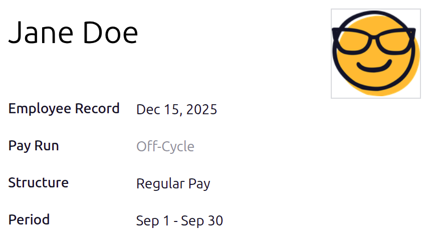
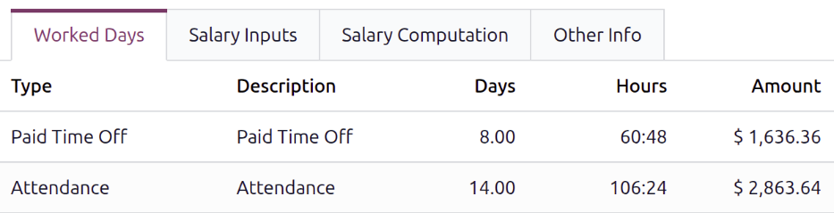
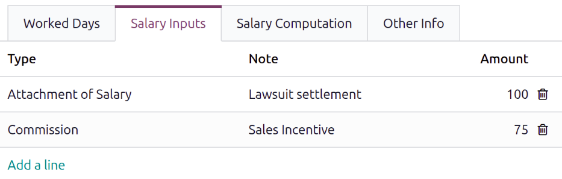
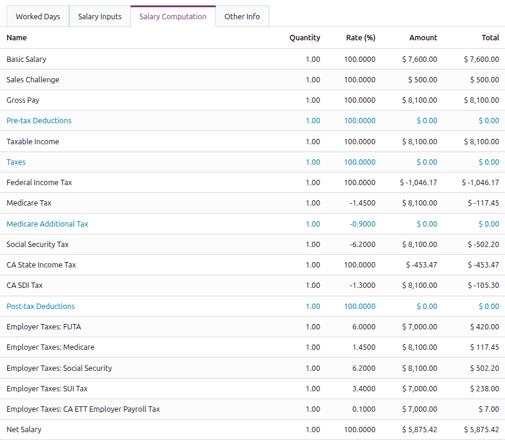
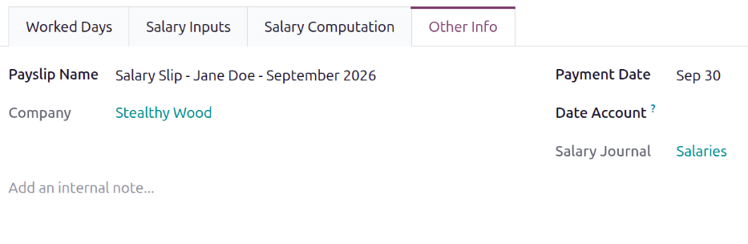
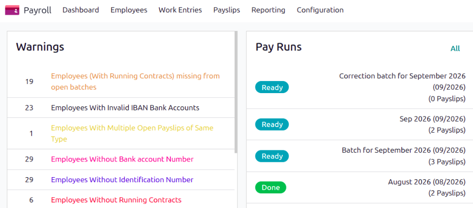
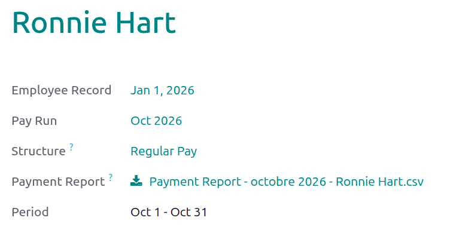
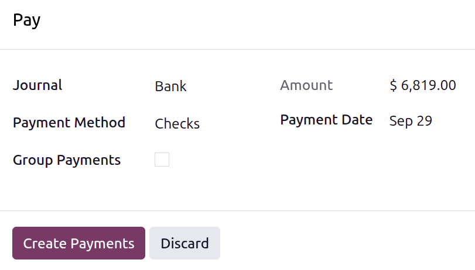
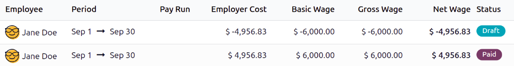
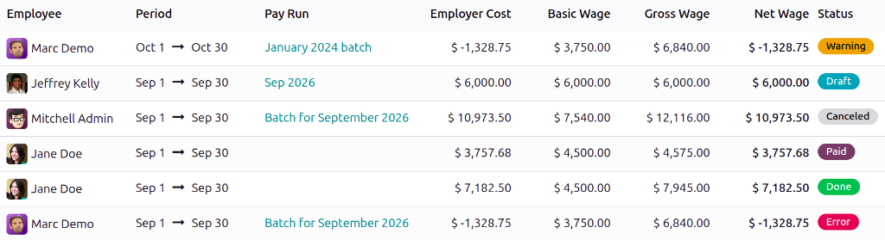

========
Payslips
========

*Payslips* are individual records of payment, containing all the details of how the pay was
calculated (hours, deductions, other inputs, etc.), and generated by payroll officers through the
**Payroll** app. Payslips can be created and processed individually, or multiple payslips can be
processed at one time, in a single batch, referred to in Odoo as :doc:`pay runs <pay_runs>`.

.. _payroll/payslips/new-payslip:

Create a payslip
================

To create a new payslip, navigate to :menuselection:`Payroll app --> Payslips --> Payslips`, and the
*Employee Payslips* dashboard loads. Click the :guilabel:`New Off-Cycle` button in the corner, and a
blank payslip form loads. Fill out the following information on the payslip form:

- :guilabel:`Employee`: Select the employee being paid using the drop-down menu. This field is
  **required**. Once a selection is made, other fields may auto-populate according to the employee
  record.

  .. note::
     It is recommended to **only** create payslips for employees that are already in the database.
     If there is no current employee record, and therefore no employee contract, it is recommended
     to create the new employee in the **Employees** application *before* creating payslips for that
     employee. Refer to the :doc:`new employee <../employees/new_employee>` documentation for
     instructions on how to add an employee.

- :guilabel:`Employee Record`: The date the current contract began for the selected employee
  automatically populates this field. This field is **required**.

  .. important::
     All employees are **required** to have a contract in order to generate payslips. Additionally,
     *only one* contract can be in the running stage for each employee, therefore the current
     contract start date populates this field, and it is **not** recommended to make changes to this
     field.

- :guilabel:`Pay Run`: Select the pay run this new payslip should be added to, if applicable, using
  the drop-down menu. For individual payslips not related to a pay run, leave this field blank.
- :guilabel:`Structure`: The structure linked to the employee's contract auto-populates this field
  by default. If desired, use the drop-down menu to select a different structure.
- :guilabel:`Period`: The start and end dates of the pay period. The first and last days of the
  *current* month auto-populate the two :guilabel:`Period` fields by default. The dates can be
  changed, if desired.

  To change the start or end date, click on the first date in the :guilabel:`Period` field to reveal
  a pop-up calendar. Navigate to the desired month, and click on the desired day to select that
  specific date. These fields are **required**.

.. important::
   If modifications to auto-populated fields are made, it is recommended to check with the
   accounting department to ensure every entry that affects the **Accounting** app is correct.

.. _payroll/payslips/worked-days:

Worked days tab
---------------

The *Worked Days* tab lists the number of days and hours the employee worked during the specified
:guilabel:`Period` specified at the top portion of the payslip form. This tab is automatically
populated with all the individual attendance records for the time period, including both worked time
and any time off taken.

Each individual entry lists:

- The :guilabel:`Type` of entry
- A :guilabel:`Description`
- The number of :guilabel:`Days` worked
- The total :guilabel:`Hours`
- The :guilabel:`Amount` earned

Additional records **cannot** be created for the *Worked Days* tab as it is auto-populated according
to the employee's attendance records or working schedule on their :ref:`employee record
<employees/work-info-tab>`.

.. tip::
   Adjusting work enttries can be done on the *Work Entry* :doc:`dashboard <work_entries>` or in the
   :doc:`Attendances app <../attendances>`.

.. _payroll/payslips/salary-inputs:

Salary inputs tab
-----------------

The *Salary Inputs* tab automatically lists all running :doc:`salary adjustments
<salary_attachments>` and other additional inputs such as tips, bonuses, etc.

Each salary input lists:

- The :guilabel:`Type` of input
- The :guilabel:`Note` related to it
- The :guilabel:`Amount`

To manually add an additional salary input, click :guilabel:`Add a line`, and a blank line appears
in the tab. Select the :guilabel:`Type` using the drop-down menu. Add any relevant :guilabel:`Notes`
to the corresponding field, then enter the :guilabel:`Amount`.

.. _payroll/payslips/computation:

Salary computation tab
----------------------

The *Salary Computation* tab calculates each individual salary rule. This includes everything from
the employee's salary to all the deductions and allowances associated with the installed
:doc:`payroll localization <payroll_localizations>`, such as taxes, expenses, benefit contributions,
and any other items.

When the payslip is first created, this tab remains blank. Click the :guilabel:`Compute Sheet`
button in the corner, and the *Salary Computation* tab is populated.

It is **not** possible to make edits to this tab, as the calculations are based on other entries on
the payslip.

.. important::
   The :guilabel:`Compute Sheet` button does **not** disappear from view after it is clicked, so the
   payslip can be recalculated at any point prior to :ref:`processing it
   <payroll/payslips/process>`.

   If any changes need to be made to the :ref:`Worked Days <payroll/payslips/worked-days>` or
   :ref:`Salary Inputs <payroll/payslips/salary-inputs>` tabs, make the necessary changes, then
   click the :guilabel:`Compute Sheet` button to recalculate the payslip.

Other info tab
--------------

The *Other Info* tab displays accounting details that are not used in *Salary Computation* tab.

The :guilabel:`Payslip Name` is auto-populated according to the employee name and the time period
the payslip is for, in the following format: `Salary Slip - (Employee) - (Month) (Year)`. Make any
desired edits to the name in this field. This field is **required**.

The :guilabel:`Company` field is also automatically populated according to the employee's record,
and cannot be modified.

Enter the :guilabel:`Payment Date` using the calendar selector in the corresponding field. This is
the date payment is issued to the employee. The :guilabel:`Date Account` field is the date the
payslip is recorded in the accounting journals. If left blank, the validation date of the payslip is
used to determine when the payslip is logged in the accounting journals.

The :guilabel:`Salary Journal` field is populated by default, and **cannot** be edited. This is the
accounting journal the paycheck is logged in.

If there are any additional notes or information needed for the payslip, add them to the
:guilabel:`Add an Internal Note` field.

.. _payroll/payslips/process:

Process a payslip
=================

Before processing payslips, check for possible issues concerning payroll. To view all payroll
issues, navigate to :menuselection:`Payroll app --> Dashboard`. The **Payroll** app dashboard loads,
including a *Warnings* seciton that appear in the corner of the dashboard.

Warnings are grouped by type, such as `Employees Without Running Contracts` or `Employees Without
Bank account Number`. Click on a warning to view all entries associated with that specific issue.

If the warnings are not resolved, at any point in the payslip processing process, an error may
occur. Errors appear in a pop-up window, and provide details for the error, and how to resolve them.

After all relevant warnings are resolved, the payslip can be processed. When all the necessary
information on the payslip is entered, the payslip can be processed. First, the payslip is
:ref:`validated <payroll/payslips/validate>`, then a :ref:`payment report
<payroll/payslips/payment-report>` is created, the journal entries are :ref:`posted
<payroll/payslips/post>` and finally, the employee is :ref:`paid <payroll/payslips/pay-employee>`.

.. _payroll/payslips/validate:

Validate the payslip
--------------------

Once everything on the payslip form is correct, and the payslip has been :ref:`computed
<payroll/payslips/computation>`, click the :guilabel:`Validate` button. A *Confirmation* pop-up
window appears, asking :guilabel:`Are you sure you want to proceed?` Click :guilabel:`Ok` to
confirm.

Once the payslip is validated, the status changes from :guilabel:`Draft` to :guilabel:`Validated`,
and a :icon:`fa-usd` :guilabel:`Journal Entry (Draft)` smart button appears at the top. A PDF of the
payslip appears in the sidebar, if the screen is wide enough to display it.

.. tip::
   To email a PDF payslip to the employee, click the :guilabel:`Send By Email` button. The email is
   sent, and logged in the chatter.

.. _payroll/payslips/payment-report:

Generate a payment report
-------------------------

Once the payslip status has changed to :guilabel:`Done`, a payment report must be created. A payment
report is a document that contains all the necessary information to transfer the pay earnings from
the company's bank account to the employee's bank account. These are submitted by the payroll
department to the appropriate institution.

Click the :guilabel:`Create Payment Report` button and a *Generate a Payment Report* pop-up window
loads. Using the drop-down menu, select the :guilabel:`Export Format` for the payment report. The
two default options available are :guilabel:`CSV` and :guilabel:`NACHA`. :guilabel:`NACHA` stands
for the :abbr:`National Automated Clearing House Association (NACHA)`, and this selection creates a
compatible ACH file which is sent to the company's bank.

.. note::
   Other options may be available depending on the :doc:`payroll localization
   <payroll_localizations>` installed in the database.

   If :guilabel:`CSV` is selected, all other fields are hidden from view.

Next, set the date the paycheck is issued in the :guilabel:`Payment Date` field using the calendar
selector. Last, select the desired :guilabel:`Bank Journal` the paycheck is logged to using the
drop-down menu.

Once the *Generate a Payment Report* pop-up window is configured, click the :guilabel:`Generate`
button, and the file appears on the payslip form, in a new :guilabel:`Payment Report` field.

.. _payroll/payslips/post:

Post the journal entry
----------------------

Before the payment can be sent to the employee, the journal entry **must** be posted.

Click the :icon:`fa-usd` :guilabel:`Journal Entry (Draft)` smart button, and the journal entry
loads. Click :guilabel:`Post` to post the entry, then click the payslip breadcrumb to return to the
payslip. The :icon:`fa-usd` :guilabel:`Journal Entry (Draft)` smart button changes to :icon:`fa-usd`
:guilabel:`Journal Entry (Posted)`.

.. _payroll/payslips/pay-employee:

Pay the employee
----------------

To pay the employee, click the :guilabel:`Pay` button in the corner. Doing so reveals a *Pay* pop-up
window.

.. important::
   Employees **cannot** be paid until the :ref:`journal entry is posted <payroll/payslips/post>`.

All the necessary information is pre-populated on the form according to the payslip configuration,
but modifications can be made, if necessary, to any of the fields *except* the :guilabel:`Amount`.
This is populated according to the payslip calculations, and **cannot** be modified.

- :guilabel:`Journal`: The accounting journal the payslip is logged to.
- :guilabel:`Payment Method`: Using the drop-down menu, select how the employee is being paid. The
  default options are:

  - :guilabel:`Manual Payment`: Select this if paying the employee in a method *other* than
    :guilabel:`Checks` or :guilabel:`NACHA`.
  - :guilabel:`Check`: Select this when issuing a check directly to the employee.
  - :guilabel:`NACHA`: Select this if using the :abbr:`National Automated Clearing House Association
    (NACHA)` to transfer the payment to the employee, via direct deposit.

- :guilabel:`Group Payments`: If the employee has multiple payslips for the same time period (for
  example, separate payroll, reimbursement, and commission checks), click the checkbox to group all
  payments into one payment.
- :guilabel:`Payment Date`: Using the calendar selector, select the date the employee is to be paid.

Once the *Pay* pop-up form is complete, click the :guilabel:`Create Payments` button, and the
payment is processed.

After the payment is processed, and there is confirmation that the checks have been issued, or the
funds have been directly deposited to the employee's bank account, click the :guilabel:`Mark as
paid` button, and the payslip's status changes to :guilabel:`Paid`.

.. important::
   For a payslip to be paid, the employee **must** have a bank account entered in the :ref:`private
   information tab <employees/private-info>` of their employee record, *and* the bank account must
   be marked as :guilabel:`Trusted`.

   If there is no bank information, or if the bank is not listed as :guilabel:`Trusted`, payslips
   cannot be paid, and an error appears when the :guilabel:`Pay` button is clicked. Edit the
   employee record, and add banking information, or trust the bank account, as needed.

Refund a payslip
================

When refunding a payment, the refund is achieved by creating a payslip for a negative amount of the
original payslip.

.. example::
   An employee is paid $5,000.00 USD in a paycheck, in error. When refunding the payslip, a new
   payslip is created in the amount of $-5,000.00.

If a payment needs to be refunded, navigate to :menuselection:`Payroll app --> Payslips -->
Payslips`, and click on the individual payslip being refunded. Click the :guilabel:`Revert` button,
located in the corner of the screen.

The *Refund Payslip* dashboard loads, with both the original payslip being refunded (with a status
of :guilabel:`Paid`) and the newly created payslip in the negative amount of the original payslip,
in a list view.

By default, the refund payslip has a status of :guilabel:`Draft`. This refund payslip is processed
:ref:`in the same way a regular payslip is processed <payroll/payslips/process>`.

Print a payslip
===============

To print a payslip, navigate to :menuselection:`Payroll app --> Payslips --> Payslips`, and click on
the individual payslip being printed. Click the :guilabel:`Print` button in the corner of the
payslip record, and a file explorer window opens in a new tab.

The name of the file is `Payslip - (Employee).pdf` by default. Modify the file name if desired,
navigate to where the payslip should be saved, and click :guilabel:`Save`.

A PDF file is downloaded to the selected location.

.. tip::
   Depending on the the configured settings of the browser, the file may automatically download.

.. _payroll/payslips/all-payslips:

View all payslips
=================

To view all payslips, regardless of status, go to :menuselection:`Payroll app --> Payslips -->
Payslips`. The *Employee Payslips* dashboard loads, displaying all payslips in a default list view.

The :guilabel:`Status` for each individual payslip is displayed, indicating one of the following
status options:

- :guilabel:`Draft`: The payslip has not been validated yet, and edits can still be made.
- :guilabel:`Done`: The payslip is calculated, validated, and ready to be paid.
- :guilabel:`Paid`: The employee has been paid.
- :guilabel:`Canceled`: The payslip has been canceled.
- :guilabel:`Warning`: The payslip has errors that **must** be resolved before the payslip can be
  processed.
- :guilabel:`Error`: The payslip is in the :guilabel:`Draft` stage, but an error prevents it from
  being processed further.

Click on an individual payslip to view the details for that payslip on a separate page. Using the
breadcrumb menu, click :guilabel:`Employee Payslips` to go back to the list view of all payslips.

Export payslips
===============

All or a select number of payslips can be exported to an Excel spreadsheet.

All payslips
------------

To export **all** payslips, navigate to :menuselection:`Payroll app --> Payslips --> Payslips`.
Click the :icon:`fa-cog` :guilabel:`(Actions)` icon, then click :icon:`fa-upload` :guilabel:`Export
All` in the drop-down menu.

In the file explorer window that loads, select the desired location for the file, update the default
`Pay Slip (hr.payslip).xlsx` file name if desired, and click :guilabel:`Save`.

Select payslips
---------------

To export only specific payslips, first click the checkbox to the left of each individual payslip on
the *Employee Payslips* dashboard to select the payslip. As payslips are selected, a :guilabel:`#
Selected` smart button appears, indicating the number of selected payslips.

Click the :icon:`fa-cog` :guilabel:`Actions` button at the top of the page, click :icon:`fa-upload`
:guilabel:`Export`, and an *Export Data* pop-up window loads. :ref:`Configure
<essentials/export_import_data/export-data>` the *Export Data* pop-up window, then click
:guilabel:`Export` to export the data.

In the file explorer window that loads, select the desired location for the file, update the default
`Pay Slip (hr.payslip).xlsx` file name if desired, and click :guilabel:`Save`.
