=========
Reporting
=========

The :guilabel:`Reporting` section of the *Payroll* app offers a variety of reports to choose from.
The :guilabel:`Payroll`, :guilabel:`Meal Vouchers`, :guilabel:`Attachment of Salary`, and
:guilabel:`DMFA` reports are universal and available for all companies regardless of location. The
:guilabel:`Paid Time Off Allocation`, :guilabel:`273S Sheet`, and :guilabel:`274.XX Sheets` reports
are specific to Belgian companies only.

To view a report, go to :menuselection:`Payroll --> Reporting` and click on the specific report.

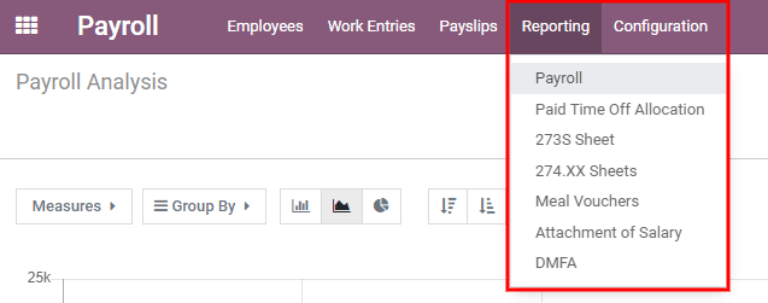

If a report is unavailable to a company, a user error pops up, stating `You must be logged in to a
Belgian company to use this feature.`

At the top of each report, click on :guilabel:`Filters` to display the optional filters for the
specific report. Filters show information that matches the specific filter parameters. For example,
when selecting the :guilabel:`Last 365 Day Payslip` filter, only payslips for the last 365 days
appear. All reports have the option to add a custom filter, and each have different default custom
filter options. Select the parameters, then click the :guilabel:`Apply` button.

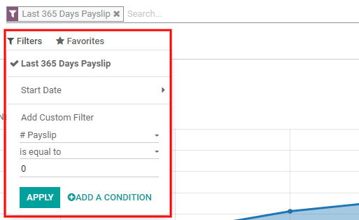

Clicking on :guilabel:`Favorites` displays three options: :guilabel:`Save the current search`,
:guilabel:`Add the search to the dashboard`, or :guilabel:`Insert the search to a Google
spreadsheet`.

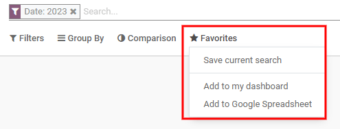

Payroll
-------

Click on :menuselection:`Payroll --> Reporting --> Payroll` to display the :guilabel:`Payroll
Analysis` report.

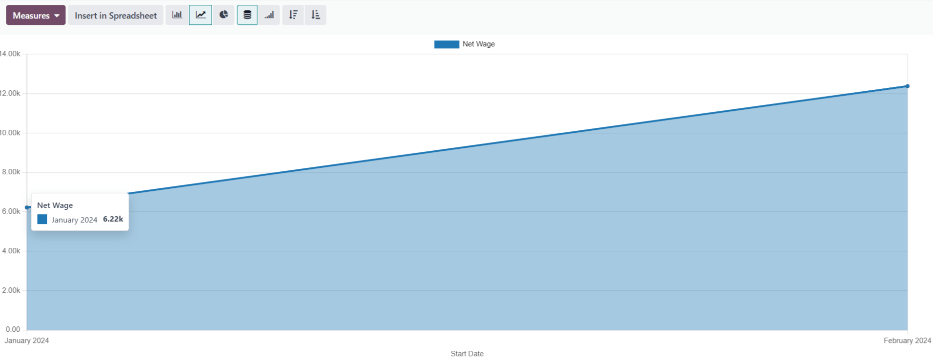

This shows all the payslips generated in the last 365 days. The report can display metrics for a
variety of parameters. Click the :guilabel:`Measures` box to view a drop-down menu with the various
options to display. The options available include: :guilabel:`# Payslip`, :guilabel:`Basic Wage`,
:guilabel:`Basic Wage for Time Off`, :guilabel:`Days of Paid Time Off`, :guilabel:`Days of
Unforeseen Absence`, :guilabel:`Days of Unpaid Time Off`, :guilabel:`Gross Wage`, :guilabel:`Net
Wage`, :guilabel:`Number of Days`, :guilabel:`Number of Hours`, :guilabel:`Work Days`,
:guilabel:`Work Hours`, and :guilabel:`Count`.

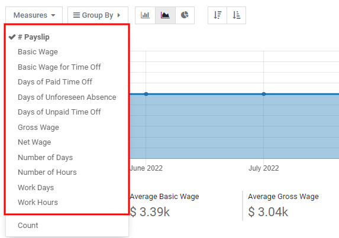

Line chart
~~~~~~~~~~

A line chart is the default view for the *Payroll Analysis* report. If a different view was
selected, click on the :guilabel:`Line Chart` icon (middle icon) in the menu bar to change the view
back to a line chart. An option to display the line chart in ascending or descending order appears
at the end of the options.

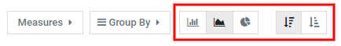

Bar chart
~~~~~~~~~

To display the data in a bar chart, click on the :guilabel:`Bar Chart` icon (first icon) in the menu
bar.

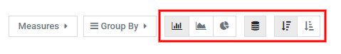

Click the :guilabel:`Stacked` icon to view the bar chart in a stacked format (where multiple values
appear in each column). An option to display the columns in ascending or descending order appears at
the end of the options.

.. tip::
   Clicking an option enables it. To disable the option, click it again. When the option is enabled
   it appears grey. When it is inactive, it appears white.

Pie chart
~~~~~~~~~

To display the data in a pie chart, click on the :guilabel:`Pie Chart` icon (last icon) in the menu
bar. There are no additional options available in this view.

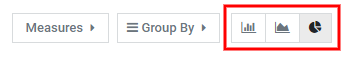

Pivot table
~~~~~~~~~~~

The bottom half of the :guilabel:`Payroll Analysis` dashboard presents a pivot table no matter which
type of chart is selected for the top of the dashboard. The default information displayed is the
number of payslips, net wage, gross wage, days of paid time off, and days of unpaid time off. The
information is divided by department. To display more information on the report, select the
:guilabel:`Measures` drop-down menu, then click on any other items to display.

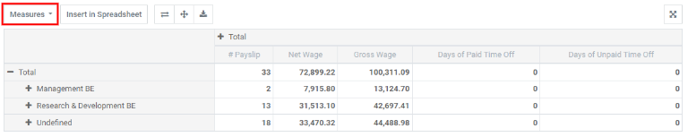

To sort the entries by a specific column, such as :guilabel:`Net Wage`, click on the column name
twice. The first click selects the column, and the second click sorts the information in descending
order.

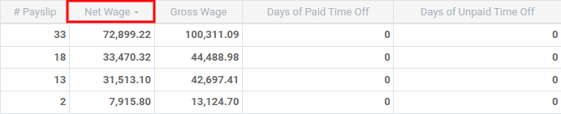

To export the data in an XLSX format, click the :guilabel:`Download xlsx` icon. The information will
be downloaded into an Excel spreadsheet.

.. image:: reporting/export.png
   :align: center
   :alt: Download an Excel spreadsheet of the data by clicking the download button.

The data can be inserted into a spreadsheet by clicking the :guilabel:`Insert in Spreadsheet`
button. A pop-up appears asking which spreadsheet to place the information in. Select an existing
spreadsheet or enter the name for a new spreadsheet. Click the :guilabel:`Confirm` button to move to
a spreadsheet view with all the information populated.

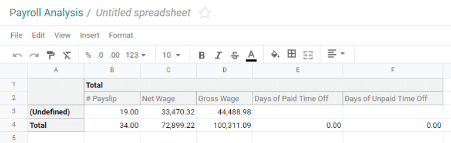

Once in the spreadsheet view, click on :guilabel:`File`, then select :guilabel:`Save` to save the
data, or :guilabel:`Save as Template` to save the setting as a template to use in the future.

.. note::
   The *Documents* application must be installed in order to use the :guilabel:`Insert in
   Spreadsheet` option.

Meal Vouchers
-------------

:guilabel:`Meal Vouchers` provides an overview of the meal vouchers used by employees, and can be
shown by :guilabel:`Day`, :guilabel:`Week`, :guilabel:`Month`, :guilabel:`Quarter`, or
:guilabel:`Year`. The default view is by month.

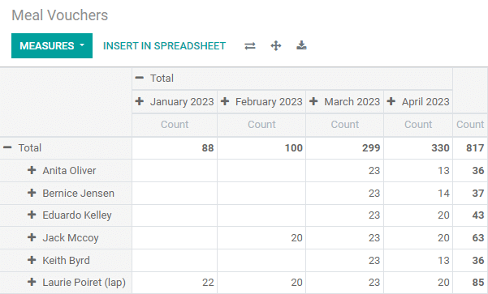

To change the displayed view, click on :guilabel:`Total`. The data collapses, showing only the count
column. Click on :guilabel:`Total` again, then hover over :guilabel:`Day`, then click on one of the
other time-period options available.

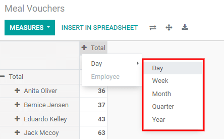

It is possible to compare the current meal voucher report to the one for the previous time period or
the previous year. To view these comparisons, click on the :guilabel:`Comparison` drop-down menu at
the top, then select either :guilabel:`Date: Previous Period` or :guilabel:`Date: Previous Year`.

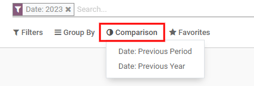

To export the data in an XLSX format, click the :guilabel:`Download xlsx` icon. The information will
be downloaded into an Excel spreadsheet.

.. image:: reporting/voucher-download.png
   :align: center
   :alt: Download an Excel spreadsheet of the data by clicking the download button.

The data can be inserted into a spreadsheet by clicking the :guilabel:`Insert in Spreadsheet`
button. A pop-up appears asking which spreadsheet to place the information in. Select an existing
spreadsheet or enter the name for a new spreadsheet. Click the :guilabel:`Confirm` button to move to
a spreadsheet view with all the information populated.

Once in the spreadsheet view, click on :guilabel:`File`, then select :guilabel:`Save` to save the
data, or :guilabel:`Save as Template` to save the settings as a template to use in the future.

.. note::
   The *Documents* application must be installed in order to use the :guilabel:`Insert in
   Spreadsheet` option.

Attachment of Salary
--------------------

The :guilabel:`Attachment of Salary` report shows all deductions or allocations per employee, such
as child support payments and wage garnishments.

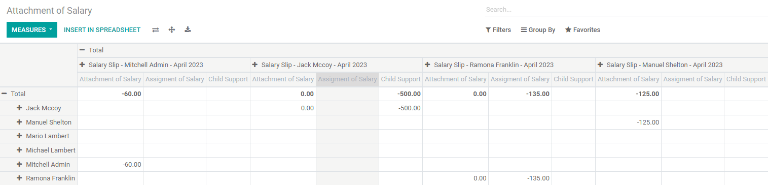

The employees are listed in the left-side column, while the different deductions are listed in the
top row, organized by month.

The report can be exported as a XLSX file, or inserted into a spreadsheet, using the corresponding
buttons at the top.

Clicking on the :guilabel:`Measures` button shows options for how the data is displayed.
:guilabel:`Assignment of salary`, :guilabel:`Attachment of salary`, :guilabel:`Child support`, and
:guilabel:`Count`, can all be selected or deselected by clicking on the item. If an item has a check
mark, it is displayed.

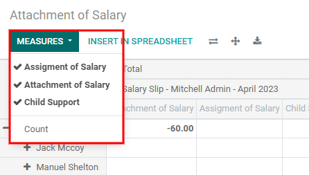

The salary attachment report can be compared to the one for the previous time period or the previous
year. To view these comparisons, click on the on the :guilabel:`Comparison` drop-down menu at the
top, then select either :guilabel:`Payslip End Date: Previous Period` or :guilabel:`Payslip End
Date: Previous Year`.
