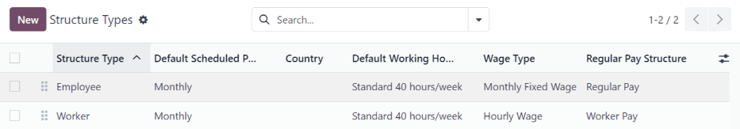
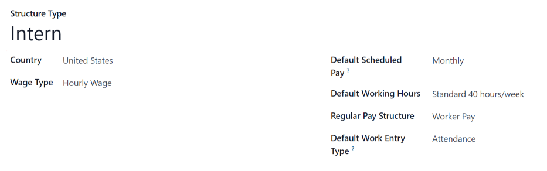
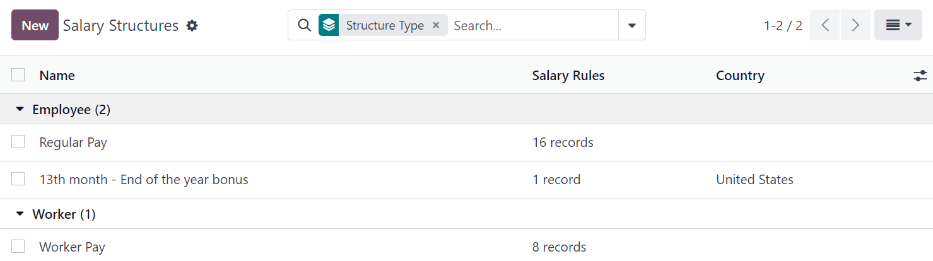
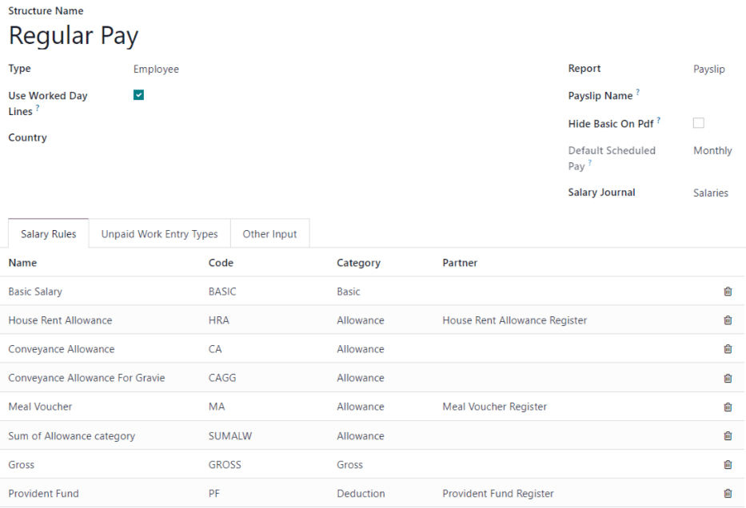
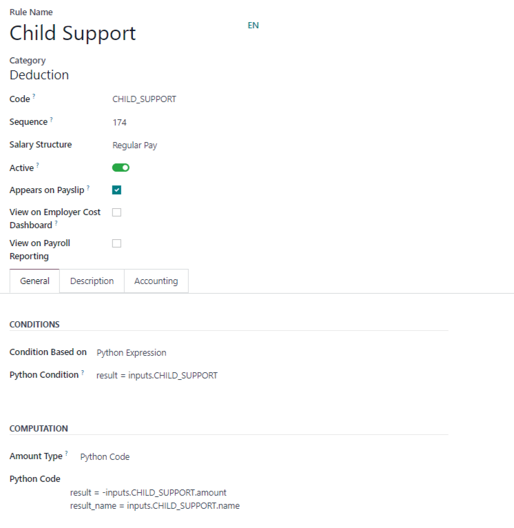

========
Salaries
========

In Odoo, salaries are calculated and determined by five factors: salary :ref:`structure types
<payroll/structure-types>`, salary :ref:`structures <payroll/structures>`, :ref:`rules
<payroll/rules>`, :ref:`rule parameters <payroll/rule-parameters>`, and :ref:`other input types
<payroll/other-input>`. Together, these determine how each employee's pay is calculated.

Each *structure type* contains one or more *structures* within it. Each *structure* contains a set
of *rules*, and every *rule* uses *parameters* to define how specific amounts are calculated.
Additional inputs, (such as bonuses or deductions) can also be included to adjust the final salary.

When payslips are calculated, Odoo calculates the employee's worked time from their :doc:`work
entries <work_entries>`, then applies the relevant structure, rules, and parameters from the
employee's assigned structure type to determine their total pay.

.. _payroll/structure-types:

Structure types
===============

In Odoo, a *structure type* groups related salary structures. When a contract specifies a structure
type, **only** the structures within that type are used to calculate the employee's pay. Each
structure type houses individual structures within them, each containing a set of rules for
processing a timesheet entry.

Structure types define key aspects of payroll configuration, including how often employees are paid,
their working hours, the default salary structure, and whether wages are fixed (salary-based) or
variable (hourly-based).

.. example::
   A structure type called `Employee` contains two different structures within it: a `Regular Pay`
   structure which includes all the separate rules for processing regular pay, and an `End of Year
   Bonus` structure, which includes the rules **only** for the end of year bonus. Both belong to the
   same `Employee` structure type.

View existing *structure types* by navigating to :menuselection:`Payroll app --> Configuration -->
Structure Types`.

Two default structure types are preconfigured in Odoo: :guilabel:`Employee` and :guilabel:`Worker`.

Typically, :guilabel:`Employee` is used for salaried employees, which is why the :guilabel:`Default
Wage Type` is a :guilabel:`Fixed Wage`, and :guilabel:`Worker` is typically used for employees paid
by the hour, so the wage type is :guilabel:`Hourly Wage`.

.. note::
   If using a country-specific :doc:`payroll localizations <payroll_localizations>`, it is
   recommended to use the structure in the corresponding country localization document.

.. _payroll/new-structure-type:

New structure type
------------------

If the default structure types do not meet the company's needs, go to :menuselection:`Payroll app
--> Configuration --> Structure Types` and click :guilabel:`New` to create a custom structure type.

.. warning::
   When creating a new salary structure type, ensure all local and national laws are accounted for.
   Confirm with the accounting department when configuring payroll structures, to ensure all
   requirements are met.

Proceed to enter the following information in the fields:

- :guilabel:`Structure Type`: Enter the name for the new structure type, such as `Employee` or
  `Worker`.
- :guilabel:`Country`: Select the country that the new structure type applies to from the drop-down
  menu.
- :guilabel:`Wage Type`: Select the wage type for the structure:

  - :guilabel:`Fixed Wage`: For salaried employees who receive the same wage every pay period.
  - :guilabel:`Hourly Wage`: For employees paid based on hours worked during a pay period.

- :guilabel:`Default Scheduled Pay`: Select the typical pay schedule for the new structure type from
  the drop-down menu. This indicates how often this specific type of structure is paid out.
- :guilabel:`Default Working Hours`: Select the default working hours for the new structure type
  from the drop-down menu. All available working hours for the currently selected company appear in
  the drop-down menu. The default working hours are the :guilabel:`Standard 40 hours/week` option.
  If the needed working hours do not appear in the list, a :ref:`new set of default working hours
  can be created <new-default-working-hours>`.
- :guilabel:`Regular Pay Structure`: Type in the name for the regular pay structure. It is used as
  the default option when generating payslips.
- :guilabel:`Default Work Entry Type`: Select the default work entry type which is used to create
  all work entries for the employee.

.. _new-default-working-hours:

New default working hours
-------------------------

To make new default working hours, type the name for the new working hours in the :guilabel:`Default
Working Hours` field on the new structure type form. Click :guilabel:`Create and edit`. A default
working hours form pops up. The default working hours form has two sections: a general information
section, and a tab listing all the individual working hours by day and time. When the form is
completed, click :guilabel:`Save & Close`.

- :guilabel:`Name`: Type in the name for the new default working hours. This should be descriptive
  and clear to understand, such as `Standard 20 Hours/Week`.
- :guilabel:`Flexible Hours`: Tick the checkbox to let employees adjust their start and end times
  while maintaining the same total daily hours.
- :guilabel:`Company Full Time`: Enter the number of hours per week an employee needs to work to be
  considered a full-time employee. Typically, this is approximately 40 hours, and this number
  affects what types of benefits an employee can receive, based on their employment status
  (full-time vs part-time).
- :guilabel:`Average Hour Per Day`: Auto-populated based on the working hours in the
  :guilabel:`Working Hours` tab. This entry affects resource planning by determining how many
  resources can be used per workday.
- :guilabel:`Work Time Rate`: This percentage is auto-generated based on the entry for the
  :guilabel:`Company Full Time` and the working hours configured in the :guilabel:`Working Hours`
  tab. This number should be between `0.00%` and `100%`, so if the percentage is above `100%`, it is
  an indication that the working times and/or :guilabel:`Company Full Time` hours need adjustment.
- :guilabel:`Company`: Select the company that can use these new default working hours from the
  drop-down menu. Leave this field blank if the hours are available for all companies.
- :guilabel:`Timezone`: Select the time zone to be used for the new default working hours from the
  drop-down menu.
- :guilabel:`Working Hours` Tab: This tab is where each day's specific working hours are listed.
  When a new default working hour form is created, the :guilabel:`Working Hours` tab is
  pre-populated with a default 40-hour week, with each day divided into three timed sections.

  Each day includes morning (8:00–12:00), lunch (12:00–13:00), and afternoon (13:00–17:00) periods,
  configured using the 24-hour time format.

  To adjust any of these hours, click the field and modify the time using the drop-down menus, or
  type the desired time directly.

  .. note::
     Working hours are company-specific, and cannot be shared between companies.

  .. tip::
     If the working hours are not consistent each week, and the hours are on a bi-weekly schedule
     instead, click the :guilabel:`Switch to 2 week calendar` button at the top of the new default
     working hours form. This changes the :guilabel:`Working Hours` tab to display two weeks of
     working times that can be adjusted.

.. _payroll/structures:

Structures
==========

*Salary structures* are the different situations in which an employee could be paid within a
specific *structure*, and are specifically defined by various rules.

The number of structures a company needs for each structure type depends on how many different ways
employees are paid, and how their pay is calculated. A common example of an additional structure is
a `Bonus`.

To view all the various structures for each structure type, go to :menuselection:`Payroll app -->
Configuration --> Structures`.

Each :ref:`structure type <payroll/structure-types>` lists the various structures associated with
it. Each structure contains a set of rules that define it.

Click on a structure to view its :guilabel:`Salary Rules`. These rules define how the payslip will
be computed for the employee.

.. note::
   After installing a :doc:`payroll localization <payroll_localizations>`, relevant structures are
   installed and appear in this list.

.. _payroll/rules:

Salary rules
============

Each *structure* has a set of salary *rules* used to compute the various amounts considered in the
pay. These rules are configured by the localization and affect the computation of the salaries.

.. warning::
   Modification or creation of rules should **only** be done when necessary.

To view all the rules, go to :menuselection:`Payroll app --> Configuration --> Rules`. Click on a
structure (such as :guilabel:`Regular Pay`) to view all the rules.

To make a new rule, click :guilabel:`New`. A new rule form appears. Enter the following information
in the fields.

Top section
-----------

- :guilabel:`Rule Name`: Enter a name for the rule. This field is required.
- :guilabel:`Category`: Select a category the rule applies to from the drop-down menu, or enter a
  new one. This field is required.
- :guilabel:`Code`: Enter a code to be used for this new rule. This field is required.
- :guilabel:`Sequence`: Enter a number indicating when this rule is calculated in the sequence of
  all other rules.
- :guilabel:`Salary Structure`: Select a salary structure the rule applies to from the drop-down
  menu, or enter a new one. This field is required.
- :guilabel:`Active`: Enable this toggle so the rule is available for use. Disable the toggle to
  continue to show it on the payslip, but skip the computation.
- :guilabel:`Appears on payslip`: Disabling the toggle will still show the rule on the payslip, it
  will just not be computed.
- :guilabel:`View on Employer Cost Dashboard`: Tick the checkbox to have the rule appear on the
  *Employer Cost* report, located on the *Payroll* app dashboard.
- :guilabel:`View on Payroll Reporting`: Tick the checkbox to have the rule appear on payroll
  reports.

General tab
-----------

Conditions
~~~~~~~~~~

- :guilabel:`Condition Based on`: Select from the drop-down menu whether the rule is
  :guilabel:`Always True` (always applies), a :guilabel:`Range` (applies to a specific range, which
  is entered beneath the selection), :guilabel:`Other Input` (the condition is entered beneath the
  field), or a :guilabel:`Python Expression` (the code is entered beneath the selection). This field
  is required.

Computation
~~~~~~~~~~~

- :guilabel:`Amount Type`: Select from the drop-down menu whether the amount is a :guilabel:`Fixed
  Amount`, a :guilabel:`Percentage (%)`, :guilabel:`Other Input`, or a :guilabel:`Python Code`.
  Depending on what is selected, the fixed amount, percentage, other input, or Python code needs to
  be entered next. This field is required.

Company contribution
~~~~~~~~~~~~~~~~~~~~

- :guilabel:`Partner`: If another company financially contributes to this rule, select the company
  from the drop-down menu.

Description tab
---------------

Provide any additional information in this tab to help clarify the rule. This tab only appears in
the rule form.

Accounting tab
--------------

- :guilabel:`Debit Account`: Select the debit account from the drop-down menu the rule affects.
- :guilabel:`Credit Account`: Select the credit account from the drop-down menu the rule affects.
- :guilabel:`Split account line based on name`: Tick the checkbox to split the accounting entry
  according to the payslip line name.
- :guilabel:`Not computed in net accountability`: If checked, the amount of the rule is shown
  independently from the net salary, to allow for better reporting in the **Accounting** app.

.. _payroll/rule-parameters:

Rule parameters
===============

Rule parameters inform Odoo how to calculate each line of a payslip. To view the configured rule
parameters, navigate to :menuselection:`Payroll app --> Configuration --> Rule Parameters`.

All rule parameters are displayed. Click on an individual rule parameter to view the details.

Each rule parameter displays the name of the rule, the code, when the rule is active, and the
parameter value.

.. example::
   The rule parameters for overtime pay inform Odoo that employees receive time and a half when
   working over 40 hours.

.. _payroll/other-input:

Other input types
=================

When creating payslips, it is sometimes necessary to add other entries for specific circumstances,
like tips, commissions, expenses, or deductions. These other inputs can be found by navigating to
:menuselection:`Payroll app --> Configuration --> Other Input Types`.

.. image:: salaries/other-input.png
   :alt: A list of other input types for payroll that can be selected when creating a new entry for
         a payslip.

If a new input type is needed that does not appear on the list, click the :guilabel:`New` button to
create a new input type. Enter the :guilabel:`Description`, the :guilabel:`Code`, and select which
structure it applies to in the :guilabel:`Availability in Structure` field.

Tick the :guilabel:`Available in attachments` checkbox if the input should be a salary attachment.

.. important::
   The :guilabel:`Code` is used in the salary rules to compute payslips. If the
   :guilabel:`Availability in Structure` field is left blank, it indicates that the new input type
   is available for all payslips and is not exclusive to a specific structure.

