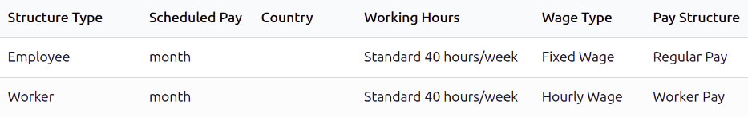
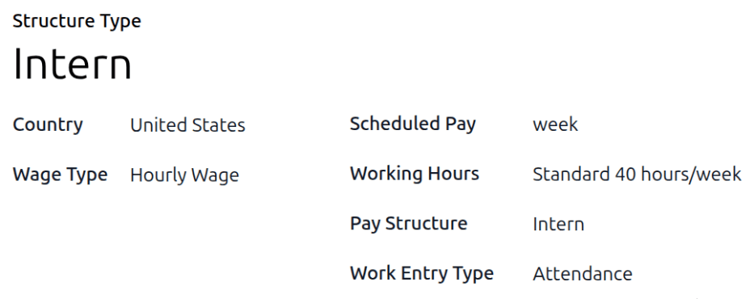
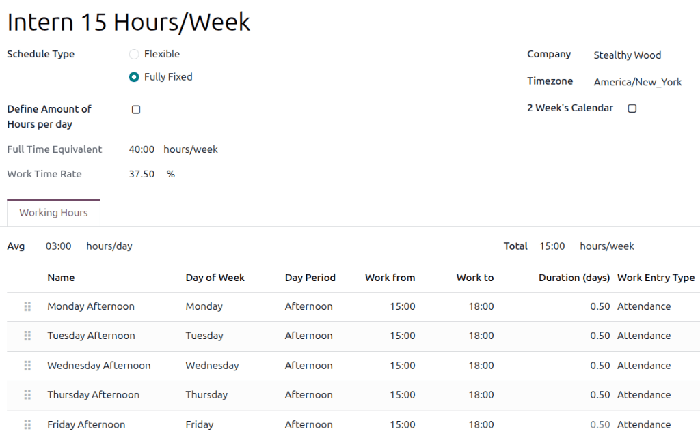
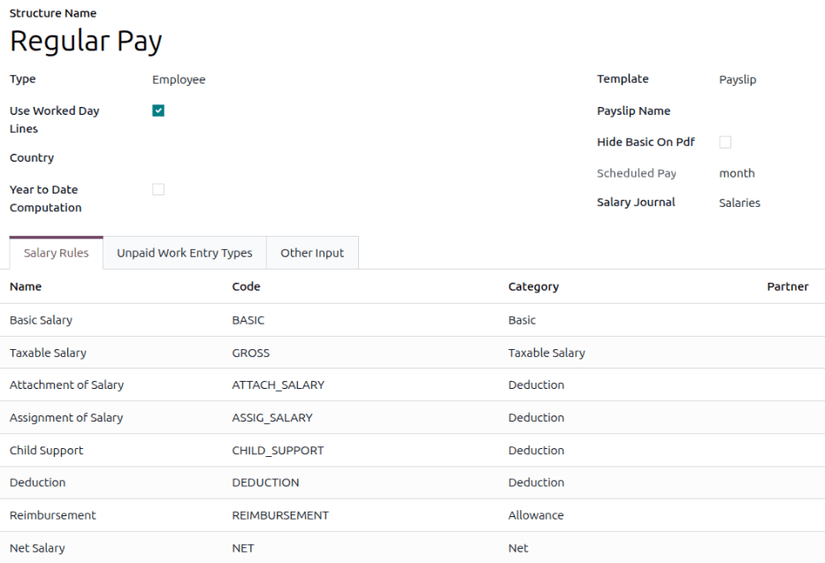
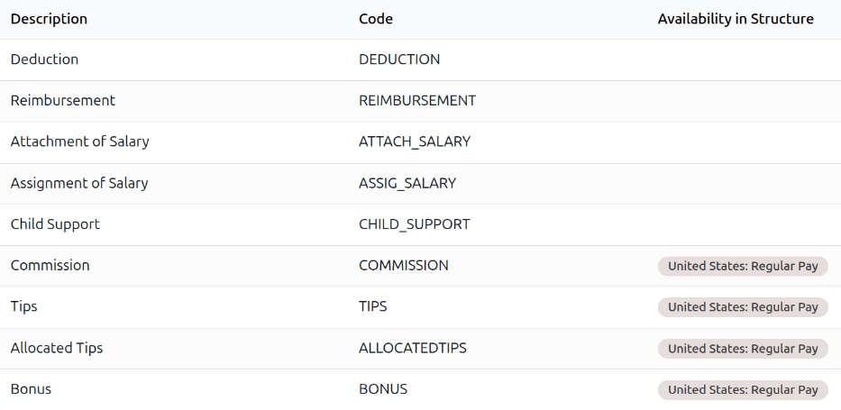

========
Salaries
========

In Odoo, salaries are calculated and determined by six factors: salary :ref:`structure types
<payroll/salaries/structure-types>`, salary :ref:`structures <payroll/salaries/structures>`,
:ref:`rules <payroll/salaries/rules>`, :ref:`rule parameters <payroll/salaries/rule-parameters>`,
:ref:`rule categories <payroll/salaries/rule-categories>`, and :ref:`salary input types
<payroll/salaries/salary-input-types>`. Together, these determine how each employee's pay is
calculated.

Each *structure type* contains one or more *structures* within it. Each *structure* contains a set
of *rules*, and every *rule* uses *parameters* and *categories* to define how specific amounts are
calculated. Additional salary inputs, such as bonuses or deductions, can also be included to adjust
the final salary.

When payslips are calculated, Odoo calculates the employee's worked time from their :doc:`work
entries <work_entries>`, then applies the relevant structure, rules, and parameters from the
employee's assigned structure type to determine their total pay.

.. _payroll/salaries/structure-types:

Structure types
===============

In Odoo, a *structure type* groups related salary structures. When a contract specifies a structure
type, **only** the structures within that type are used to calculate the employee's pay. Each
structure type houses individual structures within them, each containing a set of rules for
processing a timesheet entry.

Structure types define key aspects of payroll configuration, including how often employees are paid,
their working hours, the default salary structure, and whether wages are fixed (salary-based) or
variable (hourly-based).

.. example::
   A structure type called `Employee` contains two different structures within it: a `Regular Pay`
   structure which includes all the separate rules for processing regular pay, and an `End of Year
   Bonus` structure, which includes the rules **only** for the end of year bonus. Both belong to the
   same `Employee` structure type.

View existing *structure types* by navigating to :menuselection:`Payroll app --> Configuration -->
Structure Types`.

Two default structure types are preconfigured in Odoo: :guilabel:`Employee` and :guilabel:`Worker`.

Typically, :guilabel:`Employee` is used for salaried employees, which is why the :guilabel:`Wage
Type` is set to :guilabel:`Fixed Wage`, and :guilabel:`Worker` is typically used for employees paid
by the hour, so the wage type is set to :guilabel:`Hourly Wage`.

.. note::
   If using a country-specific :doc:`payroll localizations <payroll_localizations>`, it is
   recommended to use the structure in the corresponding country localization document.

.. _payroll/salaries/new-structure-type:

New structure type
------------------

If the default structure types do not meet the company's needs, go to :menuselection:`Payroll app
--> Configuration --> Structure Types` and click :guilabel:`New` to create a custom structure type.

.. warning::
   When creating a new salary structure type, ensure all local and national laws are accounted for.
   Confirm with the accounting department when configuring payroll structures, to ensure all
   requirements are met.

Proceed to enter the following information in the fields:

- :guilabel:`Structure Type`: Enter the name for the new structure type, such as `Employee` or
  `Worker`.
- :guilabel:`Country`: Select the country that the new structure type applies to from the drop-down
  menu.
- :guilabel:`Wage Type`: Select the wage type for the structure:

  - :guilabel:`Fixed Wage`: For salaried employees who receive the same wage every pay period.
  - :guilabel:`Hourly Wage`: For employees paid based on hours worked during a pay period.

- :guilabel:`Scheduled Pay`: Select the typical pay schedule for the new structure type using the
  drop-down menu. This indicates how often this specific type of structure is paid out.
- :guilabel:`Working Hours`: Select the working hours for the new structure type using the drop-down
  menu. All available working hours for the currently selected company appear in the drop-down menu.
  The default working hours are the :guilabel:`Standard 40 hours/week` option. If the needed working
  hours do not appear in the list, a :ref:`new set of working hours can be created
  <payroll/salaries/new-working-hours>`.
- :guilabel:`Pay Structure`: Select the pay structure that falls within the new structure type using
  the drop-down menu. This is used as the default option when generating payslips.
- :guilabel:`Work Entry Type`: Select the work entry type used to create all work entries for the
  employee.

.. _payroll/salaries/new-working-hours:

New working hours
-----------------

To make new working hours, type the name for the new working hours in the :guilabel:`Working Hours`
field on the new structure type form, then click :guilabel:`Create and edit`. A *Create Working
Hours* pop-up window loads. The form has two sections: a general information section, and a *Working
Hours* tab listing all the individual working hours by day and time. When the form is completed,
click :guilabel:`Save`.

- :guilabel:`Name`: Type in the name for the new working hours. This should be descriptive and clear
  to understand, such as `Standard 20 Hours/Week`.
- :guilabel:`Schedule Type`: Select if the hours are :guilabel:`Flexible` or :guilabel:`Fully Fixed`
  by clicking the corresponding radio button. Selecting :guilabel:`Flexible` hides the *Working
  Hours* tab and some other fields in the general information section.
- :guilabel:`Define Amount of Hours per day`: Enable this option to base the schedule on a set
  amount of expected hours by day, instead of set start and end times for each day. When this option
  is modified, a *Confirmation* pop-up window appears. Click :guilabel:`Confirm` on the pop-up to
  make the change.
- :guilabel:`Full Time Equivalent`: The number of hours per week an employee needs to work to be
  considered a full-time employee. Typically, this is approximately 40 hours, and this number
  affects what types of benefits an employee can receive, based on their employment status
  (full-time vs part-time). This field is **not** able to be modified.
- :guilabel:`Work Time Rate`: This percentage is auto-generated based on the configured times in the
  *Working Hours* tab, compared to the :guilabel:`Full Time Equivalent`. This number should be
  between `0.00%` and `100%`, so if the percentage is above `100%`, it is an indication that the
  working times may need adjustment.
- :guilabel:`Company`: Select the company that can use the new default working hours using the
  drop-down menu. Leave this field blank if the hours are available for all companies.
- :guilabel:`Timezone`: Select the time zone to be used for the new working hours using the
  drop-down menu.
- :guilabel:`2 Week's Calendar`: Enable this checkbox to switch from a one-week calendar to a
  two-week calendar. When this option is modified, a *Confirmation* pop-up window appears. Click
  :guilabel:`Switch` on the pop-up to make the change. When enabled, the presented tabs change from
  a single *Working Hours* tab to two tabs: *Week 1 Working Hours* and *Week 2 Working Hours*.

  .. important::
     Switching the calendar in either method removes **all** current work entries.

- *Working Hours* Tab: This tab is where each day's specific working hours are listed, including
  breaks. When a new working schedule is created, the *Working Hours* tab is pre-populated with a
  default 40-hour week, with each day divided into three timed sections.

  Each day includes a morning shift (8:00-12:00), a lunch break (12:00-13:00), and an afternoon
  shift (13:00-17:00), configured using a 24-hour time format.

  The average daily working hours is automatically calculated based on the schedule, and appears in
  the :guilabel:`Avg` field, along with the :guilabel:`Total` hours for the week.

  To adjust any of these entries, click the desired field and modify the information using the
  drop-down menus or type the information in directly.

  Ensure the :guilabel:`Work Entry Type` field is configured for each line. This ensures the
  **Payroll** app properly calculates all work entries.

  .. note::
     Working hours are company-specific, and cannot be shared between companies.

  .. tip::
     If the :guilabel:`2 Week's Calendar` option is enabled, ensure the various working hours for
     both tabs (*Week 1 Working Hours* and *Week 2 Working Hours*) are correctly configured.

.. _payroll/salaries/structures:

Structures
==========

*Salary structures* are the different situations in which an employee could be paid within a
specific *structure*, and are specifically defined by various rules.

The number of structures a company needs for each structure type depends on how many different ways
employees are paid, and how their pay is calculated. A common example of an additional structure is
a `Bonus`.

To view all the various structures for each structure type, go to :menuselection:`Payroll app -->
Configuration --> Structures`.

Each :ref:`structure type <payroll/salaries/structure-types>` lists the various structures
associated with it. Each structure contains a set of rules that define it.

Odoo comes with two salary structures preconfigured: :guilabel:`Regular Pay`, housed within the
:guilabel:`Employee` structure type, and :guilabel:`Worker Pay`, housed within the
:guilabel:`Worker` salary structure type.

Click on a structure to view its :guilabel:`Salary Rules`. These rules define how the payslip will
be computed for the employee.

.. note::
   After installing a :doc:`payroll localization <payroll_localizations>`, relevant structures are
   installed and appear in this list.

.. _payroll/salaries/rules:

Salary rules
============

Each *structure* has a set of salary *rules* used to compute the various amounts considered in the
pay. These rules are configured by the localization and affect the computation of the salaries.

.. warning::
   Modification or creation of rules should **only** be done when necessary.

To view all the rules, go to :menuselection:`Payroll app --> Configuration --> Rules`. Click on a
structure, such as :guilabel:`Regular Pay`, to view all the rules.

Add a new rule
--------------

To make a new rule, click :guilabel:`New` and a blank *Salary Rules* form loads. Enter the following
information in the top half of the form:

- :guilabel:`Rule Name`: Enter a name for the rule. This is the name displayed in the payslip.
- :guilabel:`Code`: Enter a code to be used for the new rule. This is case sensitive and is used as
  the *rule ID*. This field is **required**.
- :guilabel:`Category`: Using the drop-down menu, select the category the rule applies to, or enter
  a new category. The category is used to group rules and access their total sum.
- :guilabel:`Salary Structure`: Using the drop-down menu, select the salary structure the rule
  applies to, or enter a new one. This field is **required**.
- :guilabel:`Sequence`: Enter a number indicating *when* the rule is calculated, in the sequence of
  all other rules. Rules are processed one after another based on their sequence number. Rules with
  a lower sequence number are calculated first, and their results can be used by rules with a higher
  sequence number. This field is **required**.
- :guilabel:`Appears on Payslip`: Enable this checkbox to have the rule visible on the employee
  payslip PDF.
- :guilabel:`Contributes to Employer Cost`: Enable this checkbox to include the rule when computing
  the *employer cost* of a payslip.

General tab
~~~~~~~~~~~

Fill out the following sections of the *General* tab. These configurations determine *when* and
*how* the rule is calculated.

Conditions
**********

- :guilabel:`Condition Based on`: Using the drop-down menu, select if the rule is calculated and
  displayed as a line in the payslip form view. Choose from one of the following options:

  - :guilabel:`Always True`: The rule is always calculated. No other configurations are needed for
    this section.
  - :guilabel:`Salary Input`: This introduces a dynamic benefit to the structure. This appears as a
    field in the *Payroll* tab of the *Employee* form, the *Inputs* tab of the payslip, or both. The
    value of this field is added to the amount of the rule. If selected, the following additional
    fields appear and must be configured:

    - :guilabel:`Input on`: Specify where this field should appear and which object it should belong
      to, the :guilabel:`Employee`, the :guilabel:`Payslip`, or both. If both are selected, the
      value on the payslip automatically defaults to the value from the employee record, but it can
      be overwritten directly on the payslip for a specific payroll run.
    - :guilabel:`Section`: This groups several inputs into one expandable section on the form view.
      Only one option is available by default, :guilabel:`Inputs`.
    - :guilabel:`Unit`: Click the corresponding radio button to determine how the benefit is
      displayed. The available options are:

      - :guilabel:`Monetary`: A number with currency.
      - :guilabel:`Quantity`: A number.
      - :guilabel:`Percentage`: A number with a % sign.
      - :guilabel:`Checkbox`: Indicates boolean values.

    - :guilabel:`Input Description`: Enter a short explanation of when the input is applicable.
    - :guilabel:`Default Value`: Enter the default value, either a monetary amount, quantity, or
      percentage. This is determined by what is selected for the :guilabel:`Unit`. If necessary, add
      a :guilabel:`Suffix` in the field to the right of this value, such as `per km`.

      .. note::
         If :guilabel:`Checkbox` is selected for the :guilabel:`Unit`, this field changes to
         :guilabel:`Selected by Default`. Click the checkbox to have the rule active by default.

     - :guilabel:`Depends On`: Select another rule that has a salary input, and use its value to
       determine whether this rule should be hidden.

  - :guilabel:`Other Input`: Select this to check if a payslip line exists with the same *type*.
    When selected, a :guilabel:`Condition Other Input` field appears. Using the drop-down menu,
    select the type of input the rule is based on, such as :guilabel:`Deduction`,
    :guilabel:`Reimbursement`, etc.
  - :guilabel:`Python Expression`: Select this to have the rule calculated using a Python script.
    The script is evaluated using the local dictionary. The right side lists the
    :guilabel:`Available variables` and the :guilabel:`Output`:

    - :guilabel:`Available variables`:

      - :guilabel:`payslip`: The `hr.payslip` object.
      - :guilabel:`employee`: The `hr.employee` object.
      - :guilabel:`version`: The `hr.version` object.
      - :guilabel:`result_rules`: A dictionary containing the rules amounts, quantities, rates and
        totals (previously computed).
      - :guilabel:`categories`: A dictionary containing the computed salary rule categories (the sum
        of the amount of all the rules belonging to that category):

        - :guilabel:`total`: rule total
        - :guilabel:`amount`: rule amount
        - :guilabel:`quantity`: rule quantity
        - :guilabel:`rate`: rule rate
        - :guilabel:`ytd`: rule year to date value

      - :guilabel:`worked_days`: A dictionary containing the computed worked days, where each key is
        a work entry type code, and each value is a `worked_days` object. This object contains many
        variables, with the most important ones being:

        - :guilabel:`number_of_days`: The number of days registered in the payslip duration with
          this work entry type.
        - :guilabel:`number_of_hours`: The number of hours registered in the payslip duration with
          this work entry type.
        - :guilabel:`is_paid`: Whether or not this work entry type is added as an unpaid work entry
          on this payslip structure.

      - :guilabel:`inputs`: A dictionary containing the computed inputs where *key* is the other
        input type code and *value* is the sum of the payslip input lines with the same code.

    - :guilabel:`Output`:

      - :guilabel:`result`: The boolean is *True* if the rule should be calculated, or *False* if
        otherwise.

- :guilabel:`Domain`: Select this option to apply the rule *only* if it matches the configured
  :guilabel:`Applicability Domain`. Configure the :guilabel:`Applicability Domain` that appears
  beneath this option when selected.

Computation
***********

This section determines the final value of the rule, which consists of the base amount, the
quantity, and the rate. The total of the rule is `total = amount * quantity * (rate/100)`.

.. important::
   This field does **not** appear if the :guilabel:`Condition Based on` field is set to
   :guilabel:`Salary Input`.

Using the drop-down menu, select one of the following options for the :guilabel:`Amount Type` field:

- :guilabel:`Percentage (%)`: Defines the values for the total calculation. When selected, configure
  the following fields:

  - :guilabel:`Percentage based on`: A Python expression is evaluated using the `localdict`, and its
    value is assigned to the rule amount.
  - :guilabel:`Quantity`: A Python expression is evaluated using the `localdict`, and its value is
    assigned to the rule quantity.
  - :guilabel:`Percentage (%)`: A decimal number assigned to the rule rate.

- :guilabel:`Fixed Amount`: The amount and quantity is defined, with a rate of 100%.

  - :guilabel:`Quantity`: A Python expression is evaluated using the `localdict`, and its value is
    assigned to the rule quantity.
  - :guilabel:`Fixed Amount`: Enter a decimal number which is assigned to the rule amount.

- :guilabel:`Other Input`: Select this to fetch the rule amount from the payslip input lines that
  have the same *other input type* with rate of `100%` and quantity of `1.0`. When selected, an
  :guilabel:`Amount Other Input` field appears beneath it. Using the drop-down menu, select the
  *type* of input it is, such as :guilabel:`Deduction`, :guilabel:`Tips`, or :guilabel:`Expenses`.

- :guilabel:`Python Code`: This is the more complex version of the :guilabel:`Percentage (%)`
  option, where a whole Python script is written then evaluated using the `localdict`. This includes
  a list of :guilabel:`Available variables` and an :guilabel:`Output` list.

  - :guilabel:`Available variables`:

    - :guilabel:`payslip`: hr.payslip object
    - :guilabel:`employee`: hr.employee object
    - :guilabel:`version`: hr.version object
    - :guilabel:`result_rules`: A dict containing the rules amounts, quantities, rates and totals
      (previously computed), where the key is the rule code, and the value is dict with the
      following keys:

      - :guilabel:`total`: rule total
      - :guilabel:`amount`: rule amount
      - :guilabel:`quantity`: rule quantity
      - :guilabel:`rate`: rule rate
      - :guilabel:`ytd`: rule year to date value

    - :guilabel:`categories`: A dict containing the computed salary rule categories (sum of amount
      of all rules belonging to that category) where key is the category code and value is the sum
      of the rules total values.
    - :guilabel:`worked_days`: A dict containing the computed worked days where *key* is the work
      entry type code and *value* is the `worked_days` object contain many variables, but most
      important ones are:

      - :guilabel:`number_of_days`: The number of days registered in the payslip duration with this
        work entry type.
      - :guilabel:`number_of_hours`: The number of hours registered in the payslip duration with
        this work entry type.
      - :guilabel:`is_paid`: Dictates whether or not this work entry type is added as unpaid work
        entry on this payslip structure.

    - :guilabel:`inputs`: A dict containing the computed inputs Where *key** is the other input type
      code and *value* is the sum of the payslip input lines with the same code.

  - :guilabel:`Output`:

    - :guilabel:`result`: float, base amount of the rule
    - :guilabel:`result_rate`: float, which defaults to 100.0 (%)
    - :guilabel:`result_qty`: float, quantity, which defaults to 1
    - :guilabel:`result_name`: string, name of the line. This defaults to the name field of the
      salary rule (useful if the name depends or should depend on something computed in the rule).

Company contribution
********************

Using the drop-down menu, select the eventual third party involved in the salary payment to the
employees.

Display tab
~~~~~~~~~~~

This section determines the appearance of the rule on the payslip PDF available to the employee, and
defines the rule aesthetics.

First, select a :guilabel:`Color` for the rule using the color picker. Next, enable the
:guilabel:`Title` checkbox to **only** display the salary rule's *title* and *description*, and hide
any numerical values.

Activate the :guilabel:`Indented`, :guilabel:`Space Above`, :guilabel:`Bold`, :guilabel:`Underline`,
and :guilabel:`Italic` checkboxes to activate the respective options.

Finally, enter a :guilabel:`Description` for the rule, which is displayed below the rule name.

Accounting tab
~~~~~~~~~~~~~~

This section determines how the rule affects the various accounting journals and how the Net salary
is calculated for employees. Configure the following fields in this section:

- :guilabel:`Debit Account`: Using the drop-down menu, select the debit account for the rule.
- :guilabel:`Credit Account`: Using the drop-down menu, select the credit account for the rule.
- :guilabel:`Split on names`: Enable this option to split the accounting entries for this rule
  according to the payslip line name. Splitting the entries provides more visibility for deductions
  and reimbursements, or for salary adjustments.
- :guilabel:`Excluded from Net`: Check this checkbox to exclude the rule's calculations from the net
  salary rule in journal entries. A specific debit and credit account should be set to independently
  classify it.
- :guilabel:`Set employee on account line`: Check this checkbox to have the employee's name visible
  on the journal items.

.. important::
   This tab is **only** available if the **Accounting** app is installed.

.. _payroll/salaries/rule-parameters:

Rule parameters
===============

Rule parameters inform Odoo how to calculate each line of a payslip. To view the configured rule
parameters, navigate to :menuselection:`Payroll app --> Configuration --> Rule Parameters`.

All rule parameters are displayed. Click on an individual rule parameter to view the details.

Each rule parameter displays the name of the rule, the code, when the rule is active, and the
parameter value.

.. _payroll/salaries/rule-categories:

Rule categories
===============

Every rule is associated with a rule category. To view the various categories, navigate to
:menuselection:`Payroll app --> Configuration --> Rule Categories`.

All rule categories appear in a list view, and display the category :guilabel:`Name`,
:guilabel:`Code`, and :guilabel:`Country`.

To create a new rule category, click the :guilabel:`New` button. Enter a :guilabel:`Name` and
:guilabel:`Code` for the category in the corresponding fields. If the category is housed beneath a
:guilabel:`Parent` category, select the parent category using the drop-down menu. If the category is
country-specific, select the :guilabel:`Country` using the drop-down menu.

.. _payroll/salaries/salary-input-types:

Salary input types
==================

When creating payslips, it is sometimes necessary to add other entries for specific circumstances,
like tips, commissions, expenses, or deductions. These other inputs can be found by navigating to
:menuselection:`Payroll app --> Configuration --> Salary Input Types`. All universal and
localization-specific salary input types appear in the list.

         a payslip.

If a new input type is needed that does not appear on the list, click the :guilabel:`New` button to
create a new salary input type. Enter the :guilabel:`Description`, the :guilabel:`Code`, and select
which structure it applies to in the :guilabel:`Availability in Structure` field.

Enable the :guilabel:`Available in adjustments` checkbox if the input should be a salary adjustment.

.. important::
   The :guilabel:`Code` is used in the salary rules to compute payslips. If the
   :guilabel:`Availability in Structure` field is left blank, it indicates that the new input type
   is available for all payslips and is not exclusive to a specific structure.
