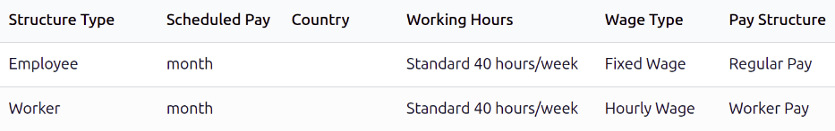
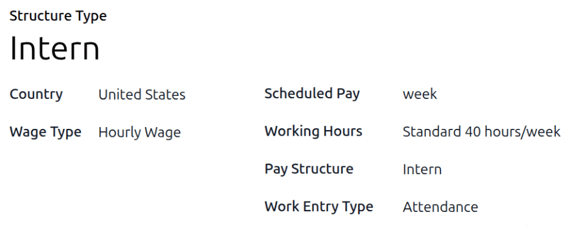
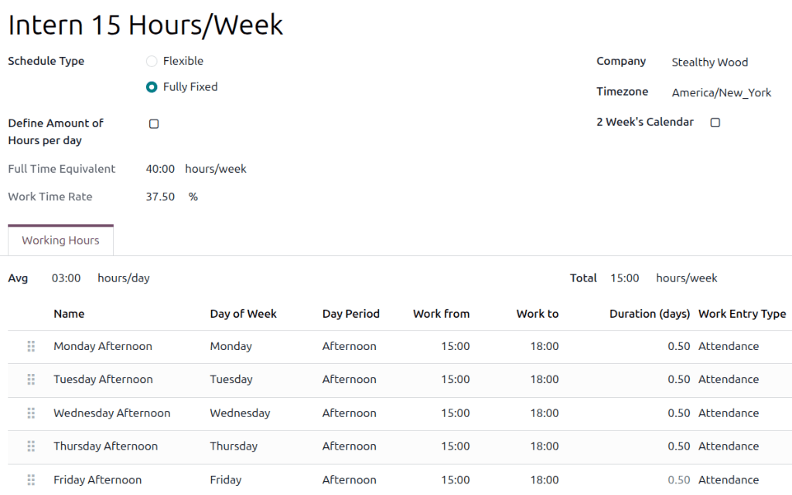
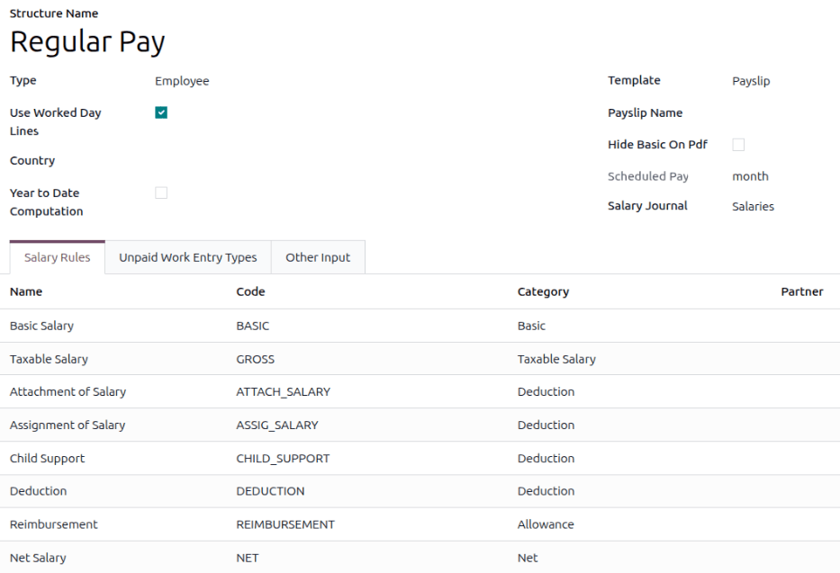
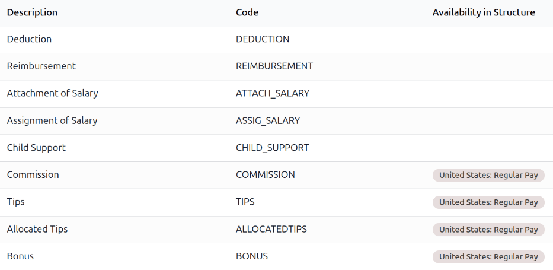

========
Salaries
========

In Odoo, salaries are calculated and determined by six factors: salary :ref:`structure types
<payroll/salaries/structure-types>`, salary :ref:`structures <payroll/salaries/structures>`,
:doc:`rules <salary_rules>`, :ref:`rule parameters <payroll/salary_rules/rule-parameters>`,
:ref:`rule categories <payroll/salary_rules/rule-categories>`, and :ref:`salary input types
<payroll/salaries/salary-input-types>`. Together, these determine how each employee's pay is
calculated.

Each *structure type* contains one or more *structures* within it. Each *structure* contains a set
of *rules*, and every *rule* uses *parameters* and *categories* to define how specific amounts are
calculated. Additional salary inputs, such as bonuses or deductions, can also be included to adjust
the final salary.

When payslips are calculated, Odoo calculates the employee's worked time from their :doc:`work
entries <work_entries>`, then applies the relevant structure, rules, and parameters from the
employee's assigned structure type to determine their total pay.

.. _payroll/salaries/structure-types:

Structure types
===============

In Odoo, a *structure type* groups related salary structures. When a contract specifies a structure
type, **only** the structures within that type are used to calculate the employee's pay. Each
structure type houses individual structures within them, each containing a set of rules for
processing a timesheet entry.

Structure types define key aspects of payroll configuration, including how often employees are paid,
their working hours, the default salary structure, and whether wages are fixed (salary-based) or
variable (hourly-based).

.. example::
   A structure type called `Employee` contains two different structures within it: a `Regular Pay`
   structure which includes all the separate rules for processing regular pay, and an `End of Year
   Bonus` structure, which includes the rules **only** for the end of year bonus. Both belong to the
   same `Employee` structure type.

View existing *structure types* by navigating to :menuselection:`Payroll app --> Configuration -->
Structure Types`.

Two default structure types are preconfigured in Odoo: :guilabel:`Employee` and :guilabel:`Worker`.

Typically, :guilabel:`Employee` is used for salaried employees, which is why the :guilabel:`Wage
Type` is set to :guilabel:`Fixed Wage`. :guilabel:`Worker` is typically used for employees paid by
the hour, so the wage type is set to :guilabel:`Hourly Wage`.

.. note::
   If using a country-specific :doc:`payroll localization <payroll_localizations>`, it is
   recommended to use the structure in the corresponding country localization document.

.. _payroll/salaries/new-structure-type:

New structure type
------------------

If the default structure types do not meet the company's needs, go to :menuselection:`Payroll app
--> Configuration --> Structure Types` and click :guilabel:`New` to create a custom structure type.

.. warning::
   When creating a new salary structure type, ensure all local and national laws are accounted for.
   Confirm with the accounting department when configuring payroll structures, to ensure all
   requirements are met.

Proceed to enter the following information in the fields:

- :guilabel:`Structure Type`: Enter the name for the new structure type, such as `Employee` or
  `Worker`.
- :guilabel:`Country`: Select the country that the new structure type applies to from the drop-down
  menu.
- :guilabel:`Wage Type`: Select the wage type for the structure:

  - :guilabel:`Fixed Wage`: For salaried employees who receive the same wage every pay period.
  - :guilabel:`Hourly Wage`: For employees paid based on hours worked during a pay period.

- :guilabel:`Scheduled Pay`: Select the typical pay schedule for the new structure type using the
  drop-down menu. This indicates how often this specific type of structure is paid out.
- :guilabel:`Working Hours`: Select the working hours for the new structure type using the drop-down
  menu. All available working hours for the currently selected company appear in the drop-down menu.
  The default working hours are the :guilabel:`Standard 40 hours/week` option. If the needed working
  hours do not appear in the list, a :ref:`new set of working hours can be created
  <payroll/salaries/new-working-hours>`.
- :guilabel:`Pay Structure`: Select the pay structure that falls within the new structure type using
  the drop-down menu. This is used as the default option when generating payslips.
- :guilabel:`Work Entry Type`: Select the work entry type used to create all work entries for the
  employee.

.. _payroll/salaries/new-working-hours:

New working hours
-----------------

To make new working hours, type the name for the new working hours in the :guilabel:`Working Hours`
field on the new structure type form, then click :guilabel:`Create and edit`. A *Create Working
Hours* pop-up window loads. The form has two sections: a general information section, and a *Working
Hours* tab listing all the individual working hours by day and time. When the form is completed,
click :guilabel:`Save`.

- :guilabel:`Name`: Type in the name for the new working hours. This should be descriptive and clear
  to understand, such as `Standard 20 Hours/Week`.
- :guilabel:`Schedule Type`: Select whether the hours are :guilabel:`Flexible` or :guilabel:`Fully
  Fixed` by clicking the corresponding radio button. Selecting :guilabel:`Flexible` hides the
  *Working Hours* tab and some other fields in the general information section.
- :guilabel:`Define Amount of Hours per day`: Enable this option to base the schedule on a set
  amount of expected hours by day, instead of set start and end times for each day. When this option
  is modified, a *Confirmation* pop-up window appears. Click :guilabel:`Confirm` on the pop-up to
  make the change.
- :guilabel:`Full Time Equivalent`: The number of hours per week an employee needs to work to be
  considered a full-time employee. Typically, this is approximately 40 hours, and this number
  affects what types of benefits an employee can receive, based on their employment status
  (full-time vs. part-time). This field is **not** able to be modified.
- :guilabel:`Work Time Rate`: This percentage is auto-generated based on the configured times in the
  *Working Hours* tab, compared to the :guilabel:`Full Time Equivalent`. This number should be
  between `0.00%` and `100%`, so if the percentage is above `100%`, it is an indication that the
  working times may need adjustment.
- :guilabel:`Company`: Select the company that can use the new default working hours using the
  drop-down menu. Leave this field blank if the hours are available for all companies.
- :guilabel:`Timezone`: Select the time zone to be used for the new working hours using the
  drop-down menu.
- :guilabel:`2 Week's Calendar`: Enable this checkbox to switch from a one-week calendar to a
  two-week calendar. When this option is modified, a *Confirmation* pop-up window appears. Click
  :guilabel:`Switch` on the pop-up to make the change. When enabled, the presented tabs change from
  a single *Working Hours* tab to two tabs: *Week 1 Working Hours* and *Week 2 Working Hours*.

  .. important::
     Switching the calendar between either method removes **all** current work entries.

- *Working Hours* tab: This tab is where each day's specific working hours are listed, including
  breaks. When a new working schedule is created, the *Working Hours* tab is pre-populated with a
  default 40-hour week, with each day divided into three timed sections.

  Each day includes a morning shift (8:00-12:00), a lunch break (12:00-13:00), and an afternoon
  shift (13:00-17:00), configured using a 24-hour time format.

  The average daily working hours are automatically calculated based on the schedule and appear in
  the :guilabel:`Avg` field, along with the :guilabel:`Total` hours for the week.

  To adjust any of these entries, click the desired field and modify the information using the
  drop-down menus or type the information in directly.

  Ensure the :guilabel:`Work Entry Type` field is configured for each line. This ensures the
  **Payroll** app properly calculates all work entries.

  .. note::
     Working hours are company-specific, and cannot be shared between companies.

  .. tip::
     If the :guilabel:`2 Week's Calendar` option is enabled, ensure the various working hours for
     both tabs (*Week 1 Working Hours* and *Week 2 Working Hours*) are correctly configured.

.. _payroll/salaries/structures:

Structures
==========

*Salary structures* are the different situations in which an employee could be paid within a
specific *structure*, and are specifically defined by various rules.

The number of structures a company needs for each structure type depends on how many different ways
employees are paid, and how their pay is calculated. A common example of an additional structure is
a `Bonus`.

To view all the various structures for each structure type, go to :menuselection:`Payroll app -->
Configuration --> Structures`.

Each :ref:`structure type <payroll/salaries/structure-types>` lists the various structures
associated with it. Each structure contains a set of rules that define it.

Odoo comes with two salary structures preconfigured: :guilabel:`Regular Pay`, housed within the
:guilabel:`Employee` structure type, and :guilabel:`Worker Pay`, housed within the
:guilabel:`Worker` salary structure type.

Click on a structure to view its :guilabel:`Salary Rules`. These rules define how the payslip will
be computed for the employee.

.. note::
   After installing a :doc:`payroll localization <payroll_localizations>`, relevant structures are
   installed and appear in this list.

.. _payroll/salaries/salary-input-types:

Salary input types
==================

When creating payslips, it is sometimes necessary to add other entries for specific circumstances,
like tips, commissions, expenses, or deductions. These other inputs can be found by navigating to
:menuselection:`Payroll app --> Configuration --> Salary Input Types`. All universal and
localization-specific salary input types appear in the list.

         a payslip.

If a new input type is needed that does not appear on the list, click the :guilabel:`New` button to
create a new salary input type. Enter the :guilabel:`Description`, the :guilabel:`Code`, and select
which structure it applies to in the :guilabel:`Availability in Structure` field.

Enable the :guilabel:`Available in adjustments` checkbox if the input should be a salary adjustment.

.. important::
   The :guilabel:`Code` is used in the salary rules to compute payslips. If the
   :guilabel:`Availability in Structure` field is left blank, it indicates that the new input type
   is available for all payslips and is not exclusive to a specific structure.
