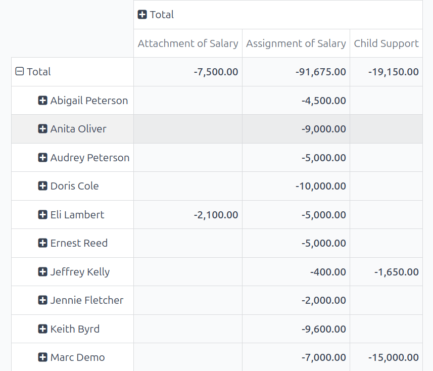
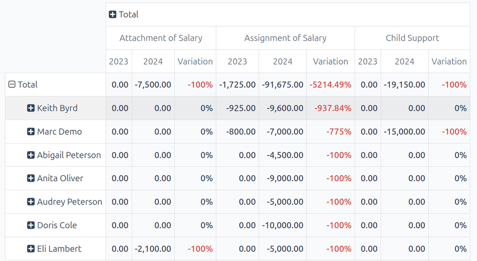

========================
Salary attachment report
========================

*Salary attachments* in Odoo refer to a portion of an employee's earnings that are designated for
a specific purpose, both voluntary and involuntary. These can include contributions to a retirement
plan, repayment of a loan, wage garnishments, or child support.

Voluntary salary attachments, such as repaying a loan, or contributing to a charity on a monthly
basis, are considered *Assignments of Salary* in Odoo. Salary attachments that are required, such as
a lawsuit settlement repayment, or repaying a tax lien, are considered *Attachments of Salary* in
Odoo. Child support payments have their own category, and are simply referred to as *Child Support*
in Odoo.

To view this report, navigate to :menuselection:`Payroll app --> Reporting --> Salary Attachment
Report`. The :guilabel:`Salary Attachment Report` shows all deductions or allocations per employee,
organized by payslip, in a default pivot table. The default filter is the end of the current year
(:guilabel:`Payslip End Date: (year)`). The employees populate the rows, while the various
deductions populate the columns, organized by type of deduction, and further grouped by individual
payslip.

The default report contains **all** payslips for the current year, so the report typically contains
a large number of columns. This could make it difficult to view all the data at once, as the report
may be very wide and require scrolling to view all the data.

To view a condensed version of salary attachments, and have all the salary attachment columns
visible on one page, click the :icon:`fa-minus-square-o` :guilabel:`Total` icon at the top of the
report, above the various payslips.

This presents the salary attachments for the current year, and only displays three columns,
:guilabel:`Attachment of Salary`, :guilabel:`Assignment of Salary`, and :guilabel:`Child Support.`

Each entry displays the total amount paid for each specific type of salary attachment, for each
employee.

The report can be downloaded as an XLSX file, or :doc:`inserted into a spreadsheet
<../../productivity/spreadsheet/insert>` using the corresponding buttons at the top.

Click the :guilabel:`Measures` button to reveal the options of what data is displayed.
:guilabel:`Assignment of salary`, :guilabel:`Attachment of salary`, and :guilabel:`Child support`
are all selected and visible, by default, while the :guilabel:`Count` option is not.

Click an option to either show or hide that particular metric. A :icon:`fa-check`
:guilabel:`(checkmark)` icon indicates the data is visible.

Compare to previous year
========================

The :guilabel:`Salary Attachment Report` can be compared to the report for the previous time period
or the previous year.

To view these comparisons, click the :icon:`fa-caret-down` :guilabel:`(down arrow)` icon in the
search bar, then click either :guilabel:`Payslip End Date: Previous Period` or :guilabel:`Payslip
End Date: Previous Year`, beneath the :icon:`fa-adjust` :guilabel:`Comparison` column.

The report updates and displays the current time period values, and the previous time period values,
as well as the :guilabel:`Variation` between the two, in a percentage.

