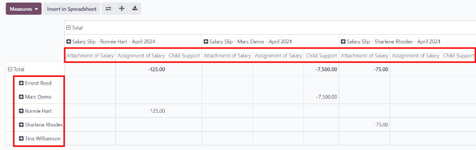

========================
Salary attachment report
========================

*Salary attachments* in Odoo refer to a portion of an employee's earnings that are earmarked for
something, both voluntary and involuntary. These can include things like contributions to a
retirement plan, repayment of a loan, wage garnishments, or child support.

The *Salary Attachment Report* shows all deductions or allocations per employee,

To view this report, navigate to :menuselection:`Payroll
app --> Reporting --> Salary Attachment Report`.

The employees are listed in the left-side column, while the different deductions are listed in the
top row, organized by deduction and monthly individual payslips.

The report can be exported as an XLSX file, or inserted into a spreadsheet, using the corresponding
buttons at the top.

Click the :guilabel:`Measures` button to reveal the options of what data can be displayed.
:guilabel:`Assignment of salary`, :guilabel:`Attachment of salary`, :guilabel:`Child support`, and
:guilabel:`Count` can all be selected or deselected by clicking on the item. If an item has a
checkmark next to it, that information is displayed.

.. image:: salary_attachment/attachment-measures.png
   :align: center
   :alt: Select the options to be displayed in the Salary Attachment Report.

The :guilabel:`Salary Attachment Report` can be compared to the report for the previous time period
or the previous year. To view these comparisons, click the :guilabel:`⬇️ (down arrow)` icon in the
search bar to reveal the various :ref:`filter <payroll/filters>` and grouping options.

In the section titled :guilabel:`Comparison`, click on either :guilabel:`Payslip End Date: Previous
Period` or :guilabel:`Payslip End Date: Previous Year`. The report updates and displays the
previous time period values, as well as the :guilabel:`Variation` between the two.
