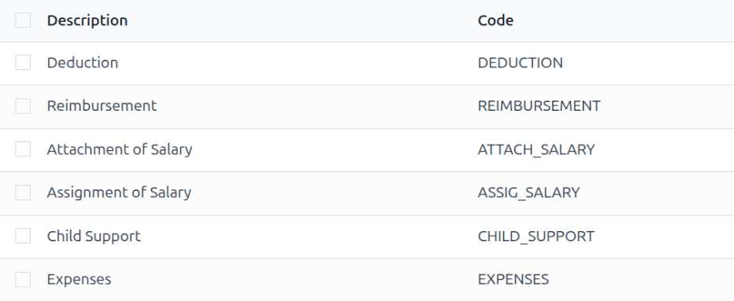
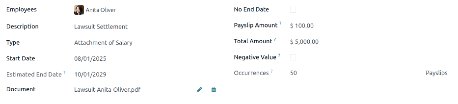

==================
Salary attachments
==================

Salary attachments are portions of earnings taken directly out of a payslip for a specific purpose,
whether voluntary or required.

When the deduction is voluntary, they are typically considered *deductions*. When the deduction is
court-ordered, or involuntary, it is sometimes referred to as a *wage garnishment*. In Odoo, these
are all universally called, *salary attachments*.

Note that salary attachments could also be used to give recurring amount of money to employees.
Like bonus divided in multiple parts.

.. _payroll/salary-attachment/types:

Salary attachment types
=======================

To view the currently configured salary attachment types, navigate to :menuselection:`Payroll app
--> Configuration --> Salary Attachment Types`. The default salary attachment types are:
:guilabel:`Attachment of Salary`, :guilabel:`Assignment of Salary`, and :guilabel:`Child Support`.

Each salary attachment type displays the :guilabel:`Name` of the attachment type, the
:guilabel:`Code` used when calculating payslips, a checkbox to indicate if there is :guilabel:`No
End Date`, and whether it is :guilabel:`Country` specific (or universal).

Create new salary attachment types
----------------------------------

.. danger::
   Upon installation of the **Payroll** application, the pre-configured default salary attachment
   types are linked to a variety of rules that are linked to various salary structures, as well as
   the installed :ref:`localization package <fiscal_localizations/packages>`.

   It is **not** recommended to alter or modify **any** of the preconfigured salary attachment
   types, especially if they have been previously used on payslips in the database. Doing so may
   affect various salary rules, and can prevent the creation of payslips.

   A new salary attachment type *can* be created, but this should only be done when absolutely
   necessary. A salary attachment type needs to be linked to a salary rule in order to be considered
   in the salary computation.

To make a new type of salary attachment, click the :guilabel:`New` button, and a blank
:guilabel:`Salary Attachment Types` form loads. Enter the :guilabel:`Name` for the new salary
attachment type in the corresponding field. Next, enter the :guilabel:`Code` used in the salary
rules to compute payslips. Last, tick the :guilabel:`No End Date` checkbox if this salary attachment
never expires.

If in a multi-company database, with locations in multiple countries, a :guilabel:`Country` field
also appears on the :guilabel:`Salary Attachment Types` form. Select the country the attachment
applies to, or leave blank if it is universal.

.. _payroll/salary-attachment/create:

Create a salary attachment
==========================

All salary attachments must be configured separately for each employee, for each type of salary
attachment. To view the currently configured salary attachments, navigate to :menuselection:`Payroll
app --> Contracts --> Salary Attachments`.

All salary attachments appear in a default list view, and displays the name of the
:guilabel:`Employees`, :guilabel:`Description`, the salary attachment :guilabel:`Type`, the
:guilabel:`Monthly Amount`, :guilabel:`Start Date`, and current :guilabel:`Status`.

To create a new salary attachment, click the :guilabel:`New` button in the top-left corner, and a
blank :guilabel:`Salary Attachment` form loads. Enter the following information on the form:

- :guilabel:`Employees`: Using the drop-down menu, select the desired employees. Multiple employees
  can be listed in this field.
- :guilabel:`Description`: Enter a short description of the salary attachment.
- :guilabel:`Type`: Using the drop-down menu, select the specific :ref:`salary attachment type
  <payroll/salary-attachment/types>`.
- :guilabel:`Start Date`: Using the calendar selector, select the date the salary attachment goes
  into effect.
- :guilabel:`Estimated End Date`: This field is **not** modifiable, and **only** appears after the
  :guilabel:`Monthly Amount` field is populated. This field is the estimated date when the salary
  attachment will be completed. Today's date populates the field by default. Then, when the
  :guilabel:`Total Amount` field is populated, this date is updated.
- :guilabel:`Document`: If any documentation is needed, such as a court order, click the
  :guilabel:`Upload your file` button, and a file explorer window loads. Select the desired document
  to attach it to the record. Only **one** document can be attached to a salary attachment.
- :guilabel:`Monthly Amount`: Enter the amount taken out of each paycheck every month in this field.
- :guilabel:`Total Amount`: This field **only** appears if the :ref:`salary attachment type
  <payroll/salary-attachment/types>` has no end date (the :guilabel:`No End Date` option is
  **not** ticked.)

Since the salary attachment form auto saves as the fields are populated, after making a salary
attachment for an individual employee, there is no further action required.

If creating salary attachments for multiple employees on a single salary attachment form, after the
form is filled out, click the :guilabel:`Create Individual Attachments` button. This creates
separate salary attachments for each of the employees listed in the :guilabel:`Employees` field.

After the separate salary attachments have been created, the screen returns to the :guilabel:`Salary
Attachment` dashboard, but with a :guilabel:`Description` filter, populated with the description
filled in on the salary attachment form. All the salary attachments have a status of
:guilabel:`Running`, since they are currently active. Clear the filter in the search box to view the
default :guilabel:`Salary Attachment` dashboard in its entirety.

Manage salary attachments
=========================

Salary attachments can have one of three statuses: *Running*, *Completed*, or *Cancelled*. To view
the current status of all salary attachments, navigate to :menuselection:`Payroll app --> Contracts
--> Salary Attachments`.

All salary attachments appear in the order they were configured. To view the salary attachments by
a particular metric, such as the :guilabel:`Status`, or :guilabel:`Type`, click on the column title
to sort by that specific column.

Completed salary attachments
----------------------------

When a salary attachment is created, it has a status of :guilabel:`Running`. Once the salary
attachment is finished (the *Total Amount* entered on the :ref:`salary attachment form
<payroll/salary-attachment/create>` has been paid in full), the status automatically changes to
*Completed*, and the employee no longer has the money taken out of future paychecks.

If a salary attachment has been fulfilled, but has not automatically changed to *Completed*, the
record can be manually updated. To change the status, open the *Salary Attachment* dashboard by
navigating to :menuselection:`Payroll app --> Contracts --> Salary Attachments`.

Click on the record to update, and the detailed :guilabel:`Salary Attachment` form loads. On the
individual :guilabel:`Salary Attachment` record, click the :guilabel:`Mark as Completed` button in
the upper-left corner, and the status changes to :guilabel:`Completed`.

.. example::
   The following is an example of when a payroll manager may need to manually change a salary
   attachment from :guilabel:`Active` to :guilabel:`Completed`.

   Rose Smith has a salary attachment for a lawsuit settlement, where she is required to pay
   $3,000.00. A salary attachment is created that takes $250.00 a month out of Rose's paycheck, to
   go towards this settlement payment.

   After six months, Rose has paid $1,500.00 from her salary. She received a tax refund, and uses
   the money to pay off the remainder of the lawsuit settlement. After sending the relevant
   documentation to the payroll manager, showing the settlement has been paid in full, the payroll
   manager manually changes the status of her salary attachment to :guilabel:`Completed`.

Cancel salary attachments
-------------------------

Any salary attachment can be cancelled at any time. To cancel a salary attachment, click on the
individual attachment record from the main :guilabel:`Salary Attachment` dashboard to open the
record. From the :guilabel:`Salary Attachment` record, click the :guilabel:`Cancel` button to cancel
the salary attachment, and stop having the designated money taken out of future paychecks.

.. seealso::
   :doc:`salary_attachment`
