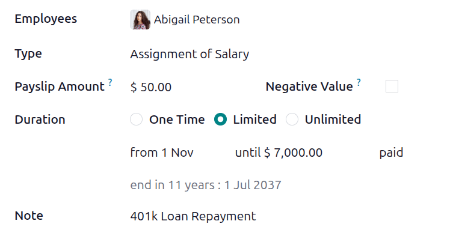
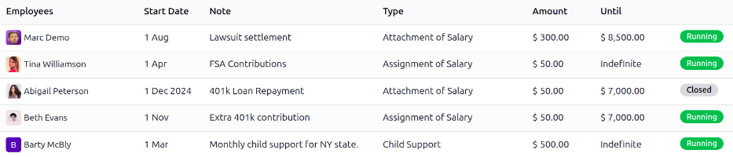

==================
Salary adjustments
==================

Salary adjustments are portions of earnings taken directly out of a payslip for a specific purpose,
whether voluntary or required.

When the deduction is voluntary, they are typically considered *deductions*. When the deduction is
court-ordered, or involuntary, it is sometimes referred to as a *wage garnishment*. In Odoo, these
are all universally called *salary adjustments*.

Note that salary adjustments can also be used to give recurring amounts of money to employees, like
a bonus divided into multiple payments.

.. _payroll/salary-adjustment/types:

Salary adjustment types
=======================

To view the currently configured salary adjustment types, navigate to :menuselection:`Payroll app
--> Configuration --> Other Input Types`. This displays *all* other salary inputs, not only the
various salary adjustments.

The three default salary adjustment types that appear in this list are: :guilabel:`Attachment of
Salary`, :guilabel:`Assignment of Salary`, and :guilabel:`Child Support`.

Each salary adjustment type displays the :guilabel:`Name` of the adjustment type, and the
:guilabel:`Code` used when calculating payslips.

.. image:: salary_attachments/adjustment-types.png
   :alt: The default salary adjustment types.

Create new salary adjustment types
----------------------------------

.. danger::
   Upon installation of the **Payroll** application, the preconfigured default salary adjustment
   types are linked to a variety of rules that are linked to various salary structures, as well as
   the installed :ref:`localization package <fiscal_localizations/packages>`.

   It is **not** recommended to alter or modify **any** of the preconfigured salary adjustment
   types, especially if they have been previously used on payslips in the database. Doing so may
   affect various salary rules, and can prevent the creation of payslips.

   A new salary adjustment type *can* be created, but this should only be done when absolutely
   necessary. A salary adjustment type **must** be linked to a salary rule to be considered in the
   salary computation.

To make a new type of salary adjustment, click the :guilabel:`New` button, and a blank
:guilabel:`Payslip Other Input Types` form loads. Enter the :guilabel:`Description` for the new
salary adjustment type in the corresponding field. Next, tick the :guilabel:`Available in
adjustments` checkbox, indicating it is available to use as a salary adjustment. Enter the
:guilabel:`Code` used in the salary rules to compute payslips. Lastly, if the salary adjustment type
should **only** be used in a specific payroll structure, use the drop-down menu in the
:guilabel:`Available in Structure` field, and select the specific structure.

.. _payroll/salary-adjustment/create:

Create a salary adjustment
==========================

All salary adjustments must be configured separately for each employee, for each type of salary
adjustment. To view the currently configured salary adjustments, navigate to :menuselection:`Payroll
app --> Employees --> Salary Adjustments`.

All salary adjustments appear in a default list view, and displays the name of the
:guilabel:`Employees`, the :guilabel:`Start Date`, a descriptive :guilabel:`Note`, the salary
adjustment :guilabel:`Type`, and the :guilabel:`Amount`. An :guilabel:`Until` column appears as
well, which details when the salary adjustment ends, either a monetary amount to be reached, or
:guilabel:`Indefinite` if the adjustment has no end.

At the end of each line is a status tag, with a green :guilabel:`Running` tag for active
adjustments, or :guilabel:`Closed` for adjustments that have ended.

To create a new salary adjustment, click the :guilabel:`New` button in the top-left corner, and a
blank :guilabel:`Salary Adjustment` form loads. Enter the following information on the form:

- :guilabel:`Employees`: Using the drop-down menu, select the desired employees. Multiple employees
  can be listed in this field.
- :guilabel:`Type`: Using the drop-down menu, select the specific :ref:`salary adjustment type
  <payroll/salary-adjustment/types>`.
- :guilabel:`Payslip Amount`: Enter the amount taken out of each paycheck in this field.
- :guilabel:`Negative Amount`: Tick this checkbox if the salary adjustment is taken into account as
  a negative value.
- :guilabel:`Duration`: Select the length of time for the salary adjustment. The options are:

  - :guilabel:`One Time`: Only one payment is taken from the employee's paycheck.
  - :guilabel:`Limited`: The employee is paying a specific monetary amount in total, divided up
    among multiple paychecks.
  - :guilabel:`Unlimited`: The employee is making recurring payments towards something with no end
    point, such as contributions to a retirement fund, or a donation to a charity.
  - :guilabel:`from`: Using the calendar selector, select the date the salary adjustment goes into
    effect.

  .. note::
     If the :guilabel:`Duration` field is set to :guilabel:`Limited`, an :guilabel:`until (amount)
     paid` field appears. Enter the monetary amount that must be reached, before the salary
     adjustment ends.

- :guilabel:`Note`: Enter a short description of the salary adjustment.

Since the salary adjustment form auto-saves as the fields are populated, after making a salary
adjustment for an individual employee, there is no further action required.

If creating salary adjustments for multiple employees on a single salary adjustment form, after the
form is filled out, click the :guilabel:`Create Individual Attachments` button. This creates
separate salary adjustments for each of the employees listed in the :guilabel:`Employees` field.

After the separate salary adjustments have been created, the screen returns to the :guilabel:`Salary
Adjustment` dashboard, but with a :guilabel:`Note` filter, populated with the information filled in
the :guilabel:`Note` field on the salary adjustment form. All the salary adjustments have a status
of :guilabel:`Running`, since they are currently active. Clear the filter in the search box to view
the default :guilabel:`Salary Adjustment` dashboard in its entirety.

Manage salary adjustments
=========================

Salary adjustments can have one of two statuses, *Running* or *Closed*. To view the current status
of all salary adjustments, navigate to :menuselection:`Payroll app --> Employees --> Salary
Adjustments`.

All salary adjustments appear in chronological order, by :guilabel:`Start Date`, with the most
recent appearing at the top. To view the salary adjustments by a particular metric, such as the
:guilabel:`Status`, or :guilabel:`Type`, click on the column title to sort by that specific column.

Closed salary adjustments
-------------------------

When a salary adjustment is created, it has a status of :guilabel:`Running`. Once the salary
adjustment is finished (the *Until* amount entered on the :ref:`salary adjustment form
<payroll/salary-adjustment/create>` has been paid in full), the status automatically changes to
*Closed*, and the employee no longer has money taken out of future paychecks.

If a salary adjustment has been fulfilled, but has not automatically changed to *Closed*, the record
can be manually updated. To change the status, open the *Salary Adjustment* dashboard by navigating
to :menuselection:`Payroll app --> Employees --> Salary Adjustments`.

Click on the record to update, and the detailed :guilabel:`Salary Adjustment` form loads. On the
individual :guilabel:`Salary Adjustment` record, click the :guilabel:`Mark as Completed` button in
the upper-left corner, and the status changes to :guilabel:`Closed`.

.. example::
   The following is an example of when a payroll manager may need to manually change a salary
   adjustment from :guilabel:`Running` to :guilabel:`Closed`.

   Rose Smith has a salary adjustment for a lawsuit settlement, where she is required to pay
   $3,000.00. A salary adjustment is created that takes $250.00 a month out of Rose's paycheck, to
   go towards this settlement payment.

   After six months, Rose has paid $1,500.00 from her salary. She receives a tax refund, and uses
   the money to pay off the remainder of the lawsuit settlement. After sending the relevant
   documentation to the payroll manager, showing the settlement has been paid in full, the payroll
   manager manually changes the status of her salary adjustment to :guilabel:`Closed`.
