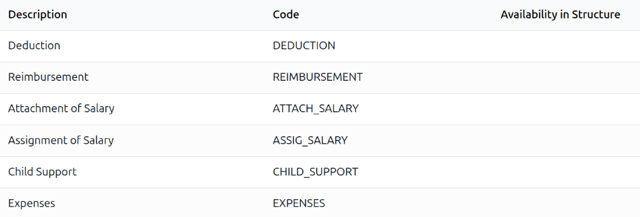
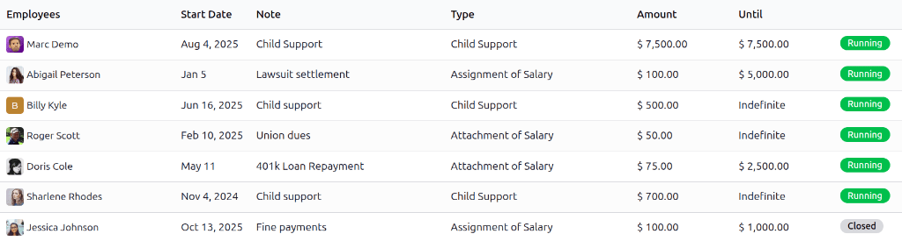
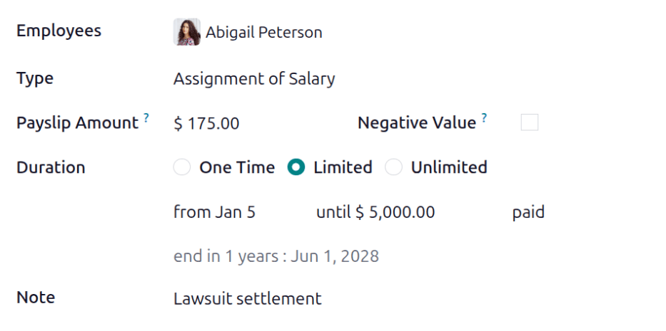

==================
Salary adjustments
==================

Salary adjustments are portions of earnings taken directly out of a payslip for a specific purpose,
whether voluntary or required.

When the deduction is voluntary, they are typically considered *deductions*. When the deduction is
court-ordered, or involuntary, it is sometimes referred to as a *wage garnishment*. In Odoo, these
are all universally called *salary adjustments*.

Note that salary adjustments can also be used to give recurring amounts of money to employees, like
a bonus divided into multiple payments.

.. _payroll/salary-adjustment/types:

Salary adjustment types
=======================

To view the currently configured salary adjustment types, navigate to :menuselection:`Payroll app
--> Configuration --> Salary Input Types`, and the *Salary Input Types* dashboard loads. This
displays *all* other salary inputs, not only the various salary adjustments.

The three default salary adjustment types and uses that appear in this list are:

- :guilabel:`Attachment of Salary`: Used primarily for voluntary regular payments from the
  employee's wages, such as paying into a savings program, charity contributions, union dues, etc.
- :guilabel:`Assignment of Salary`: Used primarily for legally enforceable orders requiring part of
  an employee's wages to be paid to another party. This is typically used when repaying debts,
  court-ordered judgements, etc.
- :guilabel:`Child Support`: Used for any child support payments.

Each salary adjustment type displays the :guilabel:`Description` of the adjustment type and the
:guilabel:`Code` used when calculating payslips. If it is restricted to a specific salary structure,
it is listed in the :guilabel:`Availability in Structure` column.

Create new salary adjustment types
----------------------------------

.. danger::
   Upon installation of the **Payroll** application, the preconfigured default salary adjustment
   types are linked to a variety of rules that are linked to various salary structures, as well as
   the installed :ref:`localization package <fiscal_localizations/packages>`.

   It is **not** recommended to alter or modify **any** of the preconfigured salary adjustment
   types, especially if they have been previously used on payslips in the database. Doing so may
   affect various salary rules, and can prevent the creation of payslips.

   A new salary adjustment type *can* be created, but this should only be done when absolutely
   necessary. A salary adjustment type **must** be linked to a salary rule to be considered in the
   salary computation.

To make a new type of salary adjustment, click the :guilabel:`New` button on the *Salary Input
Types* dashboard, and a blank *Salary Input Types* form loads. Configure the following fields on the
form:

- :guilabel:`Description`: Enter a decription for the new salary adjustment type.
- :guilabel:`Available in adjustments`: Enable this option to indicate the input type is available
  to use as a *salary adjustment*.
- :guilabel:`Is quantity?`: Leave this option unchecked, as it removes the ability to enter a set
  monetary amount.
- :guilabel:`No end date by default`: Enable this option if the adjustment is indefinite, such an
  attachment to pay regular fees such as dues or licenses. Do not select this if the adjustment is
  based on a total amount that must be reached, such as a court settlement repayment.
- :guilabel:`Code`: Enter a code to be used in the salary rules to compute payslips.
- :guilabel:`Available in Structure`: If the salary adjustment type should **only** be used in a
  specific payroll structure, use the drop-down menu to select the structure.

.. _payroll/salary-adjustment/dashboard:

Salary adjustment dashboard
===========================

To view the currently configured salary adjustments, navigate to :menuselection:`Payroll app -->
Employees --> Salary Adjustments`, and the *Salary Adjustment* dashboard loads.

All salary adjustments appear in a list view, in chronological order by :guilabel:`Start Date`, with
the most recent appearing at the top. Each salary adjustment displays the name of the
:guilabel:`Employees`, the :guilabel:`Start Date`, a descriptive :guilabel:`Note`, the salary
adjustment :guilabel:`Type`, and the :guilabel:`Amount`. An :guilabel:`Until` column appears as
well, which details when the salary adjustment ends, either a monetary amount to be reached, or
:guilabel:`Indefinite` if the adjustment has no end.

At the end of each line is a status tag, with a green :guilabel:`Running` tag for active
adjustments, or a gray :guilabel:`Closed` tag for adjustments that have ended.

.. _payroll/salary-adjustment/create:

Create salary adjustments
=========================

To create a new salary adjustment, click the :guilabel:`New` button on the :ref:`Salary Adjustment
dashboard <payroll/salary-adjustment/dashboard>` and a blank *Salary Adjustment* form loads. Enter
the following information on the form:

- :guilabel:`Employees`: Select the desired employees using the drop-down menu. Multiple employees
  can be listed in this field **only** if all the other field values are identical.
- :guilabel:`Type`: Select the specific :ref:`salary adjustment type
  <payroll/salary-adjustment/types>` using the drop-down menu.
- :guilabel:`Payslip Amount`: Enter the amount taken out of each paycheck in this field.
- :guilabel:`Negative Amount`: Enable this checkbox if the salary adjustment is taken into account
  as a negative value.
- :guilabel:`Duration`: Select the length of time for the salary adjustment. The options are:

  - :guilabel:`One Time`: Only one payment is taken from the employee's paycheck.
  - :guilabel:`Limited`: The employee is paying a specific monetary amount in total, divided up
    among multiple paychecks. The salary adjustment automatically ends once the specified total is
    paid.
  - :guilabel:`Unlimited`: The employee is making recurring payments towards something with no end
    point, such as contributions to a retirement fund, or a donation to a charity.
  - :guilabel:`from`: Using the calendar selector, select the date the salary adjustment goes into
    effect.

  .. note::
     If the :guilabel:`Duration` field is set to :guilabel:`Limited`, an :guilabel:`until (amount)
     paid` field appears. Enter the monetary amount that must be reached to end the salary
     adjustment.

- :guilabel:`Note`: Enter a short description of the salary adjustment.

If creating salary adjustments for multiple employees on a single salary adjustment form, after the
form is filled out, click the :guilabel:`Create Individual Attachments` button. This creates
separate salary adjustments for each of the employees listed in the :guilabel:`Employees` field.

After the individual salary adjustments have been created for multiple employees, the screen loads
a list view of the newly created individual salary adjustments. All the salary adjustments have a
status of :guilabel:`Running`, since they are currently active.

Manage salary adjustments
=========================

Salary adjustments that have a set amount due in total are automatically closed once the *Until*
amount entered on the :ref:`salary adjustment form <payroll/salary-adjustment/create>` has been paid
in full. For all other salary adjustments, it is necessary to manually close the adjustment to stop
taking money out of future paychecks.

If a salary adjustment has been fulfilled or the employee no longer wishes to contribute voluntary
funds, the record must be manually updated. To change the status, open the *Salary Adjustment*
dashboard by opening the :ref:`Salary Adjustment dashboard <payroll/salary-adjustment/dashboard>`

Click on the record to update, and the detailed *Salary Adjustment* form loads. On the individual
record, click the :guilabel:`Mark as Completed` button in the corner, and the status changes to
:guilabel:`Closed`.

.. example::
   The following is an example of when a payroll manager may need to manually change a salary
   adjustment from :guilabel:`Running` to :guilabel:`Closed`.

   Rose Smith has a salary adjustment for a lawsuit settlement, where she is required to pay
   $3,000.00. A salary adjustment is created that takes $250.00 a month out of Rose's paycheck, to
   go towards this settlement payment.

   After six months, Rose has paid $1,500.00 from her salary. She receives a tax refund, and uses
   the money to pay off the remainder of the lawsuit settlement. After sending the relevant
   documentation to the payroll manager, showing the settlement has been paid in full, the payroll
   manager manually changes the status of her salary adjustment to :guilabel:`Closed`.
