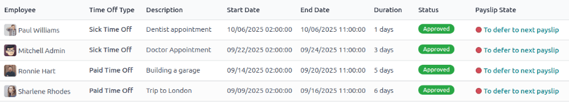
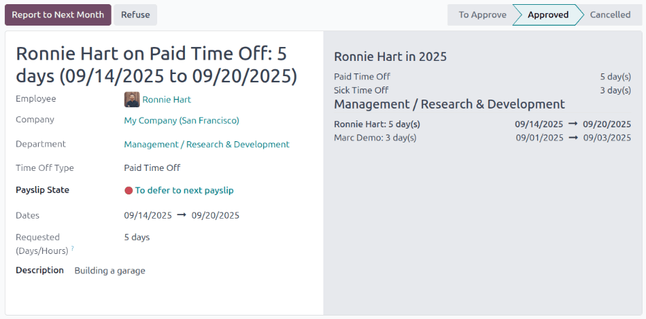

==================
Time off to report
==================

Payroll is often processed a few days before the end of a pay period, so that employees can be paid
in a timely manner. When work schedules are predictable, this method often works. However, sometimes
employees take time off unexpectedly, especially sick time. When this occurs, there can be
discrepancies in payroll that must be addressed.

.. example::
   The payroll department for a medium-sized company processes paychecks every two weeks, on
   Wednesdays. Each employee is paid on the Friday after.

   One employee is sick on the last Thursday and Friday of the two-week pay period. Since they have
   automatically generated work entries based on their working schedule, and payroll is processed on
   Wednesdays, the paycheck they receive incorrectly states that they were paid for a regular work
   day for all ten days of the two-week pay period.

   Instead of cancelling the paycheck and reissuing it, causing delays for the employee and more
   work for the payroll department, Odoo allows for the deferral of the time off taken, to the
   following pay period.

   This ensures all time off balances are correct, and the employee is properly compensated for
   their time.

.. _payroll/time-off-dashboard:

Time off dashboard
==================

When time off requests are submitted for a time period that was already processed on a payslip, the
time off requests appear in the *Time Off* page of the **Payroll** app. To access this, navigate to
:menuselection:`Payroll app --> Work Entries --> Time Off to Report`.

The :guilabel:`Time Off` page default filter is :guilabel:`To Defer`, and displays all requests with
a :guilabel:`Payslip State` of :guilabel:`To defer to next payslip`. This is because the employee
was *already paid* for that time as worked time, and it was logged as regular time spent at work.

Defer multiple time off entries
===============================

In order to keep the employee's time off balances correct, the time off request **must** be applied
to the following pay period. This not only ensures time off request balances are current, it also
eliminates the need to redo work entries, cancel paychecks, and reissue paychecks.

To select the work entries to defer, tick the box to the left of the work entry line on the
:ref:`Time Off page <payroll/time-off-dashboard>`. To select all work entries in the list, tick the
box to the left of the :guilabel:`Employee` column title, at the top of the list.

Once any work entry is selected, two buttons appear at the top of the report: a :guilabel:`(#)
selected` button, and an :icon:`fa-gear` :guilabel:`Actions` button. The :guilabel:`(#) selected`
button indicates how many entries are currently selected.

When all the desired work entries are selected, click the :icon:`fa-gear` :guilabel:`Actions`
button, and a menu appears with several choices. Click :guilabel:`Defer to Next Month` in the list,
and all selected entries are deferred to the following month.

Defer individual time off entries
=================================

Time off requests appearing on the :ref:`Time Off page <payroll/time-off-dashboard>` can be deferred
individually. Click on an individual time off request, and the details for that request load.

The specific details for the time off request appear on the left-hand side, and all of the
employee's submitted time off requests appear on the right-hand side (including the request in the
details on the left-hand side).

To defer the time off request to the next payslip, click the :guilabel:`Report to Next Month` button
in the upper-left corner. Once processed, the :guilabel:`Report to Next Month` button disappears,
and the :guilabel:`Payslip State` changes from :guilabel:`To defer to next payslip` to
:guilabel:`Computed in Current Payslip`.

