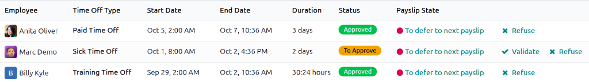

=========
Time offs
=========

Since the **Payroll** app calculates pay based on employees' worked time and time off, a *Time Off*
dashboard is available to view all time off records. From this dashboard, requests can be aproved or
refused, ensuring payroll is correctly calculated.

.. _payroll/time-off-dashboard:

Time off dashboard
==================

When time off requests are submitted for a time period that was already processed on a payslip, the
time off requests appear in the *Time Off* page of the **Payroll** app. To access this, navigate to
:menuselection:`Payroll app --> Work Entries --> Time OffS`.

The :guilabel:`Time Off` page default filter is :guilabel:`To Defer`, and displays all requests with
a :guilabel:`Payslip State` of :guilabel:`To defer to next payslip`. This is because the employee
was *already paid* for that time as worked time, and it was logged as regular time spent at work.

Review time off
===============

All time off requests awaiting approval or validation appear with a striped background.
