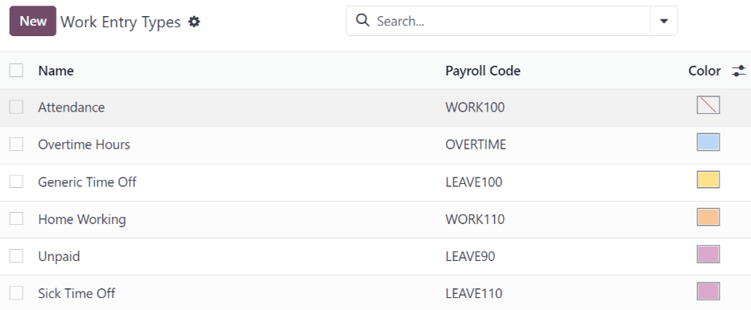
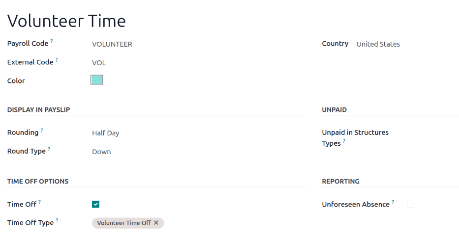

============
Work entries
============

A *work entry* is an individual record on an employee's timesheet. Work entries can be configured to
account for all types of work and time off, such as :guilabel:`Attendance`, :guilabel:`Sick Time
Off`, :guilabel:`Training`, or :guilabel:`Public Holiday`.

The **Payroll** app automatically creates work entries based on the employee's :ref:`salary
structure type <payroll/structure-types>`, and from the **Planning**, **Attendances**, and **Time
Off** applications. When needed, work entries can also be :ref:`created manually
<payroll/new-work-entry>`.

Work entries provide the **Payroll** app with the worked hours used to compute employee paychecks,
if the employee's salary is based on work entries, as opposed to a salaried position.

.. note::
   Odoo configures several work entry types by default, but :ref:`additional work entry types can be
   created <payroll/work-entry-types>`, when necessary.

.. _payroll/work-entry-dashboard:

Work entry dashboard
====================

The *Work Entries* dashboard of the **Payroll** app provides a visual overview of the individual
work entries for every employee.

To open the dashboard, navigate to :menuselection:`Payroll app --> Work Entries --> Work Entries`.

On the :guilabel:`Work Entry` dashboard, work entries appear in alphabetical order, based on the
first name of the employees. The entire month is displayed, with the current day highlighted in pale
yellow.

The :guilabel:`Work Entry` dashboard has a default :guilabel:`Conflicting` filter, which displays
only work entries with :ref:`conflicts <payroll/conflicts>` to be resolved.

.. image:: work_entries/work-entries-overview.png
   :alt: Conflicts dashboard view showing all employee's conflicts in work entries.

.. tip::
   Remove the default :guilabel:`Conflicting` filter from the search bar to view *all* work entries.

.. _payroll/new-work-entry:

Add a new work entry
====================

If a work entry is missing, such as sick time, or if an employee forgot to clock in and out for a
shift, a new work entry must be created for the missing shift.

Click :guilabel:`New` on the :ref:`work entry dashboard <payroll/work-entry-dashboard>`, and a blank
:guilabel:`Create` work entry pop-up form appears. Enter the following information on the form:

- :guilabel:`Description`: Enter a short description for the work entry, such as `Sick Time`. The
  default entry is `Attendance: (Employee)`.
- :guilabel:`Employee`: Select the employee the work entry is for, using the drop-down menu.
- :guilabel:`Work Entry Type`: Select the :guilabel:`Work Entry Type` using the drop-down menu.
- :guilabel:`From` and :guilabel:`To`: Enter the start (:guilabel:`From`) and end (:guilabel:`To`)
  dates and times for the work entry.

  First, click on either the :guilabel:`From` or :guilabel:`To` line to reveal a calendar pop-up
  window. Select the date by navigating to the correct month, then click on the specific day to
  select it.

  Next, select the time, by clicking on either the hour or minute fields at the bottom of the
  calendar, and set the desired time.

  When the date and time for the entry are correct, click the :guilabel:`Apply` button.
- :guilabel:`Duration`: This field displays the hours based on the :guilabel:`To` and
  :guilabel:`From` entries. Modifying this field modifies the :guilabel:`To` field (the
  :guilabel:`From` field does not change).

Once the desired information is entered, click :guilabel:`Save & Close` to save the entry, and close
the pop-up form.

.. image:: work_entries/create.png
   :alt: Filling in the work entry Create form in Odoo.

.. _payroll/conflicts:

Conflicts
=========

A conflict occurs when a request has not been approved, such as sick time or vacation, or if there
are any errors on the work entry. Conflicts that span the current pay period being processed
**must** be resolved before payslips can be generated.

Any work entry that has a conflict to be resolved is indicated on the main :guilabel:`Work Entry`
dashboard, which can be accessed by navigating to :menuselection:`Payroll app --> Work Entries -->
Work Entries`. Only conflicts needing resolution are shown by default.

Conflicts are indicated with an orange triangle in the top-left corner of each individual work
entry. Click on an individual work entry to see the date and time for the specific work entry, then
click :guilabel:`Edit` to view the conflict details in a pop-up window.

.. image:: work_entries/conflict-pop-up.png
   :alt: A row of conflicts, with one entry showing details for the conflict.

The conflict is briefly explained in an orange text box in the :guilabel:`Open` pop-up window that
appears.

The :guilabel:`Description`, :guilabel:`Employee`, and :guilabel:`Work Entry Type` are listed on the
left side of the pop-up window. The :guilabel:`From` and :guilabel:`To` date and time range, as well
as the total time (in hours) in the :guilabel:`Duration` field, appears on the right side.

Time off conflicts
------------------

The most common work entry conflicts are for time off requests. Odoo automatically generates work
entries for specific time periods. When time off is requested after these work entries are
generated, it results in duplicate work entries for that employee (one for time off and another for
regular work).

If there is a conflict because a time off request is in the system for the same time that a regular
work entry already exists, the time off request is entered in a :guilabel:`Time Off` field.

Conflicts can be resolved either directly on the work entry or in the detailed time off request
form.

.. _payroll/time-off-work-entry:

Resolve on work entry
~~~~~~~~~~~~~~~~~~~~~

If no additional details are needed to determine if a time off request should be approved or
refused, the time off conflict can be resolved directly from the work entry pop-up window.

Click either the :guilabel:`Refuse Time Off` or :guilabel:`Approve Time Off` buttons to refuse or
approve the time off request, then the two buttons disappear. Click the :guilabel:`Save & Close`
button to close the pop-up window.

The conflict disappears from the :guilabel:`Work Entry` dashboard, since the conflict is now
resolved.

.. image:: work_entries/conflict-details.png
   :alt: The detailed conflict pop-up window that appears when the Edit button is clicked.

.. note::
   If the time off is approved, the status of the work entry conflict changes to
   :guilabel:`Cancelled`. If the time off is refused, the status changes to :guilabel:`Draft`.

.. _payroll/time-off-request-form:

Resolve on time off request
~~~~~~~~~~~~~~~~~~~~~~~~~~~

If more details are needed to make a decision about the time off request, hover over the entry in
the :guilabel:`Time Off` field, and click the :icon:`fa-external-link` :guilabel:`(Internal Link)`
icon that appears at the end of the line. This causes an :guilabel:`Open: Time Off` pop-up window to
load, with all the time off request details. Click either the :guilabel:`Approve` or
:guilabel:`Refuse` buttons to approve or refuse the request.

To resolve the time off conflict on the detailed time off request pop-up window, click the
:guilabel:`Internal Link` button at the end of the :guilabel:`Time Off` entry line, and the time off
request details appear in a new pop-up window. The request can be modified, if needed.

Click the :guilabel:`Approve` button to approve the request, then click the :guilabel:`Save & Close`
button to save the changes, and go back to the work entry conflict pop-up window.

.. image:: work_entries/entry-details.png
   :alt: The detailed time off request information.

Now, the :guilabel:`Approve Time Off` button is hidden, only the :guilabel:`Refuse Time Off` button
is visible.

If the approval was a mistake, the request can be refused here, by clicking the :guilabel:`Refuse
Time Off` button.

Since the time off was approved in the time off window, click the :guilabel:`X` in the top-right
corner to close the window. The conflict disappears from the :guilabel:`Work Entry` dashboard, since
it has been resolved.

.. _payroll/regenerate-work-entries:

Regenerate work entries
=======================

After conflicts are resolved, the affected work entries must be regenerated. This recreates the
specified work entries, and overwrites the previously conflicting work entries.

While :ref:`conflicts <payroll/conflicts>` *can* be resolved individually, if the conflicts are
caused by another application, such as **Planning** or **Attendances**, it is best practice to
correct the record in the application causing the conflict. The reason this method is recommended is
because, if the issue in the related application is **not** resolved, when work entries are
regenerated, the conflicts reappear.

First, ensure the issues are resolved in the specific applications that caused the work entry
conflicts. Once the conflicts have been resolved in the corresponding apps, open the work entry
dashboard by navigating to :menuselection:`Payroll app --> Work Entries --> Work Entries`.

Click the :guilabel:`Regenerate Work Entries` button at the top of the :guilabel:`Work Entries`
dashboard, and a :guilabel:`Work Entry Regeneration` pop-up window appears.

Select the :guilabel:`Employees` to regenerate work entries for, using the drop-down menu. Adjust
the :guilabel:`From` and :guilabel:`To` fields, so the correct date range is displayed.

Click the :guilabel:`Regenerate Work Entries` button, and the work entries are recreated. Once
finished, the pop-up window closes.

.. image:: work_entries/regenerate-details.png
   :alt: Regenerate a work entry for a particular employee.

.. example::
   An employee has incorrect work entries generated from the **Planning** app because they were
   incorrectly assigned to two work stations simultaneously. This should be fixed in the
   **Planning** app, instead of the **Payroll** app.

   To correct this issue, modify the employee's schedule in the **Planning** app, so they are
   correctly assigned to only one work station. Then, in the **Payroll** app, regenerate work
   entries for that employee, for that specific time period.

   The **Payroll** app then pulls the new, corrected data form the **Planning** app, and recreates
   the correct work entries for that employee. All conflicts for that employee are now resolved.

.. _payroll/work-entry-types:

Work entry types
================

When :ref:`creating a work entry <payroll/new-work-entry>` in the **Payroll** application, or when a
new time off type is created in the **Time Off** application, a work entry *type* needs to be
selected.

The **Payroll** app comes with nine preconfigured work entry types, and depending on the installed
:doc:`payroll localization <payroll_localizations>`, additional country-specific work entries may be
configured. If there is a need for additional work entry types, they can be :ref:`created
<payroll/new-work-entry-type>`.

To view the current work entry types available, navigate to :menuselection:`Payroll app -->
Configuration --> Work Entries --> Work Entry Types`.

Each work entry type has a code to aid in the creation of payslips, and to ensure all taxes and fees
are correctly entered.

.. note::
   Depending on the installed localization, other sections and fields may appear on the form.

.. _payroll/new-work-entry-type:

New work entry type
-------------------

To create a new work entry type, go to :menuselection:`Payroll app --> Configuration --> Work
Entries --> Work Entry Types` and click :guilabel:`New`. Then, enter the information for the
following sections on the form.

General information section
~~~~~~~~~~~~~~~~~~~~~~~~~~~

- :guilabel:`Work Entry Type Name`: Enter a name for the work entry type. It should be short and
  descriptive, such as `Sick Time` or `Training`.
- :guilabel:`Payroll Code`: Enter a code for the work entry type. This code appears with the work
  entry type on timesheets and payslips. Since the code is used in conjunction with the
  **Accounting** application, it is advised to check with the accounting department for a code to
  use.
- :guilabel:`External Code`: Enter a code to use for exporting data to a third-party payroll
  service. Check with the third-party being used to determine the :guilabel:`External Code` to enter
  for the new work entry type.
- :guilabel:`Color`: Select a color for the particular work entry type. This color appears on the
  work entry dashboard to aid in identifying work entry types.

.. note::
   The **only** required fields for a work entry type is the :guilabel:`Work Entry Type Name` and
   the :guilabel:`Payroll Code`.

Display in payslip section
~~~~~~~~~~~~~~~~~~~~~~~~~~

- :guilabel:`Rounding`: Select how the time entered for the work entry should be rounded. The
  rounding method selected determines how the worked time on timesheet entries are calculated. The
  options are:

  - :guilabel:`No Rounding`: Work entries are not modified.
  - :guilabel:`Half Day`: Work entries are rounded to the closest half day amount.
  - :guilabel:`Day`: Work entries are rounded to the closest full day amount.

- :guilabel:`Rounding Type`: If either :guilabel:`Half Day` or :guilabel:`Day` is selected in the
  :guilabel:`Rounding` field, this field appears. Select either :guilabel:`Up` or :guilabel:`Down`
  to determine how the rounding is handled.

.. example::
   The working time is set to an 8-hour work day (a 40-hour work week). An employee enters a time of
   5.5 hours on a work entry.

   If the :guilabel:`Rounding` is set to :guilabel:`No Rounding`, the work entry remains at 5.5
   hours.

   If the :guilabel:`Rounding` is set to :guilabel:`Half Day`, and the :guilabel:`Rounding Type` is
   set to :guilabel:`Down`, the work entry is changed to 4 hours. If the :guilabel:`Rounding Type`
   is set to :guilabel:`Up`, the work entry is changed to 8 hours.

   If the :guilabel:`Rounding` is set to :guilabel:`Day`, and the :guilabel:`Rounding Type` is set
   to :guilabel:`Down`, the work entry is changed to zero hours. If the :guilabel:`Rounding Type` is
   set to :guilabel:`Up`, the work entry is changed to 8 hours.

Unpaid section
~~~~~~~~~~~~~~

- :guilabel:`Unpaid in Structures Types`: If the work entry type is for work that is *not paid*,
  specify which pay structure the unpaid work entry type applies to, using the drop-down menu. Some
  situations where work is logged on a payslip, but no compensation is given, such as unpaid
  internships, unpaid training, or volunteer work.

Time off options section
~~~~~~~~~~~~~~~~~~~~~~~~

- :guilabel:`Time Off`: Tick this box if the work entry type can be selected for a time off request
  or time off entry, in the **Time Off** application.

  If :guilabel:`Time Off` is active, a :guilabel:`Time Off Type` field appears. This field has a
  drop-down menu to select the specific types of time off, such as `Paid Time Off`, `Sick Time Off`,
  or `Extra Hours`. Select the :guilabel:`Time Off Type` associated with the work entry type.

- :guilabel:`Keep Time Off Right`: Tick this checkbox if the work entry type associated with the
  selected time off type allows for rolling over unused time off to the following year.

Reporting section
~~~~~~~~~~~~~~~~~

- :guilabel:`Unforeseen Absence`: Tick this box if the work entry type should be visible on the
  unforeseen absences report.

.. seealso::
   :doc:`payslips`

   :doc:`batches`
