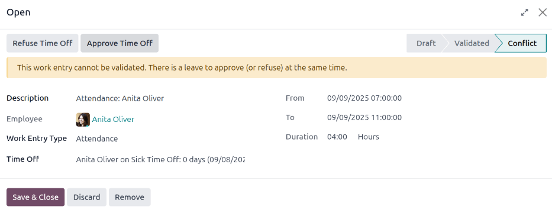

============
Work entries
============

The **Payroll** app automatically creates work entries based on the employee's :ref:`salary
structure type <payroll/structure-types>`, and from the **Planning**, **Attendances**, and **Time
Off** applications.

Work entries provide the **Payroll** app with the worked hours used to compute employee paychecks,
if the employee's salary is based on work entries, as opposed to a salaried position.

.. _payroll/work-entry-dashboard:

Work entry dashboard
====================

The *Work Entries* dashboard of the **Payroll** app provides a visual overview of the individual
work entries for every employee.

To open the dashboard, navigate to :menuselection:`Payroll app --> Work Entries --> Work Entries`.

On the :guilabel:`Work Entry` dashboard, work entries appear in alphabetical order, based on the
first name of the employees. The entire month is displayed, with the current day highlighted in pale
yellow.

The :guilabel:`Work Entry` dashboard has a default :guilabel:`Conflicting` filter, which displays
only work entries with :ref:`conflicts <payroll/conflicts>` to be resolved.

.. tip::
   Remove the default :guilabel:`Conflicting` filter from the search bar to view *all* work entries.

.. _payroll/adjust-view:

Adjust view
-----------

To change the view so that only the entries for a single day, week, month, quarter, or year are
shown, click the :icon:`fa-calendar` :guilabel:`(Month)(Year)` button. A drop-down menu appears with
the options of :guilabel:`Today`, :guilabel:`This week`, :guilabel:`This month`, :guilabel:`This
quarter`, or :guilabel:`This year`. Click on one of the options to only display data for that
specific selection.

Use the :icon:`oi-arrow-left` :guilabel:`(left arrow)` and :icon:`oi-arrow-right` :guilabel:`(right
arrow)` buttons to adjust the displayed dates. The arrows adjust the date based on the type of time
selected.

For example, if :guilabel:`Month` is selected, the arrows move one month with each click of the
arrow. If :guilabel:`Week` or :guilabel:`Day` is selected, the time moves by either a week or a day
for each click of the arrow, respectively.

At any point, to return to a view containing the current day, click the :icon:`fa-crosshairs`
:guilabel:`(Focus Today)` button.

.. _payroll/new-work-entry:

Add a new work entry
====================

If a work entry is missing, such as sick time, or if an employee forgot to clock in and out for a
shift, a new work entry must be created for the missing shift.

Click :guilabel:`New` on the :ref:`work entry dashboard <payroll/work-entry-dashboard>`, and a blank
:guilabel:`Create` work entry pop-up form appears. Enter the following information on the form:

- :guilabel:`Description`: Enter a short description for the work entry, such as `Sick Time`. The
  default entry is `Attendance: (Employee)`.
- :guilabel:`Employee`: Select the employee the work entry is for, using the drop-down menu.
- :guilabel:`Work Entry Type`: Select the :ref:`work entry type <payroll/work-entries>` using the
  drop-down menu.
- :guilabel:`From` and :guilabel:`To`: Enter the start (:guilabel:`From`) and end (:guilabel:`To`)
  dates and times for the work entry.

  First, click on either the :guilabel:`From` or :guilabel:`To` line to reveal a calendar pop-up
  window. Select the date by navigating to the correct month, then click on the specific day to
  select it.

  Next, select the time, by clicking on either the hour or minute fields at the bottom of the
  calendar, and set the desired time.

  When the date and time for the entry are correct, click the :guilabel:`Apply` button.
- :guilabel:`Duration`: This field displays the hours based on the :guilabel:`To` and
  :guilabel:`From` entries. Modifying this field modifies the :guilabel:`To` field (the
  :guilabel:`From` field does not change).

Once the desired information is entered, click :guilabel:`Save & Close` to save the entry, and close
the pop-up form.

.. _payroll/conflicts:

Conflicts
=========

A conflict occurs when a request has not been approved, such as sick time or vacation, or if there
are any errors on the work entry. Conflicts that span the current pay period being processed
**must** be resolved before payslips can be generated.

Any work entry that has a conflict to be resolved is indicated on the main :guilabel:`Work Entry`
dashboard, which can be accessed by navigating to :menuselection:`Payroll app --> Work Entries -->
Work Entries`. Only conflicts needing resolution are shown by default.

Conflicts are indicated with an orange triangle in the top-left corner of each individual work
entry. Click on an individual work entry to see the date and time for the specific work entry, then
click :guilabel:`Edit` to view the conflict details in a pop-up window.

.. image:: work_entries/conflict-pop-up.png
   :alt: A row of conflicts, with one entry showing details for the conflict.

The conflict is briefly explained in an orange text box in the :guilabel:`Open` pop-up window that
appears.

The :guilabel:`Description`, :guilabel:`Employee`, and :guilabel:`Work Entry Type` are listed on the
left side of the pop-up window. The :guilabel:`From` and :guilabel:`To` date and time range, as well
as the total time (in hours) in the :guilabel:`Duration` field, appears on the right side.

Time off conflicts
------------------

The most common work entry conflicts are for time off requests. Odoo automatically generates work
entries for specific time periods. When time off is requested after these work entries are
generated, it results in duplicate work entries for that employee (one for time off and another
for regular work).

If there is a conflict because a time off request is in the system for the same time that a regular
work entry already exists, the time off request is entered in a :guilabel:`Time Off` field.

Conflicts can be resolved either directly on the work entry or in the detailed time off request
form.

.. _payroll/time-off-work-entry:

Resolve on work entry
~~~~~~~~~~~~~~~~~~~~~

If no additional details are needed to determine if a time off request should be approved or
refused, the time off conflict can be resolved directly from the work entry pop-up window.

Click either the :guilabel:`Refuse Time Off` or :guilabel:`Approve Time Off` buttons to refuse or
approve the time off request, then the two buttons disappear. Click the :guilabel:`Save & Close`
button to close the pop-up window.

The conflict disappears from the :guilabel:`Work Entry` dashboard, since the conflict is now
resolved.

.. note::
   If the time off is approved, the status of the work entry conflict changes to
   :guilabel:`Cancelled`. If the time off is refused, the status changes to :guilabel:`Draft`.

.. _payroll/time-off-request-form:

Resolve on time off request
~~~~~~~~~~~~~~~~~~~~~~~~~~~

If more details are needed to make a decision about the time off request, hover over the entry in
the :guilabel:`Time Off` field, and click the :icon:`fa-external-link` :guilabel:`(Internal Link)`
icon that appears at the end of the line. This causes an :guilabel:`Open: Time Off` pop-up window to
load, with all the time off request details. Click either the :guilabel:`Approve` or
:guilabel:`Refuse` buttons to approve or refuse the request.

To resolve the time off conflict on the detailed time off request pop-up window, click the
:guilabel:`Internal Link` button at the end of the :guilabel:`Time Off` entry line, and the time off
request details appear in a new pop-up window. The request can be modified, if needed.

Click the :guilabel:`Approve` button to approve the request, then click the :guilabel:`Save & Close`
button to save the changes, and go back to the work entry conflict pop-up window.

Now, the :guilabel:`Approve Time Off` button is hidden, only the :guilabel:`Refuse Time Off` button
is visible.

If the approval was a mistake, the request can be refused here, by clicking the :guilabel:`Refuse
Time Off` button.

Since the time off was approved in the time off window, click the :guilabel:`X` in the top-right
corner to close the window. The conflict disappears from the :guilabel:`Work Entry` dashboard, since
it has been resolved.

.. _payroll/regenerate-work-entries:

Regenerate work entries
=======================

After conflicts are resolved, the affected work entries must be regenerated. This recreates the
specified work entries, and overwrites the previously conflicting work entries.

While :ref:`conflicts <payroll/conflicts>` *can* be resolved individually, if the conflicts are
caused from another application, such as **Planning** or **Attendances**, it is best practice to
correct the record in the application causing the conflict. The reason this method is recommended is
because, if the issue in the related application is **not** resolved, when work entries are
regenerated, the conflicts reappear.

First, ensure the issues are resolved in the specific applications that caused the work entry
conflicts. Once the conflicts have been resolved in the corresponding apps, open the work entry
dashboard by navigating to :menuselection:`Payroll app --> Work Entries --> Work Entries`.

Click the :guilabel:`Regenerate Work Entries` button at the top of the :guilabel:`Work Entries`
dashboard, and a :guilabel:`Work Entry Regeneration` pop-up window appears.

Select the :guilabel:`Employees` to regenerate work entries for, using the drop-down menu. Adjust
the :guilabel:`From` and :guilabel:`To` fields, so the correct date range is displayed.

Click the :guilabel:`Regenerate Work Entries` button, and the work entries are recreated. Once
finished, the pop-up window closes.

.. image:: work_entries/regenerate-details.png
   :alt: Regenerate a work entry for a particular employee.

.. example::
   An employee has incorrect work entries generated from the **Planning** app because they were
   incorrectly assigned to two work stations simultaneously. This should be fixed in the
   **Planning** app, instead of the **Payroll** app.

   To correct this issue, modify the employee's schedule in the **Planning** app, so they are
   correctly assigned to only one work station. Then, in the **Payroll** app, regenerate work
   entries for that employee, for that specific time period.

   The **Payroll** app then pulls the new, corrected data form the **Planning** app, and recreates
   the correct work entries for that employee. All conflicts for that employee are now resolved.

.. seealso::
   :doc:`payslips`

   :doc:`batches`
