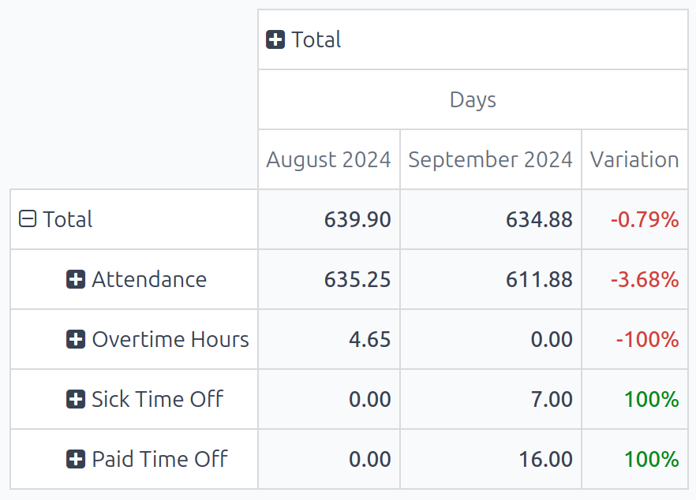
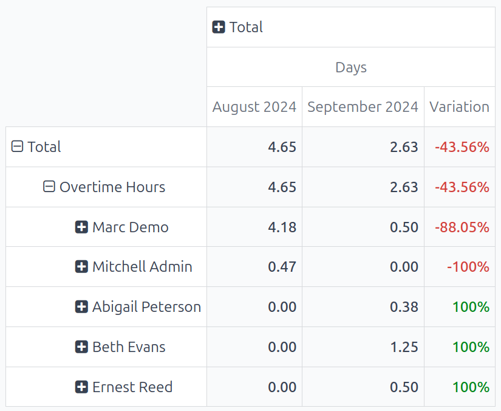

===================
Work entry analysis
===================

The default *Work Entries Analysis* report provides an overview of the validated work entries for
the current month. To view this report, navigate to :menuselection:`Payroll app --> Reporting -->
Work Entry Analysis`.

The work entries appear in a pivot table, with the default filters of :guilabel:`Current month:
(Month)(Year)` and :guilabel:`Validated`. The various types of :doc:`work_entries` populate the
rows, while the :guilabel:`Total` values populate the only visible column.

To change the displayed information, click :icon:`fa-plus-square` :guilabel:`Total` above the main
column, revealing a drop-down menu of available metrics. Click on one of the available groupings,
and the data is further organized by that selected metric. The default options are :guilabel:`Work
Entry Type`, :guilabel:`Employee`, and :guilabel:`Department`. If in a multi-company database, a
:guilabel:`Company` option also appears.

Work entry analysis comparison
==============================

It is possible to compare the work entries from one time period to a previous time period. To view
this comparison, first navigate to :menuselection:`Payroll app --> Reporting --> Work Entry
Analysis`.

Next, click the :icon:`fa-caret-down` :guilabel:`(down arrow)` icon in the search bar, revealing a
drop-down menu. Under the :icon:`fa-adjust` :guilabel:`Comparison` section, click on either
:guilabel:`Current Month: Previous Period` or :guilabel:`Current Month: Previous Year`.

The report updates and displays the data for the current time period, data for the selected previous
time period, as well as the :guilabel:`Variation` between the two, in a percentage.

.. note::
   If no work entries for a specific :ref:`work entry type <payroll/work-entries>` are logged for
   the time period, it does **not** appear on the report. That does **not** mean the work entry type
   does not exist, or is not configured.

   Additionally, if the default :guilabel:`Current month: (Month)(Year)` filter is removed from the
   search bar, the :guilabel:`Comparison` column does **not** appear; there must be a time-frame
   selected to view the :guilabel:`Comparison` column.

Use case: overtime report comparison
====================================

It is possible to alter the *Work Entries Analysis* report to show a comparison of only overtime
work entries, grouped by employee, for a specific time period. To view this data, first navigate to
the default *Work entry analysis* report by going to :menuselection:`Payroll app --> Reporting -->
Work Entry Analysis`.

Next, click the :icon:`fa-caret-down` :guilabel:`(down arrow)` icon in the search bar, revealing a
drop-down menu. Under the :icon:`fa-filter` :guilabel:`Filters` column, click :guilabel:`Add Custom
Filter`, and a :guilabel:`Add Custom Filter` pop-up window appears.

Using the drop-down menu, select :guilabel:`Work Entry Type` for the first field, leave the middle
field as-is (with :guilabel:`is in` populating the field), and select :guilabel:`Overtime Hours` for
the last field. Click :guilabel:`Add`, and all other work entry types disappear, and
:guilabel:`Overtime Hours` appear in the sole row.

To compare overtime from the current month to the previous month, to see which month had more
overtime logged, click the :icon:`fa-caret-down` :guilabel:`(down arrow)` icon again in the search
bar. Under the :icon:`fa-adjust` :guilabel:`Comparison` section, click :guilabel:`Current Month:
Previous Period`. Click away from the drop-down menu to close it.

Now, the report displays the :guilabel:`Overtime Hours` for the current month and the previous
month, along with the :guilabel:`Variation`, in a percentage.

To view which employees received the most overtime, click :icon:`fa-plus-square` :guilabel:`Overtime
Hours`, revealing a drop-down menu of options. Click :guilabel:`Employee`, and all employees with
overtime work entries for either the current or previous month appears.

In this example, it can be determined that :guilabel:`Marc Demo` worked the most overtime in
:guilabel:`August 2024`, whereas :guilabel:`Beth Evans` worked the most overtime hours in
:guilabel:`September 2024`. Additionally, :guilabel:`Mitchell Admin` had the largest variation
change, with a :guilabel:`-100%` change from :guilabel:`August 2024` to :guilabel:`September 2024`.

