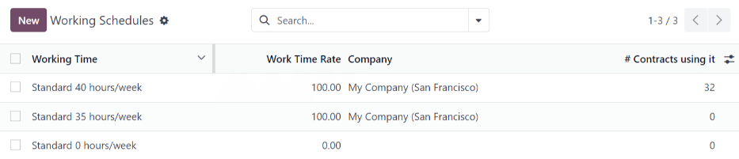
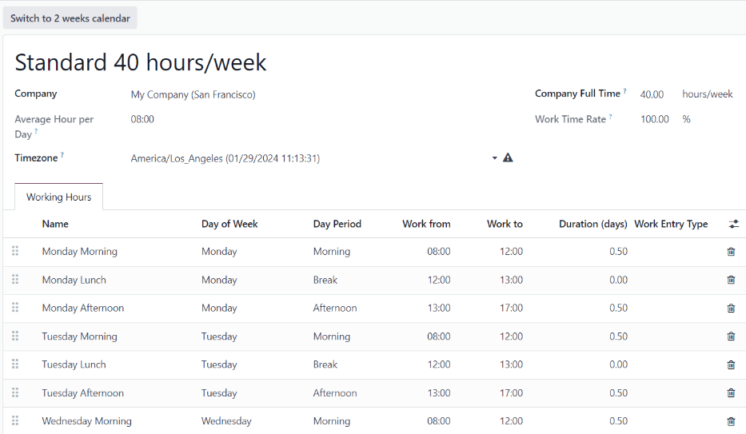

=================
Working schedules
=================

In Odoo, *working schedules* determine the hours employees are expected to work, according to their
:doc:`contract <contracts>`, and informs the **Payroll** app how to compute work entries, ultimately
affecting salaries and payslips. It is necessary to ensure all working schedules for employees are
configured in the database.

.. note::
   In Odoo's **Payroll** app, *working schedules* are referred to as *working hours* in :ref:`salary
   structures <payroll/structure-types>`.

To view the currently configured working schedules, navigate to :menuselection:`Payroll app -->
Configuration --> Working Schedules`, and the :guilabel:`Working Schedules` dashboard loads.

Working schedules are company-specific. In a multi-company database, each company **must** identify
each type of working schedule they use. If the database is created for only one company, the
:guilabel:`Company` column is not available.

.. example::
   An Odoo database containing multiple companies that use a standard 40-hour work week needs to
   have a separate working schedule entry for each company that uses the 40-hour standard work week.

   A database with five companies that all use a standard 40-hour work week needs to have five
   separate 40-hour working schedules configured.

.. _payroll/new-working-schedule:

New working schedule
====================

To create a new working schedule, navigate to :menuselection:`Payroll app --> Configuration -->
Working Schedules`, and click :guilabel:`New`. The :guilabel:`Working Schedules` form has two
sections, a general information section and a :guilabel:`Working Hours` tab listing out all the
individual working hours by day and time.

Fill out the following information on the top-half of the form:

- :guilabel:`Name`: Type in the name for the new default working schedule. This should be
  descriptive and clear to understand, such as `Standard 20 Hours/Week`.
- :guilabel:`Flexible Hours`: Tick this checkbox if employees can work different hours from the
  working schedule.
- :guilabel:`Company Full Time`: Enter the number of hours per week an employee would need to work
  to be considered a full-time employee. Typically, this is approximately 40 hours, and this number
  affects what types of benefits an employee can receive, based on their employment status
  (full-time vs part-time).
- :guilabel:`Average Hour Per Day`: The average hours per day field is auto-populated, based on the
  working hours configured in the :guilabel:`Working Hours` tab. This entry affects resource
  planning, since the average daily hours affect what resources can be used, and in what quantity,
  per workday.
- :guilabel:`Work Time Rate`: This percentage is auto-generated based on the entry for the
  :guilabel:`Company Full Time` and the working hours configured in the :guilabel:`Working Hours`
  tab. This number should be between `0.00%` and `100%`, so if the percentage is above `100%`, it is
  an indication that the working times and/or :guilabel:`Company Full Time` hours need adjustment.
- :guilabel:`Company`: Select the company that can use these new default working hours from the
  drop-down menu. A blank field indicates it is available for all companies.
- :guilabel:`Timezone`: Select the time zone to be used for the new default working hours from the
  drop-down menu.

Next, configure the individual hours in the :guilabel:`Working Hours` tab. This tab lists the
specific working hours for each day.

The :guilabel:`Working Hours` are auto-populated for a default 40-hour work week, with each day
divided into three timed sections.

Every day has morning (8:00-12:00), lunch (12:00-13:00), and evening (13:00-17:00) hours configured.

.. note::
   The :guilabel:`Work From` and :guilabel:`Work To` times **must** be in a 24-hour format. For
   example, `2:00 PM` is entered as `14:00`.

Modify the :guilabel:`Day of Week`, :guilabel:`Day Period`, and :guilabel:`Work Entry Type`
selections by clicking on the drop-down menus in each column and making the desired selection. The
:guilabel:`Work From` and :guilabel:`Work To` columns are modified by typing in the time.

.. important::
   Keep in mind, working hours are company-specific, and **cannot** be shared between companies.
   Each company needs to have its own working hours set.

.. tip::
   If the working hours are not consistent each week, and the hours are on a bi-weekly schedule
   instead, click the :guilabel:`Switch to 2 week calendar` button at the top of the new default
   working hours form. This changes the :guilabel:`Working Hours` tab to display two weeks of
   working times that can be adjusted.

