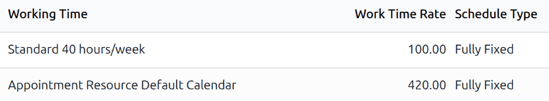
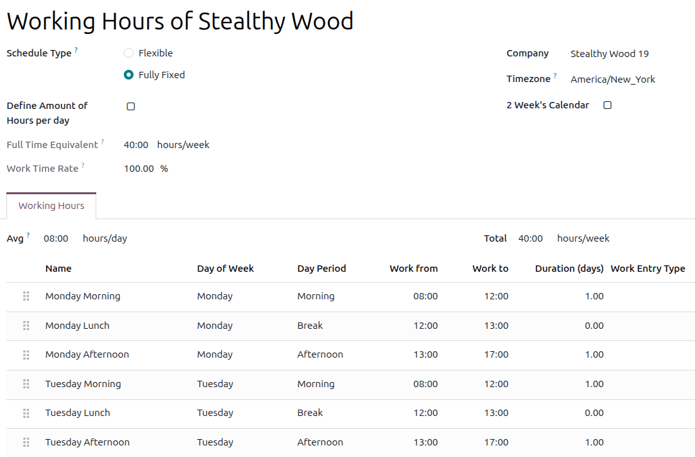

=================
Working schedules
=================

In Odoo, *working schedules* determine the hours employees are expected to work, according to their
:doc:`contract <contracts>`, and informs the **Payroll** app how to compute work entries, ultimately
affecting salaries and payslips. It is necessary to ensure all working schedules for employees are
configured in the database.

To view the currently configured working schedules, navigate to :menuselection:`Payroll app -->
Configuration --> Working Schedules`, and the *Working Schedules* dashboard loads.

.. note::
   In Odoo's **Payroll** app, *working schedules* are referred to as *working hours* in :ref:`salary
   structures <payroll/structure-types>`.

.. _payroll/new-working-schedule:

New working schedule
====================

To create a new working schedule, navigate to :menuselection:`Payroll app --> Configuration -->
Working Schedules`, click :guilabel:`New`, and a blank *Working Schedules* form lods. The form has
two sections, a general information section and a *Working Hours* tab listing out all the
individual working hours by day and time.

Fill out the following information on the top-half of the form:

- :guilabel:`Name`: Type in the name for the new default working schedule. This should be
  descriptive and clear to understand, such as `Standard 20 Hours/Week`. The palceholder name
  `Working Hours of (Company)` populates this field by default.
- :guilabel:`Schedule Type`: Click the radio button next to :guilabel:`Flexible` indicating a
  flexible schedule, or :guilabel:`Fully Fixed` for a set schedule with specific working hours. If
  :guilabel:`Flexible` is selected, the *Working Hours* tab is hidden.
- :guilabel:`Define Amount of Hours per day`: Enable this option to have specific start and end
  working times.
- :guilabel:`Full Time Equivalent`: The amount of hours an employee must work each week to be
  considered a full time employee. This field **cannot** be modified, and is determined by the
  country the company is located.
- :guilabel:`Work Time Rate`: The percentage of hours compared to the full time schedule. The
  percentage is auto-generated based on the :guilabel:`Full Time Equivalent` and the working hours
  configured in the *Working Hours* tab. This number should be between `0.00%` and `100%`, so if the
  percentage is above `100%`, it is an indication that the working times may need adjustment.
- :guilabel:`Company`: Select the company that can use these new default working hours from the
  drop-down menu. A blank field indicates it is available for all companies.
- :guilabel:`2 Week's Calendar`: Enable this option to switch form a one-week calendar to a two-week
  calendar. When enabled, two tabs appear: *Week 1 Working Hours* and *Week 2 Working Hours*.

Next, configure the individual hours in the *Working Hours* tab. This tab lists the specific working
hours for each day, including breaks.

The default presented working hours are for a 40-hour work week, with each day divided into three
timed sections. Every day has morning (8:00-12:00), lunch (12:00-13:00), and evening (13:00-17:00)
hours configured.

.. note::
   The :guilabel:`Work from` and :guilabel:`Work to` times **must** be in a 24-hour format. For
   example, `2:00 PM` is entered as `14:00`.

Update the :guilabel:`Name` of each shift, if desired. Modify the :guilabel:`Day of Week`,
:guilabel:`Day Period`, and :guilabel:`Work Entry Type` selections by clicking into the drop-down
menus in each column and making the desired selection. The :guilabel:`Work from`, and
:guilabel:`Work to` columns are modified by typing in the time.

.. tip::
   If the working hours are not consistent each week, and the hours are on a bi-weekly schedule
   instead, click the :guilabel:`Switch to 2 week calendar` button at the top of the new default
   working hours form. This changes the :guilabel:`Working Hours` tab to display two weeks of
   working times that can be adjusted.

