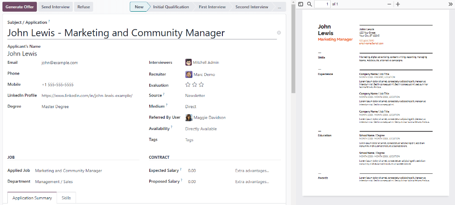
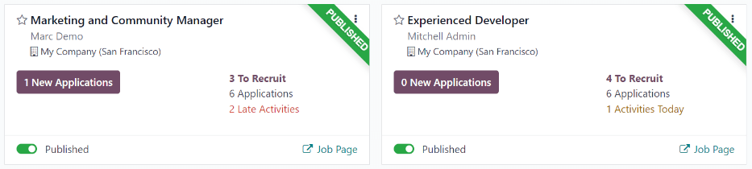
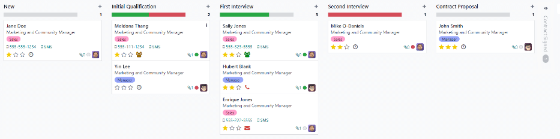
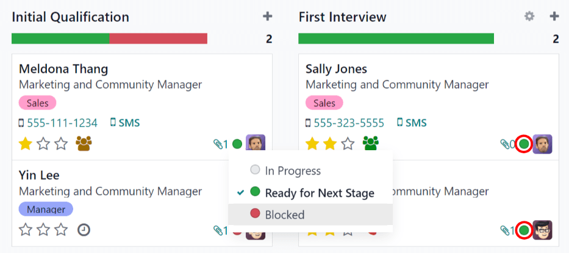
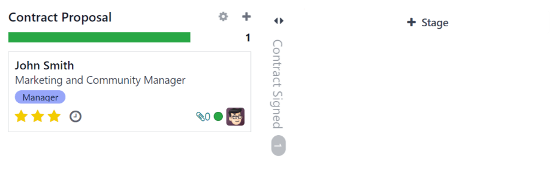
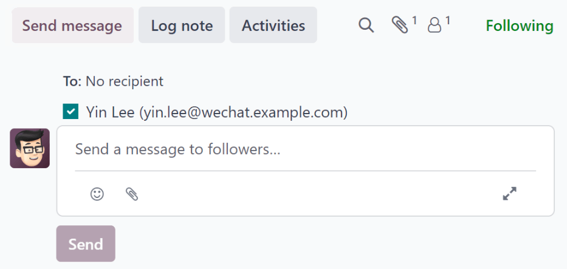
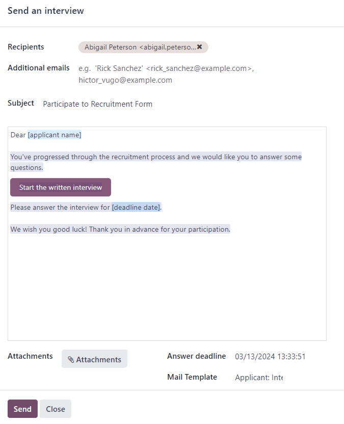

:show-content:

===========
Recruitment
===========

Odoo keeps all job applicants organized with a pre-configured series of steps and stages that each
applicant goes through. Each stage has a specific step(s) that should be performed. These range from
scheduling a phone call, conducting an interview, or sending a job offer, for example. This process
is referred to as the 'applicant flow.'

When an applicant applies for a job position, an *applicant card* is automatically created in Odoo's
*Recruitment* app for that specific job position. As the applicant progresses through the
recruitment pipeline, the recruitment team moves their card from one stage to the next.

:ref:`Stages can be configured <recruitment/modify-stages>` so that an email is automatically sent
out using a set, pre-configured template as soon as an applicant's card enters a stage. These
automated emails are defined on each stage in the applicant flow.

The applicant flow explained in this document is the default flow in Odoo, and goes through the
applicant flow when using the *Recruitment* application's default configuration. The applicant flow
is able to be modified to suit the specific recruitment flow for any business.

.. note::
   The applicant flow with all its stages are universal and applies to all job positions, unless
   specified. :ref:`A specific stage can be configured <recruitment/customize-stages>` to be
   job-specific, meaning that specific stage is only visible for that specific job position.
   Otherwise, if a new stage is created, or an existing stage is modified, those changes are
   visible on all job positions.

.. _recruitment/settings:

Settings
========

Before creating a job position in Odoo, configure the necessary settings for the *Recruitment* app.
To view and edit the settings, navigate to :menuselection:`Recruitment app --> Configuration -->
Settings`. After any changes are made, click the :guilabel:`Save` button in the top-left corner to
save all the changes.

Job posting
-----------

The :guilabel:`Job Posting` section of the *Recruitment* app settings has only one selection to
make. If job positions are to be posted to the company's website, enable the :guilabel:`Online
Posting` option.

.. note::
   The :guilabel:`Online Posting` is only available if the *Website* application is also installed.

Recruitment process
-------------------

The :guilabel:`Recruitment process` section of the settings page specifies what the database can and
cannot do during the recruitment process.

Send interview survey
~~~~~~~~~~~~~~~~~~~~~

Odoo is capable of having a survey sent to an applicant to gather more information about them.
Surveys can be thought of as exams, or questionnaires, and can be customized in various ways to
provide the recruitment team with valuable insights into the applicant

Enable the :guilabel:`Send Interview Survey` option to send surveys to applicants. Once enabled, an
:icon:`fa-arrow-right` :guilabel:`Interview Survey` internal link appears. Click the
:icon:`fa-arrow-right` :guilabel:`Interview Survey` link to navigate to a list of all created
surveys.

This list includes all surveys that were created in the database, not just surveys used in the
*Recruitment* app. If no surveys have been created, the surveys list displays a :guilabel:`No Survey
Found` message, and presents options to create a survey from several pre-configured survey
templates.

.. seealso::
   For more detailed information about surveys, refer to the :doc:`survey essentials
   <../marketing/surveys/create>` documentation.

.. note::
   Enabling the :guilabel:`Send Interview Survey` option will install the *Surveys* application once
   the settings are saved, if it is not installed already.

Send SMS
~~~~~~~~

It is possible to send text messages to applicants directly through the *Recruitment* app. To do so,
enable the :guilabel:`Send SMS` option. This option requires credits to use, which can be obtained
by clicking the :icon:`fa-arrow-right` :guilabel:`Buy credits` internal link that emerges when the
feature is enabled.

.. seealso::
   For more information, refer to the :doc:`SMS pricing and FAQs
   <../marketing/sms_marketing/pricing/pricing_and_faq>` documentation.

.. _recruitment/cv-display:

CV display
~~~~~~~~~~

When applicants submit an application, one of the default required fields is a resumé, or :abbr:`CV
(curriculum vitae)`. All resumés are stored in the *Documents* application, and are accessible on
the applicant's card.

A resumé has the option to appear on the applicant's form, which can be viewed by clicking on the
applicant's card. The resumé appears on the right-side of the screen. If this is not enabled, the
resumé is accessed via a link in the chatter, where it needs to be clicked to expand and view it, or
downloaded.

Enable the :guilabel:`CV Display` option to show the resumé on the applicant's card by default, and
in addition to the document link. When enabled, the resumé appears on the right side of the
applicant's card.

.. note::
   For the resumé to appear on the right-side, the browser window must be in full-screen mode (where
   the browser spans the entire screen).

   If the browser window is set to a size smaller than the entire width of the screen (not
   full-screen), then the resumé does not appear on the right-side. Instead, the resumé appears in
   the :guilabel:`Files` section of the chatter, below the applicant's card.

.. _recruitment/cv-ocr:

CV digitization (OCR)
~~~~~~~~~~~~~~~~~~~~~

When an application is submitted using any of the available methods, such as an online application
submission, emailing a resume to the job position alias, or creating an applicant record directly
from the database, it is possible to have Odoo extract the applicant's name, phone number, and email
address from the resumé and populate the applicant's form. To do so, enable the :guilabel:`CV
Digitization (OCR)` option.

When enabled, additional options appear. Click on the corresponding radio button to select one of
the following options:

- :guilabel:`Do not digitize`: this option turns off resumé digitization.
- :guilabel:`Digitize on demand only`: this option only digitizes resumes when requested. A
  :guilabel:`Digitize document` buttons appears on applicant cards. When clicked, the resumé is
  scanned and the applicant's card is updated.
- :guilabel:`Digitize automatically`: this option automatically digitizes all resumés when they are
  submitted.

Beneath these options are two additional links. Click the :icon:`fa-arrow-right` :guilabel:`Buy
credits` button to purchase credits for CV digitization. Click the :icon:`fa-arrow-right`
:guilabel:`View My Services` to view a list of all current services, and their remaining credit
balances.

For more information on document digitization and :abbr:`IAP's (in-app purchases)`, refer to the
:doc:`In-app purchase (IAP) <../essentials/in_app_purchase>` documentation.

.. note::
   The :guilabel:`Do not digitize` option for :guilabel:`CV digitization (OCR)` at first may seem
   like a redundancy. It seems to be the same as disabling the :guilabel:`CV digitization (OCR)`
   option.

   When the :guilabel:`CV digitization (OCR)` option is enabled, a module is installed so that
   resumés can be scanned. Disabling this option would uninstall the module.

   If at some point, there is a desire to temporarily stop digitizing resumés, the :guilabel:`Do not
   digitize` option is selected. The reason this option is available is so that the module is not
   uninstalled, allowing for digitization to be enabled in the future by selecting one of the other
   two options.

Salary package configurator
~~~~~~~~~~~~~~~~~~~~~~~~~~~

When sending an offer to an applicant, an expiration date can be set on the offer. Enter the number
of days an offer is valid for in the :guilabel:`days` field. After the set amount of days has
passed, if the applicant has not accepted the offer, the offer is no longer available.

Kanban view
===========

To access the Kanban view for a job position, navigate to the main :menuselection:`Recruitment app`
dashboard, which is the default view when opening the application. All job positions appear on the
main dashboard. Click the :guilabel:`(#) New Applications` smart button on a job position card to
navigate to the Kanban view for all the applicants for that particular job position.

Inside the job application, the Kanban stages appear, with all the applicants populated in their
respective columns, indicating what stage they are currently in. There are six default stages in
Odoo:

- :ref:`New <recruitment/new>`
- :ref:`Initial Qualification <recruitment/initial-qualification>`
- :ref:`First Interview <recruitment/first-interview>`
- :ref:`Second Interview <recruitment/second-interview>`
- :doc:`Contract Proposal <recruitment/offer_job_positions>`
- :ref:`Contract Signed <recruitment/offer_job_positions/contract-signed>`

The last column, :guilabel:`Contract Signed`, is folded by default. Folded columns appear gray, and
the applicants in it are hidden from view. To expand the folded stage and view the applicant cards
for that column, click anywhere on the thin gray column that says the stage name and the column
expands, revealing the applicants.

Each stage has a color-coded bar beneath the stage name, providing status information for the
applicant's in that specific stage. The status colors are:

- :guilabel:`Green`: the applicant is ready to move to the next stage.
- :guilabel:`Red`: the applicant is blocked from moving to the next stage.
- :guilabel:`Gray`: the applicant is still in progress in the current stage and is neither ready nor
  blocked from the next stage.

The status for each card is set manually. To set the status, click on the small circle in the
lower-left of the applicant card. A status pop-up window appears. Click on the desired status for
the applicant. The status dot on the applicant card as well as the status bar updates.

.. tip::
   The names for the three status colors (`In Progress`, `Blocked`, and `Ready for Next Stage`)
   :ref:`can be modified <recruitment/modify-stages>`, if desired.

.. _recruitment/customize-stages:

Customize stages
================

Stages can be modified, added, or deleted to best meet the needs of the particular hiring steps of
a business.

New stage
---------

To create a new stage, click on :icon:`fa-plus` :guilabel:`Stage` and a new column appears. Enter
the title for the new stage in the :guilabel:`Stage title` field, then click :guilabel:`Add`. The
new column appears, and another new stage is available to create. If no new stages are needed, click
anywhere on the screen to exit the new stage creation.

.. _recruitment/modify-stages:

Modify stage
------------

To modify the settings of a stage, hover over the name of the stage, and a :icon:`fa-cog`
:guilabel:`(gear)` icon appears in the upper right hand side of the stage. Click on the
:icon:`fa-cog` :guilabel:`(gear)` icon and a menu appears. Then click on the :guilabel:`Edit`
option. An :guilabel:`Edit: (Stage)` form appears. Make any desired modifications to the form, then
click :guilabel:`Save & Close` when done.

.. image:: recruitment/gear.png
   :align: center
   :alt: The gear icon that appears when a column name is moused over, and the drop-down menu it
         displays when clicked.

.. _recruitment/edit-stage:

Edit stage form
~~~~~~~~~~~~~~~

The :guilabel:`Edit: (Stage)` form is where the stage's settings are configured. The only required
field is the :guilabel:`Stage Name`.

The fields to be populated or modified are:

- :guilabel:`Stage Name`: type in a name for the stage.
- :guilabel:`Email Template`: select an email template to be used from the drop-down menu. If a
  template is selected, when the applicant card enters the stage, an email is automatically sent to
  the applicant using the selected template.
- :guilabel:`Folded in Kanban`: check the box to have the stage appear folded (hidden) at all times
  in the default view.
- :guilabel:`Hired Stage`: check the box if this stage indicates that the applicant is hired. When
  an applicant's card enters this stage, the card displays a :guilabel:`Hired` banner in the upper
  right corner. If this box is checked, this stage is used to determine the hire date of an
  applicant.
- :guilabel:`Job Specific`: if the stage only applies to specific job positions, select the job
  positions from the drop-down menu. Multiple job positions can be selected.
- :guilabel:`Show in Referrals`: check the box if this stage should be seen in the *Referrals*
  application, and allow the referrer to accrue points when a referral of theirs reaches this stage.
  If this is active, a :guilabel:`Points` field appears. Enter the amount of referral points the
  employee receives when an applicant enters this stage. The *Referrals* app must be installed in
  order to use this option.
- :guilabel:`Tooltips` section: there are three pre-configured status labels (colored circles) for
  each applicant's card, indicating its status. These colors are displayed at the top of each stage
  to reflect the statuses of the applicants in the stage. The *names* for the label can be modified,
  but the label itself (the color) cannot. The default names and labels are: :guilabel:`In Progress`
  (gray), :guilabel:`Blocked` (red), and :guilabel:`Ready for Next Stage` (green).
- :guilabel:`Requirements`: enter any internal notes for this stage explaining any requirements of
  the stage.

Delete stage
------------

If a stage is no longer needed, the stage can be deleted. To delete a stage, hover over the name of
the stage, and a :icon:`fa-cog` :guilabel:`(gear)` icon appears. First, click on the :icon:`fa-cog`
:guilabel:`(gear)` icon to reveal a drop-down menu, then click :guilabel:`Delete`. A
:guilabel:`Confirmation` pop-up warning appears, asking :guilabel:`Are you sure you want to delete
this column?` Click :guilabel:`Delete` to delete the column.

.. important::
   If there are applicants currently in the stage being deleted, an error pops up when attempting to
   delete the stage. The records currently in the stage to need to be either deleted, archived, or
   moved to a different stage before the stage can be deleted.

Email templates
===============

To communicate with the applicant, Odoo has several pre-configured email templates that can be used.
The pre-configured email templates and when to use them are as follows:

- :guilabel:`Recruitment: Applicant Acknowledgement`: this template is used to let the applicant
  know that their application was received. This email is automatically sent out once the applicant
  is in the :guilabel:`New` stage.
- :guilabel:`Recruitment: Interest`: this template is used to let the applicant know that their
  application caught the recruiter's attention, and they have been shortlisted for either a phone
  call or an interview.
- :guilabel:`Recruitment: Schedule Interview`: this template is used to let the applicant know that
  they have passed the :guilabel:`Initial Qualification` stage and they will be contacted to set up
  an interview with the recruiter. This email is automatically sent out once the applicant is in the
  :guilabel:`Initial Qualification` stage.
- :guilabel:`Recruitment: Not interested anymore`: this template is used when an applicant
  communicates that they are no longer interested in the position, and thanks them for their time
  and consideration.
- :guilabel:`Recruitment: Refuse`: this template is used when an applicant is no longer being
  considered for the position.

.. note::
   Email templates can be created, modified, and deleted to suit the needs of a business. For more
   information on email templates, refer to the :doc:`../general/companies/email_template` document.

To manually send an email, click :guilabel:`Send message` in the chatter. A text box appears, as
well as the applicant's email address.

Click the :icon:`fa-expand` :guilabel:`(expand)` full composer icon in the bottom right corner of
the :guilabel:`Send Message` tab in the chatter. A :guilabel:`Compose Email` pop-up window loads,
with the :guilabel:`Recipients` and :guilabel:`Subject` pre-populated. The applicant's email address
is entered in the :guilabel:`Recipients` line, and the :guilabel:`Subject` is `(Job Position)`. The
email body is empty by default.

To use a pre-configured email template, click the field next to :guilabel:`Load template` in the
bottom section of the window. Select the email template to use from the drop-down menu.

Pre-configured email templates may contain dynamic placeholders so unique information can be
populated in the email for a more personalized message to the applicant. There are several
pre-configured email templates to choose from. Depending on the template selected, the email subject
and/or body may change.

.. note::
   Only the email templates that are configured for the model load. There are other email templates
   pre-configured in Odoo, but if they are not configured for the recruitment application, they do
   not appear in the list of available templates.

If any attachments are to be added, click the :guilabel:`Attachments` button in the lower left
corner. Navigate to the file to be attached, then click :guilabel:`Open` to attach it. To delete an
attachment, click the :icon:`fa-close` :guilabel:`(delete)` icon to the right of the attachment.

If any changes need to be made to the email, edit the body of the email. If the edits should be
saved to be used in the future, the email can be saved as a new template. Click the :guilabel:`Save
Template` button in the bottom. To send the email, click :guilabel:`Send` and the email is sent to
the applicant. The email then appears in the chatter.

         pre-configured template.

.. seealso::
   - :doc:`recruitment/new_job`
   - :doc:`recruitment/add-new-applicants`
   - :doc:`recruitment/schedule_interviews`
   - :doc:`recruitment/offer_job_positions`
   - :doc:`recruitment/refuse_applicant`

.. toctree::
   :titlesonly:

   recruitment/new_job
   recruitment/recruitment-flow
   recruitment/add-new-applicants
   recruitment/schedule_interviews
   recruitment/offer_job_positions
   recruitment/refuse_applicant
