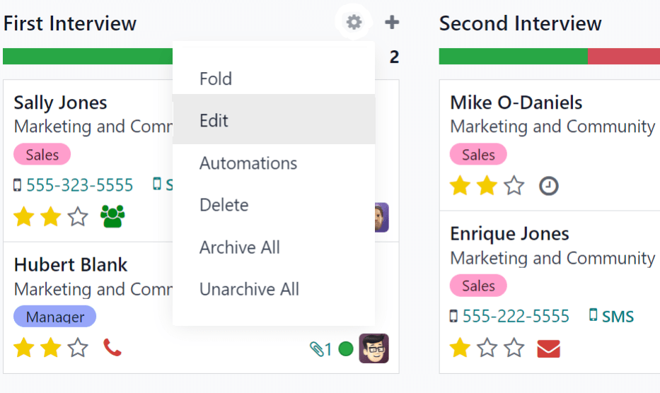

:show-content:
:show-toc:

===========
Recruitment
===========

Odoo keeps all job applicants organized with a pre-configured series of steps and stages that each
applicant goes through. Each stage has a specific step(s) that should be performed. These range from
scheduling a phone call, conducting an interview, to sending a job offer, just to name a few. This
process is referred to as the 'applicant flow'.

When an applicant applies for a job position, an *applicant card* is automatically created in Odoo's
*Recruitment* app for that specific job position. As the applicant progresses through the
recruitment pipeline, the recruitment team moves their card from one stage to the next.

:ref:`Stages can be configured <recruitment/modify-stages>` so that an email is automatically sent
out using a set, pre-configured template as soon as an applicant's card enters a stage. These
automated emails are defined on each stage in the applicant flow.

The applicant flow explained in this document is the default flow in Odoo, and goes through the
applicant flow when using the *Recruitment* application's default configuration. The applicant flow
is able to be modified to suit the specific recruitment flow for any business.

.. note::
   The applicant flow with all its stages are universal and applies to all job positions, unless
   specified. :ref:`A specific stage can be configured <recruitment/customize-stages>` to be
   job-specific, meaning that specific stage is only visible for that specific job position.
   Otherwise, if a new stage is created, or an existing stage is modified, those changes will be
   visible on all job positions.

Kanban view
===========

To access the kanban view for a job position, navigate to the main :menuselection:`Recruitment app`
dashboard, which is the default view when opening the application. All job positions appear on the
main dashboard. Click the :guilabel:`New Applications` smart button on a job position card to
navigate to the kanban view for all the applicants for that particular job position.

Inside the job application, the kanban stages appear, with all the applicants populated in their
respective columns, indicating what stage they are currently in. There are five default stages in
Odoo:

- :ref:`Initial Qualification <recruitment/initial-qualification>`
- :ref:`First Interview <recruitment/first-interview>`
- :ref:`Second Interview <recruitment/second-interview>`
- :ref:`Contract Proposal <recruitment/contract-proposal>`
- :ref:`Contract Signed <recruitment/contract-signed>`

The last column, :guilabel:`Contract Signed`, is folded by default, meaning that the column appears
in gray and the applicants in it are hidden from view. To expand the folded stage and view the
applicant cards for that column, click anywhere on the thin gray column that says the stage name and
the column expands, revealing the applicants.

.. image:: recruitment/stages.png
   :align: center
   :alt: Expand a folded column by clicking on it in the kanban view.

Each stage has a color-coded bar beneath the stage name, giving information about the applicant's
status in the stage. The colors are:

- :guilabel:`Green`: there are applicants in the stage with an activity that is either already
  scheduled or needs to be scheduled in the future (such as a phone call or interview), according to
  the parameters for that particular stage.
- :guilabel:`Yellow`: there are applicants in the stage with an activity either scheduled for today
  or due to be scheduled today.
- :guilabel:`Red`: there are applicants in the stage with overdue activities which need to be
  scheduled.
- :guilabel:`Gray`: there are either no activities currently scheduled and no future activities that
  are required to be scheduled, or there are no applicants currently in the stage.

.. _recruitment/customize-stages:

Customize stages
================

Stages can be modified, added, or deleted to best meet the needs of the particular hiring steps of
a business.

New stage
---------

To create a new stage, click on :guilabel:`+ Add a Column` and a new column appears. Enter the title
for the new stage in the :guilabel:`Column title` field, then click :guilabel:`Add`. The new column
appears, and another new stage is available to create. If no new stages are needed, click anywhere
on the screen to exit the new column creation.

.. _recruitment/modify-stages:

Modify stage
------------

To modify the settings of a stage, hover over the name of the stage, and a :guilabel:`⚙️ (gear)`
icon appears in the upper right hand side of the stage. Click on the :guilabel:`⚙️ (gear)` icon and
a menu appears. Then click on the :guilabel:`Edit Stage` option. An :guilabel:`Edit Column` form
appears. Make any modifications to the form, then click :guilabel:`Save` when done.

         displays when clicked.

Edit column form
~~~~~~~~~~~~~~~~

The :guilabel:`Edit Column` form is where the stage's settings are configured. The only required
fields are the :guilabel:`Stage Name`, and the :guilabel:`Tooltips` section.

The fields to be populated or modified are:

- :guilabel:`Stage Name`: type in a name for the stage.
- :guilabel:`Email Template`: select an email template to be used from the drop-down menu. If a
  template is selected, when the applicant card enters the stage, an email will automatically be
  sent to the applicant using the selected template.
- :guilabel:`Folded in Kanban`: check the box to have the stage appear folded (hidden) at all times
  in the default view.
- :guilabel:`Hired Stage`: check the box if this stage indicates that the applicant is hired. When
  an applicant's card enters this stage, the card displays a :guilabel:`Hired` banner in the upper
  right corner. If this box is checked, this stage is used to determine the hire date of an
  applicant.
- :guilabel:`Job Specific`: if the stage only applies to a specific job position(s), select the job
  position(s) from the drop-down menu. Multiple job positions can be selected.
- :guilabel:`Show in Referrals`: check the box if this stage should be seen in the *Referrals*
  application, and allow the referrer to accrue points when a referral of theirs reaches this stage.
  If this is active, a :guilabel:`Points` field appears. Enter the amount of referral points the
  employee receives when an applicant enters this stage.
- :guilabel:`Tooltips` section: there are three pre-configured labels (colored circles) for each
  applicant's card, indicating its status. These colors are displayed at the top of each stage to
  reflect the statuses of the applicants in the stage. The *names* for the label can be modified,
  but the label itself (the color) cannot. The default names and labels are: :guilabel:`In Progress`
  (gray), :guilabel:`Blocked` (red), and :guilabel:`Ready for Next Stage` (green).
- :guilabel:`Requirements`: enter any internal notes for this stage explaining any requirements of
  the stage.

Delete stage
------------

If a stage is no longer needed, the stage can be deleted. To delete a stage, hover over the name of
the stage, and a :guilabel:`⚙️ (gear)` icon appears. First, click on the :guilabel:`⚙️ (gear)` icon
to reveal a drop-down menu, then click :guilabel:`Delete`. A pop-up warning appears, asking
:guilabel:`Are you sure you want to remove this column?`. Click :guilabel:`OK` to delete the column.

.. important::
   If there are applicants currently in the stage being deleted, an error pops up when attempting to
   delete the stage, explaining that there are records in the stage which need to be deleted,
   archived, or moved to a different stage before deleting.

Email templates
===============

To communicate with the applicant, Odoo has several pre-configured email templates that can be used.
The pre-configured email templates and when to use them are as follows:

- :guilabel:`Applicant: Acknowledgement`: this template is used to let the applicant know that their
  application was received. This email is automatically sent out once the applicant is in the
  :guilabel:`First Interview` stage.
- :guilabel:`Applicant: Interest`: this template is used to let the applicant know that they have
  passed the :guilabel:`Initial Qualification` stage and they will be contacted to set up an
  interview with the recruiter.
- :guilabel:`Applicant: Not interested anymore`: this template is used when an applicant
  communicates that they are no longer interested in the position, and thanks them for their time
  and consideration.
- :guilabel:`Applicant: Refuse`: this template is used when an applicant is no longer being
  considered for the position.
- :guilabel:`Applicant: Your Salary Package`: this template is used when offering an applicant a
  position. This informs the applicant they can configure their salary package.

.. note::
   Email templates can be created, modified, and deleted to suit the needs of a business. For more
   information on email templates, refer to the :doc:`../general/email_communication/email_template`
   document.

To manually send an email click :guilabel:`Send message` in the chatter. A text box appears, as well
as the applicant's email address. Click the :guilabel:`⤢ (double arrow)` full composer icon in the
bottom right corner of the :guilabel:`Send Message` tab in the chatter.

.. image:: recruitment/full-composer.png
   :align: center
   :alt: Send an email from the chatter.

An email composer pop-up loads, with the :guilabel:`Recipients` and :guilabel:`Subject`
pre-populated. The applicant's email address is entered on the :guilabel:`Recipients` line, and the
:guilabel:`Subject` is `Re: (Subject / Application Name)`. The email body is empty by default.

To use a pre-configured email template, click the drop-down next to the :guilabel:`Load template`
field in the lower right section of the window. Pre-configured email templates may contain dynamic
placeholders so unique information can be populated in the email for a more personalized message to
the applicant. There are several pre-configured email templates to choose from. Depending on the
template selected, the email subject and/or body may change.

.. note::
   Only the email templates that are configured for the model will load. There are other email
   templates pre-configured in Odoo, but if they are not configured for the recruitment application,
   they will not appear in the list of available templates.

If any attachments are to be added, click the :guilabel:`Attach A File` button in the lower left
corner. Navigate to the file to be attached, then click :guilabel:`Open` to attach it. To delete an
attachment, click the :guilabel:`X (Delete)` icon to the right of the attachment. If any changes
need to be made to the email, edit the body of the email. If the edits should be saved to be used in
the future, the email can be saved as a new template. Click the :guilabel:`Save As New Template`
button in the bottom right corner. To send the email, click :guilabel:`Send` and the email will be
sent to the applicant. The email then appears in the chatter.

Stage flow
==========

In order to move an applicant's card from one stage to another, the applicant's card can either be
dragged and dropped in the kanban view to the desired stage, or the stage can be modified on the
applicant's card.

To change the stage on the applicant's card, click on the applicant's card in the kanban view to go
to a detailed view of the card. The current stage for the card is highlighted in purple at the top,
above the card. Simply click the desired stage for the card, and the stage changes. A log note
indicating the stage change appears in the chatter. Navigate back to the kanban view by clicking on
:guilabel:`Applications` in the breadcrumb menu in the top left, and the applicant's card now
appears in the new stage.

.. image:: recruitment/stage-change.png
   :align: center
   :alt: Change the stage of an applicant by clicking on the desired stage at the top of the
         applicant's card.

.. _recruitment/initial-qualification:

Initial qualification
---------------------

.. important::
   The following information is based on Odoo's default recruitment pipeline flow. Be advised that
   if modifications are made to create a customized recruitment pipeline flow, it will vary from the
   following information.

All applicants appear in the :guilabel:`Initial Qualification` stage, whether submitted online or if
the applicant is manually entered by a recruiter. When the applicant's card is created, Odoo
automatically populates the applicant's :guilabel:`Name`, :guilabel:`Email address`, and
:guilabel:`Phone number` on the applicant's card. This information is required when applying for a
job position.

If the applicant entered any information in the :guilabel:`Short Introduction` section of the online
application, it is populated in the :guilabel:`Application Summary` tab at the bottom of the
applicant's card. If a resumé was attached to the online application, the resumé appears in the
attachments section of the chatter, and is also stored in the *Documents* application. To find the
recruitment documents stored in the Documents application, navigate to the main
:menuselection:`Documents` dashboard, and click the folder labeled :guilabel:`Recruitment` on the
right side. All recruitment documents will be stored within that folder.

Send interview
~~~~~~~~~~~~~~

At any point in the hiring process, an *interview* can be sent to the applicant to obtain more
information. These interviews are custom-made, and can be formatted in a variety of ways.

Odoo uses the term *interview*, but these can be thought of as questionnaires, surveys, tests,
certifications, etc. Custom interviews can be formatted to suit each individual job position's
needs. For example, a job position for a computer programmer could have an interview in the form of
a programming quiz to determine the skill level of the applicant. A job position for a restaurant
server could have a questionnaire inquiring about the applicant's availability, if the desired
applicant needs to be available on weekend evenings. For more information on creating and editing
interview forms, refer to the :doc:`../hr/recruitment/new_job` documentation.

.. note::
   In order to send an email to an applicant, there must be an email address on the applicant's
   card. If an email address is not entered on the applicant's card, when :guilabel:`Send Interview`
   is clicked, the applicant's card appears instead of the :guilabel:`Survey` pop-up window. Enter
   the email address in the email field, then click :guilabel:`Save`. Once the applicant's card is
   saved, the applicant's card closes and the :guilabel:`Survey` pop-up window appears.

To send an interview to an applicant, click on an applicant's card to navigate to a detailed view of
the applicant's card. At the top of the applicant's card, click the button labeled :guilabel:`Send
Interview`.

If the applicant's card has an email address on file, a :guilabel:`Survey` pop-up window appears,
with all the information populated. If an email is not on the applicant's card, then a contact form
appears. Enter the applicants email address, then click :guilabel:`Save`. The card closes and the
:guilabel:`Survey` pop-up window appears.

Odoo refers to the interview forms as *surveys*. These email templates also use dynamic placeholders
to personalize the email to the applicant and the job position. Add any additional recipients for
the survey if more people should receive the email. If an email is in the database as a contact, add
that contact on the :guilabel:`Recipients` line. If an email should be sent to someone who is not in
the database as a contact, and they should **not** be added as a contact, add their email to the
:guilabel:`Additional emails` line.

If any attachments need to be added, click the :guilabel:`Attachments` button and a file explorer
window appears. Navigate to the desired file, then click :guilabel:`Open` to attach it to the email.
The attachment loads, and is listed above the :guilabel:`Attachments` button.

If the emailed interview must be completed by a specific date, select a date for the
:guilabel:`Answer deadline` in the lower-right area of the pop-up window. Click on the line next to
:guilabel:`Answer deadline`, and a calendar selector appears. Use the :guilabel:`< (left)` and
:guilabel:`> (right)` arrows on either side of the month to navigate to the desired month, then
click on the :guilabel:`day` to select the date.

The :guilabel:`Mail template` field is pre-populated based on the configuration for the interview. A
different template can be chosen from the drop-down menu if desired. If a new template is selected,
the new email template loads in the email body.

To send the email with the interview link to the applicant, click :guilabel:`Send` at the bottom of
the email pop-up.

.. image:: recruitment/send-survey.png
   :align: center
   :alt: Send a custom survey, also referred to as an interview form, to an applicant using a
         pre-configured template.

Refuse
~~~~~~

At any point in the recruitment pipeline, an applicant can be refused from the job application
process. To refuse an applicant, click on an applicant's card to navigate to a detailed view of the
applicant's card. At the top of the applicant's card, there are several buttons. Click the one
labeled :guilabel:`Refuse`.

A :guilabel:`Refuse Reason` pop-up appears. Select the :guilabel:`Refuse Reason` from the drop-down
menu. The default refuse reasons in Odoo are: :guilabel:`Doesn't fit the job requirements`,
:guilabel:`The applicant is not interested anymore`, and :guilabel:`The applicant gets a better
offer`. These three refusal reasons have pre-configured email templates associated with them.
Additional refusal reasons can be created and existing ones can be modified or deleted. To add a new
refusal reason, type in the name of the reason, then click :guilabel:`Create and Edit...`. A
:guilabel:`Create: Refuse Reason` pop-up window appears. Type in the name of the new email template
in the :guilabel:`Email Template` field, and click :guilabel:`Create and Edit...`. A
:guilabel:`Create: Email Template` window loads. Configure the new email template, then click
:guilabel:`Save`.

.. note::
   Pre-configured email templates in Odoo sometimes use dynamic placeholders, which are customized
   pieces of data that populate dynamic content. For example, if the applicant's name is a piece of
   dynamic content, the applicant's name will appear anytime that dynamic placeholder appears on the
   email template. For more detailed information on email templates, refer to the
   :doc:`../general/email_communication/email_template` documentation.

An email template populates the :guilabel:`Email Template` field after a refusal reason is selected.
If an email should not be sent to the applicant, uncheck the :guilabel:`Send Email` checkbox. To
view the email template, click the :guilabel:`External Link` icon to the right of the email template
selected. The email template loads in the pop-up window, and can be modified if needed. After making
modifications, click :guilabel:`Save`. To close the email template, click :guilabel:`Discard`.

To send the refusal email to the applicant, click :guilabel:`Send`. The refusal email is sent to the
applicant, and a :guilabel:`Refused` banner appears on the applicant's card.

.. image:: recruitment/refuse.png
   :align: center
   :alt: An applicant's card with the refused banner appearing in the top right corner in red.

After refusal, the applicant's card is no longer visible in the job position's kanban view. To view
refused applicants, navigate to the :menuselection:`Recruitment app --> Applications --> All
Applications`. All applications for all job positions are presented in a list view. To view the
refused applicants only, click :guilabel:`Filters`, then click :guilabel:`Archived/Refused`. All
applicants that have been archived and/or refused appear in the list. To further organize this list
and view refusals by job position, click :guilabel:`≣ Group By`, then click :guilabel:`Job`.

New applicant
~~~~~~~~~~~~~

An applicant card can be manually added if needed. If an applicant needs to be added to the list of
prospective candidates and an applicant card has not been created yet (they have not applied for the
job online yet) an applicant card can be easily added from the job position kanban view in one of
two ways, using either the :ref:`Quick add <recruitment/quick-add-applicant>` icon or the
:ref:`Create <recruitment/create-new-applicant>` button.

.. _recruitment/quick-add-applicant:

Quick add
*********

Quickly add a new applicant using the :guilabel:`Quick add` icon. If not already in the job position
kanban view, navigate to the main recruitment dashboard, and click the :guilabel:`New Applicants`
button on the job position card that the applicant should be added to. Then, click on the small
:guilabel:`+ (plus sign) Quick add` icon in the top right of the :guilabel:`Initial Qualification`
stage to quickly add a new applicant.

.. image:: recruitment/quick-add.png
   :align: center
   :alt: All the fields for a new applicant form entered when using the Quick Add option.

Enter the following information on the card:

- :guilabel:`Subject/Application Name`: this is the only required field. Enter the title for the
  card. Typically this is the applicant's name and job position being applied to, for example:
  `Laura Smith - Experienced Developer`. This field is not visible in the kanban view (unless in the
  Developer mode), but is visible on the individual card.
- :guilabel:`Applicant's Name`: enter the applicant's name.
- :guilabel:`Email`: enter the applicant's email address.
- :guilabel:`Applied Job`: the current job position populates this field. If needed, the job
  position can be changed by selecting a different position from the drop-down menu. If a different
  job position is selected, after the card is created, the card will appear in the selected job
  position.

After the information is entered, click :guilabel:`Add`. The applicant appears in the list, and a
new blank applicant card appears. Click either the :guilabel:`🗑️ (delete)` icon or click anywhere
on the screen to close the card.

If preferred, after entering the applicant name, click :guilabel:`Edit` and a detailed
:guilabel:`Applicant Form` loads. :ref:`Enter the information on the form
<recruitment/applicant-details>`, then click :guilabel:`Save`

.. _recruitment/create-new-applicant:

Create
******

Add a new applicant including all the relevant information using the :guilabel:`Create` button. If
not already in the kanban view for the job position to add an applicant to, navigate to the main
recruitment dashboard, and click the :guilabel:`New Applicants` button on the job position card that
the applicant should be added to. Then, click the :guilabel:`Create` button in the top left of the
kanban view and an applicant form loads.

Certain fields on the applicant card may be pre-populated, depending on how the job position is
configured. Typically, the :guilabel:`Job` section, as well as the :guilabel:`Recruiter` field, are
all pre-populated.

Enter the following information on the new applicant form. Note that not all fields listed below may
be visible. Depending on installed applications and configurations, some fields may not be
displayed.

.. _recruitment/applicant-details:

Applicant section
^^^^^^^^^^^^^^^^^

- :guilabel:`Subject/Application Name`: this is the only required field. Enter the title for the
  card. Typically this is the applicant's name and job position being applied to, for example:
  `Laura Smith - Experienced Developer`. This field is not visible in the kanban view, unless the
  :guilabel:`Applicant's Name` is left blank. If there is no :guilabel:`Applicant's Name`, then the
  :guilabel:`Subject/Application Name` is what is displayed on the applicant card in the kanban
  view.
- :guilabel:`Applicant's Name`: enter the applicant's name.
- :guilabel:`Email`: enter the applicant's email address.
- :guilabel:`Phone`: enter the applicant's phone number.
- :guilabel:`Mobile`: enter the applicant's mobile number.
- :guilabel:`Degree`: select the applicant's highest level of education earned from the drop-down
  menu. Options are :guilabel:`Graduate`, :guilabel:`Bachelor Degree`, :guilabel:`Master Degree`, or
  :guilabel:`Doctoral Degree`. The :guilabel:`Graduate` option indicates graduating the highest
  level of school before a Bachelor's degree, such as a high school or secondary school diploma,
  depending on the country.
- :guilabel:`Tags`: select as many tags as desired from the drop-down menu. To add a tag that does
  not exist, type in the tag name, the click :guilabel:`Create "new tag"`.
- :guilabel:`Interviewer`: select the person who will be conducting the interview(s) from the
  drop-down menu. The person must have either *recruiter* or *officer* rights configured for the
  Recruitment application in order to appear on the drop-down.
- :guilabel:`Recruiter`: select the person responsible for the entire recruitment process for the
  job position. Only *users* can be selected, and all users are presented in the drop-down to
  select from.
- :guilabel:`Appreciation`: click on one of the stars to select a rating for the applicant. One star
  indicates :guilabel:`Good`, two stars indicates :guilabel:`Very Good`, and three stars indicates
  :guilabel:`Excellent.`
- :guilabel:`Referred By User`: if referral points are to be earned for this job position in the
  *Referrals* application, select the user who referred the applicant from the drop-down menu. The
  *Referrals* application must be installed for this to appear.

Job section
^^^^^^^^^^^

The following fields are pre-populated when creating a new applicant, as long as these field are
specified on the Job Position. Editing the fields is possible, if desired.

- :guilabel:`Applied Job`: select the job position the applicant is applying to from the drop-down
  menu.
- :guilabel:`Department`: select the department the job position falls under from the drop-down
  menu.
- :guilabel:`Company`: select the company the job positions is for using the drop-down menu.

Contract section
^^^^^^^^^^^^^^^^

- :guilabel:`Expected Salary`: enter the amount the applicant is requesting for the role in this
  field. The number should be in a `XX,XXX.XX` format. The currency is determined by the
  localization setting for the company.
- :guilabel:`Expected Salary - Extra advantages...`: if any extra advantages are requested by the
  applicant, enter it in this field. This should be short and descriptive, such as `1 week extra
  vacation` or `dental plan`.
- :guilabel:`Proposed Salary`: enter the amount to be offered to the applicant for the role in this
  field. The number should be in a `XX,XXX.XX` format.
- :guilabel:`Proposed Salary - Extra advantages...`: if any extra advantages are offered to the
  applicant, enter it in this field. This should be short and descriptive, such as `1 week extra
  vacation` or `dental plan`.
- :guilabel:`Availability`: using the calendar module in the drop-down menu, select the available
  start date for the applicant.

Application summary tab
^^^^^^^^^^^^^^^^^^^^^^^

Any additional details or notes that should be added to the applicant's card can be typed into this
field.

.. image:: recruitment/new-applicant.png
   :align: center
   :alt: All the fields for a new applicant form entered.

.. _recruitment/first-interview:

First interview
---------------

After an applicant has passed the :guilabel:`Initial Qualification` stage, they can be moved to the
:guilabel:`First Interview` stage in the job position kanban view. To move the applicant to the next
stage, drag and drop the applicant's card to the :guilabel:`First Interview` stage, or click on the
:guilabel:`First Interview` stage button at the top of the individual applicant's card.

.. image:: recruitment/move.png
   :align: center
   :alt: An applicant's card moves from one stage t another by using the click and drag method.

When the applicant's card moves to the :guilabel:`First Interview` stage, an acknowledgement email
is automatically sent to the applicant. The email is created using an email template titled
:guilabel:`Applicant: Acknowledgement`. This email template is pre-configured in Odoo, and contains
dynamic placeholders for the job position, the recruiter's name, and the company's information. Once
the email is sent, the email appears in the chatter.

.. _recruitment/schedule-meetings:

Schedule a meeting
~~~~~~~~~~~~~~~~~~

When a date and time have been agreed upon for both the applicant and interviewer, the interview can
be scheduled. To schedule an interview, whether a phone or in-person interview, click the
:guilabel:`Meeting` smart button at the top of the applicant's record.

The applicant's card can be found by navigating to the :menuselection:`Recruitment application`
dashboard, click on a :guilabel:`New Applications` button in the job position card, then click on
the applicant's card.

.. note::
   The meeting smart button will display :guilabel:`No Meeting` if no meetings are currently
   scheduled. For new applicants who are new to the :guilabel:`First Interview` stage, this will be
   the default. If there are any meetings already scheduled, the smart button will display
   :guilabel:`Next Meeting` with the date of the upcoming meeting.

Doing so loads the *Calendar* application, showing the currently scheduled meetings and events for
the user. The meetings and events displayed are for the employees who are listed under the
:guilabel:`Attendees` section on the right side of the calendar view. To change the currently loaded
meetings and events being displayed, uncheck the person who's calendar events are to be hidden. Only
the checked attendees will be visible on the calendar.

The default view is the week view. To change the calendar view, click on a button to present the
calendar in a different view, either :guilabel:`Day`, :guilabel:`Month`, or :guilabel:`Year`. To
change the displayed date range for the calendar, either use the :guilabel:`⬅️ (Left)`,
:guilabel:`➡️ (Right)`, or :guilabel:`Today` buttons above the calendar, or click on a date in the
calendar on the right side of the displayed calendar.

.. image:: recruitment/calendar.png
   :align: center
   :alt: The calendar view, highlighting how to change the displayed meetings.

To add a meeting to the calendar, click on the day the meeting is to take place, or click on the
start time of the meeting and drag to the end time, to select the date, time, and the length of the
meeting. If the calendar is displaying the day or week view, click on the day *and* the time slot
the meeting is to take place. A :guilabel:`New Event` pop up appears, with the :guilabel:`Meeting
Subject` populated with the applicant card's :guilabel:`Subject/Application Name`. The default time
slot is 30 minutes. If the information is correct, click :guilabel:`Create` to add the meeting to
the calendar, or click :guilabel:`Edit` to modify the meeting.

If :guilabel:`Edit` is clicked, an expanded :guilabel:`New Event` card loads. Make any changes
needed to the form.

New event card
**************

The fields available to populate or modify on the detailed :guilabel:`New Event` card are as
follows. The only required fields to enter are the :guilabel:`Meeting Subject`, :guilabel:`Starting
At`, and :guilabel:`Ending At` fields. Once the card details are entered, click :guilabel:`Save` to
save the changes and create the meeting.

- :guilabel:`Meeting Subject`: enter the subject for the meeting. This should clearly indicate the
  purpose of the meeting. The default subject is the :guilabel:`Subject/Application Name` on the
  applicant's card.
- :guilabel:`Attendees`: select the people who should be in attendance. The default employee listed
  is the person who is creating the meeting. Add as many other people as desired.

Meeting details tab
^^^^^^^^^^^^^^^^^^^

- :guilabel:`Starting At`: using the drop-down calendar, select the date and time for the meeting
  start time.
- :guilabel:`Ending At`: using the drop-down calendar, select the date and time for the meeting end
  time.
- :guilabel:`Duration`: this field auto populates based on the :guilabel:`Starting At` and
  :guilabel:`Ending At` times entered. If the meeting time is adjusted, this field automatically
  adjusts to the correct duration length.
- :guilabel:`All Day`: if the meeting is an all day long event, check the box next to :guilabel:`All
  Day`. After this box is checked, the :guilabel:`Duration` field is hidden from view, a well as the
  meeting start and end times.
- :guilabel:`Organizer`: the employee who created the meeting is populated in this field. Use the
  drop-down menu to change the selected employee.
- :guilabel:`Description`: enter a brief description in this field. There is an option to enter
  formatted text, such as numbered lists, headings, tables, as well as links, photos, and more. Use
  the powerbox feature, by typing a `/`, and a list of options are presented. Scroll through the
  options and click on the desired item. The item appears in the field and can be modified. Each
  command presents a different pop-up window. Follow the instructions for each command to complete
  the entry.
- :guilabel:`Reminders`: select a reminder from the drop-down menu. Options include
  :guilabel:`Notification`, :guilabel:`Email`, and :guilabel:`SMS Text Message`, each with a
  specific time period before the event (hours, days, etc). The reminder chosen will alert the
  meeting participants of the meeting via the selected option.
- :guilabel:`Location`: enter the location for the meeting.
- :guilabel:`Meeting URL`: if the meeting is virtual, enter the meeting link in this field.
- :guilabel:`Tags`: select any tag(s) for the meeting using the drop-down menu. There is no limit to
  the number of tags that can be used.

Options tab
^^^^^^^^^^^

- :guilabel:`Recurrent`: if the meeting should repeat at a selected interval (not typical for a
  first interview), check the box next to :guilabel:`Recurrent`. This reveals a recurrence section.
  Enter the details for how often the meeting should repeat, including an end time.
- :guilabel:`Privacy`: select the visibility of this meeting. Options are :guilabel:`Public`,
  :guilabel:`Private`, and :guilabel:`Only internal users`. :guilabel:`Public` allows for everyone
  to see the meeting, :guilabel:`Private` allows only the attendees listed on the meeting to see the
  meeting, and :guilabel:`Only internal users` allows anyone logged into the company database to see
  the meeting.
- :guilabel:`Show as`: select from the drop-down whether the meeting time should appear as
  :guilabel:`Busy` or :guilabel:`Available` in the attendees' schedules. Setting this field to
  :guilabel:`Available` allows other meetings to be scheduled for the same time. It is recommended
  to set this field to :guilabel:`Busy`, so no other meetings can be scheduled for the attendees at
  the same time.

.. image:: recruitment/new-event.png
   :align: center
   :alt: A new meeting card with all the details populated, and ready to save.

Send meeting to attendees
*************************

Once changes have been entered and the meeting details are correct, the meeting can be sent to the
attendees via email or text message.

To send the meeting via email, click the :guilabel:`Email` button next to the list of attendees. A
:guilabel:`Contact Attendees` email configurator pop-up appears. A pre-formatted email using the
default :guilabel:`Calendar: Event Update` email template populates the email body field. The
followers of the document (job application), as well as the user who created the meeting are added
as :guilabel:`Recipients` by default. Add the applicant's email address to the list to send the
email to the applicant as well. Make any other desired changes to the email. If an attachment is
needed, click the :guilabel:`Attach A File` button, navigate to the file, then click
:guilabel:`Open`. Once the email is ready to be sent, click :guilabel:`Send`.

.. image:: recruitment/email-event.png
   :align: center
   :alt: Enter the information to send the event via email.

To send the meeting via text message, click the :guilabel:`SMS` button next to the list of
attendees. A :guilabel:`Send SMS Text Message` pop-up appears. At the top, in a blue box,
information appears regarding the message. The first line lists how many records (phone numbers) are
selected. The second line lists the number of recipients and how many of them are invalid. If a
contact does not have a valid phone number listed, click :guilabel:`Close`, and edit the attendee's
record, then redo these steps.

.. warning::
   It is *not* recommended to check the box to send to all the records in the :guilabel:`Send SMS
   Text Message` pop-up. This would send a message to all contacts with a valid phone number.

When the message reads :guilabel:`0 are invalid`, type in the message to be sent in the
:guilabel:`Message` field. Beneath the message field, the number of characters, as well as the
amount of text messages required to send the message (according to GSM7 criteria) appears. Click
:guilabel:`Put In Queue` to have the text sent later, after any other messages are scheduled, or
click :guilabel:`Send Now` to send the message immediately.

.. image:: recruitment/send-sms.png
   :align: center
   :alt: Send a text message to the attendees of the meeting.

.. note::
   Sending text messages is not a default capability with Odoo. To send text messages, credits are
   required, which need to be purchased. For more information on IAP credits and plans, refer to
   the :doc:`../general/in_app_purchase` documentation.

.. _recruitment/second-interview:

Second interview
----------------

After an applicant has passed the :guilabel:`First Interview` stage, they can be moved to the
:guilabel:`Second Interview` stage. To move the applicant to the next stage, drag and drop the
applicant's card to the :guilabel:`Second Interview` stage, or click on the :guilabel:`Second
Interview` stage button at the top of the individual applicant's card.

When the applicant's card moves to the :guilabel:`Second Interview` stage, there are no automatic
activities or emails configured for this stage, unlike for the :guilabel:`First Interview` stage.
The recruiter can now :ref:`schedule a second interview <recruitment/schedule-meetings>` with the
applicant, following the same process as for the first interview.

.. _recruitment/contract-proposal:

Contract proposal
-----------------

When the applicant has passed the interview stages and an offer is ready to be sent, they can be
moved to the :guilabel:`Contract Proposal` stage. Drag and drop the applicant's card to the
:guilabel:`Contract Proposal` stage, or click on the :guilabel:`Contract Proposal` stage button at
the top right of the individual applicant's card.

The next step is to send an offer to the applicant. On the applicant's card, click the
:guilabel:`Generate Offer` button. A :guilabel:`Generate a Simulation Link` pop-up appears. All
fields are pre-populated with information from the job position, except for the :guilabel:`Force
New Cars List`, :guilabel:`Default Vehicle`, and the :guilabel:`Canteen Cost` (this is set to
`0.00`).

.. note::
   Not all fields may appear on the :guilabel:`Generate a Simulation Link` pop-up. Depending on the
   localization setting for the company and the applications installed, some fields may not appear.
   For example if the *Fleet* application is not installed, the fields related to vehicles will not
   appear on the pop-up.

Universal fields
~~~~~~~~~~~~~~~~

The following fields appear for all offers sent to applicants regardless of localization settings.

- :guilabel:`Offer Template`: the template currently being used to populate the :guilabel:`Generate
  a Simulation Link` pop-up. To modify the template, click the :guilabel:`External link` icon to the
  right of the drop-down arrow. Make any changes, then click :guilabel:`Save`.
- :guilabel:`Job Title`: the name of the position being offered to the applicant.
- :guilabel:`Contract Start Date`: the date the contract takes effect. The default date is the
  current date. To modify the date, click the drop-down to reveal a calendar. Use the :guilabel:`<
  (left)` and :guilabel:`> (right)` arrows on either side of the month to navigate to the desired
  month, then click on the :guilabel:`day` to select the date.
- :guilabel:`Yearly Cost`: the annual salary being offered.
- :guilabel:`Offer Link`: this link takes the applicant to a webpage where they can enter their
  personal information, which will be imported to their employee record when created. If applicable,
  the applicant can modify their salary package (this option is not available for all
  localizations). Lastly, this is where the applicant accepts the offer by clicking
  :guilabel:`Review Contract & Sign` to accept the contract and sign it using the *Sign*
  application.

.. note::
   The *Sign* application must be installed in order for a document to be signed. Ensure the *Sign*
   application is installed to use this feature.

Optional fields
~~~~~~~~~~~~~~~

The following fields will only appear if specific localization settings are selected, and/or certain
applications are installed. For example if the *Fleet* application is not installed, none of the
optional fields related to vehicles will appear, such as :guilabel:`Force New Cars List` or
:guilabel:`Default Vehicle`.

- :guilabel:`Job Position`: the official title of the job being offered to the applicant, from the
  :guilabel:`Job Position` card. To modify the name, click the :guilabel:`External link` icon to the
  right of the drop-down arrow. Make any changes, then click :guilabel:`Save`.
- :guilabel:`Department`: the department the job position falls under. To modify the department,
  click the :guilabel:`External link` icon to the right of the drop-down arrow. Make any changes,
  then click :guilabel:`Save`.
- :guilabel:`Force New Cars List`: check this box to offer a new vehicle to the applicant.
- :guilabel:`Default Vehicle`: using the drop-down menu, select the vehicle that will be assigned
  to the applicant.
- :guilabel:`Canteen Cost`: enter the amount that is offered to the applicant for the cafeteria.
- :guilabel:`Contract Type`: using the drop-down menu, select the type of contract that is being
  offered.

.. image:: recruitment/generate-link.png
   :align: center
   :alt: Format the offer to send to the applicant. Make any modifications before sending.

Send offer
~~~~~~~~~~

To send the offer to the applicant, click :guilabel:`Send`. If the applicant does not have an email
address listed on their applicant card, the applicant form appears so their email can be configured.
If there is already an email configured on the applicant's card, the email pop-up appears instead.
If prompted with the applicant's card, enter the applicant's email address in the :guilabel:`Email`
field, then click :guilabel:`Save`. The applicant form closes and the email pop-up appears.

The :guilabel:`Applicant: Your Salary Package` email template is used, and the
:guilabel:`Recipients`, :guilabel:`Subject`, and email body are pre-populated based on the email
template. If any attachments need to be added, click the :guilabel:`Attachments` button and a file
explorer window appears. Navigate to the desired file, then click :guilabel:`Open` to attach it to
the email. The attachment loads, and is listed above the :guilabel:`Attachments` button. Once the
email is ready to send, click :guilabel:`Send`.

.. note::
   To send an offer, ensure the *Sign* application is installed. This is necessary so the offer can
   be sent to the applicant by the recruiter. The applicant does not need any software installed.

.. image:: recruitment/send-offer.png
   :align: center
   :alt: Send an email to the applicant with a link to the offered salary.

.. _recruitment/contract-signed:

Contract signed
---------------

Once the applicant has accepted the offer and signed the contract, the next step is to move the
applicant to the :guilabel:`Contract Signed` stage. To move the applicant to the next stage, drag
and drop the applicant's card to the :guilabel:`Contract Signed` stage, or click the
:guilabel:`More` button at the top of the applicant's card to reveal the :guilabel:`Contract
Signed` stage button at the top of the individual applicant's card, and click :guilabel:`Contract
Signed`.

The :guilabel:`Contract Signed` stage is folded in the kanban view, but the card may still be
dragged and dropped into that stage.

Once the applicant's card moves to the :guilabel:`Contract Signed` stage, a green :guilabel:`Hired`
banner appears in the top right of the applicant's card.

.. image:: recruitment/hired.png
   :align: center
   :alt: Hired banner in the top right corner of applicant card.

Create employee
~~~~~~~~~~~~~~~

Once the applicant has been hired, the next step is to create an employee record of them. On the
applicant's card, click the :guilabel:`Create Employee` button in the top left. An employee form
appears, and any information from the applicant's card that can be imported into the employee card
appears in the form.

Fill out the rest of the form. For detailed information on the fields, refer to the
:doc:`employees/new_employee` documentation. When done, click :guilabel:`Save`. The employee record
is now saved in the *Employees* app.

.. toctree::
   :titlesonly:

   recruitment/new_job
