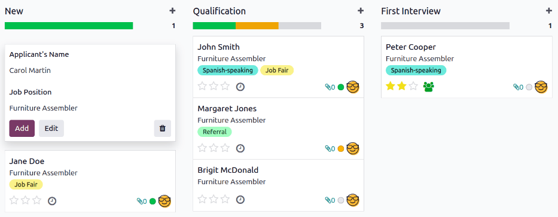
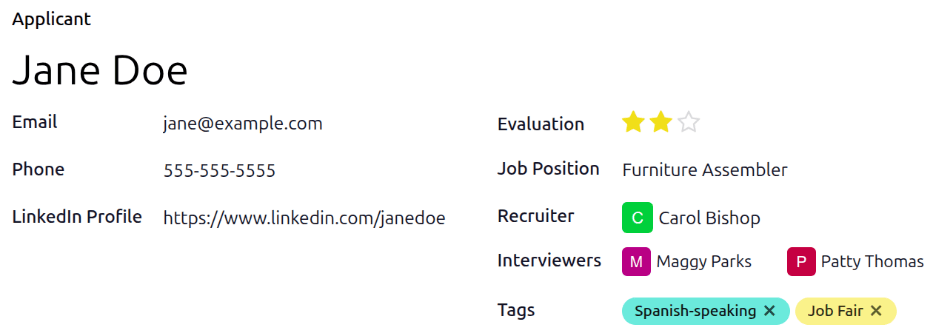
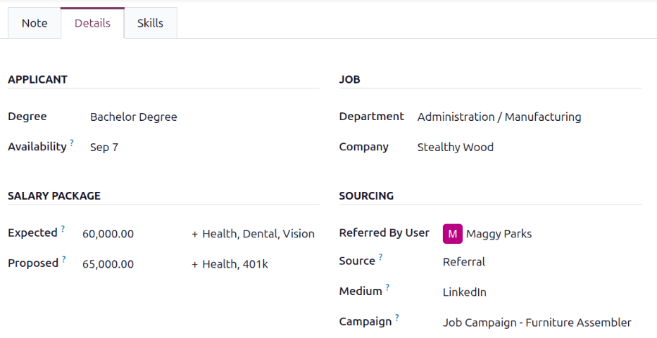
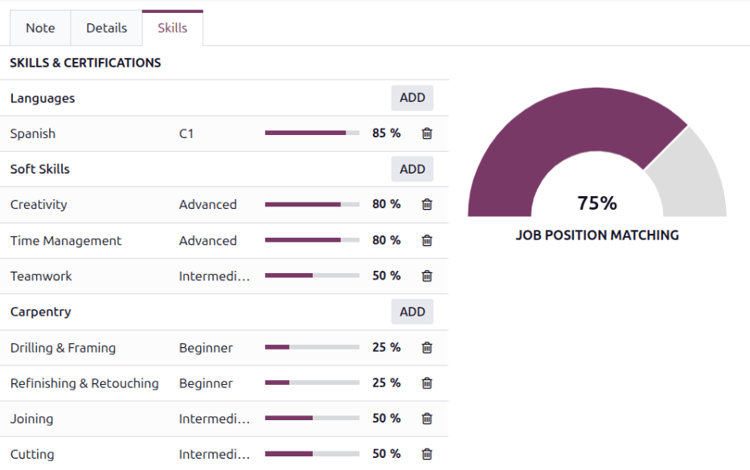

==============
Add applicants
==============

Once an applicant submits an application, either using the online application, or emailing a job
position alias, an applicant card is automatically created in the **Recruitment** app.

However, in some instances, applicants may need to be created manually in the database. This could
be necessary if, for example, a company accepts paper applications in the mail, or is meeting
prospective applicants at an in-person job fair.

To view current applicants, navigate to the :menuselection:`Recruitment` app, then click the desired
job position card. Doing so reveals the *Applications* page, which displays all applicants for that
specific role, in a default Kanban view, organized by stage.

Add applicants from a job position's *Applications* page by using either: the :icon:`fa-plus`
:ref:`(quick add) <recruitment/add_applicants/quick-add-applicant>` button, or the :ref:`New
<recruitment/add_applicants/create-new-applicant>` button.

.. _recruitment/add_applicants/quick-add-applicant:

Quick add
=========

On the job position's *Applications* page, click the :icon:`fa-plus` :guilabel:`(Quick add)` button
in the corner of the desired stage, and a new aplicant card loads.

Enter the following information on the card:

- :guilabel:`Applicant's Name`: Enter the applicant's name in this field. This is displayed as the
  card title in the Kanban view of the *Applications* page.
- :guilabel:`Job Position`: The current job position populates this field. To change it, select a
  different job position from the drop-down menu. The newly-created card then appears on the
  *Applications* page for that selected job position.

After the information is entered, click :guilabel:`Add`. This adds the applicant card to the stage,
and a new blank applicant card appears.

If preferred, after entering the :guilabel:`Applicant's Name` in the Kanban card, click
:guilabel:`Edit`, and a detailed applicant form loads. :ref:`Enter the information
<recruitment/add_applicants/create-new-applicant>` on the new applicant form.

.. _recruitment/add_applicants/create-new-applicant:

New applicant form
==================

On the *Applications* page, click the :guilabel:`New` button in the corner, and a blank
*Applications* form loads.

By default, the :guilabel:`Job Position` and :guilabel:`Recruiter` fields are populated according to
the :ref:`job position configurations <recruitment/new_job/create-job-position>`. Additionally, the
:guilabel:`Department` and :guilabel:`Company` fields in the *Details* tab may also be populated, if
those details are configured on the job position.

Complete the fields in the following sections on the new applicant form.

.. note::
   Depending on installed applications and configurations, some fields may not be displayed.

.. _recruitment/add_applicants/applicant-details:

Applicant section
-----------------

- :guilabel:`Applicant`: Enter the applicant's name. This field is displayed as the card title in
  the Kanban view of the *Applications* page. This is the **only** required field on the form.
- :guilabel:`Email`: Enter the applicant's email address.
- :guilabel:`Phone`: Enter the applicant's phone number.
- :guilabel:`LinkedIn Profile`: Enter the web address for the applicant's personal profile on
  LinkedIn.
- :guilabel:`Evaluation`: Represents a rating for the applicant: one star (:icon:`fa-star`
  :icon:`fa-star-o` :icon:`fa-star-o`) is :guilabel:`Good`, two stars (:icon:`fa-star`
  :icon:`fa-star` :icon:`fa-star-o`) is :guilabel:`Very Good`, and three stars (:icon:`fa-star`
  :icon:`fa-star` :icon:`fa-star`)is :guilabel:`Excellent.`
- :guilabel:`Job Position`: Select the job position the applicant is applying for. This field is
  populated by default but can be changed if necessary.
- :guilabel:`Recruiter`: Select the user responsible for the entire recruitment process for the job
  position. This field is populated by default but can be changed if desired.
- :guilabel:`Interviewers`: Using the drop-down menu, select the people to conduct the interviews.
  The selected people **must** have either *recruiter* or *officer* :doc:`access rights
  <../../general/users/access_rights>` configured for the **Recruitment** app to appear in the
  drop-down list.
- :guilabel:`Tags`: Select as many tags as desired from the drop-down menu. To add a tag that does
  not exist, type in the tag name, then click :guilabel:`Create "new tag"` from the resulting
  drop-down menu.

Note tab
--------

Enter any notes regarding the applicant in this tab. These notes are only visible internally to
users that have the proper access rights.

.. example::
   A recruiter met an applicant at a job fair and had a discussion regarding the job position as
   well as the applicant's prior history. They also had a furniture assembly display, with different
   pieces to be assembled. This allowed the recruiters to view applicant's skills in real time. The
   recruiter uses the *Note* tab to enter the following information:

   `Met the applicant at a job fair. They have previously worked in furniture assembly for Furniture
   R Us. They demonstrated their skills at our assembly display, and finished assembling a chair in
   under 3 minutes - which was the fastest among all participants today.`

Details tab
-----------

The *Details* tab houses various information regarding the applicant and the job position.

Applicant section
~~~~~~~~~~~~~~~~~

Enter the following information in the respective fields:

- :guilabel:`Degree`: Select the applicant's highest level of education from the drop-down menu.
  Options are: :guilabel:`Graduate`, :guilabel:`Bachelor Degree`, :guilabel:`Master Degree`, or
  :guilabel:`Doctoral Degree`.

  .. note::
     The :guilabel:`Graduate` option indicates the applicant graduated at the highest level of
     school before a Bachelor's degree, such as a high school or secondary school diploma, depending
     on the country.

- :guilabel:`Availability`: Select the available start date for the applicant. To select a date,
  click on the field to reveal a calendar. Navigate to the date the applicant can start, and click
  to select it. Leaving this field blank indicates the applicant can start immediately.

Job section
~~~~~~~~~~~

The following fields are preconfigured when creating a new applicant, as long as these fields are
specified on the job position form. Editing the fields is possible, if desired.

- :guilabel:`Department`: Select the job position's department using the drop-down menu.
- :guilabel:`Company`: Select the job position's company using the drop-down menu. This field
  **only** appears in a multi-company database.

Salary package section
~~~~~~~~~~~~~~~~~~~~~~

Configure both the expected and proposed salary and benefits in this section. Fill out the following
fields:

- :guilabel:`Expected`: Enter the applicant's requested salary amount in this field. The number
  should be in a `XX,XXX.XX` format. The currency is determined by the localization setting for the
  company. If any benefits are requested by the applicant, enter them in the blank :guilabel:`Other
  Benefits` text field next to the :guilabel:`Expected` salary field. The benefits should be short
  and descriptive, such as `4 Weeks Vacation` or `Dental Plan`.
- :guilabel:`Proposed`: Enter the salary amount offered to the applicant in this field. The number
  should be in a `XX,XXX.XX` format. If any benefits are offered to the applicant, enter them in the
  :guilabel:`Other Benefits` text field next to the :guilabel:`Proposed` field. The benefits should
  be short and descriptive, such as `Unlimited Sick Time` or `Health Insurance`.

Sourcing section
~~~~~~~~~~~~~~~~

This section houses the details regarding the way the applicant applied for the job position. This
information is necessary for :doc:`employee referrals <../referrals>`, and allows for
:doc:`reporting on the channels with the highest applicant generation <source_analysis>`.

- :guilabel:`Referred By User`: If referral points are to be earned for this job position in the
  **Referrals** application, select the user who referred the applicant from the drop-down menu. The
  **Referrals** application **must** be installed for this field to appear.
- :guilabel:`Source`: Using the drop-down menu, select where the applicant learned about the job
  position. The following options come preconfigured in Odoo: :guilabel:`Search engine`,
  :guilabel:`Lead Recall`, :guilabel:`Newsletter`, :guilabel:`Facebook`, :guilabel:`X`,
  :guilabel:`LinkedIn`, :guilabel:`Monster`, :guilabel:`Glassdoor`, :guilabel:`Craigslist`, and
  :guilabel:`Referral`. To add a new :guilabel:`Source`, type in the source, then click
  :guilabel:`Create "(new source)"`.
- :guilabel:`Medium`: Using the drop-down menu, specify how the job listing was found. The
  preconfigured options are: :guilabel:`Banner`, :guilabel:`Direct`, :guilabel:`Email`,
  :guilabel:`Facebook`, :guilabel:`Google Adwords`, :guilabel:`LinkedIn`, :guilabel:`Phone`,
  :guilabel:`SMS`, :guilabel:`Television`, :guilabel:`Website`, :guilabel:`X`, or :guilabel:`[Push
  Notifications] (website name)`. To add a new :guilabel:`Medium`, type in the medium, then click
  :guilabel:`Create "(new medium)"`.
- :guilabel:`Campaign`: Using the drop-down menu, select the campaign used for the job position.

Skills tab
----------

The *Skills* tab houses all the applicant's skills. As :ref:`skills are added <employees/skills>`,
Odoo compares the :ref:`expected skills <recruitment/new_job/job-posting>` configured for the job
position with the applicant's skills.

Additionally, the :guilabel:`Job Position Matching` scale updates in real time, showing the
percentage of the job skills the applicant has. This aids recruiters when assessing an applicant.

.. note::
   The :guilabel:`Job Position Matching` scale displays the graphic in purple. If the employee
   matches 100% of the required skills, the graphic appears green.

