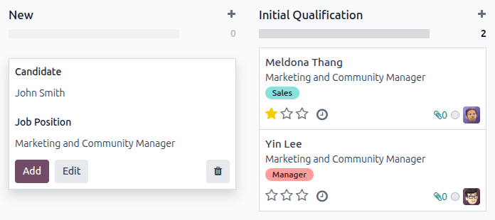

==================
Add new applicants
==================

Once an applicant submits an application, either using the online application, or emailing a job
position alias, an applicant card is automatically created in the *Recruitment* application.

However, in some instances, applicants may need to be created manually in the database. This could
be necessary if, for example, a company accepts paper applications in the mail, or is meeting
prospective applicants at an in-person job fair.

To view current applicants, navigate to the :menuselection:`Recruitment` app, then click the desired
job position card. Doing so reveals the :guilabel:`Applications` page, which displays all
applicants for that specific role, in a default Kanban view, organized by stage.

Add new applicants from a job position's :guilabel:`Applications` page by using either: the
:ref:`New <recruitment/create-new-applicant>` button or the :ref:`quick add
<recruitment/quick-add-applicant>` button.

.. _recruitment/quick-add-applicant:

Quick add
=========

On the :guilabel:`Applications` page, click the on the quick add button, represented by a small
:icon:`fa-plus` :guilabel:`(plus)` icon in the top-right corner of each stage to quickly add a new
applicant to that stage.

Enter the following information on the card:

- :guilabel:`Subject/Application`: enter the title for the card. Typically, this is the applicant's
  name, and job position being applied to. For example: `Laura Smith - HR Manager`. The text entered
  in this field is **not** visible in the Kanban view of the :guilabel:`Applications` page, unless
  the :guilabel:`Applicant's Name` field is left blank.
- :guilabel:`Applicant's Name`: enter the applicant's name. Displays as the card title in the
  Kanban view of the :guilabel:`Applications` page.
- :guilabel:`Email`: enter the applicant's email address.
- :guilabel:`Applied Job`: the current job position populates this field. If needed, the job
  position can be changed by selecting a different position from the drop-down menu. If a different
  job position is selected, after the card is created, the card appears on the
  :guilabel:`Applications` page for that newly-selected job position.

After the information is entered, click :guilabel:`Add`. The applicant appears in the list, and a
new blank applicant card appears.

If preferred, after entering the :guilabel:`Applicant's Name` in the Kanban card that appears, click
:guilabel:`Edit`, and a detailed applicant form loads. Refer to the :ref:`New applicant form
<recruitment/applicant-details>` section for details about filling out the form.

When doing a quick add, clicking away from an empty card, or clicking the :icon:`fa-trash-o`
(:guilabel:`trash`) icon, discards the applicant.

.. _recruitment/create-new-applicant:

New applicant form
==================

On the new applicant form, the :guilabel:`Subject / Application` field is populated with the
pre-selected job position, by default. Certain fields on the applicant card may also be
pre-populated, depending on how the job position is configured. Typically, the :guilabel:`Job`
section, as well as the :guilabel:`Recruiter` field, are pre-populated.

Complete the fields in the following sections on the new applicant form.

.. note::
   Depending on installed applications and configurations, some fields may **not** be displayed.

.. image:: add-new-applicants/new-applicant.png
   :align: center
   :alt: All the fields for a new applicant form entered.

.. _recruitment/applicant-details:

Applicant section
-----------------

- :guilabel:`Subject/Application Name`: this is the **only** required field. Enter the title for the
  card in this field. Typically, this is the applicant's name, and the job position being applied
  to. For example: `John Smith - Experienced Developer`. This field is **not** visible in the Kanban
  view of the :guilabel:`Applications` page, unless the :guilabel:`Applicant's Name` is left blank.
- :guilabel:`Applicant's Name`: enter the applicant's name. This field is displayed as the card
  title in the Kanban view of the :guilabel:`Applications` page.
- :guilabel:`Email`: enter the applicant's email address.
- :guilabel:`Phone`: enter the applicant's phone number.
- :guilabel:`Mobile`: enter the applicant's mobile number.
- :guilabel:`LinkedIn Profile`: enter the web address for the applicant's personal profile on
  LinkedIn.
- :guilabel:`Degree`: select the applicant's highest level of education from the drop-down menu.
  Options are: :guilabel:`Graduate`, :guilabel:`Bachelor Degree`, :guilabel:`Master Degree`, or
  :guilabel:`Doctoral Degree`. The :guilabel:`Graduate` option indicates the applicant graduated at
  the highest level of school before a Bachelor's degree, such as a high school or secondary school
  diploma, depending on the country.
- :guilabel:`Interviewers`: using the drop-down menu, select the people to conduct the interviews.
  The selected people **must** have either *recruiter* or *officer* rights configured for the
  *Recruitment* application to appear in the drop-down list. Refer to the :doc:`Access rights
  <../../general/users/access_rights>` documentation for more information.
- :guilabel:`Recruiter`: select the user responsible for the entire recruitment process for the job
  position.
- :guilabel:`Evaluation`: represents a rating for the applicant: one star (:icon:`fa-star`
  :icon:`fa-star-o` :icon:`fa-star-o`) is :guilabel:`Good`, two stars (:icon:`fa-star`
  :icon:`fa-star` :icon:`fa-star-o`) is :guilabel:`Very Good`, and three stars (:icon:`fa-star`
  :icon:`fa-star` :icon:`fa-star`)is :guilabel:`Excellent.`
- :guilabel:`Source`: using the drop-down menu, select where the applicant learned about the job
  position. The following options come pre-configured in Odoo: :guilabel:`Search engine`,
  :guilabel:`Lead Recall`, :guilabel:`Newsletter`, :guilabel:`Facebook`, :guilabel:`Twitter`,
  :guilabel:`LinkedIn`, :guilabel:`Monster`, :guilabel:`Glassdoor`, and :guilabel:`Craigslist`. To
  add a new :guilabel:`Source`, type in the source, then click :guilabel:`Create "(new source)"`.
- :guilabel:`Medium`: using the drop-down menu, specify how the job listing was found. The
  pre-configured options are: :guilabel:`Banner`, :guilabel:`Direct`, :guilabel:`Email`,
  :guilabel:`Facebook`, :guilabel:`Google Adwords`, :guilabel:`LinkedIn`, :guilabel:`Phone`,
  :guilabel:`Television`, :guilabel:`Twitter` (now known as "X"), or :guilabel:`Website`. To add a
  new :guilabel:`Medium`, type in the medium, then click :guilabel:`Create "(new medium)"`.
- :guilabel:`Referred By User`: if referral points are to be earned for this job position in the
  *Referrals* application, select the user who referred the applicant from the drop-down menu. The
  *Referrals* application **must** be installed for this field to appear.
- :guilabel:`Availability`: select the available start date for the applicant. To select a date,
  click on the field to reveal a popover calendar. Use the :icon:`fa-angle-left` :guilabel:`(left)`
  and :icon:`fa-angle-right` :guilabel:`(right)` arrows on either side of the month to navigate to
  the desired month, then click the desired date. Leaving this field blank indicates the applicant
  can start immediately.
- :guilabel:`Tags`: select as many tags as desired from the drop-down menu. To add a tag that does
  not exist, type in the tag name, then click :guilabel:`Create "new tag"` from the resulting
  drop-down menu.

Job section
-----------

The following fields are pre-populated when creating a new applicant, as long as these field are
specified on the job position form. Editing the fields is possible, if desired.

- :guilabel:`Applied Job`: select the job position the applicant is applying to from the drop-down
  menu.
- :guilabel:`Department`: select the department the job position falls under from the drop-down
  menu.
- :guilabel:`Company`: select the company the job position is for using the drop-down menu. This
  field **only** appears when in a multi-company database.

Contract section
----------------

- :guilabel:`Expected Salary`: enter the amount the applicant is requesting in this field. The
  number should be in a `XX,XXX.XX` format. The currency is determined by the localization setting
  for the company.

  - :guilabel:`Extra advantages...`: if any extra advantages are requested by the applicant, enter
    it in the :guilabel:`Extra advantages...` field to the right of the :guilabel:`Expected Salary`
    field. This should be short and descriptive, such as `1 week extra vacation` or `dental plan`.

- :guilabel:`Proposed Salary`: enter the amount to be offered to the applicant for the role in this
  field. The number should be in a `XX,XXX.XX` format.

  - :guilabel:`Extra advantages...`: if any extra advantages are offered to the applicant, enter it
    in the :guilabel:`Extra advantages...` field to the right of the :guilabel:`Proposed Salary`
    field. This should be short and descriptive, such as `unlimited sick time` or `retirement plan`.

Application Summary tab
-----------------------

Any additional details or notes that should be added to the applicant's card can be typed into this
field.

Skills tab
----------

Skills can be added to the applicant's card. For details on adding skills, refer to the
:ref:`Create new employees <employees/skills>` document.
