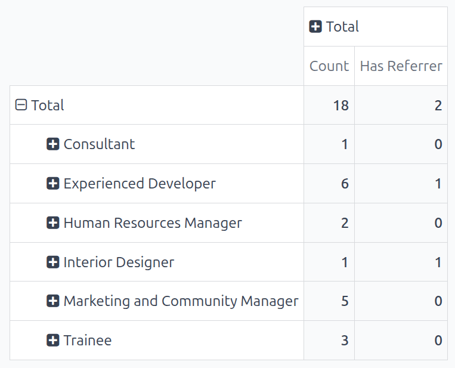
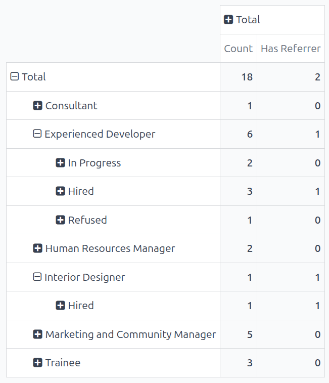

==================
Applicant analysis
==================

The *Applicant Analysis* report allows recruiting departments to see which job positions have the
most applicants, which have the most referrals, and how long it takes for applicants to move through
the pipeline.

Knowing how many applicants each specific job position has, along with statistics about how many are
hired and refused, can provide valuable insights. This information can assist the recruiting team to
pivot their strategies to acquire the most desirable candidates.

Applicant analysis report
=========================

Start by navigating to :menuselection:`Recruitment app --> Reporting --> Applicant Analysis`. This
presents a line chart of all applicants for the last year.

Three separate color-coded metrics are presented: :guilabel:`In Progress`, :guilabel:`Hired`, and
:guilabel:`Refused`.

Hover the cursor over a month of the chart, and a pop-up window appears, displaying the specific
numbers for that month.

Pivot table view
----------------

For a more detailed view of the information in the :guilabel:`Applicant Analysis` report, click the
:icon:`oi-view-pivot` :guilabel:`(Pivot)` icon in the top-right corner. This displays all the
information in a pivot table.

In this view, the job positions are displayed in the rows, and the columns display the total numbers
of applicants, including how many of those applicants were hired or refused, and who is still in the
recruitment process. The displayed information can be modified, if desired.

In this example, there are 18 total applicants. Out of that, six have been hired, two have been
refused, and ten are still in the recruitment pipeline. The :guilabel:`Experienced Developer`
position has six total applicants, three of which were hired, one refused, and two still in
progress.

.. image:: applicant_analysis/pivot-view.png
   :alt: The detailed pivot table view.

Use case: applicants with referrals
~~~~~~~~~~~~~~~~~~~~~~~~~~~~~~~~~~~

To get a better understanding of how effective the company's :doc:`referral program <../referrals>`
is, the :guilabel:`Applicant Analysis` report can be modified to show how many applicants were
referred by current employees.

From the :icon:`oi-view-pivot` :guilabel:`(Pivot)` view of the :guilabel:`Applicant Analysis`
report, first click the :guilabel:`Measures` button to reveal a drop-down menu of options.

Click both :guilabel:`Has Referrer` and :guilabel:`Count`, to activate those two measures. Then,
click :guilabel:`Applicant`, :guilabel:`Hired`, :guilabel:`In Progress` and :guilabel:`Refused` to
deactivate those default measures.

Now, the column displays the number of applicants that came from a referral in the :guilabel:`Has
Referrer` column, and the total number of applicants in the :guilabel:`Count` column.

In this example, the :guilabel:`Experienced Developer` and :guilabel:`Interior Designer` job
positions both have applicants from referrals, while the rest do not have any referrals.

Hired through referrals
***********************

It is possible to modify this report even further to see how many referred applicants end up being
hired.

To view this data, click on a :icon:`fa-plus-square` :guilabel:`[job position]` row, which reveals a
drop-down menu. Then, click :guilabel:`State` to show the various states applicants are currently
in.

.. note::
   Only states that have applicants in them are shown for each job position. If a state does **not**
   have any applicants, it does not appear in the list.

To expand the other rows, and display the various states, click on the :icon:`fa-plus-square`
:guilabel:`[job position]` button.

Both the :guilabel:`Experienced Developer` and :guilabel:`Interior Designer` roles yielded one
referral hire each, confirming that developers and designers generate the highest-success referrals.
