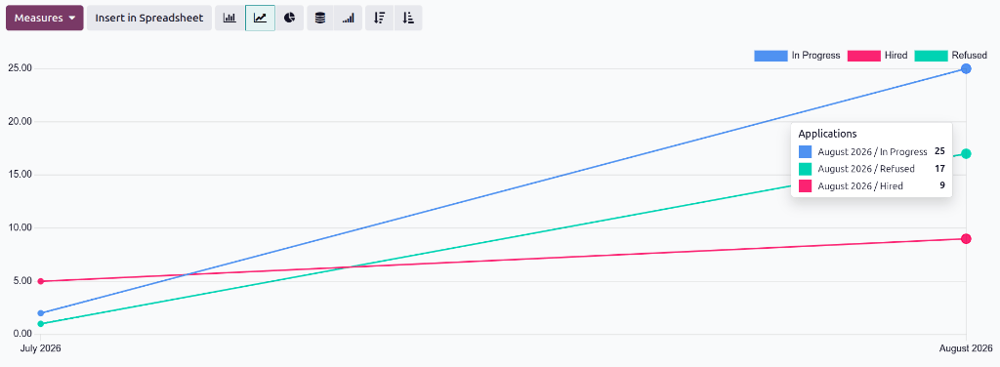
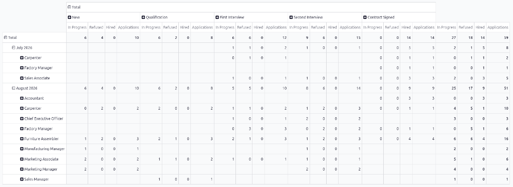
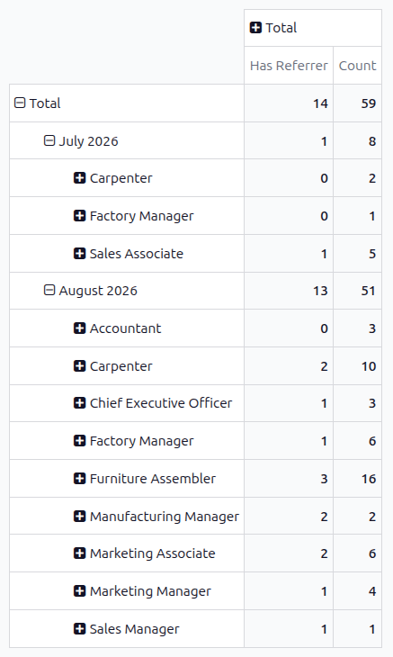

====================
Application analysis
====================

The *Application Analysis* report allows recruiting departments to see the total number of
applications submitted for the past 365 days. Along with the total, the number of hired applicants,
refused applicants, and those still in the pipeline are displayed.

This information can help the recruiting team see how the various rates align with their hiring
goals and pivot their strategies to acquire more desirable candidates.

Application Analysis report
===========================

To view the *Application Analysis* report, navigate to :menuselection:`Recruitment app --> Reporting
--> Application Analysis`. This presents a line chart of all applicants for the last 365 days.

Three separate color-coded metrics are presented: :guilabel:`In Progress` appears in blue,
:guilabel:`Hired` appears in red, and :guilabel:`Refused` appears in green.

Hover the cursor over a month of the chart, and an *Applications* pop-up window appears, displaying
the specific numbers for that month.

.. _recruitment/application_analysis/pivot:

Pivot table view
----------------

For a more detailed view of the information in the *Application Analysis* report, click the
:icon:`oi-view-pivot` :guilabel:`(Pivot)` icon in the corner. This displays all the information in a
pivot table.

In this default view, the months are displayed in the rows, with each job position nested beneath
them. The columns display the various stages of the recruitment pipeline, further divided by how
many applicants were hired, refused, or still in process while in that stage. The displayed
information can be modified, if desired.

.. tip::
   To only view the total number of applicants in each stage, click :icon:`fa-minus-square-o`
   :guilabel:`Total` in the top row. All the stages collapse, displaying only the total number of
   applications that are :guilabel:`In Progress`, :guilabel:`Hired`, and :guilabel:`Refused`, along
   with the totals for all three in the :guilabel:`Applications` column. These numbers are organized
   by month, then job position.

   In this example, of the fourteen newly hired employees, the :guilabel:`Furniture Assembler`
   position had the most new hires, with a total of four.

   .. image:: application_analysis/pivot-collapsed.png
      :alt: The pivot table showing only the totals in the columns.

Use case: applicants with referrals
~~~~~~~~~~~~~~~~~~~~~~~~~~~~~~~~~~~

To get a better understanding of how effective the company's :doc:`referral program <../referrals>`
is, the *Application Analysis* report can be modified to show how many applicants were referred by
current employees.

From the :ref:`pivot table view <recruitment/application_analysis/pivot>` of the *Application
Analysis* report, first click the :guilabel:`Measures` :icon:`fa-caret-down` button to reveal a
drop-down menu of options.

Click both :guilabel:`Has Referrer` and :guilabel:`Count` to activate those two measures. Then,
click :guilabel:`Applications`, :guilabel:`Hired`, :guilabel:`In Progress`, and :guilabel:`Refused`
to deactivate those default measures. Click away from the drop-down window to close it. Then click
:icon:`fa-minus-square-o` :guilabel:`Total` above the columns to condense all the displayed values.

Now, the columns display the number of applicants that came from a referral in the :guilabel:`Has
Referrer` column, and the total number of applicants in the :guilabel:`Count` column.

In this example, the :guilabel:`Furniture Assembler` job position has the most referrals, and almost
25% of all applications were submitted through a referral.

Hired through referrals
***********************

It is possible to modify this report even further to see how many referred applicants end up being
hired.

To view this data, click on a :icon:`fa-plus-square` :guilabel:`(job position)` row, which reveals a
drop-down menu. Then, click :guilabel:`State` to show the various states applicants are currently
in.

To expand the other rows and display the various states, click on the :icon:`fa-plus-square`
:guilabel:`(job position)` button.

.. note::
   Only states that have applicants in them are shown for each job position. If a state does **not**
   have any applicants, it does not appear in the list.
