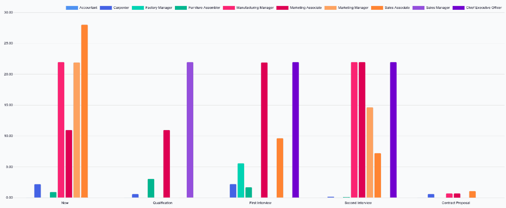
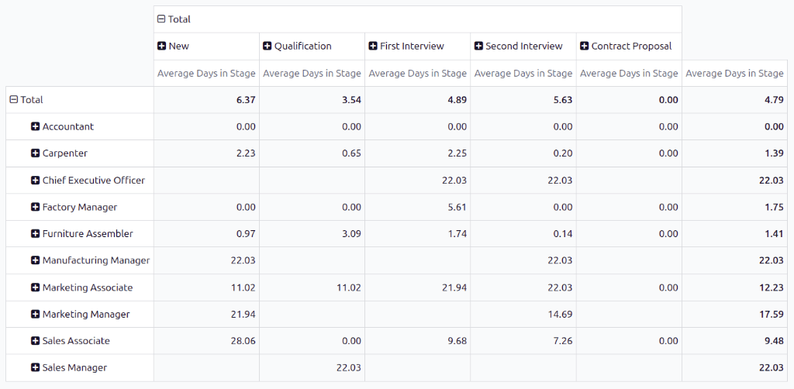
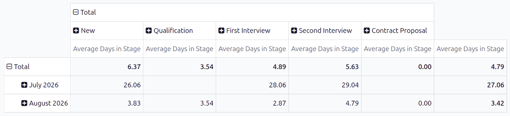

===============
Hiring velocity
===============

The *Hiring Velocity* report provides information on how long applicants stay in each stage of the
recruitment process. This is important, as every job position has specific :ref:`hiring process
details <recruitment/new_job/hiring-process>` that state the length of time applicants should expect
to wait between specific stages.

Knowing how long applicants remain in each stage can help highlight possible bottlenecks. Analyzing
this data allows the recruitment team to assess each stage, identify any issues, and pivot their
strategies to move applicants through each stage, within the expected time interval.

Hiring velocity report
======================

To access the *Hiring Velocity* report, navigate to :menuselection:`Recruitment app --> Reporting
--> Hiring Velocity`. The report displays data for all job positions, with the stages populating the
x-axis, and the number of days populating the y-axis, in a default :icon:`fa-line-chart`
:guilabel:`(Line Chart)`.

The default filter is :guilabel:`Last 365 Days Applicant`, showing information for the last 365
days.

Hover over a stage in the line chart to reveal a popover window listing all the job positions within
it, and the average number of days each job position sat in each stage.

For a more visually digestible view of the information in the *Hiring Velocity* report, click the
:icon:`fa-bar-chart` :guilabel:`(Bar Chart)` icon in the corner. This displays all the information
in a bar chart.

In this view, it is easier to visualize the differences between the job positions, regarding how
long applicants stay in each stage. From this view, recruiters can determine which job positions
have delays or bottlenecks at certain stages.

Use case: comparing times by month
----------------------------------

With the *Hiring Velocity* report, it is possible to see if there are certain months where
applicants take longer to be moved through the pipeline. To view this data, switch to the pivot
table view by clicking the :icon:`oi-view-pivot` :guilabel:`(Pivot)` icon in the corner.

This presents the data in a detailed pivot table, with the rows representing the different job
positions, and the columns representing the stages. The :guilabel:`Average Days in Stage` populates
the various boxes.

.. note::
   If a field is empty, it indicates no applicant has been in that stage. Instead, all applicants
   moved from a previous stage without being placed in the stage with an empty field.

Click :icon:`fa-minus-square-o` :guilabel:`Total` above the job position rows to collapse the
information. Next, click :icon:`fa-plus-square` :guilabel:`Total` again, revealing a drop-down menu.
Click :guilabel:`Custom Group` :icon:`fa-caret-down` at the bottom of the list, revealing further
grouping options. Click :guilabel:`Start Date` from the expanded list.

After doing so, the data presented is grouped with the various months from the previous 365 days for
the rows, leaving the :guilabel:`Average Days in Stage` as the columns.

In this example, :guilabel:`July 2026` had the longest time that applicants spent in each stage, on
average. In addition, the :guilabel:`Second Interview` stage had the longest wait time in July, with
an average of :guilabel:`29.04` days in that stage.

While this report does not display the reasons applicants stayed in the various stages for these
lengths of time, it can be helpful to know when delays occur.

.. seealso::
   :doc:`Essentials reporting documentation <../../essentials/reporting>`
