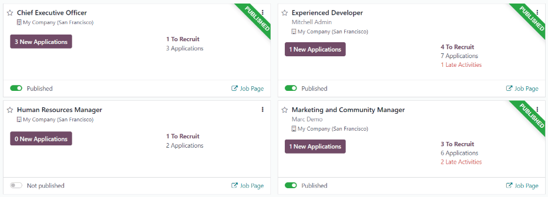
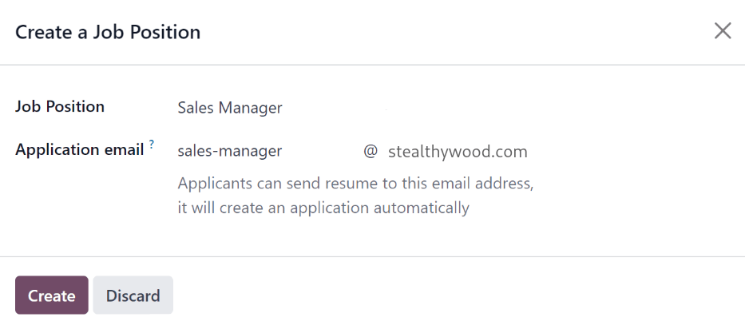
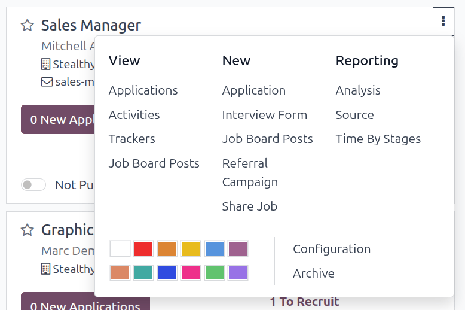
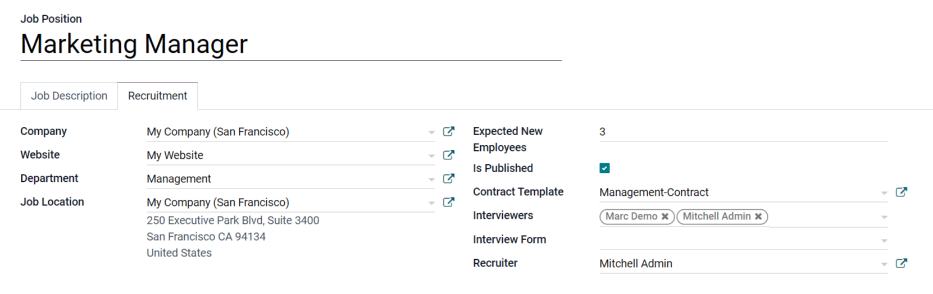
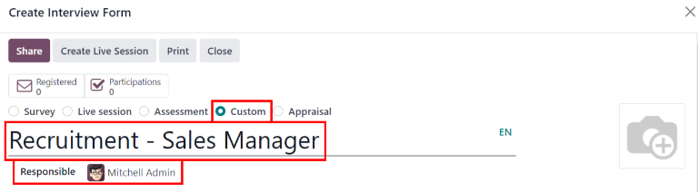
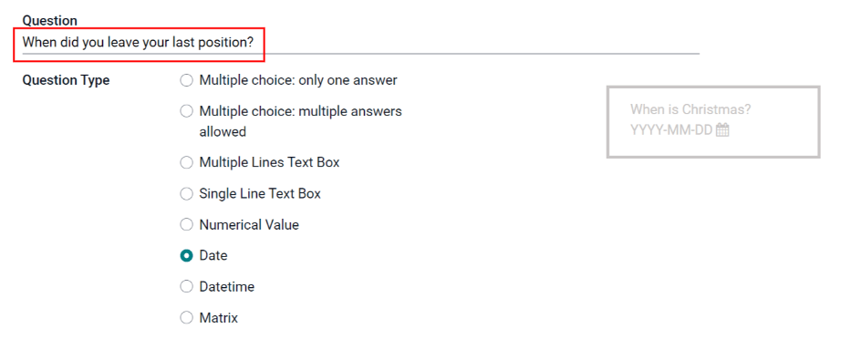
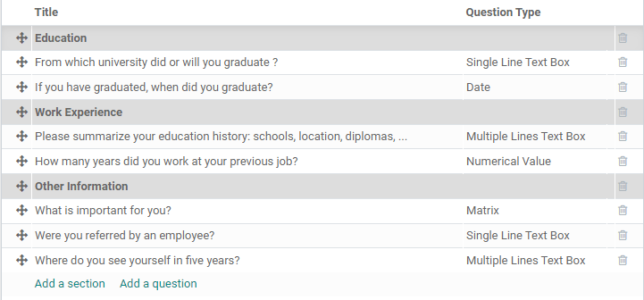
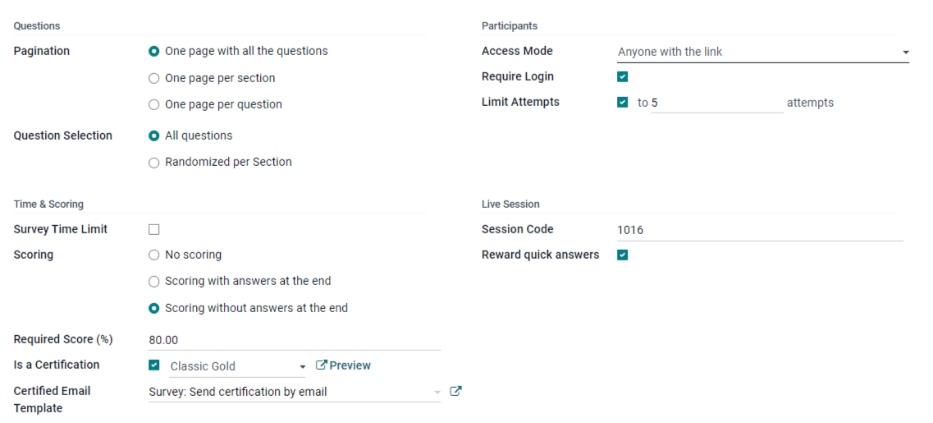

=============
Job positions
=============

In the default :menuselection:`Recruitment` dashboard view, all job positions are shown, regardless
of status. Current published positions with active applicants are shown, as well as job positions
that have been created but have not yet been published.

Each job position is shown in an individual kanban card. If the job position is active and
candidates can apply, then a :guilabel:`Published` banner will appear in the top-right corner of the
card.

View submitted applications by clicking anywhere on a job position card.

Create a new job position
=========================

Create a new job position from the main Recruitment dashboard by clicking the :guilabel:`New` button
in the top-left corner.

Then, a :guilabel:`Create a Job Position` pop-up window will appear. From here, enter the name of
the position (such as `Sales Manager`, `Mechanical Engineer`, etc.). When complete, click the
:guilabel:`Create` button to save the entry, or the :guilabel:`Discard` button to delete it.

Once the job position has been created, it will appear as a card in the kanban view on the main
:guilabel:`Recruitment` dashboard.

Edit a new job position
-----------------------

After the job position is created, it's time to enter the details for the position. Click on the
:guilabel:`⋮ (three dots)` icon in the upper-right corner of the relevant card to reveal several
options, and then click :guilabel:`Configuration` to edit the details.

Enter the job description in the :guilabel:`Job Summary` tab. This information is what is visible to
potential applicants when searching for available jobs.

Recruitment
~~~~~~~~~~~

All the basic information about the job position is listed under the :guilabel:`Recruitment` tab.
None of the fields are required, but it is a good idea to provide at least a few details, such as
where the job is located.

The fields can be filled out as follows:

- :guilabel:`Department`: select the relevant department for the job position.
- :guilabel:`Job Location`: select the physical address for the job.
- :guilabel:`Employment Type`: select what type of position the job is, such as
  :guilabel:`Full-Time`, :guilabel:`Part-Time`, etc.
- :guilabel:`Company`: select the company the job is for.
- :guilabel:`Target`: enter the number of employees to be hired for this position.
- :guilabel:`Is Published`: activate this option to publish the job online.
- :guilabel:`Website`: select the website where the job will be published.
- :guilabel:`Recruiter`: select the person who will be doing the recruiting for this role.
- :guilabel:`Interviewers`: select who should perform the interview(s). Multiple people can be
  selected.
- :guilabel:`Interview Form`: select an :ref:`Interview form <interview>` that applicants will fill
  out prior to their interview.
- :guilabel:`Contract Template`: select a contract template that will be used when offering the job
  to a candidate.
- :guilabel:`Process Details` section: this section contains information that is displayed online
  for the job position. This informs the applicants of the timeline and steps for the recruitment
  process, so they know when to expect a reply.

  - :guilabel:`Time to Answer`: enter the number of days before the applicant is contacted.
  - :guilabel:`Process`: enter the various stages the candidate will go through during the
    recruitment process.
  - :guilabel:`Days to get an Offer`: enter the number of days before the applicant should expect
    an offer after the recruitment process has ended.

.. note::
   The :guilabel:`Process Details` section is a text field. All answers are typed in rather than
   selected from a drop-down menu. The text is displayed on the website exactly as it appears in
   this tab.

.. _interview:

Create interview form
---------------------

An *Interview Form* is used to determine if a candidate is a good fit for a job position. Interview
forms can be as specific or general as desired, and can take the form of a certification, an exam,
or a general questionnaire. Interview forms are determined by the recruitment team.

All interview forms must be created, there are no pre-configured forms in Odoo. To create an
interview form, start from the recruitment tab of the :guilabel:`Job Position` form. In the
:guilabel:`Interview Form` field, enter a name for the new interview form. As the name is typed,
several options populate beneath the entry, :guilabel:`Create (interview form name)`,
:guilabel:`View all`, and :guilabel:`Create and edit...`. Click :guilabel:`Create and edit...`. and
a :guilabel:`Create Interview Form` pop-up window appears.

.. note::
   The option :guilabel:`View all` only appears if there are any interview forms already created.
   If no interview forms exist, the only options available are :guilabel:`Create (interview form
   name)`, and :guilabel:`Create and edit...`.

First, enter a name for the form in the :guilabel:`Name` field. This should be indicative of when
the form should be used. For example, is the form specific to a job position, or is it a general
form that can be used for all recruitment scenarios?

Next, select what kind of interview form is being created. The default is :guilabel:`Custom`, which
is pre-selected. The various options are :guilabel:`Survey`, :guilabel:`Live session`,
:guilabel:`Assessment`, :guilabel:`Custom`, and :guilabel:`Appraisal`.

Then select the person responsible for the form from the drop-down menu for the
:guilabel:`Responsible` field.

If desired, an image can be added to the interview form. Mouse over the camera icon on the far right
and a :guilabel:`✏️ (pencil)` icon appears. Click the :guilabel:`✏️ (pencil)` icon and a file
explorer window appears. Navigate to the desired image file, then click :guilabel:`Open` to select
it.

Questions
~~~~~~~~~

In the :guilabel:`Questions` tab, click on :guilabel:`Add a section` to add a section to the form. A
line appears, and a section heading can be entered. When complete, click off the line, or press
enter to lock in the new section on the form.

Next, click :guilabel:`Add a question` to add a question to the section. A :guilabel:`Create
Sections and Questions` pop-up window appears where the question details are entered. Type out the
question in the top line.

There are several :guilabel:`Question Types` to choose from:

- :guilabel:`Multiple choice: only one answer`: a multiple choice question that only allows the
  candidate to select one answer
- :guilabel:`Multiple choice: multiple answers allowed`: a multiple choice question that allows the
  candidate to select multiple answers
- :guilabel:`Multiple Lines Text Box`: allows the applicant to enter several lines of text
- :guilabel:`Single Line Text Box`: limits the applicant to only a single line of text
- :guilabel:`Numerical Value`: only allows a number to be entered
- :guilabel:`Date`: a calendar module is presented to select a date
- :guilabel:`Datetime`: a calendar module and a clock icon is presented to select a date and time
- :guilabel:`Matrix`: a customizable table that allows the candidate to choose an answer for each
  row

After selecting a question type, a sample question appears in gray. This represents how the question
will be displayed to applicants.

Questions and sections can be reorganized. Move them by clicking and dragging individual section
headings or question lines to their desired position(s).

Sections are indicated by a gray background, while questions have a white background.

Answers
*******

If :guilabel:`Multiple choice: only one answer`, :guilabel:`Multiple choice: multiple answers
allowed`, :guilabel:`Single Line Text Box`, or :guilabel:`Matrix` is selected for the
:guilabel:`Question Type`, an :guilabel:`Answers` tab appears beneath the question. If another
question type is selected, the :guilabel:`Answers` tab remains hidden from view.

.. tabs::

   .. tab:: Multiple choice

      For both the :guilabel:`Multiple choice: only one answer` and :guilabel:`Multiple choice:
      multiple answers allowed` question type, the answers are populated in the same way.

      First, in the :guilabel:`Answers` tab, click :guilabel:`Add a line`. A line appears, and an
      answer can be entered. After typing in the answer, click off the line, or press enter to lock
      in the new answer on the form and have another answer line appear.

      If desired, an image can be attached to the answer. Click on a line to select it, and an
      :guilabel:`Upload your file` button appears on the right side. Click the :guilabel:`Upload
      your file` button and a file explorer window appears. Navigate to the image file, select it,
      then click :guilabel:`Open` to select it.

      Repeat this for all the answers to be added for the multiple choice question. The answers can
      be rearranged in any order. To move an answer, click on the six small squares on the far left
      of each answer line, and drag the answer to the desired position. The order the answers appear
      in the form is the order the answers will appear online.

      To delete a line, click on the :guilabel:`🗑️ (trash can)` icon on the far right side of the
      answer line.

      .. image:: new_job/multi-answers.png
         :align: center
         :alt: Answers to a multiple choice question, where each line has a different answer listed.

   .. tab:: Single Line Text Box

      If the :guilabel:`Single Line Text Box` question type is selected, only two checkboxes appear
      in the :guilabel:`Answers` tab:

      - :guilabel:`Input must be an email`: activate this option if the answer must be in the format
        of an email address.

        - :guilabel:`Save as user email?`: this option appears if :guilabel:`Input must be an email`
          is selected. This saves the email entered on the form as the user's email, and will be
          used anytime Odoo contacts the user via email.

      - :guilabel:`Save as user nickname?`: activate this option to populate the answer as the
        user's nickname. This is stored and used anywhere Odoo uses a nickname.

      .. image:: new_job/single-line.png
         :align: center
         :alt: The three possible checkboxes that can appear if a single line of text is selected
               for the question type.

   .. tab:: Matrix

      Sometimes, a question is asked that does not fit a standard answer format, and is best suited
      for a matrix. For example, asking an applicant what is their availability to work compared to
      the various shifts is a perfect question for a matrix format. In this example, an applicant
      can click on all the shifts they are available to work.

      For a :guilabel:`Matrix` question type, there are two sets of data that need to be input. The
      rows and columns must both be configured. The columns are represented by the
      :guilabel:`Choices` section, while the rows are configured in the :guilabel:`Rows` section.

      The method for populating both sections is the same. In the :guilabel:`Answers` tab, click
      :guilabel:`Add a line` in either the :guilabel:`Choices` or :guilabel:`Row` section.  A line
      appears, and an answer can be entered. After typing in the answer, click off the line, or
      press enter to lock in the new answer on the form and have another answer line appear. Repeat
      this for all answers for both the :guilabel:`Choices` and :guilabel:`Rows` sections.

      .. figure:: new_job/matrix.png
         :align: center

         This is an example matrix that asks an applicant what shifts they are available to work on
         Saturdays and Sundays, either morning, afternoon, or evening.

Description
***********

Enter any information that may be helpful to an applicant. This description will appear for this
specific question only, and therefore should be question-specific and not generalized.

Options
*******

To view the options that are available to set for a question, click on the :guilabel:`Options` tab.
The :guilabel:`Layout`, :guilabel:`Constraints`, and :guilabel:`Live Sessions` sections are
universal for all :guilabel:`Question Types`, while the :guilabel:`Answers` tab is specific to the
:guilabel:`Question Type` selected, and changes based on the selection.

Answers
^^^^^^^

- :guilabel:`Multiple choice: only one answer` and :guilabel:`Multiple choice: multiple answers
  allowed`: a :guilabel:`Show Comments Field` option appears. Activate the option to allow the
  applicant to answer the question by typing in an answer (or comment). A :guilabel:`Comment
  Message` and :guilabel:`Comment is an answer` field appear if activated. Enter the text to appear
  in the :guilabel:`Comment Message` field. This should be helpful to the applicant, such as `If
  other, please specify`. Last, if the comment should be logged as the applicant's answer, activate
  the box.
- :guilabel:`Multiple Lines Text Box`: a :guilabel:`Placeholder` field appears. Enter any text that
  should appear with the question to help clarify how the applicant should answer.
- :guilabel:`Single Line Text Box` and :guilabel:`Numerical Value`: a :guilabel:`Validate entry`
  option appears. Activate this option if what the applicant enters must be a numerical value, *and*
  needs to be verified. The answer can *only* be verified if it is a numerical entry. When
  activated, several other options appear. Enter the values for the :guilabel:`Min/Max Limits` in
  the two fields. Next, enter the text that appears when the answer given does not fit within the
  designated minimum and maximum parameters. Last, enter any text in the :guilabel:`Placeholder`
  field to provide any additional information or directions to assist the applicant.
- :guilabel:`Date` and :guilabel:`Datetime`: a :guilabel:`Validate entry` option appears. Activate
  this option if the applicant's answer needs to be verified. When activated, several other options
  appear. Enter the date ranges for the :guilabel:`Min/Max Limits` in the two fields. Click on
  a field, either the :guilabel:`minimum` or :guilabel:`maximum`, and a calendar appears. Select the
  dates for the corresponding fields. Next, enter the text that appears when the answer given does
  not fit within the designated minimum and maximum dates. Last, enter any text in the
  :guilabel:`Placeholder` field to provide any additional information or directions to assist the
  applicant.
- :guilabel:`Matrix`: the first option that appears is :guilabel:`Matrix Type`. Select either
  :guilabel:`One choice per row` or :guilabel:`Multiple choices per row` using the drop-down menu.
  The next option is :guilabel:`Show Comments Field`. Activate the option if there should be a
  comment displayed to the applicant. If activated, a :guilabel:`Comment Message` and
  :guilabel:`Comment is an answer` field appear. Enter the text to appear in the :guilabel:`Comment
  Message` field. This should be an instruction helpful to the applicant, such as `If other, please
  specify`. Last, if the comment should be logged as the applicant's answer, activate the box.

Constraints
^^^^^^^^^^^

If the question is required to be answered by the applicant, activate the box next to
:guilabel:`Mandatory Answer`. An :guilabel:`Error message` field appears, with some example text in
gray (*This question requires an answer*). Enter the message that should appear if the applicant
attempts to move on to the next question without answering this required one. The text should
explain that the question must be answered.

Layout
^^^^^^

If the question should only appear if a previous question is answered in a specific way, activate
the :guilabel:`Conditional Display` option. A new :guilabel:`Triggering Question` field appears.
Using the drop-down menu, select the previous question this new question is linked to. Once a
previous question is selected, a :guilabel:`Triggering Answer` field appears. Select the answer that
must be selected in order for the new question to appear.

.. example::
   To further illustrate a triggering question, the following is an example that is applicable to
   recruitment. The question, `Do you have experience with managing a sales team?` is already
   added. A new question is then added, `How many years of experience?`. This question should *only*
   appear if the applicant selected `Yes` to the question `Do you have prior experience managing a
   sales team?`.

   To properly configure this example, activate the :guilabel:`Conditional Display` option. Then,
   select `Do you have experience with managing a sales team?` as the :guilabel:`Triggering
   Question`. Then, select :guilabel:`Yes` for the triggering answer.

   .. image:: new_job/layout.png
      :align: center
      :alt: The layout field when properly configured for a conditional question.

Live Sessions
^^^^^^^^^^^^^

If the question is for a live session, activate the :guilabel:`Question Time Limit` option. A
:guilabel:`seconds` field appears. Enter the amount of time allotted for the applicant to enter the
answer, in seconds.

Options
~~~~~~~

Next, configure the various options for the interview form. Click the :guilabel:`Options` tab to
view all the options to configure, by category.

Questions
*********

- :guilabel:`Pagination`: choose how the questions should be displayed.

  - :guilabel:`One page per question`: display a single question on each page.
  - :guilabel:`One page per section`: display each section with the corresponding questions on an
    individual page.
  - :guilabel:`One page with all the questions`: display all sections and questions at the same
    time.

- :guilabel:`Display Progress as`: choose how to display the percentage of questions remaining to
  answer. This option only appears if either :guilabel:`One page per question` or :guilabel:`One
  page per section` is selected for :guilabel:`Pagination`.

  - :guilabel:`Percentage left`: display the remaining amount in a percentage (%).
  - :guilabel:`Number`: display the remaining amount in a numerical value.

- :guilabel:`Question Selection`: choose which questions are presented.

  - :guilabel:`All questions`: display the entire form, with all questions form all sections.
  - :guilabel:`Randomized per Section`: display only a random selection of questions from each
    section.

- :guilabel:`Back Button`: activate this option if the applicant is able to click a back button to
  go back to previous questions.

.. note::
   Although it is a selectable option, the :guilabel:`Randomized per section` option should only be
   used if receiving partial information/an incomplete survey from every applicant is acceptable to
   the business.

Time & Scoring
**************

- :guilabel:`Survey Time Limit`: activate this option to limit the time allowed to complete the
  form. When selected, a field to enter the minutes appears next to the checked box. Enter the time
  (using an XX:XX minute/second format) in the field.
- :guilabel:`Scoring`: choose how the questions should be scored.

  - :guilabel:`No scoring`: select this option to not score the form.
  - :guilabel:`Scoring with answers at the end`: select this option to score the form and display
    the correct answers for the candidate when they are finished with the form.
  - :guilabel:`Scoring without answers at the end`: select this option to score the form but not
    display the answers to the candidate.

- :guilabel:`Required Score (%)`: this option appears if one of the scoring options was selected.
  Enter the percentage the candidate needs to pass the exam (example, 80.00%). The entry should be
  written in an “XX.XX” format.

- :guilabel:`Is a Certification`: activate this option if the form is a certification exam. When
  activated, a drop-down menu appears next to the checkbox. Select one of the default formats for
  the PDF certificate that will be sent to the candidate after completing the certification exam.
  Click the :guilabel:`Preview` button to view an example of the PDF certificate.
- :guilabel:`Certified Email Template`: if the :guilabel:`Is a Certification` box is activated, a
  :guilabel:`Certified Email Template` appears. Select the email template from the drop-down menu
  that is to be used when the applicant passes the test. Click the :guilabel:`External Link` icon to
  the right of the email template to preview the email.

Participants
************

- :guilabel:`Access Mode`: specify who can access the exam. Either :guilabel:`Anyone with the link`
  or :guilabel:`Invited people only`.
- :guilabel:`Require Login`: activate this option to require candidates to log in before taking the
  exam, whether they have a valid token or not.
- :guilabel:`Limit Attempts`: if there is a limit to how many times the exam can be taken, activate
  this box, then enter the maximum attempt number in the field next to it.

Live Session
************

- :guilabel:`Session Code`: enter the access code that will allow the viewers into the live exam
  session.
- :guilabel:`Session Link`: the link appears in a box next to the :guilabel:`Session Link` option.
  Click the :guilabel:`Copy` button to copy the link.
- :guilabel:`Reward quick answers`: if the exam is to be taken live, activate this option to award
  more points to participants who answer quickly.

After all fields have been entered, click the :guilabel:`Save` button to save the changes, or click
:guilabel:`Discard` to delete the changes.

Description
~~~~~~~~~~~

When the applicant begins the survey, the text entered in this tab appears at the top of the survey
page. Enter any information or descriptions that would be helpful to the applicant.

End Message
~~~~~~~~~~~

After the survey is complete, the message entered in this tab is displayed for the applicant.
