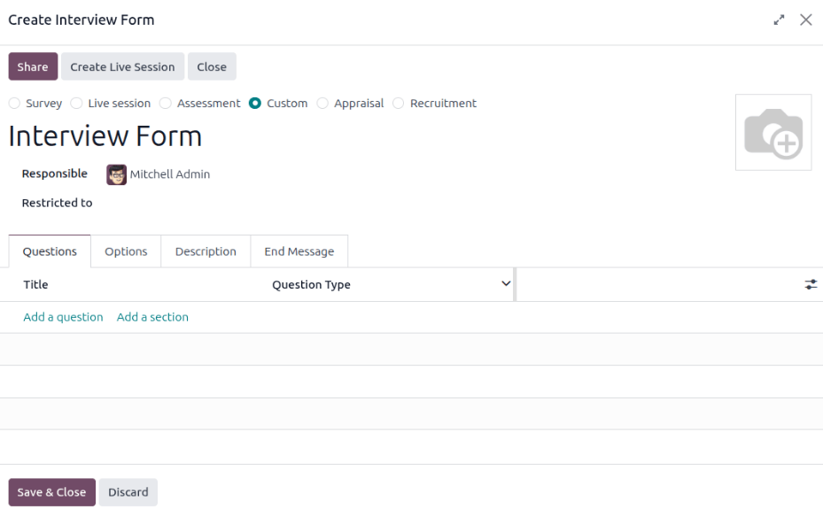

=============
Job positions
=============

In Odoo *Recruitment*, all job positions are shown on the default dashboard in the *Recruitment*
app. This includes positions that are being actively recruited for, as well as inactive positions.

Each job position is shown in an individual Kanban card. If the job position is active, and
candidates can apply, a :guilabel:`Published` banner appears in the top-right corner of the card.

View submitted applications by clicking anywhere on a job position card.

.. image:: new_job/jobs.png
   :align: center
   :alt: Main dashboard view of Recruitment app showing all job positions.

Create a new job position
=========================

To create a new job position from the main dashboard in the *Recruitment* app, click the
:guilabel:`New` button in the top-left corner, and a :guilabel:`Create a Job Position` modal
appears.

First, enter the name of the :guilabel:`Job Position` (such as `Sales Manager`, `Mechanical
Engineer`, etc.) in the field.

Next, enter an :guilabel:`Application email` by typing in the first half of the email address in the
first field, then select the second half of the email using the drop-down menu in the second field.
Applicants can send a resumé to this specific email address, and Odoo creates an application for
them automatically.

When complete, click the :guilabel:`Create` button to save the entry, or the :guilabel:`Discard`
button to delete it.

.. image:: new_job/job-title.png
   :align: center
   :alt: Create a new job position.

Once the job position has been created, it appears as a card in the Kanban view on the main
*Recruitment* app dashboard.

Edit a new job position
-----------------------

After the job position is created, it's time to enter the details for the position. Click on the
:guilabel:`⋮ (three dots)` icon in the upper-right corner of the relevant card to reveal several
options, and then click :guilabel:`Configuration` to edit the details.

.. image:: new_job/edit-job.png
   :align: center
   :alt: Edit the job position card.

All the basic information about the job position is listed under the :guilabel:`Recruitment` tab.

None of the fields are required, but it is important to configure and populate the
:guilabel:`Department`, :guilabel:`Location`, :guilabel:`Employment Type`, and :guilabel:`Job
Summary` fields, as they are all visible to prospective applicants on the website.

The fields can be filled out as follows:

- :guilabel:`Department`: select the relevant department for the job position. This is visible on
  the website.
- :guilabel:`Job Location`: select the physical address for the job. If the job position is remote,
  leave this field blank. This is visible on the website.
- :guilabel:`Email Alias`: enter an email address to which applicants can send a resumé. Once
  emailed, Odoo automatically creates an application for them.
- :guilabel:`Employment Type`: select what type of position the job is, using the drop-down menu.
  The default options are :guilabel:`Permanent`, :guilabel:`Temporary`, :guilabel:`Seasonal`,
  :guilabel:`Interim`, :guilabel:`Full-Time`, and :guilabel:`Part-Time`. This is visible on the
  website.
- :guilabel:`Company`: select the company the job is for. This field only appears if using a
  multi-company database.
- :guilabel:`Target`: enter the number of employees to be hired for this position.
- :guilabel:`Is Published`: activate this option to publish the job online.
- :guilabel:`Website`: select the website the job is published on.
- :guilabel:`Recruiter`: select the person responsible for recruiting this role.
- :guilabel:`Interviewers`: select who should perform the interviews. Multiple people can be
  selected.
- :guilabel:`Interview Form`: select an :ref:`Interview form <recruitment/interview>` that
  applicants fill out prior to their interview.
- :guilabel:`Contract Template`: select a contract template to be used when offering the job to a
  candidate.
- :guilabel:`Process Details` section: this section contains information that is displayed online
  for the job position. This informs the applicants of the timeline and steps for the recruitment
  process, so they know when to expect a reply.

  - :guilabel:`Time to Answer`: enter the number of days before the applicant is contacted.
  - :guilabel:`Process`: enter the various stages the candidate goes through during the recruitment
    process.
  - :guilabel:`Days to get an Offer`: enter the number of days before the applicant should expect
    an offer after the recruitment process has ended.

.. note::
   The :guilabel:`Process Details` section is a text field. All answers are typed in rather than
   selected from a drop-down menu. The text is displayed on the website exactly as it appears in
   this tab.

Finally, enter the job description in the :guilabel:`Job Summary` tab.

.. image:: new_job/recruitment-tab.png
   :align: center
   :alt: Enter job information details in the recruitment tab.

.. _recruitment/interview:

Create interview form
---------------------

An *Interview Form* is used to determine if a candidate is a good fit for a job position. Interview
forms can be as specific or general as desired, and can take the form of a certification, an exam,
or a general questionnaire. Interview forms are determined by the recruitment team.

Before creating an interview form, ensure the proper settings are enabled. Navigate to
:menuselection:`Recruitment app --> Configuration --> Settings`, and under the
:guilabel:`Recruitment Process` section, ensure the :guilabel:`Send Interview Survey` option is
enabled.

Since there are no pre-configured forms in Odoo, all interview forms must be created. To create an
interview form, start from the :guilabel:`Recruitment` tab of the :guilabel:`Job Position` form. In
the :guilabel:`Interview Form` field, enter a name for the new interview form. As the name is typed,
several options populate beneath the entry: :guilabel:`Create (interview form name)`,
:guilabel:`Search More...`, and :guilabel:`Create and edit...`. Click :guilabel:`Create and edit...`
and a :guilabel:`Create Interview Form` modal appears.

.. note::
   The option :guilabel:`Search More...` only appears if there are any interview forms already
   created. If no interview forms exist, the only options available are :guilabel:`Create (interview
   form name)`, and :guilabel:`Create and edit...`.

Proceed to fill out the modal interview form as a typical survey. For specific directions on how to
create a survey, refer to the :doc:`survey essentials <../../marketing/surveys/create>` document,
which provides step-by-step instructions on how to create and configure a survey.
