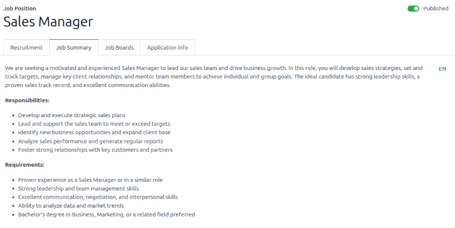
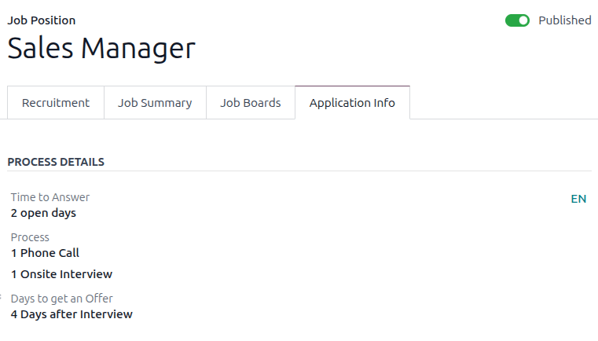

=============
Job positions
=============

In Odoo's **Recruitment** application, all job positions are shown on the default dashboard in the
**Recruitment** app, which includes both active and inactive positions.

Each job position is shown in an individual Kanban card. If the job position is active, and
candidates can apply, a :guilabel:`PUBLISHED` banner appears in the top-right corner of the card.

View submitted applications by clicking anywhere on a job position card.

.. image:: new_job/jobs.png
   :alt: Main dashboard view of Recruitment app showing all job positions.

Create a new job position
=========================

To create a new job position from the main dashboard in the **Recruitment** app, click the
:guilabel:`New` button in the top-left corner, and a :guilabel:`Create a Job Position` pop-up window
appears.

First, enter the name of the :guilabel:`Job Position` (such as `Sales Manager`, `Mechanical
Engineer`, etc.) in the field.

Next, enter an :guilabel:`Application email` by typing in the first half of the email address in the
first field, then select the second half of the email using the drop-down menu in the second field.
Applicants can send a resumé to this specific email address, and Odoo creates an application for
them automatically.

When complete, click the :guilabel:`Create` button to save the entry, or the :guilabel:`Discard`
button to delete it.

.. image:: new_job/job-title.png
   :alt: Create a new job position.

Once the job position has been created, it appears as a card in the Kanban view on the main
**Recruitment** app dashboard.

.. _recruitment/new_job_position/edit:

Edit a new job position
-----------------------

After the job position is created, it is time to enter the details for the position. Click on the
:icon:`fa-ellipsis-v` :guilabel:`(Dropdown menu)` icon in the upper-right corner of the relevant
card to reveal several options, and then click :guilabel:`Configuration` to edit the details.

.. image:: new_job/edit-job.png
   :alt: Edit the job position card.

.. note::
   The top-right corner of the card has a toggle to publish the job position to the website. If the
   job position is published, a green :guilabel:`Published` toggle is visible. If the job position
   is *not* published a gray :guilabel:`Not Published` toggle appears. Click the toggle to publish
   or unpublish the job position.

Recruitment tab
~~~~~~~~~~~~~~~

All the basic information about the job position is listed under the :guilabel:`Recruitment` tab.

None of the fields are required, but it is important to configure and populate the
:guilabel:`Department`, :guilabel:`Job Location`, :guilabel:`Employment Type` fields, and the
:guilabel:`Job Summary` tab, as they are all visible to prospective applicants on the website.

.. note::
   Some fields listed below may not appear depending on the database configuration and other
   installed applications.

The fields can be filled out as follows:

- :guilabel:`Department`: Select the relevant department for the job position. This is visible on
  the website.
- :guilabel:`Job Location`: Select the physical address for the job. If the job position is remote,
  leave this field blank. This is visible on the website.
- :guilabel:`Industry`: Select the relevant industry the job position falls under. This field
  corresponds to the industries on job boards. Odoo comes with 86 preconfigured industries. It is
  *not* recommended to add a new industry, as it may hide the job position during some searched on
  the various job boards.
- :guilabel:`Email Alias`: Enter an email address to which applicants can send a resumé. Once
  emailed, Odoo automatically creates an application for them. If an email was entered when creating
  the job position, this field is populated.
- :guilabel:`Employment Type`: select what type of position the job is, using the drop-down menu.
  The default options are :guilabel:`Permanent`, :guilabel:`Temporary`, :guilabel:`Seasonal`,
  :guilabel:`Full-Time`, :guilabel:`Intern`, :guilabel:`Student`, :guilabel:`Apprenticeship`,
  :guilabel:`Thesis`, :guilabel:`Statutory`, and :guilabel:`Employee`. Depending on the installed
  localization, other options may be available. This is visible on the website.
- :guilabel:`Working Schedule`: Select the working schedule for the job position. Odoo provides one
  working schedule by default, :guilabel:`Standard 40 hours/week`, but all working schedules in the
  database are available.
- :guilabel:`Salary Range`: Enter both the minimum and maximum salaries offered for the position in
  the two fields. Then, set the last field to the time-frame for the salary range. The default
  options are :guilabel:`Hour`, :guilabel:`Day`, :guilabel:`Week`, :guilabel:`Bi-Week`,
  :guilabel:`Month`, and :guilabel:`Year`.
- :guilabel:`Expected Skills`: Select all the desired skills for the job position, using the
  drop-down menu. The skills presented are :ref:`configured in the Employees app
  <employees/skills>`.
- :guilabel:`Company`: Select the company the job is for. This field only appears if using a
  multi-company database.
- :guilabel:`Mission Dates`: Using the calendar selector, set the start date for the job position.
  If the job is temporary and has a specific end date, set the end date in the second field.
- :guilabel:`Target`: Enter the number of employees to be hired for this position.
- :guilabel:`Website`: Select the website the job is published on.
- :guilabel:`Recruiter`: Select the person responsible for recruiting this role.
- :guilabel:`Interviewers`: Select who should perform the interviews. Multiple people can be
  selected.
- :guilabel:`Interview Form`: select an :ref:`Interview form <recruitment/interview>` that
  applicants fill out prior to their interview.
- :guilabel:`Contract Template`: Select a contract template to be used when offering the job to a
  candidate.

.. image:: new_job/recruitment-tab.png
   :alt: The job information details in the Recruitment tab.

Job summary tab
~~~~~~~~~~~~~~~

Enter the job description in the :guilabel:`Job Summary` tab. This description is visible on the
website.

Application info tab
~~~~~~~~~~~~~~~~~~~~

The :guilabel:`Process Details` section of the :guilabel:`Application Info` tab contains information
that is displayed online for the job position. This informs the applicants of the timeline and steps
for the recruitment process, so they know when to expect a reply.

The following fields are populated by default, but can be modified to suit the recruitment timeline
of the business:

- :guilabel:`Time to Answer`: Enter the number of days before the applicant is contacted.
  :guilabel:`2 open days` populates this field by default.
- :guilabel:`Process`: Enter the various stages the candidate goes through during the recruitment
  process. By default, two process steps are visible: :guilabel:`1 Phone Call` and :guilabel:`1
  Onsite Interview`.
- :guilabel:`Days to get an Offer`: Enter the number of days before the applicant should expect an
  offer after the recruitment process has ended. The default is :guilabel:`4 Days after Interview`.

.. note::
   The :guilabel:`Process Details` section is a text field. All answers are typed in rather than
   selected from a drop-down menu. The text is displayed on the website exactly as it appears in
   this tab.

.. _recruitment/interview:

Create interview form
---------------------

An *Interview Form* is used to determine if a candidate is a good fit for a job position. Interview
forms can be as specific or general as desired, and can take the form of a certification, an exam,
or a general questionnaire. Interview forms are determined by the recruitment team.

Before creating an interview form, ensure the proper settings are enabled. Navigate to
:menuselection:`Recruitment app --> Configuration --> Settings`, and under the
:guilabel:`Recruitment Process` section, ensure the :guilabel:`Send Interview Survey` option is
enabled.

Since there are no preconfigured forms in Odoo, all interview forms must be created. To create an
interview form, start from the :guilabel:`Recruitment` tab of the :guilabel:`Job Position` form. In
the :guilabel:`Interview Form` field, enter a name for the new interview form. As the name is typed,
several options populate beneath the entry: :guilabel:`Create (interview form name)`,
:guilabel:`Search More...`, and :guilabel:`Create and edit...`. Click :guilabel:`Create and edit...`
and a :guilabel:`Create Interview Form` pop-up window appears.

.. image:: new_job/blank-interview-form.png
   :alt: The blank interview form pop-up window.

.. note::
   The option :guilabel:`Search More...` only appears if there are any interview forms already
   created. If no interview forms exist, the only options available are :guilabel:`Create (interview
   form name)`, and :guilabel:`Create and edit...`.

Proceed to fill out the interview form pop-up window as a typical survey. For specific directions on
how to create a survey, refer to the :doc:`survey essentials <../../marketing/surveys/create>`
document, which provides step-by-step instructions on how to create and configure a survey.
