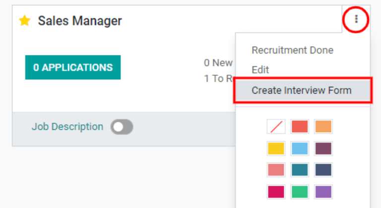
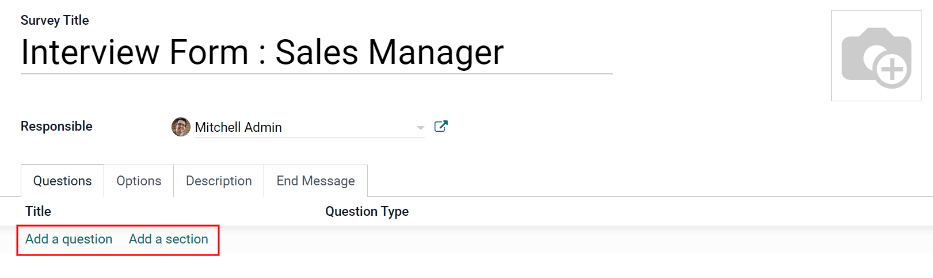

=============
Job positions
=============

In the default :menuselection:`Recruitment` dashboard view, all job positions are shown, regardless
of status. Current published positions with active applicants are shown, as well as job positions
that have been created but have not yet been published.

Each job position is shown in an individual kanban card. If the job position is active and
candidates can apply, then a :guilabel:`Published` banner will appear in the top-right corner of the
card.

View submitted applications by clicking the :guilabel:`# Applications` button, with `#` being the
number of applications received. If a position is not published, a :guilabel:`Start Recruitment`
button will appear instead.

.. image:: new_job/jobs.png
   :align: center
   :alt: Main dashboard view of Recruitment showing all job positions.

Create a new job position
=========================

There are two ways a job position can be created: from the main :guilabel:`Recruitment` dashboard,
or from the :guilabel:`Configuration` menu.

To create a job position from the :guilabel:`Configuration` menu, go to :menuselection:`Recruitment
app --> Configuration --> Job Positions`. The job positions in this view are displayed in a list.

Create a new job position from the :guilabel:`Job Positions` dashboard by clicking the
:guilabel:`Create` button in the top-left corner.

Then, a :guilabel:`Create a Job Position` pop-up window will appear. From here, enter the name of
the position (such as `Sales Manager`, `Mechanical Engineer`, etc.). When complete, click the
:guilabel:`Create` button to save the entry, or the :guilabel:`Discard` button to delete it.

.. image:: new_job/job-title.png
   :align: center
   :alt: Create a new job position.

Once the job position has been created, it will appear as a card in the kanban view on the main
:guilabel:`Recruitment`` dashboard, as well as in the list view on the :guilabel:`Configuration`
dashboard.

Edit a new job position
-----------------------

Once the job position is created, it's time to enter the details for the position. Click on the
:guilabel:`⋮ (three dots)` icon in the upper-right corner of the relevant card to reveal several
options, and then click :guilabel:`Edit` to edit the details.

.. image:: new_job/edit-job.png
   :align: center
   :alt: Edit the job position card.

Enter the job description in the :guilabel:`Job Description` tab. This information is what is
visible to potential employees when searching for available jobs.

Recruitment
~~~~~~~~~~~

All the basic information about the job position is listed under the :guilabel:`Recruitment` tab.
None of the fields are required, but it is a good idea to provide at least a few details, such as
where the job is located.

The fields can be filled out as follows:

- :guilabel:`Company`: Select the company the job is for.
- :guilabel:`Website`: Select the website where the job will be published.
- :guilabel:`Department`: Select the relevant department for the job position.
- :guilabel:`Expected New Employees`: Enter the number of employees to be hired for this position.
- :guilabel:`Contract Template`: Select a contract template that will be used when offering the job
  to a candidate.
- :guilabel:`Interview Form`: Select a form that applicants will fill out prior to their interview,
  or create a new form. Once selected, a :guilabel:`Display (Name) Form` button will appear next to
  the selected form. Click on this to see how the form will be displayed to the candidate on the
  front end.

  .. image:: new_job/interview-form.png
     :align: center
     :alt: The interview form will display a link to see the form as the candidate will.

- :guilabel:`Recruiter`: Select the person who will be doing the recruiting for this role.

.. image:: new_job/recruitment-tab.png
   :align: center
   :alt: Enter job information details in the recruitment tab.

Appraisals
~~~~~~~~~~

This tab displays the :guilabel:`Employee Feedback Template` and the :guilabel:`Manager Feedback
Template`, both of which will be used after the employee has been hired, the predetermined time has
passed, and feedback is requested.

Create interview form
---------------------

Once a job position has been made, the :guilabel:`Interview Form` needs to be created. In the
kanban view of the :menuselection:`Recruitment` dashboard, click on the :guilabel:`⋮ (three dots)`
icon in the upper-right corner of the card to reveal several options, and then click
:guilabel:`Create Interview Form`.

Click on :guilabel:`Add a section` to add a section to the form. A line will appear, and a section
heading can be entered. When complete, click off the line, or press enter to lock in the new
section on the form.

Next, click :guilabel:`Add a question` to add a question to the section. A pop-up window appears to
enter the question details. Type out the question in the top line.

There are several *Question Types* to choose from:

- :guilabel:`Multiple Lines Text Box`: allows the applicant to enter several lines of text
- :guilabel:`Single Line Text Box`: limits the applicant to only a single line of text
- :guilabel:`Numerical Value`: only allows a number to be entered
- :guilabel:`Date`: a calendar module is presented to select a date
- :guilabel:`Datetime`:  a calendar module and a clock icon is presented to select a date and time
- :guilabel:`Multiple choice: only one answer`: a multiple choice question that only allows the
  candidate to select one answer
- :guilabel:`Multiple choice: multiple answers allowed`: a multiple choice question that allows the
  candidate to select multiple answers
- :guilabel:`Matrix`: a customizable table that allows the candidate to choose an answer for each
  row

.. image:: new_job/questions.png
   :align: center
   :alt: Add a new question to the interview form.

Questions and sections can be reorganized. Move them by clicking and dragging individual section
headings or question lines to their desired position(s).

Sections are indicated by a gray background, while questions have a white background.

.. image:: new_job/questions-matrix.png
   :align: center
   :alt: A sample of categories and questions for a candidate.

Next, configure the options for the interview form. Click the :guilabel:`Options` tab to view all
the options to configure, by category.

Questions
~~~~~~~~~

- :guilabel:`Layout`: Choose how the questions should be displayed.

  - :guilabel:`One page with all the questions`: Display all sections and questions at the same
    time.
  - :guilabel:`One page per section`: Display each section with the corresponding questions on an
    individual page.
  - :guilabel:`One page per question`: Display a single question on each page.

- :guilabel:`Progression Mode`: Display the progress the candidate is making, either as a
  :guilabel:`Percentage`, or as a :guilabel:`Number`.
- :guilabel:`Survey Time Limit`: Check this box to limit the time allowed to complete the form. When
  selected, a field to enter the minutes appears next to the checked box. Enter the time (using an
  XX:XX minute/second format) in the field.
- :guilabel:`Selection`: Display the entire form (e.g. :guilabel:`All questions`), or only a random
  selection of questions from each section (:guilabel:`Randomized per section`).

  .. note::
     Although it is a selectable option, the :guilabel:`Randomized per section` option is not
     typically selected for an interview form.

Scoring
~~~~~~~

- :guilabel:`No scoring`: Select this option to not score the form.
- :guilabel:`Scoring with answers at the end`: Select this option to score the form and display the
    correct answers for the candidate when they are finished with the form.
- :guilabel:`Scoring without answers at the end`: Select this option to score the form but not
  display the answers to the candidate.

If one of the scoring options was selected, a :guilabel:`Success %` field will appear. Enter the
percentage the candidate needs to pass the exam (example, 80.00%). The entry should be written in an
“XX.XX” format.

Candidates
~~~~~~~~~~

- :guilabel:`Access Mode`: Specify who can access the exam. Either :guilabel:`Anyone with the link`
  or :guilabel:`Invited people only`.
- :guilabel:`Appraisal Managers Only`: Check this box so only the managers who are reviewing the
  exam can see the answers. If left unchecked, anyone can view the results.
- :guilabel:`Login Required`: Check this box to require candidates to log in before taking the exam,
  whether they have a valid token or not.
- :guilabel:`Attempts Limit`: If there is a limit to how many times the exam can be taken, check
  this box, then enter the maximum attempt number in the field next to it.

Live Session
~~~~~~~~~~~~

- :guilabel:`Reward quick answers`: If the exam is to be taken live, check this box to award more
  points to participants who answer quickly.
- :guilabel:`Session Code`: Enter an access code that will allow the viewers into the live exam
  session.

After all fields have been entered, click the :guilabel:`Save` button to save the changes, or click
:guilabel:`Discard` to delete the changes.

.. image:: new_job/options.png
   :align: center
   :alt: Various options to configure for the interview form.
