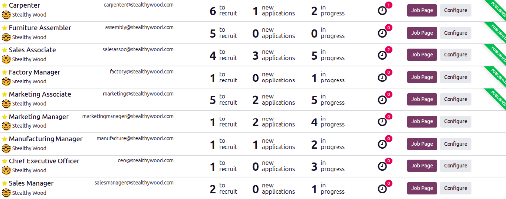
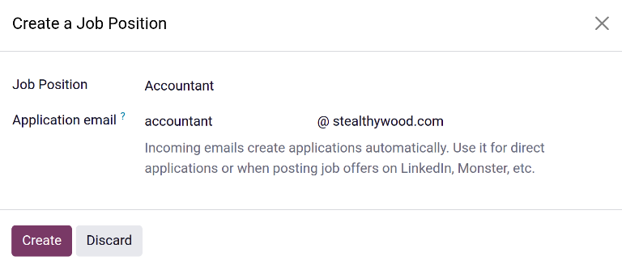
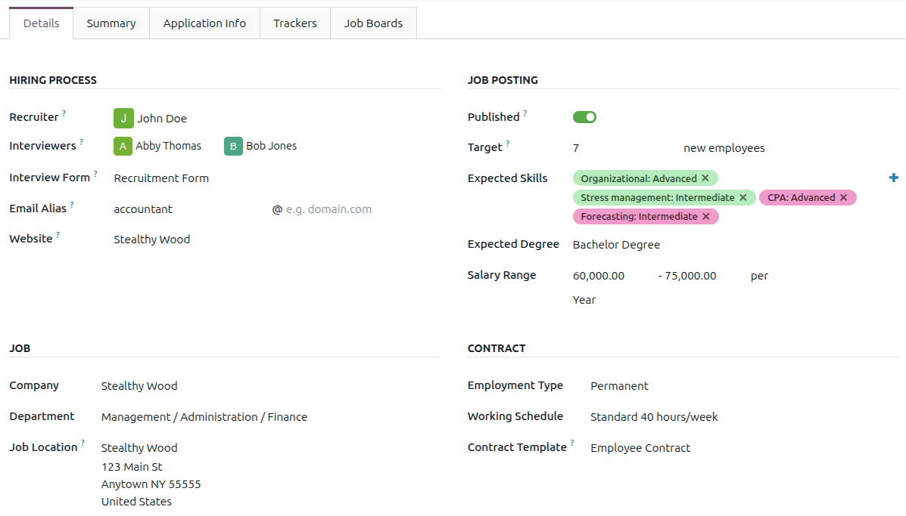
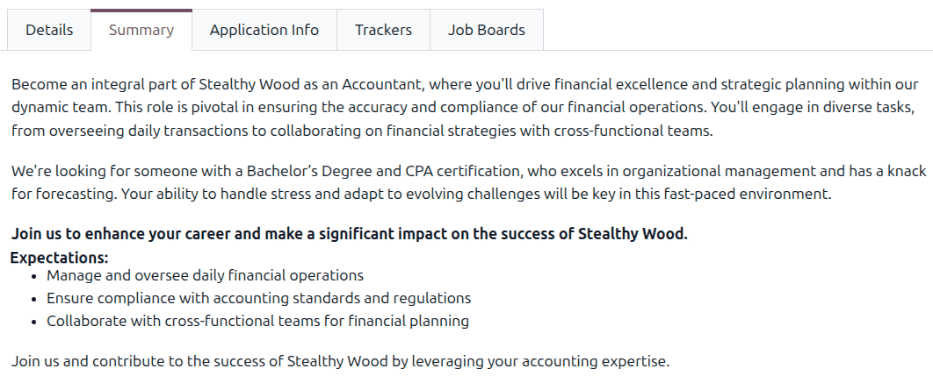
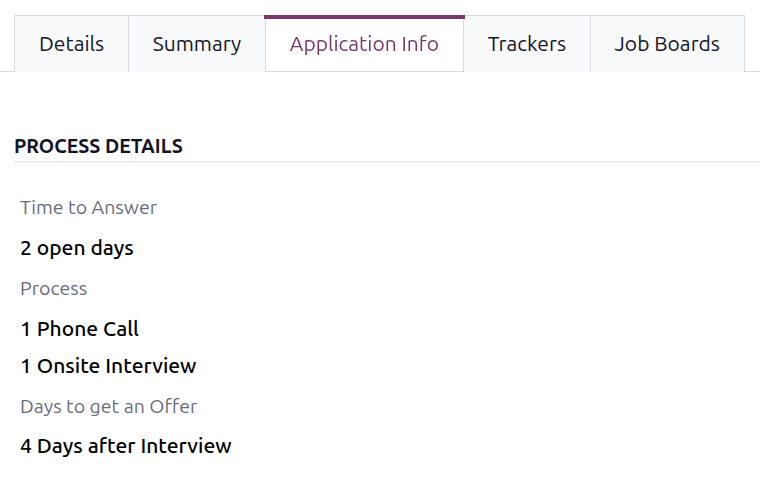
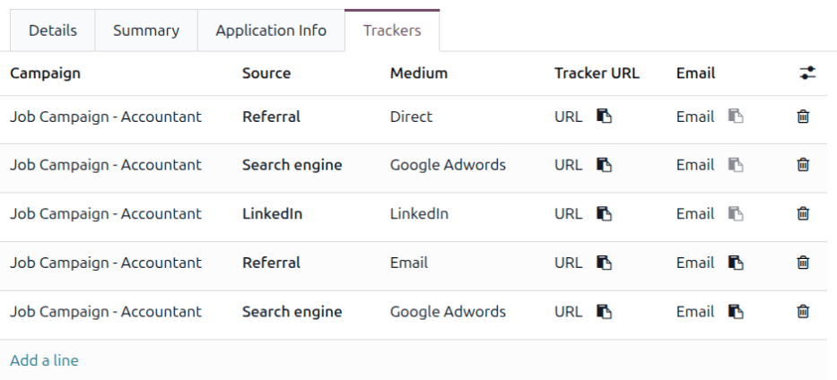

=============
Job positions
=============

In Odoo's **Recruitment** application, all job positions are shown on the default *Job Positions*
dashboard, which includes both active and inactive positions.

Each job position is shown in an individual Kanban card. If the job position is active, and
candidates can apply, a green :guilabel:`Published` banner appears in the top-right corner of the
card.

View submitted applications by clicking anywhere on a job position card, except the
:icon:`fa-clock-o` :guilabel:`(Activities)` icon, the :guilabel:`Job Page` button, or the
:guilabel:`Configure` button.

.. _recruitment/new_job/create-job-position:

Create a job position
=====================

To create a job position from the main dashboard in the **Recruitment** app, click the
:guilabel:`New` button in the top-left corner, and a *Create a Job Position* pop-up window appears.

First, enter the name of the :guilabel:`Job Position` (such as `Sales Manager`, `Mechanical
Engineer`, etc.) in the corresponding field.

Next, enter an :guilabel:`Application email` by typing in the first half of the email address in the
first field, then select the second half of the email using the drop-down menu in the second field.
Applicants can send a resumé to this specific email address, and Odoo creates an application for
them automatically.

When complete, click the :guilabel:`Create` button to save the entry, or the :guilabel:`Discard`
button to delete it.

.. note::
   Once the :guilabel:`Create` button is clicked, the *Applications* dashboard for the newly created
   job loads. The *Applications* dashboard is empty, as there are no applicants. Click the
   :guilabel:`Job Positions` breadcrumb to return to the main **Recruitment** app dashboard.

.. _recruitment/new_job/configure-job-position:

Configure a job position
------------------------

Once the job position has been :ref:`created <recruitment/new_job/create-job-position>`, the details
must be configured. On the main **Recruitment** app dashboard, click the :guilabel:`Configure`
button at the end of the Kanban card, and the detailed job position form loads.

Configure the *Details*, *Summary*, *Application Info*, and *Trackers* tabs, as described below.

Details tab
~~~~~~~~~~~

All the basic details about the job position are housed in the *Details* tab.

None of the fields are required, but it is important to configure and populate the
:guilabel:`Department`, :guilabel:`Job Location`, and :guilabel:`Employment Type` fields, as they
are all visible to prospective applicants on the website.

.. note::
   Some fields listed below may not appear depending on the installed apps and database
   configuration.

Enter the information in the following sections.

.. _recruitment/new_job/hiring-process:

Hiring process section
**********************

- :guilabel:`Recruiter`: Select the person responsible for recruiting this role.
- :guilabel:`Interviewers`: Select who should perform the interviews. Multiple people can be
  selected.
- :guilabel:`Interview Form`: Select an interview form that applicants fill out prior to their
  interview.
- :guilabel:`Email Alias`: Enter an email address to which applicants can send a resumé. Once
  emailed, Odoo automatically creates an application for them. If an email was entered when creating
  the job position, this field is populated.
- :guilabel:`Website`: Select the website the job is published on.

Job section
***********

- :guilabel:`Company`: Select the company the job is for. This field only appears if using a
  multi-company database.
- :guilabel:`Department`: Select the relevant department for the job position. This is visible on
  the website.
- :guilabel:`Job Location`: Select the physical address for the job. If the job position is remote,
  leave this field blank. This is visible on the website.

.. _recruitment/new_job/job-posting:

Job posting section
*******************

- :guilabel:`Published`: When the job position is ready to be published on the website, click the
  :guilabel:`Published` toggle to publish the job position. The toggle changes to green, indicating
  the listing is live on the website.
- :guilabel:`Target`: Enter the number of employees to be hired for this position.
- :guilabel:`Expected Skills`: Select all the desired skills for the job position in this field. To
  add a skill, click the :icon:`fa-plus` :guilabel:`(plus sign)` icon, and select the *Category*,
  *Skill*, and *Skill Level* for each skill added. The skills presented are :ref:`configured in the
  Employees app <employees/skills>`.
- :guilabel:`Expected Degree`: Select the level of education desired, using the drop-down menu. The
  default options are: :guilabel:`Graduate`, :guilabel:`Bachelor Degree`, :guilabel:`Master Degree`,
  and :guilabel:`Doctoral Degree`.
- :guilabel:`Salary Range`: Enter both the minimum and maximum salaries offered for the position in
  the two fields. Then, set the last field to the time-frame for the salary range. The default
  options are :guilabel:`Hour`, :guilabel:`Day`, :guilabel:`Week`, :guilabel:`Bi-Week`,
  :guilabel:`Month`, and :guilabel:`Year`.

Contract section
****************

- :guilabel:`Employment Type`: Select what type of position the job is, using the drop-down menu.
  The default options are :guilabel:`Permanent`, :guilabel:`Temporary`, :guilabel:`Interim`,
  :guilabel:`Seasonal`, :guilabel:`Full-Time`, :guilabel:`Part-Time`, :guilabel:`Intern`,
  :guilabel:`Student`, :guilabel:`Apprenticeship`, :guilabel:`Thesis`, :guilabel:`Statutory`, and
  :guilabel:`Employee`. Depending on the installed localization, other options may be available.
  This is visible on the website.
- :guilabel:`Working Schedule`: Select the working schedule for the job position. Odoo provides one
  working schedule by default, :guilabel:`Standard 40 hours/week`, but all working schedules in the
  database are available.
- :guilabel:`Contract Template`: Select a contract template to be used when offering the job to a
  candidate.

Summary tab
~~~~~~~~~~~

Enter the complete job description in the *Summary* tab. This description is visible on the website,
and should convey any relevant information for the position that is **not** covered or explained in
the *Details* tab. This may include information such as specific tasks the job requires, any
required past experience, or uncommon benefits or compensation.

.. _recruitment/new_job/application_info:

Application info tab
~~~~~~~~~~~~~~~~~~~~

The *Process Details* section of the *Application Info* tab contains information that is displayed
online for the job position. This informs the applicants of the timeline and steps for the
recruitment process, so they know when to expect a reply.

The following fields are populated by default, but can be modified to suit the recruitment timeline
of the business:

- :guilabel:`Time to Answer`: The number of days before the applicant is contacted. :guilabel:`2
  open days` populates this field by default.
- :guilabel:`Process`: The various stages the candidate goes through during the recruitment process.
  By default, two process steps are visible: :guilabel:`1 Phone Call` and :guilabel:`1 Onsite
  Interview`.
- :guilabel:`Days to get an Offer`: The number of days before the applicant should expect an offer
  after the recruitment process has ended. The default is :guilabel:`4 Days after Interview`.

.. note::
   The *Process Details* section of the *Application Info* tab is a text field. All answers are
   typed in rather than selected from a drop-down menu. The text is displayed on the website exactly
   as it appears in this tab.

Trackers tab
~~~~~~~~~~~~

When reaching potential applicants, recruiters often share the job position across multiple
websites, including social media sites, job board sites, and third-party hosting sites. The
*Trackers* tab provides a centralized place for recruiters to keep a record of all the places a
tracking link has been shared. This allows recruiters to determine which sites were the most
successful in terms of receiving applications from them.

.. tip::
   Before creating trackers, first :ref:`publish <post-job/website>` the job on the company website.

To add a tracking link, click on the *Trackers* tab, click :guilabel:`Add a line`, and a blank line
appears at the top of the list. Configure the following fields for each tracker:

- :guilabel:`Campaign`: Select the :ref:`campaign <marketing/social-campaigns/new-campaign>` the job
  position falls under using the drop-down menu.
- :guilabel:`Source`: Select where the tracker was used using the drop-down menu. There are ten
  default options, such as :guilabel:`Search engine`, :guilabel:`Newsletter`, and
  :guilabel:`LinkedIn`, but more may be available depending on the installed applications and
  created events.
- :guilabel:`Medium`: Select the method used to share the tracker from a list of ten default
  options, such as :guilabel:`Banner`, :guilabel:`Email`, and :guilabel:`Google Adwords`.
- :guilabel:`Tracker URL`: Once the :guilabel:`Campaign`, :guilabel:`Source`, and :guilabel:`Medium`
  are defined, Odoo automatically creates the corresponding tracking link. Click :guilabel:`URL`
  :icon:`fa-clipboard` to copy the link to the clipboard, then share the link where appropriate.
- :guilabel:`Email`: Once the :guilabel:`Campaign`, :guilabel:`Source`, and :guilabel:`Medium` are
  defined, Odoo automatically creates the corresponding email. Click :guilabel:`Email`
  :icon:`fa-clipboard` to copy the email address to the clipboard, then share the email where
  appropriate.

Job boards tab
~~~~~~~~~~~~~~

The *Job Boards* tab is automatically populated as the job position is :ref:`shared on a job board
<post-job/boards>`. As each listing is created, the information appears in this tab.

.. seealso::
   :doc:`post_job`
