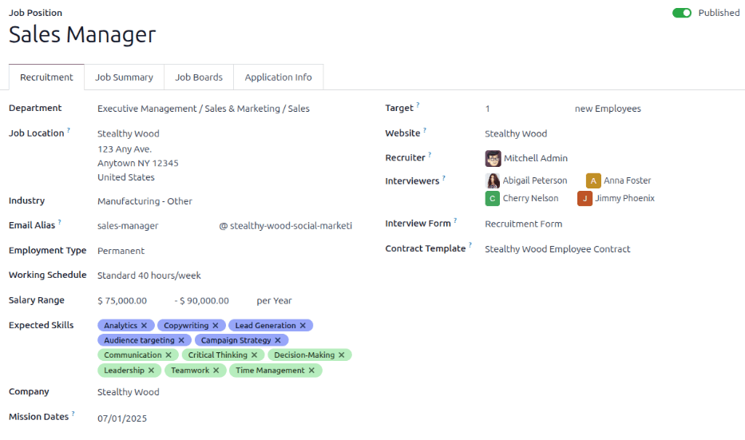

=============
Job positions
=============

In the default :menuselection:`Recruitment` dashboard view, all job positions are shown, regardless
of status. Current published positions with active applicants are shown, as well as job positions
that have been created but have not yet been published.

Each job position is shown in an individual kanban card. If the job position is active and
candidates can apply, then a :guilabel:`Published` banner will appear in the top-right corner of the
card.

View submitted applications by clicking the :guilabel:`# Applications` button, with `#` being the
number of applications received. If a position is not published, a :guilabel:`Start Recruitment`
button will appear instead.

.. image:: new_job/jobs.png
   :align: center
   :alt: Main dashboard view of Recruitment showing all job positions.

Create a new job position
=========================

There are two ways a job position can be created: from the main :guilabel:`Recruitment` dashboard,
or from the :guilabel:`Configuration` menu.

To create a job position from the :guilabel:`Configuration` menu, go to :menuselection:`Recruitment
app --> Configuration --> Job Positions`. The job positions in this view are displayed in a list.

Create a new job position from the :guilabel:`Job Positions` dashboard by clicking the
:guilabel:`Create` button in the top-left corner.

Then, a :guilabel:`Create a Job Position` pop-up window will appear. From here, enter the name of
the position (such as `Sales Manager`, `Mechanical Engineer`, etc.). When complete, click the
:guilabel:`Create` button to save the entry, or the :guilabel:`Discard` button to delete it.

.. image:: new_job/job-title.png
   :align: center
   :alt: Create a new job position.

Once the job position has been created, it will appear as a card in the kanban view on the main
:guilabel:`Recruitment`` dashboard, as well as in the list view on the :guilabel:`Configuration`
dashboard.

Edit a new job position
-----------------------

Once the job position is created, it's time to enter the details for the position. Click on the
:guilabel:`⋮ (three dots)` icon in the upper-right corner of the relevant card to reveal several
options, and then click :guilabel:`Edit` to edit the details.

.. image:: new_job/edit-job.png
   :align: center
   :alt: Edit the job position card.

Enter the job description in the :guilabel:`Job Description` tab. This information is what is
visible to potential employees when searching for available jobs.

Recruitment
~~~~~~~~~~~

All the basic information about the job position is listed under the :guilabel:`Recruitment` tab.
None of the fields are required, but it is a good idea to provide at least a few details, such as
where the job is located.

The fields can be filled out as follows:

- :guilabel:`Company`: Select the company the job is for.
- :guilabel:`Website`: Select the website where the job will be published.
- :guilabel:`Department`: Select the relevant department for the job position.
- :guilabel:`Job Location`: Select the physical address for the job.
- :guilabel:`Expected New Employees`: Enter the number of employees to be hired for this position.
- :guilabel:`Is Published`: Check the box to publish the job online.
- :guilabel:`Contract Template`: Select a contract template that will be used when offering the job
  to a candidate.
- :guilabel:`Interviewers`: Select who should perform the interview(s). Multiple people can be
  selected.
- :guilabel:`Interview Form`: Select a form that applicants will fill out prior to their interview,
  or create a new form. Once selected, a :guilabel:`Display (Name) Form` button will appear next to
  the selected form. Click on this to see how the form will be displayed to the candidate on the
  front end.

.. image:: new_job/interview-form.png
   :align: center
   :alt: The interview form will display a link to see the form as the candidate will.

- :guilabel:`Recruiter`: Select the person who will be doing the recruiting for this role.

Create interview form
---------------------

Once a job position has been made, the :guilabel:`Interview Form` needs to be created. In the
kanban view of the :menuselection:`Recruitment` dashboard, click on the :guilabel:`⋮ (three dots)`
icon in the upper-right corner of the card to reveal several options, and then click
:guilabel:`Create Interview Form`.

.. image:: new_job/new-interview-form.png
   :align: center
   :alt: Create an interview form for the new position.

Next the survey form loads. The :guilabel:`Survey Title` is pre-populated based on the job
description. Then, select the person :guilabel:`Responsible` for the survey from the drop-down menu.

Questions
~~~~~~~~~

In the :guilabel:`Questions` tab, click on :guilabel:`Add a section` to add a section to the form. A
line appears, and a section heading can be entered. When complete, click off the line, or press
enter to lock in the new section on the form.

.. image:: new_job/add-section.png
   :align: center
   :alt: Enter job information details in the recruitment tab.

Next, click :guilabel:`Add a question` to add a question to the section. A pop-up window appears to
enter the question details. Type out the question in the top line.

There are several *Question Types* to choose from:

- :guilabel:`Multiple choice: only one answer`: a multiple choice question that only allows the
  candidate to select one answer
- :guilabel:`Multiple choice: multiple answers allowed`: a multiple choice question that allows the
  candidate to select multiple answers
- :guilabel:`Multiple Lines Text Box`: allows the applicant to enter several lines of text
- :guilabel:`Single Line Text Box`: limits the applicant to only a single line of text
- :guilabel:`Numerical Value`: only allows a number to be entered
- :guilabel:`Date`: a calendar module is presented to select a date
- :guilabel:`Datetime`:  a calendar module and a clock icon is presented to select a date and time
- :guilabel:`Matrix`: a customizable table that allows the candidate to choose an answer for each
  row

After selecting a question type, a sample question appears in gray. This represents how the question
format will be displayed to applicants.

.. image:: new_job/questions.png
   :align: center
   :alt: Add a new question to the interview form.

Questions and sections can be reorganized. Move them by clicking and dragging individual section
headings or question lines to their desired position(s).

Sections are indicated by a gray background, while questions have a white background.

.. image:: new_job/questions-matrix.png
   :align: center
   :alt: A sample of categories and questions for a candidate.

Answers
*******

If :guilabel:`Multiple choice: only one answer`, :guilabel:`Multiple choice: multiple answers
allowed`, :guilabel:`Single Line Text Box`, or :guilabel:`Matrix` is selected for the
:guilabel:`Question Type`, an :guilabel:`Answers` tab appears beneath the question. If another
:guilabel:`Question Type` is selected, the :guilabel:`Answers` tab remains hidden from view.

.. tabs::

   .. tab:: Multiple choice

      For both the :guilabel:`Multiple choice: only one answer` and :guilabel:`Multiple choice:
      multiple answers allowed` question types, the answers are populated in the same way.

      First, in the :guilabel:`Answers` tab, click :guilabel:`Add a line`. A line appears, and an
      answer can be entered. After typing in the answer, click off the line, or press enter to lock
      in the new answer on the form and have another answer line appear.

      If desired, an image can be attached to the answer. Click on a line to select it, and an
      :guilabel:`Upload your file` button appears on the right side. Click the :guilabel:`Upload
      your file` button and a file explorer window appears. Navigate to the photo file, select it,
      then click :guilabel:`Open` to select it.

      Repeat this for all the answers to be added for the multiple choice question. The answers can
      be rearranged in any order. To move an answer, click on the :guilabel:`↕️ (Up-down arrows)` on
      the far left of each answer line, and drag the answer to the desired position. The order the
      answers appear in the form is the order the answers will appear online.

      To delete a line, click on the :guilabel:`🗑️ (trash can)` icon on the far right side of the
      answer line.

      .. image:: new_job/multi-answers.png
         :align: center
         :alt: Answers to a multiple choice question, where each line has a different answer listed.

   .. tab:: Single Line Text Box

      If the :guilabel:`Single Line Text Box` is selected for the :guilabel:`Question Type`, only
      two checkboxes appear in the :guilabel:`Answers` tab:

      - :guilabel:`Input must be an email`: Activate this option if the answer must be in the format
        of an email address.

        - :guilabel:`Save as user email?`: This option appears if :guilabel:`Input must be an email`
          is selected. This saves the email entered on the form as the user's email, and will be
          used anytime Odoo contacts the user via email.

      - :guilabel:`Save as user nickname?`: Activate this option to populate the answer as the
        user's nickname. This is stored and used anywhere Odoo uses a nickname.

   .. tab:: Matrix

      Sometimes, a question is asked that does not fit a standard answer format, and is best suited
      for a matrix. For example, asking an applicant what is their availability to work compared to
      the various shifts is a perfect question for a matrix format. In this example, an applicant
      can click on all the shifts they are available to work.

      For a :guilabel:`Matrix` :guilabel:`Question Type`, there are two sets of data that need to be
      input. The rows and columns must both be configured. The columns are represented by the
      :guilabel:`Choices` section, while the rows are configured in the :guilabel:`Rows` section.

      The method for populating both sections is the same. In the :guilabel:`Answers` tab, click
      :guilabel:`Add a line` in either the :guilabel:`Choices` or :guilabel:`Row` section.  A line
      appears, and an answer can be entered. After typing in the answer, click off the line, or
      press enter to lock in the new answer on the form and have another answer line appear. Repeat
      this for all answers for both the :guilabel:`Choices` and :guilabel:`Rows` sections.

      .. figure:: new_job/matrix.png
         :align: center

         This is an example matrix that asks an applicant what shifts they are available to work on
         Saturdays and Sundays, either morning, afternoon, or evening.

Description
***********

Enter any information that may be helpful to an applicant. This description will appear for this
specific question only, and therefore should be question-specific and not generalized.

Options
*******

To view the options that are available to set for a question, click on the :guilabel:`Options` tab.
The :guilabel:`Layout`, :guilabel:`Constraints`, and :guilabel:`Live Sessions` sections are
universal for all :guilabel:`Question Types`, while the :guilabel:`Answers` tab is specific to the
:guilabel:`Question Type` selected, and changes based on the selection.

Answers
^^^^^^^

- :guilabel:`Multiple choice: only one answer` and :guilabel:`Multiple choice: multiple answers
  allowed`: The :guilabel:`Answers` section is blank, with no choices needed to be made.
- :guilabel:`Multiple Lines Text Box`: A :guilabel:`Placeholder` field appears. Enter any text that
  should appear with the question to help clarify how the applicant should answer.
- :guilabel:`Single Line Text Box`, :guilabel:`Numerical Value`, :guilabel:`Date`, and
  :guilabel:`Datetime`: A :guilabel:`Validate entry` option appears. Activate this option if what
  the applicant enters must be verified as adhering to the parameters set in this section. When
  activated, several other options appear. Enter the :guilabel:`Minimum` and :guilabel:`Maximum`
  values in the corresponding fields. Depending on the :guilabel:`Question Type` selected, these
  fields may reference characters, numbers, or dates. Next, enter the text that appears when the
  answer given does not fit within the designated minimum and maximum parameters. Last, enter any
  text in the :guilabel:`Placeholder` field to provide any additional information or directions to
  assist the applicant.
- :guilabel:`Matrix`: The first option that appears is :guilabel:`Matrix Type`. Select either
  :guilabel:`One choice per row` or :guilabel:`Multiple choices per row` using the drop-down menu.

Constraints
^^^^^^^^^^^

If the question is required to be answered by the applicant, activate the box next to
:guilabel:`Mandatory Answer`. An :guilabel:`Error message` field appears, with some example text in
gray (:guilabel:`This question requires an answer`). Enter the message that should appear if the
applicant attempts to move on to the next question without answering this required one. The text
should explain that the question must be answered.

Layout
^^^^^^

If the question should only appear if a previous question is answered in a specific way, activate
the :guilabel:`Conditional Display` option. A new :guilabel:`Triggering Question` field appears.
Using the drop-down menu, select the previous question this new question is linked to. Once a
previous question is selected, a :guilabel:`Triggering Answer` field appears. Select the answer that
must be selected in order for the new question to appear.

The next option is :guilabel:`Show Comments Field`. Activate the option if there should be a comment
displayed to the applicant. If activated, a :guilabel:`Comment Message` field appears. Enter the
text to appear in the :guilabel:`Comment Message` field.

.. example::
   To further illustrate a triggering question, the following is an example that is applicable to
   recruitment. The question, `Do you have management experience?` is already added. A new question
   is then added, `How many years of experience?`. This question should *only* appear if the
   applicant selected `Yes` to the question `Do you have management experience?`.

   To properly configure this example, activate the :guilabel:`Conditional Display` option. Then,
   select `Do you have management experience?` as the :guilabel:`Triggering Question`. Then, select
   :guilabel:`Yes` for the triggering answer.

   .. image:: new_job/layout.png
      :align: center
      :alt: The layout field when properly configured for a conditional question.

Live Sessions
^^^^^^^^^^^^^

If the question is for a live session, activate the :guilabel:`Question Time Limit` option. A
:guilabel:`seconds` field appears. Enter the amount of time allotted for the applicant to enter the
answer, in seconds.

Options
~~~~~~~

Next, configure the various options for the interview form. Click the :guilabel:`Options` tab to
view all the options to configure, by category.

Questions
*********

- :guilabel:`Pagination`: Choose how the questions should be displayed.

  - :guilabel:`One page with all the questions`: Display all sections and questions at the same
    time.
  - :guilabel:`One page per section`: Display each section with the corresponding questions on an
    individual page.
  - :guilabel:`One page per question`: Display a single question on each page.

- :guilabel:`Question Selection`: Choose which questions are presented.

  - :guilabel:`All questions`: Display the entire form, with all questions form all sections.
  - :guilabel:`Randomized per Section`: Display only a random selection of questions from each
    section.

.. note::
   Although it is a selectable option, the :guilabel:`Randomized per section` option should only be
   used if receiving partial information/an incomplete survey from every applicant is acceptable to
   the business.

Time & Scoring
**************

- :guilabel:`Survey Time Limit`: Check this box to limit the time allowed to complete the form. When
  selected, a field to enter the minutes appears next to the checked box. Enter the time (using an
  XX:XX minute/second format) in the field.
- :guilabel:`Scoring`: Choose how the questions should be scored.

  - :guilabel:`No scoring`: Select this option to not score the form.
  - :guilabel:`Scoring with answers at the end`: Select this option to score the form and display
    the correct answers for the candidate when they are finished with the form.
  - :guilabel:`Scoring without answers at the end`: Select this option to score the form but not
    display the answers to the candidate.

- :guilabel:`Required Score (%)`: If one of the scoring options was selected, a :guilabel:`Required
  Score (%)` field appears. Enter the percentage the candidate needs to pass the exam (example,
  80.00%). The entry should be written in an “XX.XX” format.

- :guilabel:`Is a Certification`: Check this box if the form is a certification exam. When checked,
  a drop-down menu appears next to the checkbox. Select one of the default formats for the PDF
  certificate that will be sent to the candidate after completing the certification exam. Click the
  :guilabel:`Preview` button to view an example of the PDF certificate.
- :guilabel:`Certified Email Template`: If the :guilabel:`Is a Certification` box is checked, a
  :guilabel:`Certified Email Template` appears. Select the email template from the drop-down menu
  that is to be used when the applicant passes the test. Click the :guilabel:`External Link` icon to
  the right of the email template to preview the email.

Participants
************

- :guilabel:`Access Mode`: Specify who can access the exam. Either :guilabel:`Anyone with the link`
  or :guilabel:`Invited people only`.
- :guilabel:`Require Login`: Check this box to require candidates to log in before taking the exam,
  whether they have a valid token or not.
- :guilabel:`Limit Attempts`: If there is a limit to how many times the exam can be taken, check
  this box, then enter the maximum attempt number in the field next to it.

Live Session
************

- :guilabel:`Session Code`: Enter the access code that will allow the viewers into the live exam
  session.
- :guilabel:`Reward quick answers`: If the exam is to be taken live, check this box to award more
  points to participants who answer quickly.

After all fields have been entered, click the :guilabel:`Save` button to save the changes, or click
:guilabel:`Discard` to delete the changes.

.. image:: new_job/options.png
   :align: center
   :alt: Various options to configure for the interview form.

Description
~~~~~~~~~~~

When the applicant begins the survey, the text entered in this tab appears at the top of the survey
page. Enter any information or descriptions that would be helpful to the applicant.

End Message
~~~~~~~~~~~

Once the survey is complete the message entered in this tab is displayed for the applicant.
