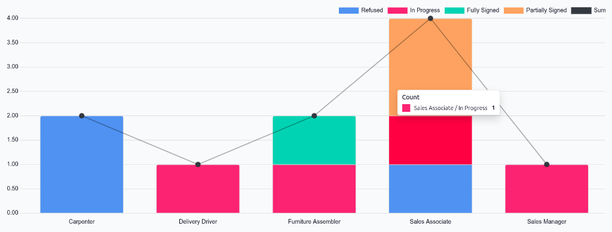

==============
Offer analysis
==============

The *Offer Analysis* report provides a high-level summary of job offers, grouped by job position and
status. This allows recruiters to view offer activity across different job positions, and track how
many offers are in each stage.

This report can help recruiters compare the number of open positions with the number of offers made,
identify positions with limited offer activity, and monitor the progress of recruitment efforts. For
example, positions with fewer offers may indicate a need to adjust recruitment strategies to attract
more qualified applicants. By reviewing offer data across positions and statuses, recruiters can
identify potential gaps in the hiring process and make more informed decisions to support
recruitment goals.

View offer analysis report
==========================

To access the *Offer Analysis* report, navigate to :menuselection:`Recruitment app --> Reporting
--> Offer Analysis`. The report displays offer data for all job positions in a default
:icon:`fa-database` :guilabel:`(Stacked)` :icon:`fa-bar-chart` :guilabel:`(Bar Chart)`.

The default filter is :guilabel:`Last 365 Days Offers`, showing information for the last 365
days.

Each job position populates the columns, with color-coded blocks showing the number of offers in
each stage. Hover over a colored block on the report to reveal a popover window listing the job
position and the number of offers in that stageThe presented colors are:

.. list-table::
   :header-rows: 1
   :stub-columns: 1

   * - Color
     - Status
     - Indicates
   * - Red
     - In progress
     - The offer was sent to the employee but the offer is unsigned by all parties.
   * - Orange
     - Partially signed
     - A minimum of one person has signed the contract, but other signatures are required.
   * - Green
     - Fully signed
     - The offer was accepted and all parties have signed the contract.
   * - Blue
     - Refused
     - The offer was refused by the applicant.

