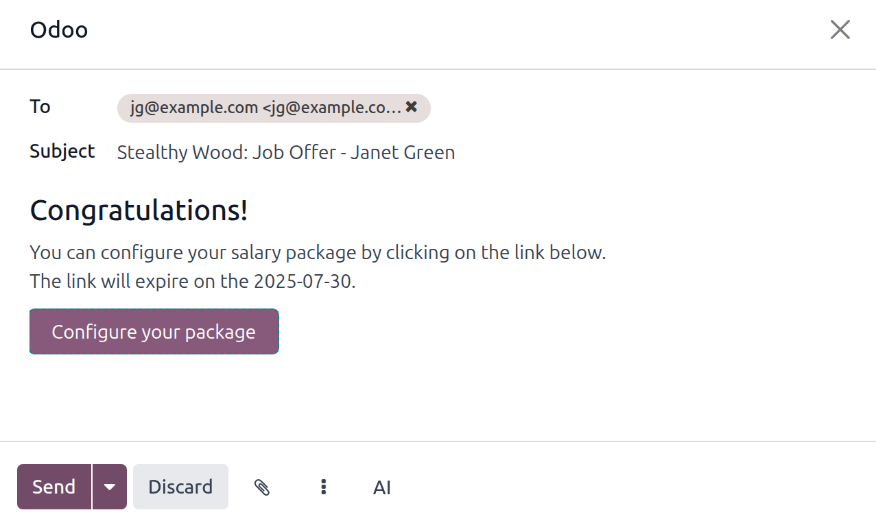
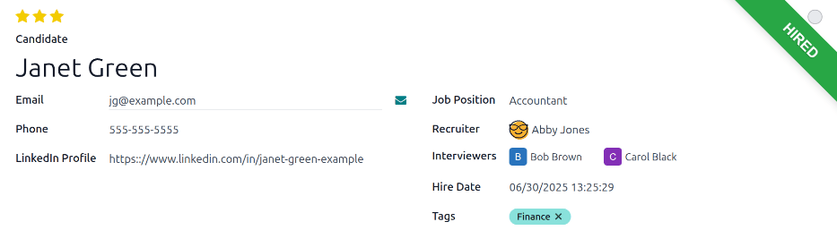

===================
Offer job positions
===================

After an applicant has successfully passed the various interview stages, the recruitment team is
ready to send an offer for employment. The first step when offering a job position is to send the
applicant a contract.

.. seealso::
   Refer to the :doc:`recruitment <../recruitment>` documentation for details on the various stages
   of the recruitment process.

Contract proposal
=================

When an offer is ready to be sent, first open the applicant's card by navigating to the
:menuselection:`Recruitment app`, and clicking on the desired job position card.

From the resulting :guilabel:`Job Positions` Kanban view, the corresponding applicant card can be
dragged-and-dropped to the :guilabel:`Contract Proposal` stage. Or, click into the desired
applicant's card, and click the :guilabel:`Contract Proposal` stage, located in the status bar in
the top-right of the applicant's form.

The next step is to send an offer to the applicant. Start by selecting the desired applicant's card
to open their applicant form.

On the applicant's form, click the :guilabel:`Generate Offer` button to load the :guilabel:`Offer
for (applicant's email)` page.

.. important::
   If the applicant does not have an email address listed on their applicant card, an
   :guilabel:`Invalid Operation` pop-up window warning appears, stating: :guilabel:`Offer link can
   not be send. The applicant needs to have a name and email.`

   Click :guilabel:`Close`, then enter an email on the applicant's card. Once an email is entered,
   click the :guilabel:`Generate Offer` button, and the :guilabel:`Offer for (applicant's email)`
   page loads.

Most fields are pre-populated with information from the job position. If any necessary fields are
blank, or if any information needs to be updated, enter, or update, the relevant information in the
corresponding fields.

.. note::
   Depending on the localization setting for the company, and which applications are installed, some
   fields may not appear on the :guilabel:`Offer for (applicant's email)` page.

   For example, if the **Fleet** application is **not** installed, any fields related to vehicles do
   **not** appear.

Universal fields
----------------

The following fields appear in the :guilabel:`Offer for (applicant's email)` page, regardless of the
localization.

- :guilabel:`Title`: The name for the contract appears in a default `Offer for (applicant's email)`
  format.
- :guilabel:`Contract Template`: The template currently being used to populate the :guilabel:`Offer
  for (applicant's email)` page. Use the drop-down menu to select a different :guilabel:`Contract
  Template`, if desired.

  .. note::
     To modify the template, hover over the current template name, and click the
     :icon:`fa-arrow-right` :guilabel:`(Internal link)` icon that appears to the right of the field.
     Make any desired changes, then click :guilabel:`Save & Close`.

- :guilabel:`Employer Budget`: The salary being offered to the applicant.
- :guilabel:`Job Title`: The selected :guilabel:`Employee Job` populates this field, by default. The
  title can be modified to suit the specific applicant's position and provide more details.

  .. example::
     An applicant is offered a marketing manager job at a shoe company, specifically for the
     children's line.

     The :guilabel:`Employee Job` selected from the drop-down menu is `Marketing Manager`, and the
     :guilabel:`Job Title` is modified for their specific responsibilities, `Marketing Manager:
     Children's Shoes`.

- :guilabel:`Employee Job`: The name of the :guilabel:`Job Title` being offered to the applicant.
  The selections available in the drop-down menu correspond to the job position configured on the
  main **Recruitment** app dashboard.

- :guilabel:`Department`: The department the job position falls under.
- :guilabel:`Contract Start Date`: The date the proposed contract takes effect. The default date is
  the current date. To modify the date, click on the displayed date to reveal a calendar popover
  window. Navigate to the desired month, then click the day to select the date.
- :guilabel:`Offer Create Date`: The day the offer is created, By default, the current date
  populates this field and *cannot* be modified.
- :guilabel:`Offer Validity Date`: The last day the offer is valid. After this date the contract
  cannot be signed.
- :guilabel:`Link`: The link to the contract being sent to the candidate.
- :guilabel:`Validity Days Count`: The number of days the contract is valid. The default expiration
  date is `30` days. Modify the expiration date, if desired.
- :guilabel:`Applicant`: The name of the applicant appears in this field, and cannot be modified.

Send offer
----------

Once all desired modifications have been made to the :guilabel:`Offer for (applicant's email)` page,
click the :guilabel:`Send By Email` button to reveal an email pop-up window.

The default `Recruitment: Your Salary Package` email template is used, and the :guilabel:`To`,
:guilabel:`Subject`, and email body are pre-populated based on the email template.

If any attachments need to be added, click the :icon:`fa-paperclip` :guilabel:`(paperclip)` button,
and a file explorer window appears. Navigate to the desired file, then click :guilabel:`Open` to
attach it to the email. The attachment loads, and is listed at the bottom of the email body.

Once the email is ready to send, click :guilabel:`Send`. The email pop-up window closes, and an
:icon:`fa-handshake-o` :guilabel:`Offers` smart button appears at the top of the applicant's card.

.. note::
   To send an offer, ensure the **Sign** application is installed. This is necessary, so the offer
   can be sent to the applicant by the recruiter, and they can actually sign the offer. The
   applicant does **not** need any software installed to sign the offer.

Configure your package
----------------------

If applicable, the applicant can modify their salary package. This option is not available for all
localizations. Depending on where the company is located, this option may not be available.

The email template includes a :guilabel:`Configure your package` button. This link takes the
applicant to a webpage, where they can modify the proposed salary package, and enter their personal
information.

Once the applicant is hired, the personal information entered on the webpage is imported to their
employee record, when created.

Once all the information is completed, the applicant can then accept the offer by clicking the
:guilabel:`Review Contract & Sign` button to accept the contract, and sign it using the **Sign**
application.

Management signatures
---------------------

Once the applicant has signed the contract, the next step is for the person responsible within the
company (the :guilabel:`HR Responsible`) must then sign the contract.

The person responsible for signing the contract receives an activity alert that their signature is
requested of them in the **Sign** app.

.. _recruitment/offer_job_positions/contract-signed:

Contract signed
===============

Once all parties have fully signed the contract, the applicant is automatically moved to the
:guilabel:`Contract Signed` stage, and a green :guilabel:`HIRED` banner appears in the top-right of
both the applicant's card and form.

.. _recruitment/new-employee:

Create employee
===============

Once the applicant has been hired, the next step is to create their employee record. Click the
:guilabel:`Create Employee` button in the top-left corner of the hired applicant's form.

An employee form appears, with information from the applicant's card, and the employee contract.

Fill out the rest of the employee form. For detailed information on the fields, refer to the
:doc:`../employees/new_employee` documentation.

Once completed, the employee record is saved in the **Employees** app.
