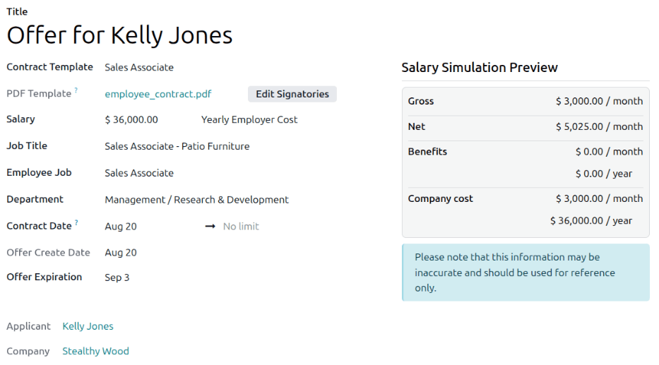
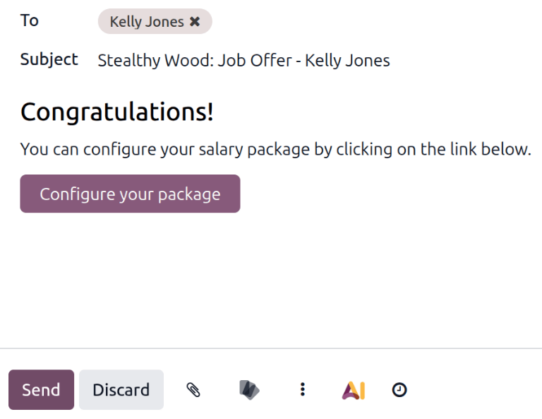
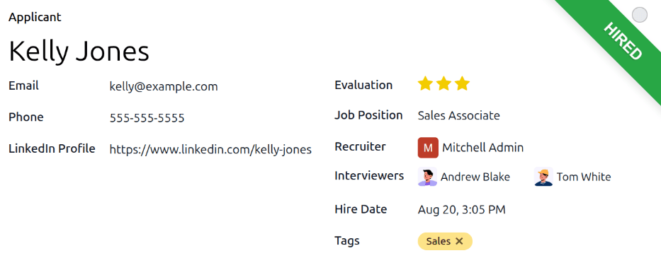

===================
Offer job positions
===================

After an applicant has successfully passed the various interview stages, the recruitment team is
ready to send an offer for employment. The first step in this process is to :ref:`send the applicant
a contract <recruitment/offer_job_position/contract-proposal>`. Once the contract is :ref:`fully
signed <recruitment/offer_job_positions/contract-signed>`, the :ref:`new employee record is created
<recruitment/offer_job_position/new-employee>`.

.. important::
   The *Salary Configurator* module **must** be :ref:`installed <general/install>` to send an offer
   using the :guilabel:`Generate Offer` button.

.. _recruitment/offer_job_position/contract-proposal:

Contract proposal
=================

When an offer is ready to be sent, first move the applicant to the :guilabel:`Contract Proposal`
stage.

Navigate to the **Recruitment** app, click on the job position Kanban card, then click the desired
applican't card. Click the :guilabel:`Contract Proposal` stage in the status bar at the top of the
applicant's record.

Next, send an offer to the applicant by clicking the :guilabel:`Generate Offer` button. This loads
the *Offer for (applicant)* page.

Most fields are pre-populated with information from the job position. Updated or add any relevant
information in the corresponding fields.

.. note::
   Depending on the localization setting for the company and which applications are installed, some
   fields may differ or not appear on the *Offer for (applicant)* page.

Contract fields
---------------

The following fields appear in the *Offer for (applicant)* page regardless of the localization.

- :guilabel:`Title`: The name for the contract appears in a default `Offer for (applicant)` format.
- :guilabel:`Contract Template`: The template currently being used to populate the  *Offer for
  (applicant)* page. Use the drop-down menu to select a different :guilabel:`Contract Template`, if
  desired.

  .. note::
     To modify the template, hover over the current template name, and click the
     :icon:`fa-arrow-right` :guilabel:`(Internal link)` icon that appears to the right of the field,
     and make any desired changes.

- :guilabel:`PDF Template`: The PDF document the applicant must sign to accept the offer.
- :guilabel:`Salary`: The salary being offered to the applicant.
- :guilabel:`Job Title`: The selected :guilabel:`Employee Job` populates this field by default. The
  title can be modified to suit the specific applicant's position and provide more details.

  .. example::
     An applicant is offered a marketing manager job at a shoe company, specifically for the
     children's line.

     The :guilabel:`Employee Job` selected from the drop-down menu is `Marketing Manager`, and the
     :guilabel:`Job Title` is modified for their specific responsibilities, `Marketing Manager:
     Children's Shoes`.

- :guilabel:`Employee Job`: The name of the :guilabel:`Job Title` being offered to the applicant.
  The selections available in the drop-down menu correspond to the configured :doc:`job positions
  <new_job>`.
- :guilabel:`Department`: The department the job position falls under.
- :guilabel:`Contract Date`: The date the proposed contract takes effect. The default date is the
  current date. To modify the date, click on the displayed date to reveal a calendar popover window.
  Navigate to the desired month, then click the day to select it. If the contract has a specific end
  date, enter the end date in the second field, next to the :icon:`fa-arrow-right` icon.
- :guilabel:`Offer Create Date`: The day the offer is created. The current date populates this field
  by default and **cannot** be modified.
- :guilabel:`Offer Expiration`: The last day the offer is valid. After this date the contract cannot
  be signed. Click into the field to reveal a calendar popover window. Navigate to the desired date,
  and click on it to select it.
- :guilabel:`Applicant`: The name of the applicant appears in this field and **cannot** be modified.
  Click the name to view the detailed applicant form.
- :guilabel:`Company`: The name of the company offering the job position appears in this field and
  **cannot** be modified. This only appears in a multi-company database.
- :guilabel:`Salary Simulation Preview`: The various costs for the contract appear in this box,
  including the :guilabel:`Gross`, :guilabel:`Net`, and :guilabel:`Benefits`, along with the total
  :guilabel:`Company Cost`. These numbers are estimates and should be used for referenceonly.

Send offer
----------

Once all desired modifications have been made to the *Offer for (applicant)* page, click the
:guilabel:`Send By Email` button to reveal an email pop-up window.

The default `Recruitment: Your Salary Package` email template is used, and the :guilabel:`To`,
:guilabel:`Subject`, and email body are pre-populated based on the email template.

If any attachments need to be added, click the :icon:`fa-paperclip` :guilabel:`(Add Attachment)`
button, and a file explorer window appears. Navigate to the desired file, then click
:guilabel:`Open` to attach it to the email. The attachment loads, and is listed at the bottom of the
email body.

Once the email is ready, click :guilabel:`Send`, and then the email pop-up window closes. Return to
the applicant's card, and an :icon:`fa-handshake-o` :guilabel:`Offers` smart button appears at the
top.

.. note::
   The **Sign** application must be installed for the applicant to digitally sign the contract in
   Odoo. The applicant does **not** need any software installed to sign the offer.

.. _recruitment/offer_job_position/configure-package:

Configure your package
----------------------

If applicable, the applicant can modify their salary package. This option is not available for all
localizations. Depending on where the company is located, this option may not be available.

The email template includes a :guilabel:`Configure your package` button. This link takes the
applicant to a webpage where they can modify the proposed salary package.

Applicant signature
-------------------

On the offer page, which is linked in the offer email, the applicant enters their contact
information along with any personal information requested on the form. The information entered is
transferred to the employee's record once cretaed.

The applicant clicks the :guilabel:`Review Contract & Sign` button to accept the offer, and the
contract loads. Click :guilabel:`Click to start` to begin signing the document. All fields are
populated according to the applicant's information, but can be modified if necessary.

Click :guilabel:`Next` to navigate to the subsequent fields of the contract. Once all fields are
configured, click :guilabel:`Sign it`, and an *Adopt Your Signature* pop-up window loads. Modify the
default signature if desired, then click :guilabel:`Sign all` to apply the signature. Click
:guilabel:`Next` once more to enter the :guilabel:`Date` in the corresponding field. When done,
click the :guilabel:`Validate & Send Completed DOcument` button, and the contract si sgined.

Management signatures
---------------------

Once the applicant has signed the contract, the next step is for the person responsible within the
company (the :guilabel:`HR Responsible`) must then sign the contract.

The person responsible for signing the contract receives an activity alert that their signature is
requested of them in the **Sign** app.

.. _recruitment/offer_job_positions/contract-signed:

Contract signed
===============

Once all parties have fully signed the contract, the applicant is automatically moved to the
:guilabel:`Contract Signed` stage, and a green :guilabel:`Hired` banner appears in the corner of
both the applicant's card and form.

.. _recruitment/offer_job_position/new-employee:

Create employee
===============

Once the applicant has been hired, the next step is to create their employee record. Click the
:guilabel:`Create Employee` button in the corner of the hired applicant's form.

An employee form loads with information pulled from the applicant's card and the employee contract.

Fill out the rest of the employee form. For detailed information on the fields, refer to the
:doc:`../employees/new_employee` documentation.

Once completed, the employee record is saved in the **Employees** app.
