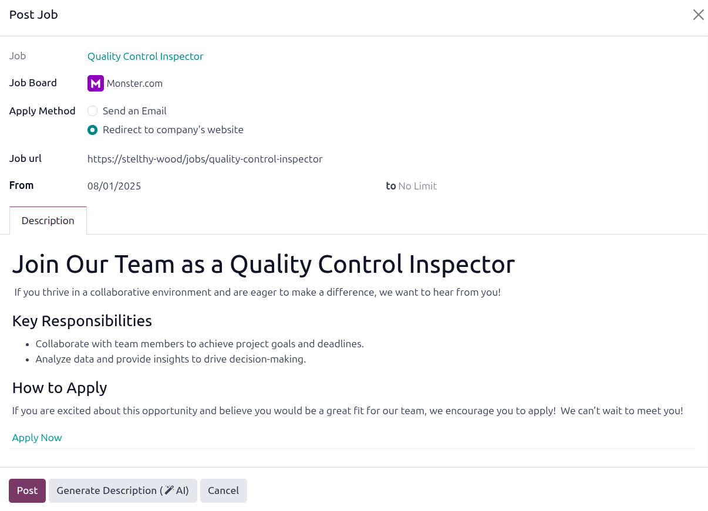
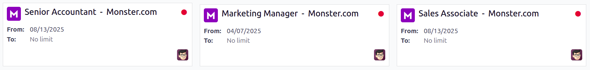

==================
Post job positions
==================

After a job position has been :doc:`created and configured <new_job>`, the next step is to share it,
so that prospective applicants can apply.

Job positions can be shared on the :ref:`company website <post-job/website>` or on :ref:`job boards
<post-job/boards>`.

.. _post-job/website:

Publish to website
==================

To publish a job listing on the company's website, first a setting must be enabled in the
**Recruitment** app. Navigate to :menuselection:`Recruitment app --> Configuration --> Settings`,
and enable the :guilabel:`Online Posting` option. Click the :guilabel:`Save` button after making any
changes.

.. note::
   The :guilabel:`Online Posting` is only available if the :doc:`Website <../../websites/website>`
   application is also installed.

Once the setting has been enabled, open the main **Recruitment** dashboard by navigating to
:menuselection:`Recruitment app --> Applications --> By Job Position`. A toggle appears in the
lower-left corner of every job position card, and indicates whether the role is :guilabel:`Not
Published` or :guilabel:`Published`.

Click on the toggle to change the current state of the job position. When a job position is
published, a green :guilabel:`PUBLISHED` banner appears in the top-right corner of the card.

To view the listing on the website, click the :icon:`oi-launch` :guilabel:`Job Page` in the
lower-right corner of the job card.

.. _post-job/boards:

Post on job boards
==================

Posting a job on a job board is an effective way to reach a wider audience, and attract more
candidates.

.. note::
   Check back frequently for more updates, as more job boards are added.

Job board settings
------------------

To publish a job listing onto a job board outside of Odoo, first a setting must be configured in the
**Recruitment** app. Navigate to :menuselection:`Recruitment app --> Configuration --> Settings`,
and click :icon:`oi-arrow-right` :guilabel:`Choose a Job Board`.

This loads a page displaying the :guilabel:`Recruitment Integration Monster` module. Click
:guilabel:`Activate` to install the module.

.. note::
   If the :guilabel:`Recruitment Integration Monster` module is already installed, no
   :guilabel:`Activate` button appears, only a :guilabel:`Module Info` button.

After the module is installed, the database reloads to the main dashboard. Open the **Recruitment**
app, and navigate to :menuselection:`Configuration --> Settings`. A :guilabel:`Monster Credentials`
section appears in the :guilabel:`Job Posting` section.

Enter the :guilabel:`Username` and :guilabel:`Password` for Monster in the corresponding fields,
then click the :guilabel:`Save` button.

Publish on job board
--------------------

Once the credentials have been configured for the job board, it is possible to post a job position.
Navigate to the **Recruitment** app dashboard, and click :guilabel:`# To Recruit` on the desired job
card.

Click the :guilabel:`Publish on Job Board` button, and a :guilabel:`Publish on Job Board` form loads
in a pop-up window. Fill out the following information on the form:

- :guilabel:`Job`: The name of the job position appears here by default, and cannot be modified.
- :guilabel:`Job Board`: Using the drop-down menu, select the job board being posted to.
- :guilabel:`Apply Method`: Click the desired radio button to determine how applicants apply for the
  position.

  - :guilabel:`Send an Email`: Select this for applicants to apply for the job via email.
  - :guilabel:`Redirect to company's website`: Select this for applicants to apply for the job via
    the company website.

- :guilabel:`Email` or :guilabel:`Job url`: The selected :guilabel:`Apply Method` determines which
  field appears. The field is populated with the information from the job card, if available. Make
  any desired modifications to this field, for example enter a tracking url for the job board
  listing.
- :guilabel:`From` and :guilabel:`to`: Using the calendar selector, select the date the list should
  be posted to the job board, in the :guilabel:`From` field. The :guilabel:`to` field says
  :guilabel:`No Limit`, by default. If the job position should be removed from the job board on a
  specific date, enter it in the second field.
- :guilabel:`Description` tab: The description from the job card populates this tab, by default.
  Make any desired changes to it in this section. This is what appears on the job board.

  .. tip::
     Click the :guilabel:`Generate Description` (:icon:`fa-magic` :guilabel:`AI`) to use AI to edit
     or create the job description.

Once the listing is ready, click the :guilabel:`Post` button. After the post has been published to a
job board, the page reloads to the :guilabel:`Job Boards Posts` page, and the new post appears in a
Kanban card.

Job board emails
~~~~~~~~~~~~~~~~

When posting job positions on a job board, like Indeed or LinkedIn, the job board posts the job
position, and typically allows the website visitor to apply to the job directly from the job board.

When someone applies to a job directly from a job board, an email is sent to Odoo from a specific
email address, such as `jobs-listings@linkedin.com`. The email uses regular expression (regex)
rules, which are instructions to match text in the email, and map it to specific fields in Odoo.

When Odoo receives an email from the job board's corresponding email address, it runs the regex
rule, and pulls applicant information from the email, when creating an applicant record.

.. example::
   The regex rule for :guilabel:`LinkedIn` (emails received from: `jobs-listings@linkedin.com`) is
   :guilabel:`New application:.*from (.*)`. This rule tells Odoo to capture everything after the
   word `from` when creating the applicant record.

   An email subject of `New application: Job ID 123 from John Doe` will capture `John Doe` and
   create an applicant record for `John Doe`.

To view the currently configured job board emails, navigate to :menuselection:`Recruitment app -->
Configuration --> Emails`. Three emails come preconfigured in the database; for
:guilabel:`LinkedIn`, :guilabel:`Jobsdb`, and :guilabel:`Indeed`.

Create job board emails
***********************

To create a new job board email, navigate to :menuselection:`Recruitment app --> Configuration -->
Emails`. Click the :guilabel:`New` button, and a blank :guilabel:`Emails` form loads.

Enter the :guilabel:`Name` for the platform, such as `Glassdoor`, in the corresponding field. Next,
enter the email address the applications will come from, in the :guilabel:`Email` field. Last, enter
the :guilabel:`regex` rules in the corresponding field.

View job board listings
-----------------------

To view all the job positions that have been posted to a job board, navigate to
:menuselection:`Recruitment --> Applications --> Job Boards Posts`. This presents the :guilabel:`Job
Boards Posts` dashboard and all job board postings.

Each listing is displayed in an individual Kanban card, with the following information:

- :guilabel:`Job Board Icon`: the icon for the job board where the listing is posted.
- :guilabel:`Job Board Listing Title`: the job position title and job board name.
- :guilabel:`From`: the date the listing was published.
- :guilabel:`To`: the date the listing will be removed from the job board.
- :guilabel:`User Icon`: the icon of the user who posted the listing.

Click on any Kanban card to view the details for the specific job board listing.

