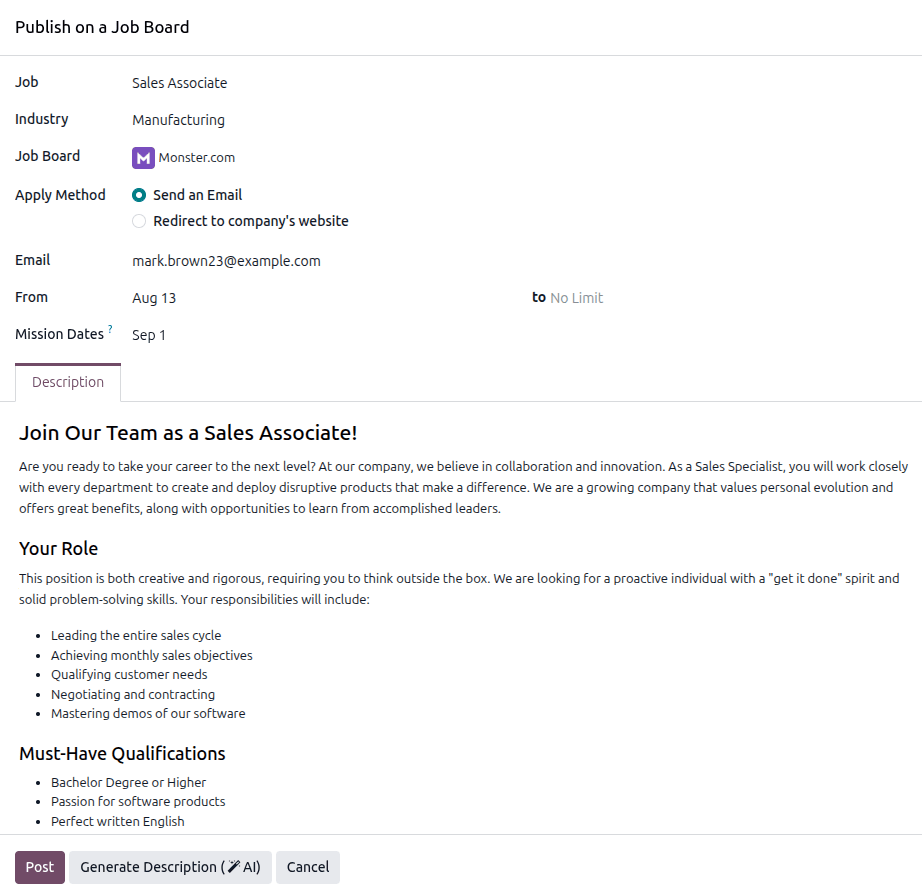
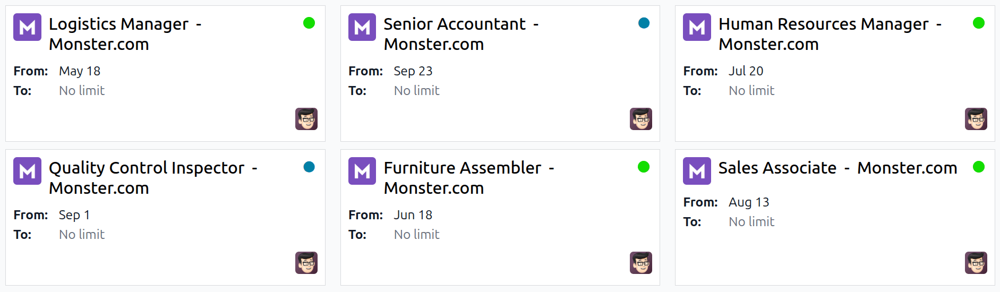

==================
Post job positions
==================

After a job position has been :doc:`created and configured <new_job>`, the next step is to share it
so that prospective applicants can apply.

Job positions can be shared on the :ref:`company website <recruitment/post-job/website>` or on
:ref:`job boards <recruitment/post-job/boards>`.

.. _recruitment/post-job/website:

Publish to website
==================

To publish a job listing on the company's website, first a setting must be enabled in the
**Recruitment** app. Navigate to :menuselection:`Recruitment app --> Configuration --> Settings`,
and enable the :guilabel:`Online Posting` option. Click the :guilabel:`Save` button after making any
changes.

.. note::
   The :guilabel:`Online Posting` option is only available if the :doc:`Website
   <../../websites/website>` application is also installed.

Once the setting has been enabled, open the main **Recruitment** dashboard by navigating to
:menuselection:`Recruitment app --> Applications --> By Job Positions`. Next, click the
:guilabel:`Job Page` button, then click the :guilabel:`Unpublished` toggle in the upper-right
corner. The toggle becomes green and displays :guilabel:`Published`. Return to the main dashboard by
navigating to :menuselection:`Recruitment app --> Applications --> By Job Positions`.

When a job position is published, a green :guilabel:`Published` banner appears in the top-right
corner of the job position card.

.. tip::
   Alternatively, click the :guilabel:`Configure` button on a job position card, then click the
   :guilabel:`Published` toggle in the *Job Posting* section of the *Details* tab.

.. _recruitment/post-job/boards:

Post on job boards
==================

Posting a job on a job board is an effective way to reach a wider audience and attract more
candidates.

.. note::
   Currently, Odoo only supports directly posting to Monster.com. Check back frequently for more
   updates, as more job boards are added.

Job board credentials
---------------------

To publish a job listing onto a job board outside of Odoo, the job board credentials must be
configured first. Navigate to :menuselection:`Recruitment app --> Configuration --> Settings`. In
the *Monster Credentials* section, enter the :guilabel:`Username` and :guilabel:`Password` for
Monster in the corresponding fields, then click the :guilabel:`Save` button.

.. note::
   When installing the **Recruitment** app, the following modules are automatically installed: *Job
   Board - Monster.com*, *Job Board - Monster.com (Skills)*, and *Job Board - Monster.com
   (Website)*. If any of these modules are *not* installed, :doc:`install them
   <../../general/apps_modules>` from the main **Apps** app.

Publish on job board
--------------------

Once the credentials have been configured for the job board, it is possible to post a job position.

Navigate to :menuselection:`Recruitment app --> Applications --> Job Boards Posts`, click
:guilabel:`Publish on Jobs Board`, and a *Publish on a Job Board* pop-up window loads. Fill out the
following information in the pop-up window:

- :guilabel:`Job`: Select the job position being shared using the drop-down menu.
- :guilabel:`Industry`: Select the relevant industry the job position falls under with the drop-down
  menu. This field corresponds to industries on the job board, and can aid applicants searching for
  positions within a specific industry.
- :guilabel:`Job Board`: Select the job board being posted to with the drop-down menu.
- :guilabel:`Apply Method`: Click the desired radio button to determine how applicants apply for the
  position. The two options are:

  - :guilabel:`Send an Email`: Select this for applicants to apply for the job via email.
  - :guilabel:`Redirect to company's website`: Select this for applicants to apply for the job via
    the company website.

- :guilabel:`Email` or :guilabel:`Job url`: The selected :guilabel:`Apply Method` determines which
  field appears. The field is populated with the information from the job card, if available. Make
  any desired modifications to this field, for example, enter a tracking URL for the job board
  listing.
- :guilabel:`From` and :guilabel:`to`: Using the calendar selector, select the date the job is
  posted to the job board in the :guilabel:`From` field. The :guilabel:`to` field says :guilabel:`No
  Limit` by default. If the job position should be removed from the job board on a specific date,
  enter it in the second field.
- :guilabel:`Mission Dates`: If there is a set start date for the job position, select the date
  using the calendar selector. When configured, if the applicant is hired for the job position,
  their availability on the job board is updated to reflect they are no longer available.
- :guilabel:`Description` tab: The description from the job card populates this tab by default. Make
  any desired changes to it in this section. This is what appears on the job board.

  .. tip::
     Click the :guilabel:`Generate Description` (:icon:`fa-magic` :guilabel:`AI`) to use AI to edit
     or create the job description.

Once the listing is ready, click the :guilabel:`Post` button. After the post has been published to a
job board, the *Job Boards Posts* page reloads, and the new post appears in a Kanban card.

Job board emails
~~~~~~~~~~~~~~~~

When posting job positions on a job board, like Indeed or LinkedIn, the job board posts the job
position, and typically allows the website visitor to apply to the job directly from the job board.

When someone applies to a job directly from a job board, an email is sent to Odoo from a specific
email address, such as `jobs-listings@linkedin.com`. The email uses regular expression (regex)
rules, which are instructions to match text in the email and map it to specific fields in Odoo.

When Odoo receives an email from the job board's corresponding email address, it runs the regex rule
and pulls applicant information from the email when creating an applicant record.

.. example::
   The regex rule for :guilabel:`LinkedIn` (emails received from: `jobs-listings@linkedin.com`) is
   :guilabel:`New application:.*from (.*)`. This rule tells Odoo to capture everything after the
   word `from` when creating the applicant record.

   An email subject of `New application: Job ID 123 from John Doe` will capture `John Doe` and
   create an applicant record for `John Doe`.

To view the currently configured job board emails, navigate to :menuselection:`Recruitment app -->
Configuration --> Emails`. Three emails come preconfigured in the database: :guilabel:`LinkedIn`,
:guilabel:`Jobsdb`, and :guilabel:`Indeed`.

Create job board emails
***********************

To create a new job board email, navigate to :menuselection:`Recruitment app --> Configuration -->
Emails`. Click the :guilabel:`New` button, and a blank *Emails* form loads.

Enter the :guilabel:`Name` for the platform, such as `Glassdoor`, in the corresponding field. Next,
enter the email address the applications come from in the :guilabel:`Email` field. Last, enter the
:guilabel:`regex` rules in the corresponding field.

View job board listings
-----------------------

To view all the job positions that have been posted to a job board, navigate to
:menuselection:`Recruitment --> Applications --> Job Boards Posts`. This presents the :guilabel:`Job
Boards Posts` dashboard and all job board postings.

Each listing is displayed in an individual Kanban card, with the following information:

- :guilabel:`Job Board Icon`: The icon for the job board where the listing is posted.
- :guilabel:`Job Board Listing Title`: The job position title and job board name.
- :guilabel:`Status Dot`: The status of the post. A green dot indicates the post is live, a blue dot
  indicates it is scheduled to be published in the future, and a red dot indicates there is an issue
  with the post and the posting failed.
- :guilabel:`From`: The date the listing was published.
- :guilabel:`To`: The date the listing is removed from the job board.
- :guilabel:`User Icon`: The icon of the user who posted the listing.

Click on any Kanban card to view the details for the specific job board listing.

