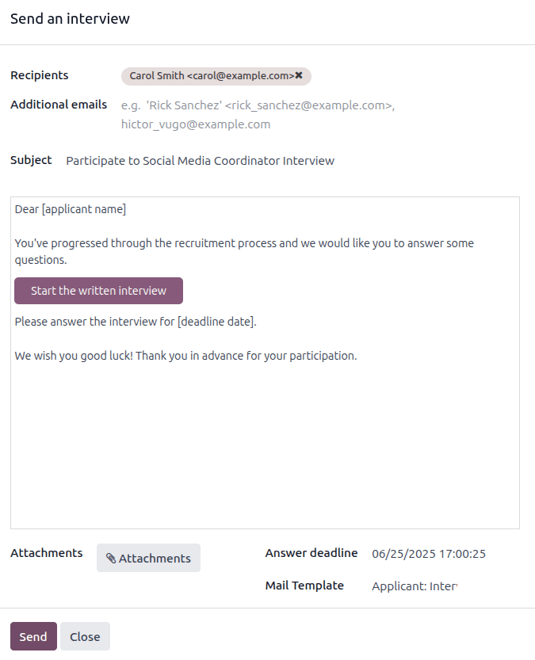

================
Recruitment flow
================

When a prospective employee applies for a job in Odoo, there is a preconfigured process from the
:ref:`initial inquiry <recruitment/new>` to the :ref:`creating of a new employee
<recruitment/new-employee>` once hired. The following outlines the default recruitment process for
Odoo's *Recruitment* application.

.. important::
   The following is based on Odoo's default recruitment pipeline. Be advised that if
   :ref:`modifications are made <recruitment/customize-stages>` to the pipeline, the process
   differs.

.. _recruitment/new:

New
===

At the start of the process, all applicants appear in the :guilabel:`New` stage on the
:guilabel:`Applications` page, whether submitted online or if the applicant is :doc:`manually
entered by a recruiter <add-new-applicants>`.

When the applicant's card is created, Odoo automatically populates the
:guilabel:`Subject/Application`, the :guilabel:`Applicant's Name`, :guilabel:`Email`, and
:guilabel:`Mobile` number, on the applicant's card. This information is required when applying for
a job position, by default.

.. note::
   If the website application form is modified, different fields may be populated, based on what
   information is requested on the website.

If the applicant entered any information in the *Short Introduction* section of the online
application, it populates the :guilabel:`Application Summary` tab at the bottom of the applicant's
card.

Resumé
------

If a resumé was attached to the online application, it appears in the :guilabel:`Files` section of
the chatter, and is also stored in the *Documents* application.

To find the recruitment documents, navigate to the main :menuselection:`Documents app` dashboard,
and click the :guilabel:`Recruitment` folder on the left-hand side. All recruitment documents are
stored within that folder.

If the :ref:`CV Display <recruitment/cv-display>` option was enabled in the :ref:`Settings
<recruitment/settings>` of the *Recruitment* app, the resumé appears on the applicant's card, on the
right-hand side.

.. note::
   Depending on the browser zoom level, or size of the browser screen, the resumé may appear below
   the main applicant card information as a PDF link.

Send interview
--------------

At any point in the hiring process, an interview can be sent to the applicant to obtain more
information. These interviews are custom-made, and can be formatted in a variety of ways.

The *Surveys* application is **required** to send interviews to an applicant, so it **must** be
installed.

Odoo uses the term *interview*, but these can be thought of as questionnaires, surveys, tests,
certifications, etc. Custom interviews can be formatted to suit each individual job position's
needs. For more information on creating and editing interviews, refer to the
:doc:`../../hr/recruitment/new_job` documentation.

.. example::
   A job position for a computer programmer could have an interview in the form of a programming
   quiz to determine the skill level of the applicant. A job position for a restaurant server could
   have a questionnaire inquiring about the applicant's availability, if the desired applicant needs
   to be available on weekend evenings.

To send an interview to an applicant, first click the applicant's card from the
:guilabel:`Applications` page, to view the detailed applicant information. At the top-left of the
applicant's card, click the :guilabel:`Send Interview` button.

If the applicant's card has an email address on file, a :guilabel:`Send an interview` pop-up window
appears, with the :guilabel:`Recipients`, :guilabel:`Subject`, and email body populated.

.. note::
   To send an email to an applicant, there **must** be an :guilabel:`Email` address on the
   applicant's card.

   If an email address is not entered on the applicant's card, when the :guilabel:`Send Interview`
   button is clicked, an :guilabel:`Edit: (Applicant's Name)` pop-up window appears, *on top of* the
   :guilabel:`Send an interview` pop-up window.

   Enter the email address in the :guilabel:`Email` field, then click :guilabel:`Save & Close`.

   Once the applicant's information is saved, the :guilabel:`Edit: (Applicant's Name)` pop-up window
   closes, and the :guilabel:`Send an interview` pop-up window remains.

Sometimes, preconfigured email templates in Odoo use dynamic placeholders, which are automatically
filled with specific data when the email is sent. For example, if a placeholder for the applicant's
name is used, it is replaced with the actual name of the applicant in the email. For more detailed
information on email templates, refer to the :doc:`../../general/companies/email_template`
documentation.

Add the email addresses of any additional recipients for the survey in the :guilabel:`Additional
emails` field, if more people should receive the email. If an email address is in the database as a
contact, add that contact in the :guilabel:`Recipients` field. If an email should be sent to someone
who is not in the database as a contact, and they should **not** be added as a contact, add their
email address in the :guilabel:`Additional emails` field.

If any attachments need to be added, click the :icon:`fa-paperclip` :guilabel:`Attachments` button,
and a file explorer window appears. Navigate to the desired file, and click :guilabel:`Open` to
attach it to the email. The attachment loads, and is listed above the :icon:`fa-paperclip`
:guilabel:`Attachments` button.

If the emailed interview must be completed by a specific date, enter that date in the
:guilabel:`Answer deadline` field, located in the lower-right area of the pop-up window.

To do so, click the empty field next to :guilabel:`Answer deadline`, and a calendar selector
appears. Use the :icon:`fa-chevron-left` :guilabel:`(left)` and :icon:`fa-chevron-right`
:guilabel:`(right)` arrows, on either side of the month, to navigate to the desired month. Then,
click on the desired day to select the date.

The :guilabel:`Mail Template` field is pre-populated, based on the configuration for the interview.
A different template can be chosen from the drop-down menu, if desired. If a new template is
selected, the new email template loads in the email body.

To send the email with the interview link to the applicant, click :guilabel:`Send` at the bottom of
the email pop-up window.

         pre-configured template.

.. _recruitment/initial-qualification:

Initial qualification
=====================

If an applicant seems to be a good potential candidate, they are moved to the :guilabel:`Initial
Qualification` stage.

This stage exists to quickly sort candidates that have potential, from those that do not meet the
requirements. No automatic actions, such as emails, are set for this stage. This stage simply
informs the recruitment team to potentially set up a phone call or an interview with the candidate.

.. note::
   In order to move an applicant's card from one stage to another, the applicant's card can either
   be dragged and dropped in the Kanban view of the :guilabel:`Applications` page to the desired
   stage, or the stage can be modified on the applicant's card.

   To change the stage on the applicant's card, first click the desired applicant's card from the
   :guilabel:`Applications` page. The current stage for the card is highlighted at the top on a
   status bar, above the card.

   Click the desired stage for the card, and the stage changes. A log note indicating the stage
   change appears in the chatter, as well.

  .. image:: recruitment-flow/stage-change.png
     :align: center
     :alt: Change the stage of an applicant by clicking on the desired stage at the top of the
           applicant's card.

.. _recruitment/first-interview:

First interview
===============

After an applicant has passed the :guilabel:`Initial Qualification` stage, they can be manually
moved to the :guilabel:`First Interview` stage on the :guilabel:`Applications` page, while in Kanban
view.

To move the applicant to the next stage, drag-and-drop the applicant's card to the :guilabel:`First
Interview` stage.

Alternatively, open the desired applicant's card from the :guilabel:`Applications` page, and click
the :guilabel:`First Interview` stage on the status bar at the top of the individual applicant's
card.

.. image:: recruitment-flow/move.png
   :align: center
   :alt: An applicant's card moves from one stage to another by using the click and drag method.

.. tip::
   The :guilabel:`First Interview` stage can be modified, so when the applicant's card moves to the
   :guilabel:`First Interview` stage, an email can be automatically sent to the applicant, stating
   an interview is requested. In this pre-configured email template, a link to the recruiting team's
   calendar appears, allowing the applicant to schedule their interview.

   :ref:`Edit <recruitment/edit-stage>` the :guilabel:`First Interview` stage, and select the
   :guilabel:`Recruitment: Schedule Interview` option in the :guilabel:`Email Template` field, to
   automate this action.

.. _recruitment/second-interview:

Second interview
================

After an applicant has passed the :guilabel:`First Interview` stage, they can be moved to the
:guilabel:`Second Interview` stage. To move the applicant to the next stage, drag-and-drop the
applicant's card to the :guilabel:`Second Interview` stage from the Kanban view of the
:guilabel:`Applications` page, or click on the :guilabel:`Second Interview` stage at the top of the
individual applicant's card.

When the applicant's card moves to the :guilabel:`Second Interview` stage, there are no automatic
activities or emails configured for this stage, by default. The recruiter can now :ref:`schedule a
second interview <recruitment/schedule_interviews/recruitment-scheduled>` with the applicant,
following the same process as the first interview.

.. _recruitment/contract-proposal:

Contract Proposal
=================

After the applicant has completed the various interview processes, the next step is to :doc:`send
the job offer <offer_job_positions>`.

Once the offer has been sent, drag-and-drop the applicant's card to the :guilabel:`Contract
Proposal` stage from the Kanban view of the :guilabel:`Applications` page, or click on the
:guilabel:`Contract Proposal` stage at the top of the individual applicant's card.

Contract Signed
===============

Once the contract has been signed, and the applicant has been hired, the applicant's card moves to
the :guilabel:`Contract Signed` stage.

Drag-and-drop the applicant's card to the :guilabel:`Contract Signed` stage from the Kanban view of
the :guilabel:`Applications` page, or click the :icon:`fa-ellipsis-h` :guilabel:`(ellipsis)` icon at
the top of the individual applicant's card, then click :guilabel:`Contract Signed` on the status
bar.

Refuse applicant
================

At any point in the recruitment process, a candidate can be :doc:`refused <refuse_applicant>`.
