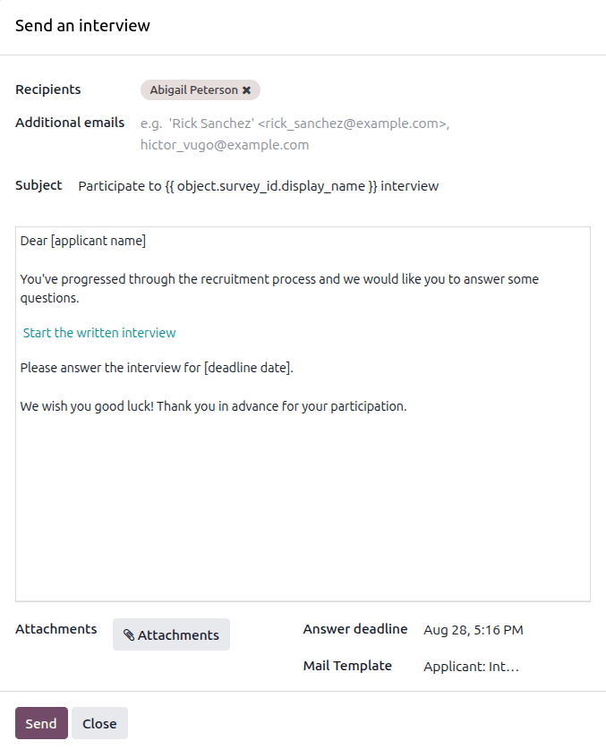

================
Recruitment flow
================

When a prospective employee applies for a job in Odoo, there is a preconfigured process from the
:ref:`initial inquiry <recruitment/recruitment_flow/new>` to the :ref:`creation of a new employee
<recruitment/offer_job_positions/new-employee>` once hired. The following outlines the default
recruitment process for Odoo's **Recruitment** application.

.. important::
   The following is based on Odoo's *default* recruitment pipeline. Be advised that if
   :ref:`modifications are made <recruitment/customize-stages>` to the pipeline, the process
   differs.

.. _recruitment/recruitment_flow/new:

New
===

At the start of the process, all applicants appear in the :guilabel:`New` stage on the
*Applications* page, whether they submitted through the company website, emailed a resumé to the
email alias, or were :doc:`manually added by a recruiter <add-new-applicants>`.

The :guilabel:`Applicant`, :guilabel:`Email`, and :guilabel:`Phone` number on the applicant's card
are filled as soon as it is created. By default, these details are required for every job position.

.. note::
   If the website application form is modified, different fields may be populated, based on what
   information is required on the website.

Anything typed in the *Short Introduction* section appears in the applicant's chatter as a note from
:guilabel:`OdooBot`, labeled *Other Information*.

Resumé
------

If a resumé was attached to the online application, it appears in the *Files* section of the
chatter, and is also stored in the **Documents** application.

To find the recruitment documents, navigate to the main :menuselection:`Documents` app dashboard,
and click the :guilabel:`Recruitment` folder on the side. All recruitment documents are stored
within that folder.

.. note::
   Depending on the browser zoom level, or size of the browser screen, the resumé may appear below
   the main applicant card information as a PDF link, or on the right side as an image.

Send interview
--------------

At any point in the hiring process, an interview can be sent to the applicant to obtain more
information. These interviews are custom-made, and can be formatted in a variety of ways.

The **Surveys** application is required to send interviews to an applicant, so it **must** be
installed.

Odoo uses the term *interview*, but these can be thought of as questionnaires, surveys, tests,
certifications, etc. :doc:`Custom interviews <new_job>` can be formatted to suit each individual job
position's needs.

.. example::
   A job position for a computer programmer could have an interview in the form of a programming
   quiz to determine the skill level of the applicant. A job position for a restaurant server could
   have a questionnaire inquiring about the applicant's availability, if the desired applicant needs
   to be available on weekend evenings.

To send an interview to an applicant, first open the applicant's card from the *Applications* page
to view the detailed applicant information. In the top corner of the applicant's card, click the
:guilabel:`Send Interview` button.

If the applicant's card has an email address on file, a *Send an interview* pop-up window appears,
with the :guilabel:`Recipients`, :guilabel:`Subject`, and email body populated.

.. note::
   To send an email to an applicant, there **must** be an :guilabel:`Email` address on the
   applicant's card.

   If an email address is missing on the applicant's card, when the :guilabel:`Send Interview`
   button is clicked and the *Send an interview* pop-up window loads, a second pop-up window appears
   under the :guilabel:`Recipients` field. This pop-up window displays `What's the email address of
   (applicant name)?` along with a field to enter the email address. Once entered, click
   :guilabel:`Set Email`.

   The email address entered is only used to send the interview, and does **not** appear on the
   applicant's card.

Sometimes, preconfigured :doc:`email templates <../../general/companies/email_template>` in Odoo use
dynamic placeholders, which are automatically filled with specific data when the email is sent. For
example, if a placeholder for the applicant's name is used, it is replaced with the actual name of
the applicant in the email.

Add the email addresses of any additional recipients for the survey in the :guilabel:`Additional
emails` field, if more people should receive the email. If an email address is in the database as a
contact, add that contact in the :guilabel:`Recipients` field. If an email should be sent to someone
who is *not* in the database, and they should *not* be added as a contact, add their email address
in the :guilabel:`Additional emails` field.

If any attachments need to be added, click the :icon:`fa-paperclip` :guilabel:`Attachments` button,
and a file explorer window appears. Navigate to the desired file, and click :guilabel:`Open` to
attach it to the email. The attachment loads, and is listed above the :icon:`fa-paperclip`
:guilabel:`Attachments` button.

The :guilabel:`Answer deadline` field specifies when the interview form must be completed by, and is
populated with a date and time two weeks in the future. To modify this, click on the displayed date
and time, navigate to the desired date and click the date to select it. Next, select the time the
interview is due by clicking into the displayed time, and clicking the desired new deadline.

The :guilabel:`Mail Template` field is pre-populated based on the configuration for the interview. A
different template can be chosen from the drop-down menu, if desired. If a new template is selected,
the new email template loads in the email body.

To send the email with the interview link to the applicant, click :guilabel:`Send` at the bottom of
the *Send an interview* pop-up window.

         preconfigured template.

.. _recruitment/recruitment_flow/initial-qualification:

Qualification
=============

If an applicant is determined to be a good potential candidate, they are moved to the
:guilabel:`Qualification` stage.

This stage exists to sort candidates that have potential from those that do not meet the
requirements. No automatic actions, such as emails, are set for this stage. This stage informs the
recruitment team to potentially set up a phone call or an interview with the candidate.

.. note::
   In order to move an applicant's card from one stage to another, the applicant's card can either
   be dragged and dropped in the Kanban view of the *Applications* page to the desired stage, or the
   stage can be modified on the applicant's card.

   To change the stage on the applicant's card, first click the desired applicant's card from the
   *Applications* page. The current stage for the card is highlighted at the top on a status bar,
   above the card.

   Click the desired stage for the card, and the stage changes. A log note indicating the stage
   change appears in the chatter, as well.

  .. image:: recruitment-flow/stage-change.png
     :alt: Change the stage of an applicant by clicking on the desired stage at the top of the
           applicant's card.

.. _recruitment/recruitment_flow/first-interview:

First interview
===============

After an applicant has passed the :guilabel:`Qualification` stage, they can be manually moved to the
:guilabel:`First Interview` stage on the *Applications* page, while in Kanban view.

To move the applicant to the next stage, drag and drop the applicant's card to the :guilabel:`First
Interview` stage.

Alternatively, open the desired applicant's card from the *Applications* page, and click the
:guilabel:`First Interview` stage on the status bar at the top of the individual applicant's card.

.. tip::
   The :guilabel:`First Interview` stage can be modified, so when the applicant's card moves to the
   :guilabel:`First Interview` stage, an email can be automatically sent to the applicant, stating
   an interview is requested. In this preconfigured email template, a link to the recruiting team's
   calendar appears, allowing the applicant to schedule their interview.

   :ref:`Edit <recruitment/edit-stage>` the :guilabel:`First Interview` stage, and select the
   :guilabel:`Recruitment: Schedule Interview` option in the :guilabel:`Email Template` field to
   automate this action.

.. _recruitment/recruitment_flow/second-interview:

Second interview
================

After an applicant has passed the :guilabel:`First Interview` stage, they can be moved to the
:guilabel:`Second Interview` stage. To move the applicant to the next stage, drag and drop the
applicant's card to the :guilabel:`Second Interview` stage from the Kanban view of the
*Applications* page, or click on the :guilabel:`Second Interview` stage at the top of the individual
applicant's card.

When the applicant's card moves to the :guilabel:`Second Interview` stage, there are no automatic
activities or emails configured for this stage, by default. The recruiter can now :ref:`schedule a
second interview <recruitment/schedule_interviews/recruitment-scheduled>` with the applicant,
following the same process as the first interview.

.. _recruitment/recruitment_flow/contract-proposal:

Contract proposal
=================

After the applicant has completed the various interview processes, the next step is to :doc:`send
the job offer <offer_job_positions>`.

Once the offer has been sent, drag and drop the applicant's card to the :guilabel:`Contract
Proposal` stage from the Kanban view of the *Applications* page, or click on the :guilabel:`Contract
Proposal` stage at the top of the individual applicant's card.

Contract signed
===============

Once the contract has been fully signed by all parties, and the applicant has been hired, the
applicant's card moves to the :guilabel:`Contract Signed` stage.

The :guilabel:`Contract Signed` is folded by default on the *Applications* page, and must be
expanded before the applicant's card can be manually moved. Click the :icon:`fa-caret-left`
:icon:`fa-caret-right` :guilabel:`(Unfold)` icon above the :guilabel:`Contract Signed` stage, and
the stage expands. Next, drag and drop the applicant's card to the :guilabel:`Contract Signed` stage
from the Kanban view, or click the :guilabel:`Contract Signed` stage at the top of the individual
applicant's card.

Refused
=======

At any point in the recruitment process, a candidate can be :doc:`refused <refuse_applicant>`.
