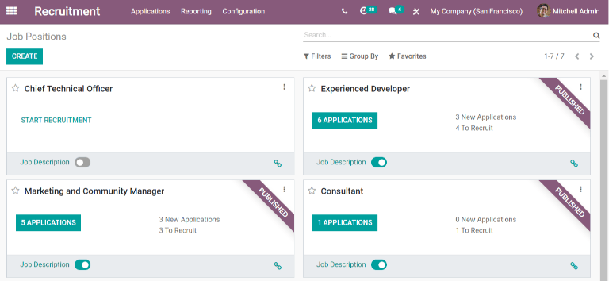
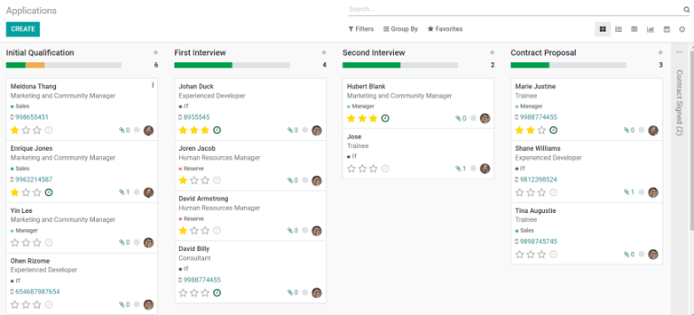
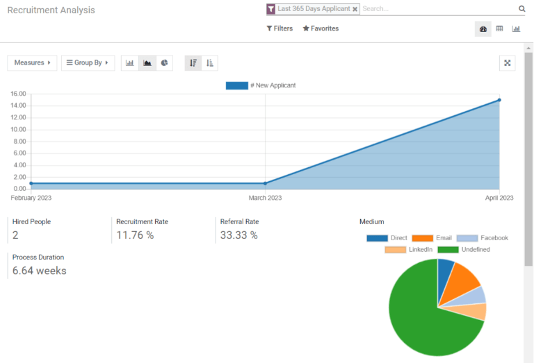
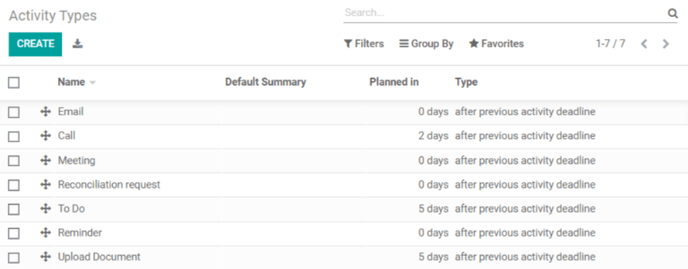

================================
Getting started with Recruitment
================================

Organize job postings, easily publish and unpublish openings, view applicants and see the stage in
the hiring process they are in, and see full recruitment metrics all from the
:guilabel:`Recruitment` application.

Applications
============

By Job Positions
----------------

The default view for :guilabel:`Recruitment`, and for :menuselection:`Recruitment --> Applications
--> By Job Positions` displays all the :guilabel:`Job Positions` for the company, regardless of
status. Each :guilabel:`Job Position` card shows the name of the position, and whether or not the
recruitment process has started. Click the :guilabel:`Start Recruitment` smart button to publish the
job listing and begin the recruitment process. Once published, a :guilabel:`Published` banner will
appear in the corner. If a published job position has applicants, a smart button listing to the
applicants appears instead of :guilabel:`Start Recruitment`. Published cards show how many positions
are available to be filled, and how many new applicants there have been. :guilabel:`Publish` and
:guilabel:`Unpublish` a job position by clicking on the publish toggle button. The
:guilabel:`Link Tracker` icon will display any links associated with the job posting, such as a
LinkedIn listing.

All Applications
----------------

To view all applications received, go to :menuselection:`Recruitment --> Applications --> All
Applications`. A kanban view will show all applicants, and organize them by stage. The default
stages are :guilabel:`Initial Qualification`, :guilabel:`First Interview`, :guilabel:`Second
Interview`, and :guilabel:`Contract Proposal`. :guilabel:`Contract Signed` is hidden by default but
can be viewed by clicking :guilabel:`Unfold`. Applicant stages can be changed by moving a card to a
new stage. Each applicant card displays the applicant's name, the name of the job being applied to,
any relevant tags, such as departments, the applicant's photos, any documents attached, a clock icon
to indicate if an activity has been scheduled, and a rating system of stars. Easily schedule an
interview by clicking on the drop down menu of a card, and clicking on :guilabel:`Schedule
Interview`.

Reporting
=========

Recruitment Analysis
--------------------

The report for :guilabel:`Recruitment Analysis` provides a breakdown of the applicants for the last
365 days. How many applicants appear on the main chart, with metrics on how many people were hired,
what the recruitment rate was, the referral rate, and how long the typical hiring process lasts. A
pie chart shows where the applicants came from, such as email, direct applications, and various
social media platforms like Facebook or LinkedIn. A breakdown of the detailed application metrics by
position appears at the bottom and the information can be inserted into a spreadsheet for further
analysis.

Configuration
=============

Settings
--------

Select whether or not to post available jobs on the company's website. If
:guilabel:`Interview Forms` are going to be used, activate the forms and modify them through the
settings. Click on the :guilabel:`Interview Forms` internal link button to access all the surveys.
Edit the relevant documents here by clicking on a form and making modifications. When offering an
applicant a position, decide how many days the offer is valid by entering the number in the
:guilabel:`Salary Package Configurator` section.

Job Positions
-------------

This section lists all job positions currently being recruited for, and the metrics associated with
the position. Each :guilabel:`Job Position` lists the title of the positions, the
:guilabel:`Department` it is in, a :guilabel:`Website` link if applicable, the current, expected,
and total forecasted, and hired employees, the Status of the job, and the company the position is
for. Click on any :guilabel:`Job Position` to modify the information.

Refuse Reasons
--------------

A list of refuse reasons is presented and can be modified. Add a new :guilabel:`Refuse Reason` by
clicking the :guilabel:`Create` smart button and entering the reason. These reasons are used
internally when closing an application, to track the reason why a candidate did not accept an offer.

Departments
-----------

See the various :guilabel:`Departments` in a list view, and the associated company, manager, and
parent department for each department. Create a new department by clicking the :guilabel:`Create`
smart button. Enter the information, and click the :guilabel:`Save` smartbutton to add a new
department. The only required field is the :guilabel:`Department Name`.

Activity Types
--------------

This list displays the various activities a  recruiter can perform, such as sending an email, making
a call, scheduling a meeting, or upload a document. Each activity can have a set number of days
after an activity or deadline, which is when the activity will be prompted. Add a new activity by
clicking the :guilabel:`Create` smart button, entering the information, and clicking
:guilabel:`Save`.

