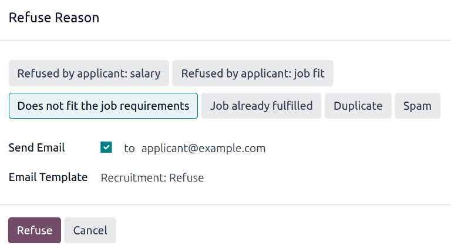
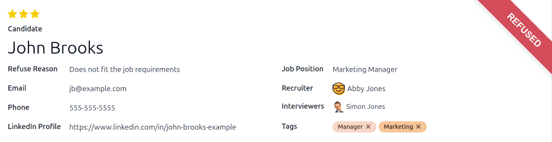

=================
Refuse applicants
=================

At any point in the recruitment process, an applicant can be refused for a job position.

To refuse an applicant, start by navigating to the applicant's card in the *Recruitment* app. This
is done in one of two ways:

- Navigate to :menuselection:`Recruitment app --> Applications --> All Applications`. In the
  :guilabel:`Applications` list, click anywhere on the desired applicant's line to open that
  specific applicant's card.
- Navigate to the main *ob Positions* dashboard by navigating to :menuselection:`Recruitment app
  --> Applications --> By Job Position`. Next, click on the desired job position card, then click on
  the individual applicant card from the :guilabel:`Applications` page.

At the top of the applicant's card, there are several buttons. Click the one labeled
:guilabel:`Refuse`.

.. _recruitment/refuse-reasons:

Refuse reasons
==============

*Refuse reasons* allow recruiters to document why an applicant was not a good fit, and send specific
refusal reason email templates to the applicant.

Clicking :guilabel:`Refuse` on an applicant's form makes the :guilabel:`Refuse Reason` pop-up window
appear.

The default refuse reasons in Odoo, and their corresponding email templates, are:

.. list-table::
   :header-rows: 1
   :stub-columns: 1

   * - Email Template
     - Refusal Reason
   * - :guilabel:`Recruitment: Refuse`
     - | :guilabel:`Doesn't fit the job requirements`
       | :guilabel:`Language issues`
       | :guilabel:`Role already fulfilled`
       | :guilabel:`Duplicate`
       | :guilabel:`Spam`
   * - :guilabel:`Recruitment: Not interested anymore`
     - | :guilabel:`Refused by Applicant: don't like job`
       | :guilabel:`Refused by Applicant: better offer`
       | :guilabel:`Refused by Applicant: salary`

Additional refusal reasons :ref:`can be created, and existing ones can be modified (or deleted)
<recruitment/new-refuse>`.

Select a refusal reason to :ref:`send a refusal email <recruitment/send-refusal-email>`.

.. _recruitment/new-refuse:

Create or modify refuse reasons
-------------------------------

To view and configure refuse reasons, navigate to :menuselection:`Recruitment app --> Configuration
--> Applications: Refuse Reasons`. Doing so reveals the :guilabel:`Refuse Reasons` page, where all
the existing refuse reasons are listed.

To create a new refuse reason from the :guilabel:`Refuse Reasons` page, click the :guilabel:`New`
button in the top-left corner. A blank line appears at the bottom of the list, with an empty field
present in the :guilabel:`Description` column.

Type in the new refuse reason in the field. It is recommended to enter a reason that is short and
concise, such as `Offer expired` or `Withdrew application`.

Then, in the :guilabel:`Email Template` field, click on the field to reveal a drop-down menu.
Select an :guilabel:`Email Template` from the list to be used when this refuse reason is selected.

If a new :guilabel:`Email Template` is desired, type in the name for the new template in the field.
Then, click :guilabel:`Create and edit...`, and a :guilabel:`Create Email Template` form pop-up
window appears.

In the :guilabel:`Create Email Template` pop-up window, enter a :guilabel:`Name` for the form, and
an email :guilabel:`Subject` in the corresponding fields.

Enter the desired email content in the :guilabel:`Content` tab. Proceed to make any other
modifications to the template in the :guilabel:`Email Configuration` and :guilabel:`Settings` tabs,
then click :guilabel:`Save & Close` to save the template. Upon clicking that, Odoo returns to the
:guilabel:`Refuse Reasons` list.

The new template appears in the new refuse reason :guilabel:`Email Template` field.

.. note::
   Pre-configured recruitment refusal email templates in Odoo use dynamic placeholders, which are
   personalized placeholders that populate data from the applicant's record in the email body.

   For example, if the applicant's name is a used in a dynamic placeholder, the applicant's name
   appears anytime that dynamic placeholder appears on the email template.

   For more detailed information on email templates, refer to the
   :doc:`../../general/companies/email_template` documentation.

.. _recruitment/send-refusal-email:

Send refusal email
==================

After clicking the :guilabel:`Refuse` button on an applicant form, a :ref:`Refuse Reason
<recruitment/refuse-reasons>` can be selected from the :guilabel:`refuse reason` pop-up window.
Then, two fields appear below the selected refusal reason: :guilabel:`Send Email` and
:guilabel:`Email Template`.

The applicant's email address automatically populates the :guilabel:`Send Email` field; additional
email recipients **cannot** be added.

If an email should **not** be sent to the applicant, uncheck the :guilabel:`Send Email` checkbox.

The email template associated with the refusal reason populates the :guilabel:`Email Template`
field. If a different email template is desired, select a different template from the
:guilabel:`Email Template` drop-down menu.

To send the refusal email to the applicant, ensure the :guilabel:`Send Email` checkbox is ticked,
then click :guilabel:`Refuse` at the bottom of the :guilabel:`Refuse Reason` pop-up window. The
refusal email is sent to the applicant, and a red :guilabel:`Refused` banner appears on the
applicant's card in the top-right corner.

View refused applicants
=======================

After refusal, the applicant's card is no longer visible in the job position's Kanban view. However,
it is still possible to view applicants who have been refused.

To view only the refused applicants, go to :menuselection:`Recruitment app --> Applications --> By
Job Positions`, or :menuselection:`Recruitment app --> Applications --> All Applications`.

On the :guilabel:`Applications` page, click the :icon:`fa-caret-down` :guilabel:`(caret down)`
button in the :guilabel:`Search...` bar, then click :guilabel:`Refused`, located under the
:guilabel:`Filters` section.

All applicants that have been refused for the job position appear on the :guilabel:`Applications`
page for that position, organized by the stage they were in when they were refused.
