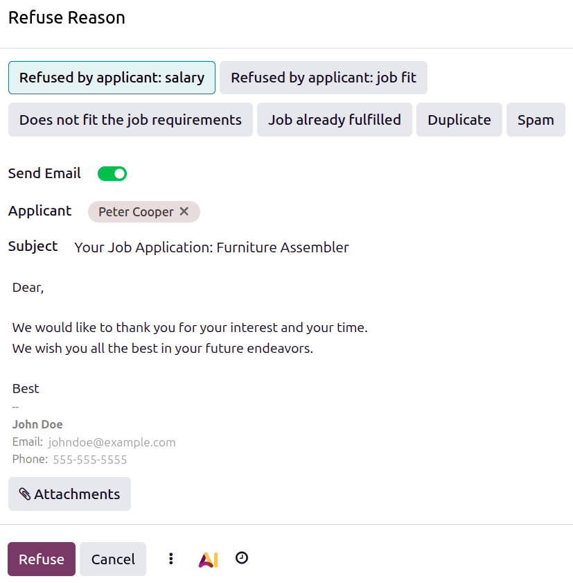
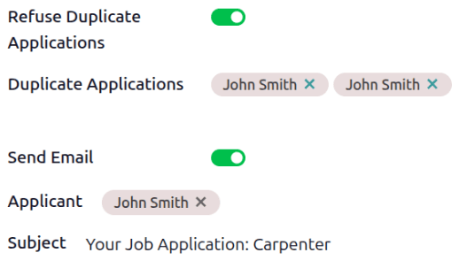
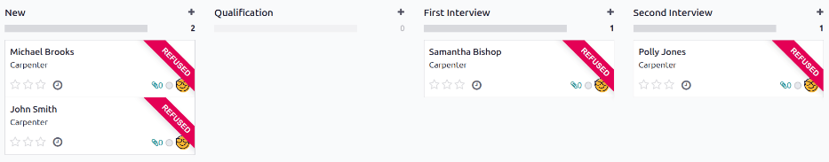
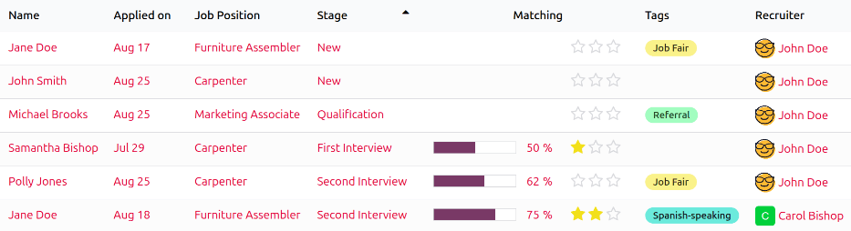

=================
Refuse applicants
=================

At any point in the recruitment process, an applicant can be refused for a job position.

To refuse an applicant, start by navigating to the applicant's card in the **Recruitment** app. This
is done in one of two ways:

- Open the main *Job Positions* dashboard by navigating to :menuselection:`Recruitment app -->
  Applications --> By Job Positions`. Next, click on the desired job position card, then click on
  the individual applicant card from the *Applications* page.
- Navigate to :menuselection:`Recruitment app --> Applications --> All Applications`. In the
  :guilabel:`Applications` list, click anywhere on the desired applicant's line to open that
  specific applicant's card.

At the top of the applicant's card, there are several buttons. Click the one labeled
:guilabel:`Refuse`.

.. _recruitment/refuse-reasons:

Refuse reasons
==============

*Refuse reasons* allow recruiters to document why an applicant was not a good fit, and send specific
refusal reason email templates to the applicant.

Clicking :guilabel:`Refuse` on an applicant's form makes the *Refuse Reason* pop-up window appear.

The default refuse reasons in Odoo, and their corresponding :ref:`refusal email
<recruitment/refuse_applicant/send-refusal-email>` templates, are:

.. list-table::
   :header-rows: 1
   :stub-columns: 1

   * - Email Template
     - Refusal Reason
   * - :guilabel:`Recruitment: Refuse`
     - | :guilabel:`Does not fit the job requirements`
       | :guilabel:`Job already fulfilled`
       | :guilabel:`Duplicate`
       | :guilabel:`Spam`
   * - :guilabel:`Recruitment: Not interested anymore`
     - | :guilabel:`Refused by applicant: job fit`
       | :guilabel:`Refused by applicant: salary`

Additional refusal reasons :ref:`can be created, and existing ones can be modified (or deleted)
<recruitment/refuse_applicant/new-refuse>`.

.. _recruitment/refuse_applicant/new-refuse:

Create or modify refuse reasons
-------------------------------

To view and configure refuse reasons, navigate to :menuselection:`Recruitment app --> Configuration
--> Refuse Reasons`. Doing so reveals the *Refuse Reasons* page, where all the existing refusal
reasons are listed.

To create a new refuse reason from the *Refuse Reasons* page, click the :guilabel:`New` button. A
blank line appears at the bottom of the list, with an empty field present in the
:guilabel:`Description` column.

Type in the new refuse reason in the field. It is recommended to enter a reason that is short and
concise, such as `Offer expired` or `Withdrew application`.

Then, click in the :guilabel:`Email Template` field to reveal a drop-down menu. Select the desired
email template from the list to be used when the new refuse reason is selected.

If a new email template is desired, type in the name for the new template in the field. Then, click
:guilabel:`Create and edit...`, and a *Create Email Template* pop-up window appears.

The :guilabel:`Template Name` field is populated with the name entered in the :guilabel:`Email
Template` column by default, but can be modified if desired. Enter the email :guilabel:`Subject` in
the corresponding field, and add the email content in the *Body* tab. To include attachments, click
the *Options* tab, and add the attachment using the :icon:`fa-paperclip` :guilabel:`Attachments`
button. To assign an :guilabel:`Owner` for the template, select a user in the drop-down menu. Enter
a :guilabel:`Template Description` in the corresponding field.

Click :guilabel:`Save`, and Odoo returns to the *Refuse Reasons* list.

The new template appears in the new refuse reason :guilabel:`Email Template` field.

.. note::
   Pre-configured recruitment refusal email templates in Odoo use dynamic placeholders, which are
   personalized placeholders that populate data from the applicant's record in the email body.

   For example, if the applicant's name is used in a dynamic placeholder, the applicant's name
   appears anytime that dynamic placeholder appears on the email template.

   For more detailed information on email templates, refer to the
   :doc:`../../general/companies/email_template` documentation.

.. _recruitment/refuse_applicant/send-refusal-email:

Send refusal email
==================

After clicking the :guilabel:`Refuse` button on an applicant form, a :ref:`refuse reason
<recruitment/refuse-reasons>` is selected from the *Refuse Reason* pop-up window.

The applicant's email address automatically populates the :guilabel:`Applicant` field. The
:guilabel:`Subject` and email body are populated according to the corresponding email template.

To send the refusal email to the applicant, click :guilabel:`Refuse` at the bottom of the *Refuse
Reason* pop-up window. The refusal email is sent to the applicant, and a red :guilabel:`Refused`
banner appears on the applicant's card in the corner.

.. tip::
   If an application should be refused but an email should **not** be sent (if, for example, the
   application was spam), click the :guilabel:`Send Email` toggle to deactivate it, and click
   :guilabel:`Refuse` at the bottom of the *Refuse Reason* pop-up window.

Refuse duplicate applicant
--------------------------

Occasionally, applicants apply multiple times for the same job position. When this occurs, it is
possible to refuse all their applications at once, instead of individually.

In this situation, a :guilabel:`Refuse Duplicate Applications` toggle appears on the *Refuse Reason*
pop-up window. Enable the toggle, and a :guilabel:`Duplicate Applications` field appears beneath it,
listing the applicant's name for each duplicate application in the system.

To refuse *all* applications for that applicant, click the :guilabel:`Refuse` button.

The applicant is only sent one email, and all their applications for the job position are marked as
*Refused*.

View refused applicants
=======================

After refusal, the applicant's card is hidden by default. However, it is still possible to view
applicants who have been refused :ref:`by job position <recruitment/refuse_applicant/job-refused>`,
or view :ref:`all refused applicants <recruitment/refuse_applicant/all-refused>`.

.. _recruitment/refuse_applicant/job-refused:

By job position
---------------

To view the refused applicants for a specific job position, navigate to :menuselection:`Recruitment
app --> Applications --> By Job Positions`, then click the desired job position Kanban card.

On the *Applications* page, click the :icon:`fa-caret-down` :guilabel:`(Toggle Search Panel)` button
in the search bar, then click :guilabel:`Refused` in the :icon:`fa-filter` :guilabel:`Filters`
column.

All applicants that have been refused for the job position appear in the stage they were in when
they were refused, and all other applicants are hidden.

.. _recruitment/refuse_applicant/all-refused:

All refused applicants
----------------------

To view all refused applicants across all job positions, navigate to :menuselection:`Recruitment app
--> Applications --> All Applications`. Every applicant record is displayed in a default list view.

Click the :icon:`fa-caret-down` :guilabel:`(Toggle Search Panel)` button in the search bar, then
click :guilabel:`Refused` in the :icon:`fa-funnel` :guilabel:`Filters` column.

All applicants that have been refused appear, with the text in red. Along with the applicant's
:guilabel:`Name`, the date they :guilabel:`Applied on`, the :guilabel:`Job Position`,
:guilabel:`Stage` they were in when refused, their :guilabel:`Matching` percentage, any
:guilabel:`Tags`, and the :guilabel:`Recruiter` responsible for the job position are listed.

