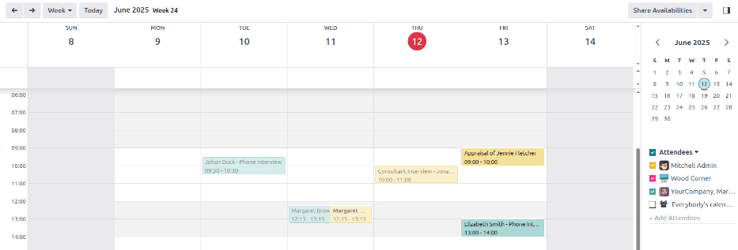
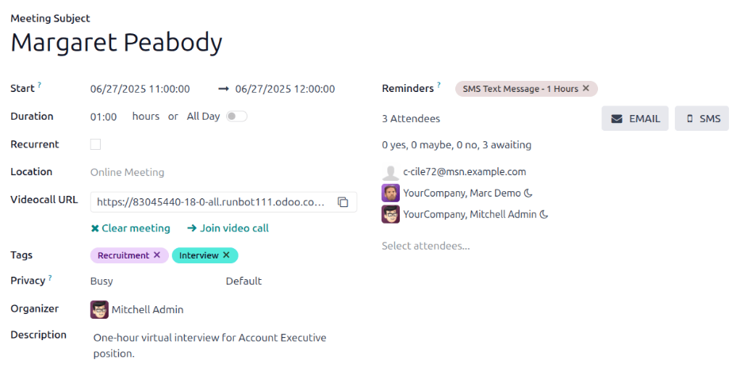
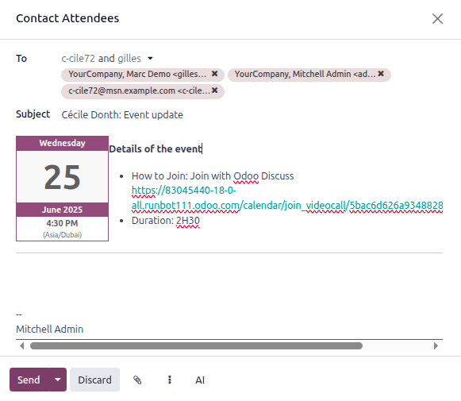
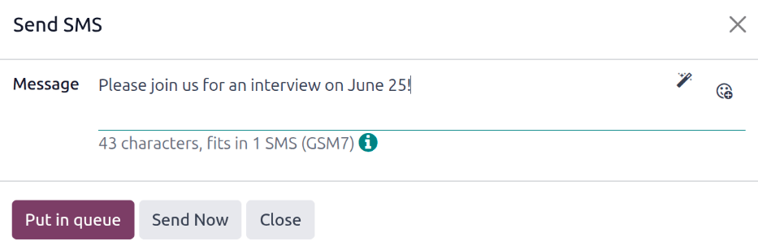
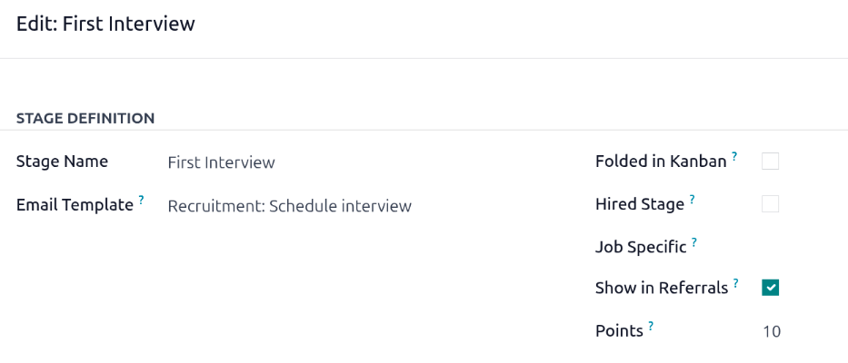
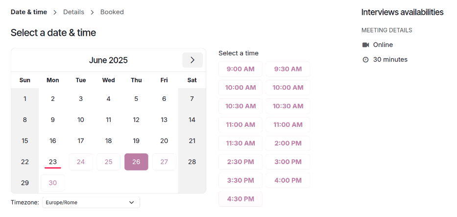
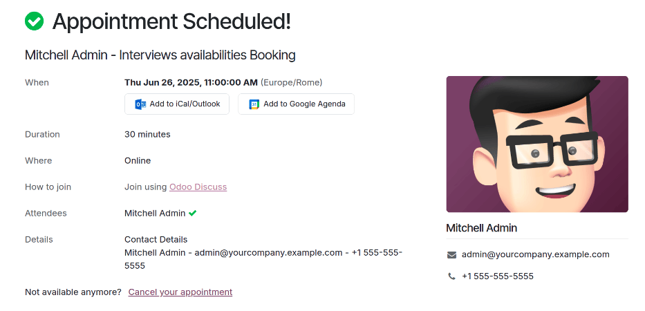

===================
Schedule interviews
===================

An in-person, virtual, or phone interview can be scheduled in one of two ways through the
**Recruitment** app, either by the :ref:`recruitment team
<recruitment/schedule_interviews/recruitment-scheduled>`, or by the :ref:`applicant
<recruitment/schedule_interviews/applicant-scheduled>`.

With one drag-and-drop, Odoo emails the candidate with a self-service link, the candidate books the
time slot, and sends the meeting to everyone's calendar. No more back-and-forth emails or calls.

.. _recruitment/schedule_interviews/recruitment-scheduled:

Recruitment team scheduled interviews
=====================================

When an applicant reaches the interview stage, the recruitment team should schedule the interview,
by first coordinating a suitable date and time with the applicant and interviewers.

To schedule the interview, navigate to the applicant's card, by first going to the
:menuselection:`Recruitment app`, and clicking the relevant job card. This opens the
:guilabel:`Applications` page for that job position. Then, click the desired applicant's card to
view their detailed applicant form.

To schedule an phone, virtual, or in-person interview, click the :icon:`fa-calendar` :guilabel:`No
Meeting` smart button at the top of the applicant's record.

.. note::
   The :guilabel:`Meetings` smart button displays :icon:`fa-calendar` :guilabel:`No Meeting` if no
   meetings are currently scheduled. For applicants who are new to the :guilabel:`First Interview`
   stage, this is the default.

   If there is one meeting already scheduled, the smart button displays :guilabel:`1 Meeting`, with
   the date of the upcoming meeting beneath it. If more than one meeting is scheduled, the button
   displays :guilabel:`Next Meeting`, with the date of the first upcoming meeting beneath it.

Clicking the :guilabel:`Meetings` smart button loads a calendar, showing the scheduled meetings and
events for the currently signed-in user, as well as the employees who are listed under the
:guilabel:`Attendees` section, located to the right of the calendar.

To change the currently loaded meetings and events being displayed, uncheck an attendee whose
calendar events are to be hidden. Only the checked attendees are visible on the calendar.

To add a meeting to the calendar when in the *Day* or *Week* view, click on the start time of the
meeting and drag down to the end time. Doing so selects the date, time, and the length of the
meeting.

A meeting can also be added in this view by clicking on the desired day *and* time slot.

Both methods cause a :ref:`New Event <recruitment/schedule_interviews/event-card>` pop-up window to
appear.

.. _recruitment/schedule_interviews/event-card:

New event pop-up window
-----------------------

Clicking a grid, corresponding with the time and date, opens the :guilabel:`New Event` pop-up window
to schedule a meeting.

Enter the information on the form. The only required fields to enter are a title for the meeting,
along with the :guilabel:`Start` (and end date/time) fields.

Once the card details are entered, click :guilabel:`Save & Close` to save the changes and create the
interview.

After entering in a required name for the meeting, the fields available to modify on the
:guilabel:`New Event` card are as follows:

- :guilabel:`Meeting Title`: Enter the subject for the meeting. This should clearly indicate the
  purpose of the meeting. The default subject is the :guilabel:`Candidate` name entered on the
  applicant's card.
- :guilabel:`Start`: Configure the start and end date and times for the meeting. Clicking either of
  these fields opens a calendar pop-up window. Click on the desired date to select it, and then
  enter the time in the corresponding field. Click :icon:`fa-check` :guilabel:`Apply` to close the
  window.
- :guilabel:`All Day`: Tick the box to schedule an all-day interview. If this box is ticked, the
  :guilabel:`Start` field changes to :guilabel:`Start Date`.
- :guilabel:`Attendees`: Select the people who should attend the meeting. The default attendees are
  the prospective candidate, and the assigned recruiter for the job position. Add as many other
  people as desired.
- :guilabel:`Videocall URL`: If the meeting is virtual, or if there is a virtual option available,
  click :icon:`fa-plus` :guilabel:`Odoo meeting`, and a URL is automatically created for the
  meeting, which populates the field.
- :guilabel:`Description`: Enter a brief description in this field. There is an option to enter
  formatted text, such as numbered lists, headings, tables, links, photos, and more. Use the
  powerbox feature, by typing a `/` to reveal a list of options.

  Scroll through the options and click on the desired item. The item appears in the field, and can
  be modified. Each command presents a different pop-up window. Follow the instructions for each
  command to complete the entry.

More options
~~~~~~~~~~~~

To add additional information to the meeting, click the :guilabel:`More Options` button in the
lower-right corner of the :ref:`New Event <recruitment/schedule_interviews/event-card>` pop-up
window. Enter any of the following additional fields:

- :guilabel:`Duration`: this field auto populates based on the :guilabel:`Start` (and end) date and
  time. If the meeting time is adjusted, this field automatically adjusts to the correct duration
  length. The default length of a meeting is one hour.
- :guilabel:`Recurrent`: if the meeting should repeat at a selected interval (not typical for a
  first interview), tick the checkbox next to :guilabel:`Recurrent`. Several additional fields
  appear when this is enabled:

  - :guilabel:`Timezone`: using the drop-down menu, select the :guilabel:`Timezone` for the
    recurrent meetings.
  - :guilabel:`Repeat`: choose :guilabel:`Daily`, :guilabel:`Weekly`, :guilabel:`Monthly`,
    :guilabel:`Yearly`, or :guilabel:`Custom` recurring meetings. If :guilabel:`Custom` is selected,
    a :guilabel:`Repeat Every` field appears beneath it, along with another time frequency parameter
    (:guilabel:`Days`, :guilabel:`Weeks`, :guilabel:`Months`, or :guilabel:`Years`). Enter a number
    in the blank field, then select the time period using the drop-down menu.
  - :guilabel:`Repeat on`: enabled when the :guilabel:`Weekly` option is selected in the
    :guilabel:`Repeat` field. Choose the day the weekly meeting falls on.
  - :guilabel:`Day of Month`: configure the two drop-down menu options to select a specific day of
    the month, irrespective of the date (e.g. the first Tuesday of every month). To set a specific
    calendar date, choose :guilabel:`Date of Month` and enter the calendar date in the field (e.g.
    `15` to set the meeting to occur on the fifteenth of every month).
  - :guilabel:`Until`: using the drop-down menu, select when the meetings stop repeating. The
    available options are :guilabel:`Number of repetitions`, :guilabel:`End date`, and
    :guilabel:`Forever`. If :guilabel:`Number of repetitions` is selected, enter the number of total
    meetings to occur in the blank field to the right. If :guilabel:`End date` is selected, specify
    the date using the calendar pop-up window, or type in a date in a MM/DD/YYYY format.
    :guilabel:`Forever` schedules meetings indefinitely.

- :guilabel:`Location`: enter the location for the meeting.
- :guilabel:`Tags`: select any tags for the meeting using the drop-down menu, or add a new tag by
  typing in the tag and clicking :guilabel:`Create "tag"`. There is no limit to the number of tags
  that can be used.
- :guilabel:`Privacy`: select if the organizer appears either :guilabel:`Available` or
  :guilabel:`Busy` for the duration of the meeting. Next, select the visibility of this meeting,
  using the drop-down menu to the right of the first selection. Options are :guilabel:`Public`,
  :guilabel:`Private`, and :guilabel:`Only internal users`. :guilabel:`Public` allows for everyone
  to see the meeting, :guilabel:`Private` allows only the attendees listed on the meeting to see the
  meeting, and :guilabel:`Only internal users` allows anyone logged into the company database to see
  the meeting.
- :guilabel:`Organizer`: the employee who created the meeting is populated in this field. Use the
  drop-down menu to change the selected employee.
- :guilabel:`Reminders`: select a reminder from the drop-down menu. Default options include
  :guilabel:`Notification`, :guilabel:`Email`, and :guilabel:`SMS Text Message`, each with a
  specific time period before the event (hours, days, etc). The chosen reminder chosen alerts the
  meeting participants of the meeting, via the selected option at the specified time. Multiple
  reminders can be selected in this field.

Send meeting to attendees
-------------------------

Once changes have been entered on the :ref:`New Event <recruitment/schedule_interviews/event-card>`
pop-up window, and the meeting details are correct, the meeting can be sent to the attendees, via
email or text message, from the expanded event form (what is seen when the :guilabel:`More Options`
button is clicked on in the :guilabel:`New Event` pop-up window).

To send the meeting via email, click the :icon:`fa-envelope` :guilabel:`EMAIL` button next to the
:guilabel:`Attendees` field on the expanded meeting form.

A :guilabel:`Contact Attendees` email configurator pop-up window appears. A pre-formatted email,
using the default :guilabel:`Calendar: Event Update` email template, populates the email body field.

The applicant, followers of the job application, as well as the user who created the meeting, are
added to the :guilabel:`To` by default. Make any desired changes to the email.

To send the meeting via text message, click the :icon:`fa-mobile` :guilabel:`SMS` button next to the
:guilabel:`Attendees` field on the expanded meeting form. A :guilabel:`Send SMS` pop-up window
appears.

At the top, a blue banner appears if any attendees do not have valid mobile numbers, and lists how
many records are invalid. If a contact does not have a valid mobile number listed, click
:guilabel:`Close`, and edit the attendee's record, then redo these steps.

When no warning message appears, type in the message to be sent to the attendees in the
:guilabel:`Message` field. To add any emojis to the message, click the :icon:`oi-smile-add`
:guilabel:`(smile add)` icon on the right-side of the pop-up window.

The number of characters, and amount of text messages required to send the message (according to
GSM7 criteria) appears beneath the :guilabel:`Message` field. Click :guilabel:`Put in queue` to have
the text sent later, after any other messages are scheduled, or click :guilabel:`Send Now` to send
the message immediately.

.. note::
   Sending text messages is **not** a default capability with Odoo. To send text messages, credits
   are required, which need to be purchased. For more information on IAP credits and plans, refer to
   the :doc:`../../essentials/in_app_purchase` documentation.

.. _recruitment/schedule_interviews/applicant-scheduled:

Applicant scheduled interviews
==============================

Coordinating interview times typically requires several email exchanges and can slow the recruitment
process. Enabling Odoo's self-service scheduling removes that bottleneck: when an applicant is moved
to an interview stage, the system automatically sends a scheduling link, records the selected slot,
and updates all relevant calendars.

This automation is turned off by default. To activate it, assign the :guilabel:`Recruitment:
Schedule Interview` email template to either the :guilabel:`First Interview` or :guilabel:`Second
Interview` stage (see :ref:`recruitment/schedule_interviews/modify-stage`).

.. _recruitment/schedule_interviews/modify-stage:

Modify stage
------------

:ref:`Modify <recruitment/modify-stages>` either the :guilabel:`First Interview` or
:guilabel:`Second Interview` stage so the stage's :guilabel:`Email Template` field is set to
:guilabel:`Recruitment: Schedule interview`.

Send email
----------

After configuring the :guilabel:`First Interview` or :guilabel:`Second Interview` stages to
:ref:`send emails <recruitment/schedule_interviews/modify-stage>`, drag-and-drop the applicant card
into one of these stages to send the email.

Self-scheduled interview
------------------------

When the applicant received the email, they click the :guilabel:`Schedule my interview` button at
the bottom of the email. This navigates the applicant to a private online scheduling page, which is
**only** accessible through the emailed link.

This page displays the :guilabel:`MEETING DETAILS` on the right side of the screen. This includes
the format and length of the meeting. In this example. the interview is virtual
(:icon:`fa-video-camera` :guilabel:`Online`) and the duration is a half hour (:icon:`fa-clock-o`
:guilabel:`30 minutes`).

Then the applicant clicks on an available day on the calendar, signified by purple text. Once a day
is selected, they click on one of the available times to select that date and time.

.. tip::
   Be sure to check the :guilabel:`Timezone` field, beneath the calendar, to ensure it is set to the
   correct time zone. Changing the time zone may alter the available times presented.

Once the date and time are selected, the applicant is navigated to an :guilabel:`Add more details
about you` page. This page asks the applicant to enter their :guilabel:`Full name`,
:guilabel:`Email`, and :guilabel:`Phone number`. The contact information entered on this form is how
the applicant is contacted to remind them about the scheduled interview.

When everything is entered on the :guilabel:`Add more details about you` page, the applicant clicks
the :guilabel:`Confirm Appointment` button, and the interview is scheduled.

After confirming the interview, the applicant is taken to a confirmation page, where all the details
of the interview are displayed. The option to add the meeting to the applicant's personal calendars
is available, through the :guilabel:`Add to iCal/Outlook` and :guilabel:`Add to Google Agenda`
buttons, beneath the interview details.

The applicant is also able to cancel or reschedule the interview, if necessary, with the
:guilabel:`Cancel your appointment` link at the bottom of the confirmation.
