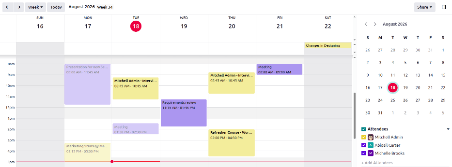
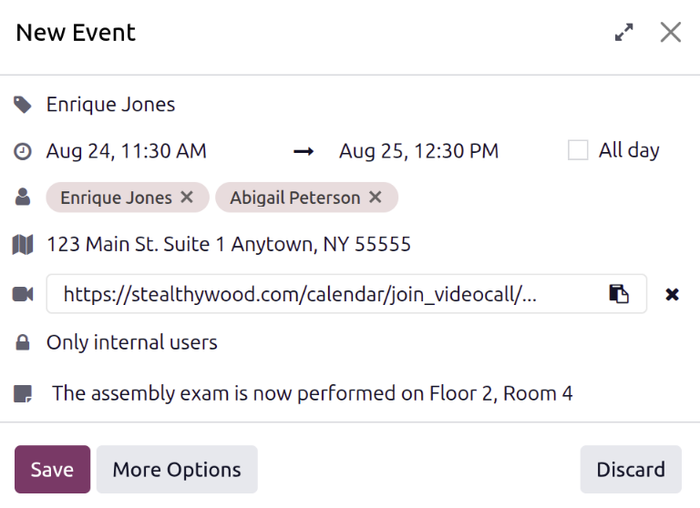
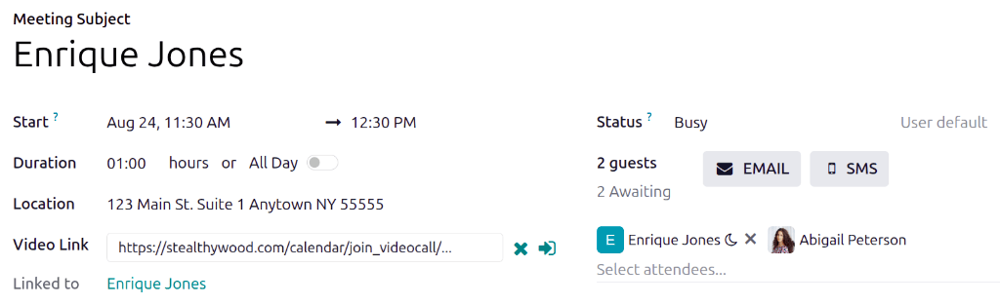
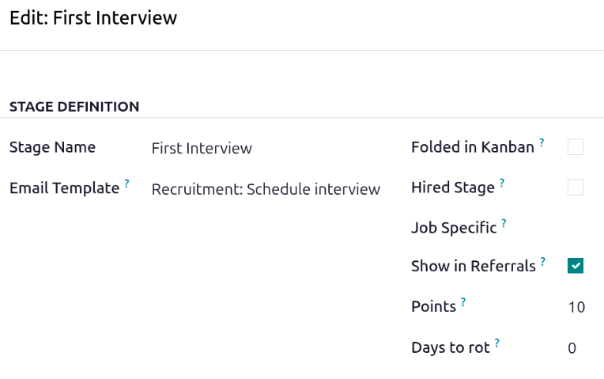
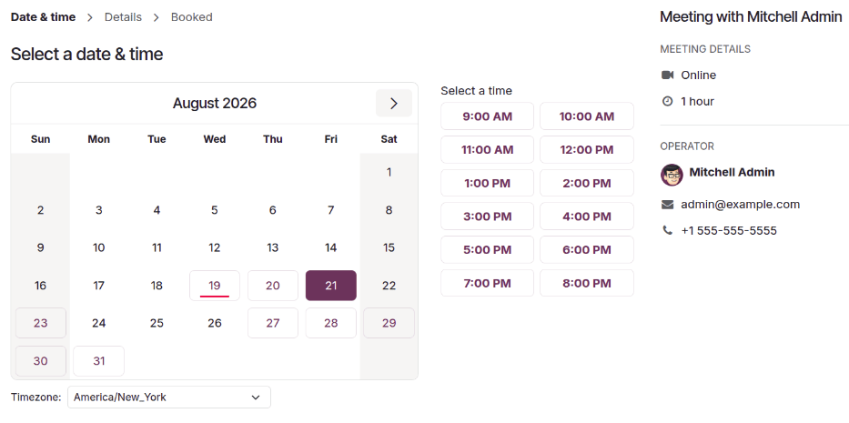
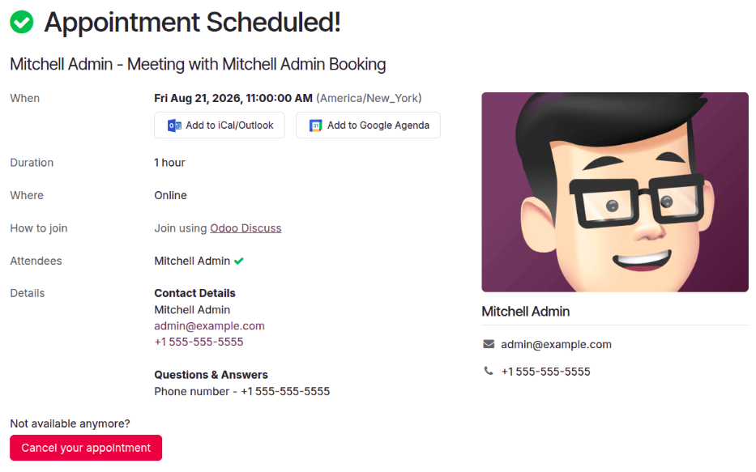

===================
Schedule interviews
===================

Once an applicant has reached the *First Interview* stage, it is time to schedule an in-person,
virtual, or phone interview. This can be done in one of two ways through the **Recruitment** app,
either by the :ref:`recruitment team <recruitment/schedule_interviews/recruitment-scheduled>`, or by
the :ref:`applicant <recruitment/schedule_interviews/applicant-scheduled>`.

With one drag and drop, Odoo emails the candidate with a self-service link, the candidate books the
time slot, and sends the meeting to everyone's calendar. No more back-and-forth emails or calls.

.. _recruitment/schedule_interviews/recruitment-scheduled:

Recruitment team scheduled interviews
=====================================

When an applicant reaches an interview stage, the recruitment team schedules the interview by first
coordinating a suitable date and time with the applicant and interviewers.

To schedule an interview, navigate to the applicant's card by going to the
:menuselection:`Recruitment` app and clicking the relevant job card. Click the desired applicant's
card on the *Applications* page.

To schedule a phone, virtual, or in-person interview, click the :icon:`fa-calendar` :guilabel:`No
Meeting` smart button at the top of the applicant's record.

.. note::
   The :guilabel:`Meetings` smart button displays :icon:`fa-calendar` :guilabel:`No Meeting` if no
   meetings are currently scheduled. For applicants who are new to the :guilabel:`First Interview`
   stage, this is the default.

   If there is one meeting already scheduled, the smart button displays :guilabel:`1 Meeting`, with
   the date of the upcoming meeting beneath it. If more than one meeting is scheduled, the button
   displays :guilabel:`Next Meeting`, with the date of the first upcoming meeting beneath it.

Clicking the :guilabel:`Meetings` smart button loads a calendar, showing the scheduled meetings and
events for the currently signed-in user, as well as the user's favorites configured in the
**Calendar** app. To hide any user's schedules from the calendar, uncheck the box next to their
name.

To only view the schedules of the user and the interviewers, click :guilabel:`+ Add Attendees` at
the bottom of the :guilabel:`Attendees` list and add each desired interviewer from the resulting
drop-down menu.

To add a meeting to the calendar when in the *Day* or *Week* view, click on the start time of the
meeting and drag down to the end time. Doing so selects the date, time, and the length of the
meeting. A meeting can also be added by clicking the :guilabel:`New` button.

Both methods cause a :ref:`New Event <recruitment/schedule_interviews/event-card>` pop-up window to
appear.

.. _recruitment/schedule_interviews/event-card:

New event pop-up window
-----------------------

Configure the information for the interview on the *New Event* pop-up window. The only required
information is the meeting title, date, and time.

- :icon:`fa-tag` :guilabel:`(Booking Name)`: Enter the title for the meeting. The default subject is
  the applicant's name.
- :icon:`fa-clock-o` :guilabel:`(Dates)`: Configure the start and end date and times for the
  meeting. Clicking either of these fields opens a calendar pop-up window. Click on the desired date
  to select it, enter the times in the corresponding fields, then click :guilabel:`Apply`.
- :guilabel:`All Day`: Click the box to schedule an all-day interview. If this box is ticked, the
  :icon:`fa-clock-o` :guilabel:`(Dates)` fields change to display the date only.
- :icon:`fa-user` :guilabel:`(Participants)`: Select the people attending the meeting. The default
  attendees are the prospective candidate, and the assigned recruiters for the job position. Add as
  many other people as desired.
- :icon:`fa-map` :guilabel:`(Location)`: Enter the address for the interview.
- :icon:`fa-video-camera` :guilabel:`(Videocall URL)`: If the meeting is virtual, or if there is a
  virtual option available, click :icon:`fa-plus` :guilabel:`Video`, and a URL is automatically
  created for the meeting, which populates the field.
- :icon:`fa-lock` :guilabel:`(Visibility)`: Determine who can see the meeting using the drop-down
  menu. The default options are :guilabel:`Public`, :guilabel:`Private`, and :guilabel:`Only
  internal users`.
- :icon:`fa-sticky-note` :guilabel:`Notes`: Enter any relevant notes in this field. There is an
  option to enter formatted text, such as numbered lists, headings, tables, links, photos, and more.
  Use the powerbox feature, by typing a `/` to reveal a list of options. Scroll through the options
  and click on the desired item. The item appears in the field, and can be modified. Each command
  presents a different pop-up window. Follow the instructions for each command to complete the
  entry.

Once the card details are entered, click :guilabel:`Save` to save the changes and schedule the
interview.

.. _recruitment/schedule_interviews/more-options:

More options
~~~~~~~~~~~~

To add additional information to the meeting, click the :guilabel:`More Options` button of the
:ref:`New Event <recruitment/schedule_interviews/event-card>` pop-up window. Enter any of the
following additional fields:

- :guilabel:`Duration`: This field auto populates based on the :guilabel:`Start` (and end) date and
  time. If the meeting time is adjusted, this field automatically adjusts to the correct duration
  length. The default length of a meeting is one hour.
- :guilabel:`Linked to`: The applicant being interviewed. This field is not able to be modified.
  Click the applicant's name to view the applicant's card.
- :guilabel:`Status`: Select if the interviewers are marked as :guilabel:`Busy` or
  :guilabel:`Available` during the interview. This field is set to :guilabel:`Busy` by default.
- :guilabel:`# guests`: This field displays the number of people invited to the meeting.
- :guilabel:`# Awaiting`: The number of guests that have not responded to the meeting invitation.
- :icon:`fa-envelope` :guilabel:`Email`: Click this to email the meeting guests with any updates.
- :icon:`fa-mobile` :guilabel:`SMS`: Click this to send an SMS message to the meeting guests.

Send meeting to attendees
-------------------------

Once the meeting details are correct, the meeting can be sent to the attendees, via :ref:`email
<recruitment/schedule_interviews/email>` or :ref:`SMS <recruitment/schedule_interviews/sms>`. This
is done from the :ref:`expanded event form <recruitment/schedule_interviews/more-options>`.

.. _recruitment/schedule_interviews/email:

Via email
~~~~~~~~~

To send the meeting via email, click the :icon:`fa-envelope` :guilabel:`Email` button next to the
:guilabel:`Attendees` field on the expanded meeting form.

A *Contact Attendees* email configurator pop-up window appears. A pre-formatted email using the
default :guilabel:`Calendar: Event Update` email template, populates the email body field.

All meeting guests are added to the :guilabel:`To` field by default. Make any desired changes to the
email, then click :guilabel:`Send` to send the email.

.. _recruitment/schedule_interviews/sms:

Via SMS
~~~~~~~

To send the meeting via SMS, click the :icon:`fa-mobile` :guilabel:`SMS` button next to the
:guilabel:`Attendees` field on the expanded meeting form. A *Send SMS* pop-up window appears.

At the top, a blue banner appears if any attendees do not have valid phone numbers, and lists how
many records are invalid. If a contact does not have a valid mobile number listed, click
:guilabel:`Discard`,  edit the attendee's record, then redo these steps.

When no warning message appears, type in the message to be sent to the attendees in the main text
field. To add any emojis to the message, click the :icon:`oi-smile-add` :guilabel:`(smile add)` icon
on the side of the pop-up window.

The number of characters and amount of text messages required to send the message (according to GSM7
criteria) appears beneath the text field. Click :guilabel:`Put in queue` to have the text sent
later, after any other messages are scheduled, or click :guilabel:`Send now` to send the message
immediately.

.. note::
   Sending text messages is **not** a default capability with Odoo. To send text messages, credits
   are required, which need to be purchased. For more information on IAP credits and plans, refer to
   the :doc:`../../essentials/in_app_purchase` documentation.

.. _recruitment/schedule_interviews/applicant-scheduled:

Applicant scheduled interviews
==============================

Coordinating interview times typically requires several email exchanges or phone calls, and can slow
the recruitment process. Enabling Odoo's self-service scheduling removes that bottleneck. When an
applicant is moved to an interview stage, the system automatically sends a scheduling link, records
the selected slot, and updates all relevant calendars.

This automation is turned off by default. To activate this, :ref:`modify
<recruitment/schedule_interviews/modify-stage>` the :guilabel:`First Interview` and
:guilabel:`Second Interview` stages and assign the :guilabel:`Recruitment: Schedule Interview` email
template to them.

.. _recruitment/schedule_interviews/modify-stage:

Modify stage
------------

:ref:`Modify <recruitment/modify-stages>` the :guilabel:`First Interview` or :guilabel:`Second
Interview` stage so the stage's :guilabel:`Email Template` field is set to :guilabel:`Recruitment:
Schedule interview`.

Send email
----------

After configuring the :guilabel:`First Interview` or :guilabel:`Second Interview` stages to
:ref:`send emails <recruitment/schedule_interviews/modify-stage>`, drag and drop the applicant card
into one of these stages to send the email.

Self-scheduled interview
------------------------

When the applicant receives the email, they click the :guilabel:`Schedule my interview` button at
the bottom of the email. This navigates the applicant to a private online scheduling page, which is
**only** accessible through the emailed link.

This page displays the :guilabel:`Meeting Details` on the side of the screen which includes the
format and length of the meeting. In this example, the interview is virtual (:icon:`fa-video-camera`
:guilabel:`Online`) and the duration is one hour (:icon:`fa-clock-o` :guilabel:`1 hour`).

The applicant clicks on an available day on the calendar, signified by purple text. Once a day is
selected, they click one of the available times to select that date and time.

.. tip::
   Be sure to check the :guilabel:`Timezone` field beneath the calendar to ensure it is set to the
   correct time zone. Changing the time zone may alter the available times presented.

Once the date and time are selected, the applicant is navigated to an *Add more details about you*
page. This page prompts the applicant to enter their :guilabel:`Full name`, :guilabel:`Email`, and
:guilabel:`Phone number`, all of which are required. The contact information entered on this form is
used to remind the applicant about the scheduled interview.

When everything is entered, the applicant clicks the :guilabel:`Confirm Appointment` button, and the
interview is scheduled.

After confirming the interview, the applicant is taken to a confirmation page, where all the details
of the interview are displayed. The option to add the meeting to the applicant's personal calendars
is available, through the :guilabel:`Add to iCal/Outlook` and :guilabel:`Add to Google Agenda`
buttons, beneath the interview details.

The applicant is also able to cancel the interview if necessary, with the :guilabel:`Cancel your
appointment` button at the bottom of the confirmation.

